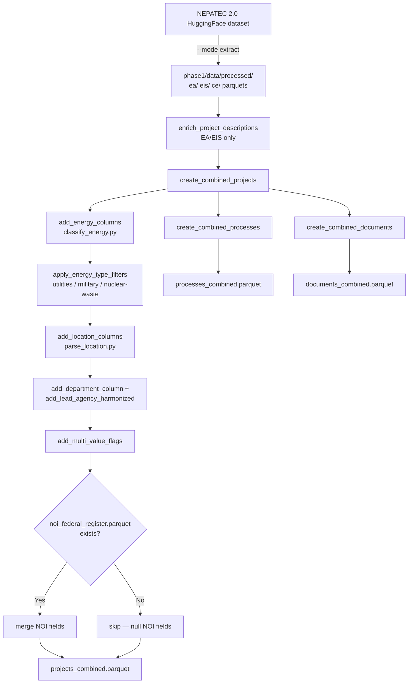

# extract_data.py — Pipeline Architecture

**Script:** `phase1/code/extract/extract_data.py`

**Purpose:** Main entry point for the Phase 1 data pipeline. Downloads raw NEPATEC 2.0 data
from HuggingFace, builds analysis-ready parquet files, applies energy classification and
exclusion filters, and merges Federal Register NOI enrichment. Every downstream deliverable
starts from `projects_combined.parquet` produced here.

---

## Data Flow



`extract_technology.py` (see [runbook 06](../../runbooks/06_technology.md)) runs as a
**separate, later pass** that reads `projects_combined.parquet`, adds
transmission/geothermal/pipeline columns, and writes them back into the same file — this is
why the committed `projects_combined.parquet` has 97 columns rather than the ~60 that
`extract_data.py` alone produces.

---

## Modes

| Mode | What it does |
|---|---|
| `--mode extract` | Downloads EA, EIS, CE datasets from HuggingFace and writes `data/processed/{ea,eis,ce}/`. Requires an HF token (`hf auth login`) and internet. |
| `--mode analysis` | Builds `projects_combined.parquet` / `processes_combined.parquet` / `documents_combined.parquet` from existing processed data. Default. |
| `--mode all` | Both — download then build. |

Unlike Phase 2's `extract_data.py`, Phase 1 has no `--refresh-federal-register` flag: NOI
enrichment is a **separate script run beforehand** (`federal_register.py`), whose output
(`noi_federal_register.parquet`) is picked up automatically if present. See
[federal_register.md](federal_register.md).

---

## Key Output: `projects_combined.parquet`

One row per NEPA project. Primary key: `project_id`. **97 columns, 61,881 rows** (verified
against the committed parquet).

| Column group | Source | Description |
|---|---|---|
| `project_id`, `project_title`, `project_type`, `project_sponsor`, `project_description` | Raw NEPATEC | Core project identity |
| `process_type`, `dataset_source` | Processes table merge | `EA`, `EIS`, or `CE` |
| `lead_agency`, `lead_agency_harmonized`, `project_department` | `classify_department()` / `add_lead_agency_harmonized()` | Normalized agency and department (DOE/DOI/USDA/DOD/etc.) |
| `project_energy_type`, `project_energy_type_strict`, `project_energy_type_questions` | `classify_energy.py` | `Clean` / `Fossil` / `Other`; strict is a conservative sub-cut; `_questions` flags borderline cases for manual review |
| `project_is_utilities_broadband_only`, `project_is_nuclear_tech_only`, `project_utilities_to_exclude`, `project_military_to_exclude`, `project_nuclear_waste_to_exclude` | Exclusion filters | Booleans recording *why* a project was reclassified from Clean to Other (or excluded from the strict cut) |
| `project_state`, `project_county`, `project_lat`, `project_lon`, `project_location_needs_geocoding` | `parse_location.py` | Geography parsed from the free-text `project_location` field |
| `project_multi_state`, `project_multi_county`, `project_multi_department` | `add_multi_value_flags()` | Multi-jurisdiction indicators |
| `project_has_decision_doc`, `project_has_final_doc`, `project_has_draft_doc`, `project_has_appendix_doc`, `project_doc_count` | Documents table | Document availability flags |
| `noi_publication_date`, `noi_document_number`, `noi_url`, `noi_match_tier`, … | `federal_register.py` (merged, not computed here) | Federal Register NOI enrichment, EA/EIS clean-energy scope only |
| `project_is_transmission*`, `project_is_pipeline*`, `project_transmission_length_*`, `project_pipeline_length_*` | `extract_technology.py` (separate later pass) | Transmission/pipeline length and classification columns — **not** produced by `extract_data.py` itself |

---

## Energy Classification and Exclusion Filters

`classify_energy.py` (`add_energy_columns()`) assigns `project_energy_type` from
`CLEAN_ENERGY_TYPES` / `FOSSIL_ENERGY_TYPES` tag sets (defined in `code/utils/config.py`):
fossil tags take precedence over clean tags when both are present; the **strict** variant
(`project_energy_type_strict`) additionally excludes two borderline tag combinations
(Utilities+Broadband-only, and Nuclear-Technology-without-Nuclear-Production).

`extract_data.py::apply_energy_type_filters()` then reclassifies a subset of `Clean` projects
to `Other`, based on **three exclusion mechanisms with different provenance**:

| Filter | Mechanism | Current count reclassified |
|---|---|---:|
| Utilities-only | Computed in `classify_energy.py` (`is_utilities_to_filter_out`) — Utilities tag combined *only* with Broadband/Waste Management/Land Development | 1,623 |
| Military nuclear | ID list `phase1/notes/military_project_ids_to_filter.csv`, produced by `phase1/code/validation/military_review.R` (defense-related nuclear: Military-and-Defense + Nuclear tags, reviewed by hand — "nearly all of 481 were DOE") | 482 |
| Nuclear waste | Tag-based (Waste-Management + Nuclear) with a **client-reviewed keep list** override: `phase1/notes/nuclear_waste_projects_to_keep.csv` (produced by `phase1/code/validation/nuclear_waste_review.R`), or a fallback exclusion-term list (`phase1/notes/agencies_to_be_excluded.txt`) matched against sponsor/agency/title when no keep list is present | 4,068 |

**This is a human-in-the-loop review cycle, not a one-shot filter.** The validation R scripts
in `phase1/code/validation/` read `projects_combined.parquet`, write candidate lists to a
shared Google Sheet for CATF client review, and the reviewed keep/exclude IDs are saved back
to `phase1/notes/*.csv`. The next `extract_data.py --mode analysis` run then re-applies the
updated lists. `phase1/code/validation/utilities_review.R` performs the analogous review step
for the utilities-only filter (~1,623 projects flagged, "some combination of Utilities we
didn't want to count as clean energy").

**Current clean energy universe** (`project_energy_type == "Clean"`): **20,725** projects
(CE 19,399 / EA 573 / EIS 753). Strict cut (`project_energy_type_strict == "Clean"`):
**19,628**.

---

## Federal Register NOI Merge

```
If phase1/data/analysis/noi_federal_register.parquet exists:
  → merged into projects_combined.parquet on project_id
  → project_title dropped from the merge to avoid a duplicate column
Else:
  → NOI fields are all null (not an error)
```

`noi_federal_register.parquet` must be produced **before** `extract_data.py` runs, by a
separate manual invocation of `federal_register.py` (see [runbook 01](../../runbooks/01_base_dataset.md)
and [federal_register.md](federal_register.md)). There is also a disabled
(`ENABLE_FEDERAL_REGISTER_NOI = False`) inline code path that would call
`federal_register.attach_noi_fields()` directly inside `create_combined_projects()`; it is
dead code in the current pipeline and the file-merge path above is what actually runs.

---

## Project Description Enrichment

`enrich_project_descriptions(dataset_type)` runs automatically at the start of
`run_analysis_pipeline()` for EA and EIS (not CE). For projects with a missing/empty
`project_description`, it scans the first 60 pages of the top 2 (EA) or 3 (EIS) documents for
a "Project Description" / "Description of the Proposed Action" / "Purpose and Need" heading
(SQL regex pass over the page parquet, then line-level Python regex refinement) and extracts
up to 3,500 characters following that heading as the description. This keeps
`projects_combined.parquet` self-updating across HuggingFace data refreshes without a
separate manual step.

---

## Other Outputs

| File | Description |
|---|---|
| `phase1/data/analysis/processes_combined.parquet` | One row per NEPA process (`project_id`, `process_family`, `process_type`, `lead_agency`, `dataset_source`) — 61,881 rows, 5 columns |
| `phase1/data/analysis/documents_combined.parquet` | One row per NEPA document with classification flags (`document_type_clean`, `document_type_category`, `main_document`, `ce_category`, …) — 142,083 rows, 14 columns |

---

## CLI Reference

```bash
# Default: build analysis parquets from already-downloaded processed data
python phase1/code/extract/extract_data.py --mode analysis

# Download raw data from HuggingFace (first-time setup / refresh)
python phase1/code/extract/extract_data.py --mode extract

# Full rebuild from scratch
python phase1/code/extract/extract_data.py --mode all
```

Per [runbook 01](../../runbooks/01_base_dataset.md), the recommended sequence is:
1. `python code/extract/federal_register.py --sample 0 --report-n 10 --fetch-raw-text`
2. `python code/extract/extract_data.py --mode analysis`

---

## Design Notes

**Why pandas instead of DuckDB?** Phase 1 predates the DuckDB-based rewrite used in Phase 2.
Page-level operations (project description enrichment, downstream extraction scripts) load
project/document/page parquets into pandas DataFrames directly. This is adequate at Phase 1's
scale but is the primary reason later extraction scripts (`extract_timeline.py`,
`extract_gencap.py`, `extract_technology.py`) run noticeably slower than their Phase 2
DuckDB-based counterparts and require explicit `--parallel`/`--workers` flags to stay
tractable.

**Why is the exclusion-filter logic split across three different mechanisms?** The three
filters were added at different points as CATF client review uncovered different edge cases
(utilities/telecom miscategorization, defense-nuclear projects, DOE nuclear-waste cleanup
sites). Each retained its own provenance mechanism (computed tag logic, a hand-reviewed ID
list, and a hand-reviewed keep-list override) rather than being consolidated, so the review
trail for each exclusion type stays independently auditable.

**Why no timeline merge here?** As in Phase 2, timeline data is not baked into
`projects_combined.parquet`. Each deliverable's `00_setup.R` loads the relevant timeline
parquet(s) (`projects_timeline_bert*.parquet`) directly and applies its own harmonization rule
where needed (see [extract_timeline.md](extract_timeline.md)).
