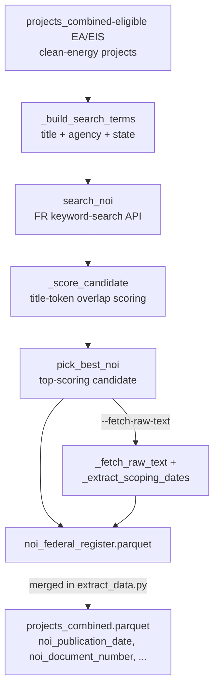

# federal_register.py — Architecture

**Script:** `phase1/code/extract/federal_register.py`

**Purpose:** Enrich clean-energy EA/EIS projects with `noi_publication_date` (Federal
Register Notice of Intent publication date) via the FR **keyword-search API**. Run once,
manually, before `extract_data.py` — see [runbook 01](../../runbooks/01_base_dataset.md).

**Scope note:** Phase 1's Federal Register integration is intentionally narrower than
Phase 2's. It fetches **NOI only** (no NOA/end-of-process date), defaults to `EA,EIS` process
types and `Clean` energy type only (CE is out of scope), and uses the **keyword-search**
matching strategy rather than direct doc-number evidence.

---

## Design: Keyword Search, Not Direct Doc-Number Fetch

`search_noi()` calls the FR API's search endpoint directly:

```
GET https://www.federalregister.gov/api/v1/documents.json
  ?conditions[term]=<search terms from project title/agency/state>
  &conditions[type][]=NOTICE
  &conditions[publication_date][gte]=<start date>
```

`_build_search_terms()` constructs the query from a short phrase of the project title
(`_select_title_phrase()`, capped at 8 words) optionally combined with agency and state terms.
Results are scored per candidate (`_score_candidate()`) using title-token overlap against the
project, and `pick_best_noi()` selects the top-scoring match, tagging it with a
`noi_match_tier` (`title_agency_state` when agency/state terms were included in the query,
`title_only` otherwise).

**This is the design Phase 2's `federal_register.py` explicitly moved away from.** Phase 2's
architecture doc records the same problem this script has: keyword search has no doc-number
anchor, so of 1,416 candidate rows scanned by this script, only 229 (16.2%) resolve to a
populated `noi_publication_date` — the rest fail title-overlap scoring or return no usable FR
match. Phase 2 replaced this with a direct doc-number-evidence approach (scan NEPATEC pages
for an explicit "FR Doc. ####-#####" citation, then fetch that exact document) specifically
because of this coverage gap. Phase 1 never received that rewrite.

---

## Pipeline



---

## Output: `noi_federal_register.parquet`

| Column | Description |
|---|---|
| `project_id`, `project_title` | Join key (title dropped on merge into `projects_combined.parquet` to avoid a duplicate column) |
| `noi_publication_date` | FR-published NOI date, when matched |
| `noi_document_number`, `noi_url` | FR record identifiers |
| `noi_project_title`, `noi_type`, `noi_subtype` | FR record metadata |
| `noi_comments_close_on`, `noi_scoping_meeting_dates` | Extracted from raw NOI text when `--fetch-raw-text` is set |
| `noi_match_score` | Candidate scoring output |
| `noi_query` | The search term string actually sent to the API |
| `noi_match_tier` | `title_agency_state` or `title_only` |

Current committed output: **1,416 candidate rows scanned, 229 with a populated
`noi_publication_date`** (1,082 `title_agency_state` / 334 `title_only` match tier).

---

## CLI Reference

```bash
python code/extract/federal_register.py --sample 0 --report-n 10 --fetch-raw-text
```

| Flag | Description |
|---|---|
| `--sample N` | Limit to N projects (`0` = all eligible) |
| `--process-types` | Default `EIS,EA` |
| `--energy-types` | Default `Clean` |
| `--cache-path` | API response cache (default `fr_noi_cache.json`) |
| `--fetch-raw-text` | Also fetch the raw NOI text to extract comment-period and scoping-meeting dates |
| `--output` | Default `data/analysis/noi_federal_register.parquet` |

---

## Integration with extract_data.py

`extract_data.py::create_combined_projects()` merges `noi_federal_register.parquet` into
`projects_combined.parquet` on `project_id` if the file exists at
`data/analysis/noi_federal_register.parquet`; if it does not exist, NOI columns are simply
null (not an error). A separate, currently-disabled code path
(`ENABLE_FEDERAL_REGISTER_NOI = False`) would call `attach_noi_fields()` inline instead — it
is dead code in the current pipeline.
