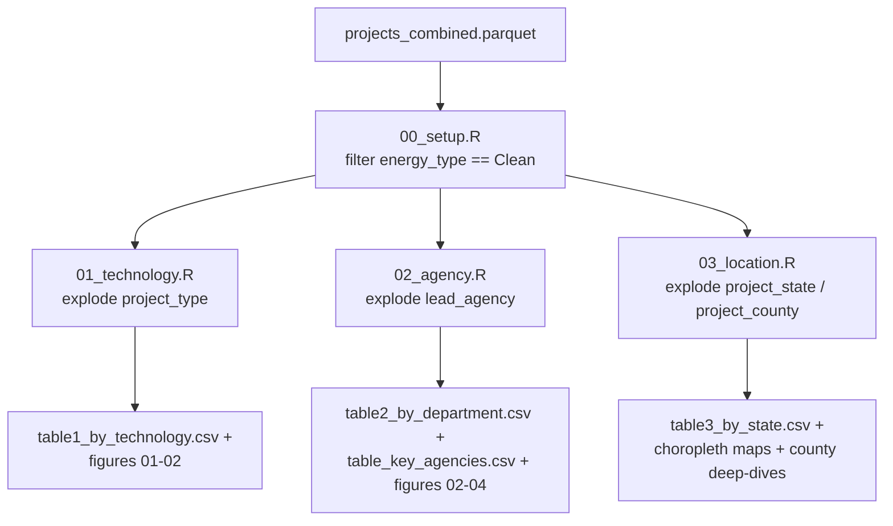

# D1: Technology, Agency, and Location — Architecture

**Goal:** Characterize the clean energy project universe by technology type (Table 1), lead
agency/department (Table 2), and geography (Table 3), including co-occurrence and
"deep-dive" county-level detail.

**Self-contained:** Yes — requires only `phase1/data/analysis/projects_combined.parquet`.

---

## Data Flow



---

## Inputs

| File | Description |
|---|---|
| `phase1/data/analysis/projects_combined.parquet` | Full project universe; D1 filters to `project_energy_type == "Clean"` (20,725 rows) in `00_setup.R` |

---

## Primary Outputs

All tables are written under `phase1/output/deliverable1/tables/`; figures under
`phase1/output/deliverable1/figures/`; maps under `phase1/output/deliverable1/maps/`.

| File | Description |
|---|---|
| `table1_by_technology.csv` | Clean energy projects by technology tag × process type (CE/EA/EIS) |
| `table2_by_department.csv` | Clean energy projects by department × process type |
| `table_key_agencies.csv`, `table_key_agencies_subtotals.csv` | Agency-level detail (harmonized `lead_agency`) grouped by department, with an EA/CE coverage-verification flag |
| `table_meeting_coverage.csv` | Coverage of agency×process-type combinations in NEPATEC |
| `table3_by_state.csv`, `table3_by_state_and_county_totals.csv` | Projects by state / county |
| `table4_cooccurrence_summary.csv`, `table5_cooccurrence_exhaustive.csv`, `table6_cooccurrence_projects.csv` | Technology tag co-occurrence tables |
| `deep_dive_{ce,ea,eis}_top_counties.csv`, `deep_dive_{ce,ea,eis}_sample.csv` | Top-10 counties per process type, with a random 20-project sample table for the report |
| `flagged_for_review.csv`, `military_projects.csv` | QA/audit sidecars |

---

## Module Architecture

### `01_technology.R` — Table 1: Technology

Explodes the JSON-array `project_type` column (`explode_column()`) to one row per
project × technology tag, restricted to the 15 tags in `clean_energy_tags` (defined in
`00_setup.R`). Produces:

- `fig_clean_energy_bar` — percent of clean energy projects carrying each technology tag
  (a project can carry multiple tags, so percentages do not sum to 100%).
- `fig_clean_energy_bar_by_process` — same breakdown as a 100%-stacked bar by process type
  (CE/EA/EIS), with a solar-specific highlighted variant
  (`02_clean_energy_bar_solar_highlight.png`) also copied to
  `phase1/output/factsheet/figures/` for reuse in the client factsheet.
- `table1_by_technology.csv` — derived directly from the same exploded/counted data as the
  figures, so the table and figures are guaranteed consistent.

**Current top technology tags** (from the committed table): Utilities (10,157 projects),
Electricity Transmission (7,697), Solar (2,483), Energy Storage (1,775), Carbon Capture and
Sequestration (1,327), Nuclear Technology (1,314), Biomass (1,249).

### `02_agency.R` — Table 2: Agency and Department

`project_department` is precomputed in the Python pipeline (`classify_department()` in
`extract_data.py`); this script uses it directly for the department-level table rather than
re-deriving it. Only 40 of 61,881 total projects (0.06%) carry multiple lead agencies, so the
department table does not need to explode multi-agency projects — `explode_column()` is
retained only for detailed agency-level analysis (harmonized `lead_agency_harmonized`, which
preserves the raw `"Department of X - Agency"` format).

Notable design note in the script comments: **only DOE, BLM, and Forest Service have complete
EA/CE data in NEPATEC** — all other agencies are represented primarily through the EPA EIS
database, which is EIS-only. `table_meeting_coverage.csv` and the "coverage-verified" figure
(`04_coverage_verified_process.png`) explicitly flag this asymmetry so the report does not
imply comprehensive EA/CE coverage for agencies outside those three.

**Current department distribution** (from the committed table, includes 20,675 of 20,725
clean projects with a resolvable department — 50 unclassified): Department of Energy 16,730;
Department of the Interior 3,669; Other Independent Agencies 94; Department of Agriculture
92; Major Independent Agencies 33; Department of Defense 18; remainder single digits per
department.

### `03_location.R` — Table 3: Geography, Maps, and County Deep-Dives

The largest D1 script (845 lines). Sections:

1. **State table** — `explode_column("project_state")` (a project can span multiple states),
   counted by process type.
2. **State/county choropleth maps** — loads `tigris`/`sf` US state and county shapefiles,
   shifts Alaska/Hawaii for display, and joins project counts. Four map variants are
   produced: an aggregate state choropleth, an aggregate county choropleth, per-process-type
   county choropleths (equal-interval breaks), and per-process-type county choropleths using
   Jenks natural-breaks classification (`classInt` package) — the Jenks variant is intended
   to better separate high-density CE clusters from the long tail.
3. **County deep-dive** — for each process type, identifies the top 10 counties by project
   count, builds a technology-tag breakdown bar chart per county group (with different
   count-filter thresholds per process type: CE filters counties with >10 projects, EA/EIS
   filter >1, reflecting CE's much higher volume), and samples 20 random projects from the
   top 2 counties per process type for the report tables
   (`deep_dive_{ce,ea,eis}_sample.csv`).

**Current top states** (from the committed table): South Carolina 2,024, Washington 1,872,
California 1,734, Oregon 1,303, Colorado 1,220 — CE-dominated in every case, reflecting CE's
much larger project count relative to EA/EIS.

---

## Run Results

<!-- d1-run-results: pull this section into the D1 report -->

D1 operates on the full clean energy universe: **20,725 projects** (CE 19,399 / EA 573 /
EIS 753), consistent with `projects_combined.parquet`'s current `project_energy_type ==
"Clean"` count.

- Technology tags are not mutually exclusive; a single project frequently carries 2+ tags
  (e.g., a solar project sited on federal land tagged both "Renewable Energy Production -
  Solar" and "Utilities"). `table4`–`table6` quantify this co-occurrence explicitly.
- County-level geography coverage is uneven by process type. A historical analysis (dated
  2025-02-04, predates the current 20,725 count and should be read as illustrative of the
  coverage *pattern* rather than current counts) found CE county coverage was structurally
  limited by legal land-survey-style location descriptions (Township/Range/Section) that don't
  reference a county name, while EA/EIS missing-county cases were overwhelmingly recoverable
  via existing lat/long fields. See `phase1/reports/deliverable01.qmd` for the current
  county-coverage table and numbers.

---

## Known Issues and Cautions

- **Agency EA/CE coverage is not comprehensive outside DOE/BLM/Forest Service.** Any
  agency-level EA/CE comparison should be read against `table_meeting_coverage.csv`'s
  coverage flag, not treated as a complete agency census.
- **The historical county-coverage note referenced above is stale and has been removed.** It
  documented an analysis from a prior build (22,279 clean projects, before the final exclusion
  filters were locked in) and should not be quoted for current coverage percentages — only for
  the qualitative CE-vs-EA/EIS pattern it identified, which is preserved above.
- **Technology tag percentages do not sum to 100%** in `fig_clean_energy_bar` because
  projects can carry multiple technology tags. This is intentional, not a data error.

---

## Output Schema

### `table1_by_technology.csv`

| Column | Description |
|---|---|
| `Technology` | Technology tag (cleaned label) |
| `Categorical Exclusion`, `Environmental Assessment`, `Environmental Impact Statement` | Project count by process type |
| `Total` | Row total |

### `table2_by_department.csv`

| Column | Description |
|---|---|
| `Department` | Harmonized department name |
| `Categorical Exclusion`, `Environmental Assessment`, `Environmental Impact Statement`, `Total` | Counts |

### `table3_by_state.csv`

| Column | Description |
|---|---|
| `State connections` (header varies; state name) | US state |
| `Categorical Exclusion`, `Environmental Impact Statement`, `Environmental Assessment`, `Total` | Counts |

---

## Methodological Notes

**Why explode `project_type` and `lead_agency` rather than take the first value?** NEPATEC
project metadata is genuinely multi-valued for both fields (a project can carry multiple
technology tags and, rarely, multiple lead agencies). Exploding preserves every tag/agency
association rather than arbitrarily picking one, at the cost of tag counts not summing to the
project total — this tradeoff is documented directly in the figure captions
("percentage labels... note co-occurrence").

**Why Jenks breaks in addition to equal-interval choropleth maps?** CE project density is
extremely right-skewed (a handful of counties have hundreds of CE projects; most have very
few). Equal-interval breaks compress nearly all counties into the lowest bucket. Jenks natural
breaks better separates the CE hotspots from the long tail, at the cost of being
process-type-specific (the breakpoints differ across CE/EA/EIS maps and are not directly
comparable to each other).

---

## Reproduction

```bash
Rscript phase1/code/deliverable01/01_technology.R
Rscript phase1/code/deliverable01/02_agency.R
Rscript phase1/code/deliverable01/03_location.R
quarto render phase1/reports/deliverable01.qmd
```

Each script `source()`s `phase1/code/deliverable01/00_setup.R` directly; there is no
`99_run_all.R` for D1 (each script can be run independently).
