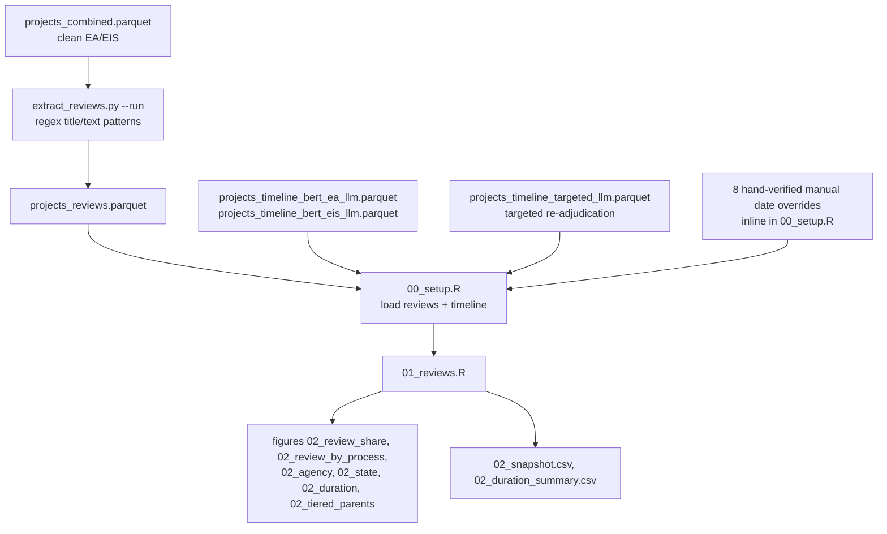

# D2: Programmatic & Tiered Reviews — Architecture

**Goal:** Classify clean energy EA/EIS projects as `Standard`, `Programmatic` (a PEIS/PEA
covering a class of actions), or `Tiered` (a site-specific review that tiers from a
programmatic review), and compare review duration across the three types.

**Self-contained:** Partially. Review-type classification (`extract_reviews.py`) is
self-contained. Duration analysis requires the shared timeline pipeline
(`extract_timeline.py`, owned architecturally by D3 — see
[../README.md](../README.md#timeline-data-integration)).

---

## Data Flow

---

## Inputs

| File | Description |
|---|---|
| `phase1/data/analysis/projects_reviews.parquet` | Output of `extract_reviews.py --run`; review type classification for clean energy EA/EIS projects |
| `phase1/data/analysis/projects_timeline_bert_ea_llm.parquet`, `..._eis_llm.parquet` | LLM-adjudicated timeline dates (required — `00_setup.R` calls `stop()` if either is missing) |
| `phase1/data/analysis/projects_timeline_targeted_llm.parquet` | Optional targeted re-adjudication patch for incomplete non-standard projects (loaded if present) |

---

## Primary Outputs

`phase1/data/analysis/projects_reviews.parquet` — **1,326 rows, 79 columns** (all clean
energy EA/EIS projects: 573 EA + 753 EIS).

Tables and figures are written under `phase1/output/deliverable2/tables/` and
`phase1/output/deliverable2/figures/`.

| File | Description |
|---|---|
| `02_snapshot.csv` | Review-type count/share cross-tabulation by process type |
| `02_duration_summary.csv` | Duration descriptive statistics (mean/median/sd/p25/p75/min/max) by process type × review type |
| `02_review_share.png` | Overall review-type distribution |
| `02_review_by_process.png` | 100%-stacked review-type share by process type, plus a zoomed non-standard-only panel |
| `02_agency.png`, `02_department.png` | Top agencies/departments for non-standard (programmatic + tiered) reviews |
| `02_state.png` | Geographic distribution of non-standard reviews (top 12 states) |
| `02_duration.png` | Review duration (initiation→decision) by type, faceted by process type |
| `02_tiered_parents.png` | Parent programmatic reviews cited by tiered projects, classified from free text |

---

## Module Architecture

### `extract_reviews.py` — Review Type Classification

A regex-only pipeline (no LLM in the production run; `--use-llm` exists as an optional
higher-recall QA pass, not used for the committed output). Classification logic:

1. **Title check** (`check_title_for_programmatic()`): title containing `programmatic` (with
   exclusions for non-NEPA uses like "programmatic agreement"/"programmatic biological
   opinion") marks a project as itself being a programmatic review.
2. **Text check** (`check_text_for_programmatic()` / `extract_review_from_text()`): scans the
   first 60 pages of each project's `main_document == "YES"` documents (bulk-loaded via a
   single DuckDB query per source — `read_parquet()` with `ROW_NUMBER() OVER (PARTITION BY
   project_id ORDER BY page_num)` capped at the page limit, rather than one query per project)
   for strong programmatic phrasing (e.g. "this programmatic EIS/EA") and for **tiering
   statements** — regex patterns matching `"this EA/EIS tiers to/from ..."`, `"pursuant to the
   [PEIS/PEA]"`, `"incorporates by reference the [PEIS]"` — which both classify the project as
   `tiered` and extract the referenced programmatic review's name into
   `project_review_tiers_from`.
3. **False-positive filtering** (`is_false_positive()`, `FALSE_POSITIVE_PATTERNS`): before any
   tiering candidate is accepted, text matching non-NEPA uses of "tier" is discarded — EPA
   engine emission tiers (`EPA Tier 1-4`), road classifications (`Tier 1-3: Roads/Primitive`),
   generic ranking language (`first/second/third-tier`), and pricing/rate tiers. This matters
   specifically for solar/wind projects on federal land, which frequently reference EPA Tier 4
   construction-equipment engine requirements — text that would otherwise look like a NEPA
   tiering reference.
4. Anything that doesn't match either check is `standard`.

Output columns include `project_review_is_programmatic`, `project_review_type`
(`programmatic`/`tiered`/`standard`), `project_review_confidence` (`high`/`medium`),
`project_review_tiers_from`, `project_review_tiers_from_context`,
`project_review_match_text`, and scan diagnostics (`project_review_pages_scanned`,
`project_review_candidates_found`).

**Current committed classification** (1,326 clean EA/EIS projects): 1,165 `standard`
(87.9%), 128 `programmatic` (9.7%), 33 `tiered` (2.5%). Confidence: 1,246 `high`, 80
`medium`.

### `01_reviews.R` — Figures and Tables

Builds the six figures and two tables listed above from the `reviews`, `reviews_tl`
(review + timeline joined), `duration_data` (subset with valid, calculable duration), and
`non_standard` (programmatic + tiered only) objects defined in `00_setup.R`.

- **Figure 1 (share)** and **Figure 2 (by process)**: straightforward count/percentage bars.
- **Figure 3/3b (agency/department)**: restricted to the top 8 agencies by total
  non-standard review count; department breakdown uses all departments with at least one
  non-standard review (no top-N cap, since `project_department` is a scalar field with far
  fewer distinct values than agency).
- **Figure 5 (duration)**: violin + boxplot + jittered points, faceted by process type,
  y-axis capped at the 97th percentile for readability. Violin layer is only drawn for
  process×review-type groups with n ≥ 10 (several review-type/process combinations, e.g.
  EIS Tiered at n=7, are too small for a meaningful density estimate).
- **Figure 6 (tiered parentage)**: `classify_parent()` maps the free-text
  `project_review_tiers_from` field to ~10 named programmatic reviews via keyword regex
  (e.g. BLM Vegetation Treatment PEIS, TVA Integrated Resource Plan EIS, Desert Renewable
  Energy Conservation Plan EIS); anything unmatched falls into "Reference not clearly
  identified" rather than being silently dropped.

### Targeted LLM re-adjudication for non-standard reviews (`extract_timeline.py --nonstandard-incomplete`)

Programmatic/tiered projects are disproportionately hard for the standard EA/EIS timeline
pipeline: of the 161 non-standard (programmatic + tiered) projects in an earlier full-review
extraction, only 82 had a complete timeline (both initiation and decision dates) after the
base LLM adjudication pass. **Root cause**: EIS documents averaged ~179 BERT date candidates
per project, but the LLM adjudication candidate cap was only 30 (`LLM_ADJ_EIS_MAX_CANDIDATES`
in `extract_timeline.py`) — 150+ candidates were filtered out before Claude ever saw them.
Programmatic EISs are the hardest case: the BERT classifier (trained on CE data) frequently
mislabels decision-era dates as `review` or `other` rather than `decision`.

A set of CLI flags added to `extract_timeline.py`'s `--llm-adjudicate` mode targets exactly
this population instead of requiring a full pipeline change:

| Flag | Effect |
|---|---|
| `--nonstandard-incomplete` | Auto-selects programmatic/tiered projects still missing `llm_initiation_date` or `llm_decision_date`, reading `projects_reviews.parquet` plus all available timeline outputs internally; also switches the adjudication prompt to a `best_effort` mode ("pick the most likely decision date, null only if truly nothing fits") instead of the conservative default |
| `--max-candidates N` | Overrides the per-project candidate cap (125 was used for this run, vs. the EIS default of 30) |
| `--context-chars N` | Overrides the context snippet length passed to the LLM |
| `--promote-rod-language` | Promotes candidates containing ROD/FONSI language to a Tier A decision candidate regardless of the BERT-assigned doc-type label |
| `--year-window N` | Drops candidates more than N years before the latest found date, to remove NEPA-citation noise (15 was used) |

Re-running the 161 non-standard projects with `--nonstandard-incomplete --max-candidates 125
--promote-rod-language --year-window 15` produced `projects_timeline_targeted_llm.parquet`
(73 rows — one per project needing new dates), patched into the main timeline via
`coalesce()` in `00_setup.R`. This raised complete-timeline coverage from 82/161 to
**118/161 (73%)**. The remaining incompleteness: 32 missing decision only, 3 missing
initiation only, and 8 missing both (of which most have zero decision-date signal
identifiable by BERT in any candidate — a hard floor without document-level improvements to
the base extraction).

---

## Run Results

<!-- d2-run-results: pull this section into the D2 report -->

**Review type snapshot** (1,326 clean energy EA/EIS projects, from `02_snapshot.csv`):

| Process | Standard | Programmatic | Tiered | Total |
|---|---:|---:|---:|---:|
| EA | 537 (93.7%) | 10 (1.7%) | 26 (4.5%) | 573 |
| EIS | 628 (83.4%) | 118 (15.7%) | 7 (0.9%) | 753 |
| **All** | **1,165 (87.9%)** | **128 (9.7%)** | **33 (2.5%)** | **1,326** |

**Duration summary** (days, initiation → decision; from `02_duration_summary.csv`, projects
with a calculable duration only):

| Process | Review type | n | Mean days | Median days |
|---|---|---:|---:|---:|
| EA | Standard | 313 | 610 | 421 |
| EA | Programmatic | 10 | 395 | 289 |
| EA | Tiered | 20 | 1,143 | 734 |
| EIS | Standard | 287 | 1,379 | 1,087 |
| EIS | Programmatic | 82 | 1,279 | 914 |
| EIS | Tiered | 7 | 725 | 593 |

Tiered EA reviews in this sample take *longer*, not shorter, than standard EA reviews at the
median (734 vs. 421 days) — the opposite of the naive expectation that tiering from an
existing programmatic analysis should speed up review. EIS tiered reviews are faster than EIS
standard (593 vs. 1,087 days median) but on an n of only 7. Sample sizes for the tiered
categories are small enough (EA n=20, EIS n=7) that these duration comparisons should be
treated as suggestive, not conclusive.

---

## Known Issues and Cautions

### Manual timeline date overrides are hard-coded in `00_setup.R`

`00_setup.R` contains an inline `manual_overrides` tibble patching 8 specific projects' dates
— explicitly flagged in the code as **"TEMPORARY — presentation 2026-03-06"** with a
`# TODO: Integrate into pipeline after Thursday.` comment that was never followed up on. Each
override is annotated with its source evidence (e.g. "date
in EA filename", "p.3 of FEIS", "TVA intends to publish the Final EIS by early to mid-2022").
These patches apply only within D2's `reviews_tl`/`duration_data` objects (and the parallel
`tl_full`), **not** to the underlying `projects_timeline_bert_ea_llm.parquet` /
`..._eis_llm.parquet` files — so any other deliverable or ad-hoc analysis reading those
parquet files directly will not see these 8 corrections. D2's own script verifies 5 of the 6
duration-relevant overrides reach `duration_data` (one, a Columbia Wind Farm project, is
missing its initiation date even after the override and so is excluded from duration
figures).

### Non-standard review coverage inspection tooling lives inline in `01_reviews.R`

The top of `01_reviews.R` contains exploratory code (`browse_ns`, `inspect_candidates()`,
`inspect_llm_prompt()`) used during manual QA of incomplete non-standard-review timelines.
This is retained in the committed script as reusable debugging tooling, not as part of the
figure/table pipeline proper — running the full script end-to-end still produces the six
figures and two tables even though this exploratory section executes first.

### `extract_reviews.py` defines match-provenance fields that are absent from the committed output

The `ReviewExtractionResult` dataclass and its `to_dict()` serialization include
`project_review_match_document_id` and `project_review_match_file_name` (which document/PDF
file name a tiering or programmatic match came from), but the **committed**
`projects_reviews.parquet` does not have these two columns. This indicates the committed
output was built from an earlier version of the script before these fields were added; a
fresh `--run` would include them.

### An earlier extraction run had a much smaller non-standard yield

A prior status note (dated 2026-02-04, no longer kept) documented an extraction run of 1,416
EA/EIS clean projects with only 16 programmatic + 10 tiered (1.8% non-standard). The committed
`projects_reviews.parquet` (verified directly) has 1,326 projects with 128 programmatic + 33
tiered (12.1% non-standard) — a substantially larger non-standard yield from a later run with
expanded regex pattern coverage. **Use the current parquet's counts** (reported throughout
this document) as authoritative.

### Small-n duration comparisons

EIS Tiered (n=7) and EA Programmatic (n=10) duration statistics are based on very few
projects. The report figure (`02_duration.png`) suppresses the violin density layer below
n=10 specifically to avoid implying more precision than these small samples support, but
median/mean values are still reported in `02_duration_summary.csv` for all groups regardless
of n.

---

## Output Schema

### `projects_reviews.parquet`

Extends `projects_combined.parquet`'s columns (through the technology/transmission columns)
with:

| Column | Type | Description |
|---|---|---|
| `project_review_is_programmatic` | bool | Whether this project's own document is a programmatic review |
| `project_review_type` | str | `programmatic`, `tiered`, or `standard` |
| `project_review_confidence` | str | `high` or `medium` |
| `project_review_tiers_from` | str | Extracted name/description of the parent programmatic review (tiered projects only) |
| `project_review_tiers_from_context` | str | Surrounding text context for the tiering reference |
| `project_review_source` | str | Which check matched (title vs. text) |
| `project_review_match_text` | str | Matched text snippet |
| `project_review_pages_scanned` | int | Number of pages scanned for this project |
| `project_review_candidates_found` | int | Number of candidate matches found before selection |

---

## Methodological Notes

**Why regex-only for production, with LLM as an optional QA pass?** Programmatic/tiered
language follows fairly formulaic NEPA drafting conventions ("this EA tiers from...",
"programmatic environmental impact statement"), making regex both cheap and reasonably
precise. `--use-llm` exists specifically to catch borderline/ambiguous phrasing that regex
scores as `medium` confidence, reserved for a focused QA pass rather than the default
production run.

**Why does D2 depend on D3's timeline pipeline rather than owning its own?** Timeline
extraction (`extract_timeline.py`) is expensive to run (BERT inference over ~20K projects,
LLM adjudication for EA/EIS) and is architecturally shared infrastructure — see
[../README.md](../README.md#timeline-data-integration). D2 only needs the EA/EIS
LLM-adjudicated dates (not the CE BERT dates, since D2's universe is EA/EIS-only), so its
`00_setup.R` loads exactly those two files rather than the full harmonization logic D3/D6 use.
