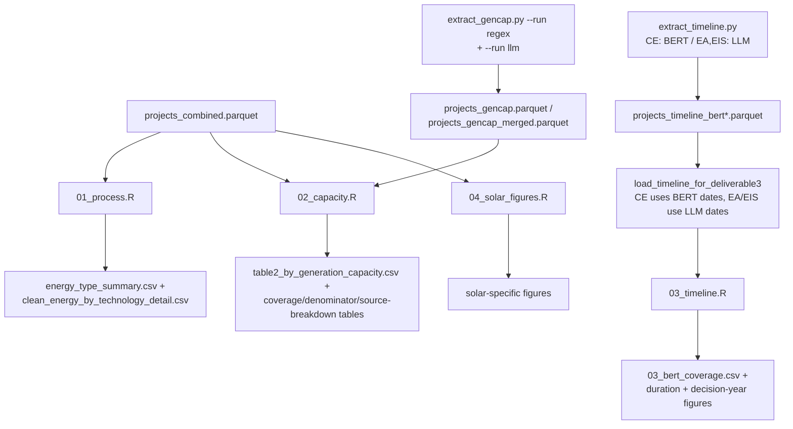

# D3: Process Type, Generation Capacity, and Timelines — Architecture

**Goal:** Characterize clean energy projects by NEPA process type (CE/EA/EIS), extracted
generation capacity (MW/GW), and project timeline (initiation → decision duration, and
decision volume over time relative to major clean-energy legislation).

**Self-contained:** Partially. The process-type table (`01_process.R`) needs only
`projects_combined.parquet`. Capacity (`02_capacity.R`) needs `extract_gencap.py`'s output.
Timeline (`03_timeline.R`) needs `extract_timeline.py`'s output and **owns** the
CE-vs-EA/EIS timeline harmonization rule that D6 also reuses — see
[../README.md](../README.md#timeline-data-integration).

---

## Data Flow



---

## Inputs

| File | Description |
|---|---|
| `phase1/data/analysis/projects_combined.parquet` | Base project universe, filtered to `project_energy_type == "Clean"` |
| `phase1/data/analysis/projects_gencap.parquet` or `projects_gencap_merged.parquet` (whichever exists; `02_capacity.R` checks both) | Regex + LLM-adjudicated generation capacity |
| `phase1/data/analysis/projects_timeline_bert.parquet` | CE timeline (BERT dates) |
| `phase1/data/analysis/projects_timeline_bert_ea_llm.parquet`, `..._eis_llm.parquet` | EA/EIS timeline (LLM-adjudicated dates); **required** — `load_timeline_for_deliverable3()` calls `stop()` if missing |

---

## Primary Outputs

Tables under `phase1/output/deliverable3/tables/`; figures under `phase1/output/deliverable3/figures/`.

| File | Description |
|---|---|
| `energy_type_summary.csv`, `clean_energy_by_technology_detail.csv` | Process-type and technology summary (Table 1) |
| `table2_by_generation_capacity.csv` | Generation projects binned by capacity (Small/Medium/Large/Utility-scale) × process type |
| `table2_capacity_coverage_summary.csv`, `table2_denominator_comparison.csv`, `table2_power_energy_coverage.csv`, `table2_gencap_source_breakdown.csv` | Coverage diagnostics: what fraction of "generation-tagged" projects have an extracted capacity value, and by what extraction source |
| `04_gencap_examples_regex.csv`, `04_gencap_examples_llm.csv` | Illustrative extraction examples for the report |
| `03_bert_coverage.csv` | CE timeline extraction coverage (decision/initiation/duration-calculable) |
| `03_year_by_process_type.csv` | Projects by decision year × process type |
| `03_bert_client_examples.csv` + `03_bert_example{1-6}.csv` | Curated example projects for client review |

---

## Module Architecture

### `01_process.R` — Table 1: Project Status by Energy Type

Reclassifies Utilities/Broadband/Waste-Management/Land-Development-only projects from Clean
to Other (a **second, D3-local application** of the same utilities-exclusion logic that
`extract_data.py::apply_energy_type_filters()` already applies upstream — the script's own
comment notes this is intentional redundancy for transparency in the deliverable, not a
different filter). Produces a grouped bar chart and a stacked composition chart comparing
Clean/Fossil/Other by process type.

### `02_capacity.R` — Table 2: Generation Capacity

Reads whichever of `projects_gencap.parquet` / `projects_gencap_merged.parquet` exists
(`gencap_candidates` path-fallback list), coalescing `project_gencap_final_*` columns down to
`project_gencap_value`/`_unit` when the `_final` columns aren't present (a compatibility shim
for older gencap output schema versions).

**Filter B — generation-tagged projects only:** capacity coverage is computed only among
projects carrying at least one generation-specific technology tag, explicitly *excluding*
Electricity-Transmission-only and Utilities-only projects (grid infrastructure, ROW renewals,
pole replacements) that would never have a generation capacity value to extract in the first
place. This denominator choice is what `table2_denominator_comparison.csv` documents: of
20,725 clean projects, only 11,038 (53.3%) are generation-tagged; the remaining 9,687 are
excluded from the capacity-coverage denominator by design, not because extraction failed on
them.

`extract_gencap.py` (see [runbook 04](../../runbooks/04_gencap.md)) runs regex extraction
over all projects first (`--run regex`), then a second LLM-adjudication pass (`--run llm`)
restricted to projects with 2+ distinct regex candidate values — i.e., the LLM is reserved
for genuinely ambiguous multi-candidate cases, not run on every project.

**Power and energy are tracked as separate field pairs throughout** (`project_gencap_value`/
`_unit` for nameplate capacity in MW/GW/kW, vs. `project_gencap_energy_value`/`_unit` for
annual generation in MWh/GWh/kWh) — unit regexes are matched longest-first (`MWh` before `MW`,
`MWac` before `MW`) so the more specific unit always wins. A known limitation: energy-unit
captures conflate battery storage capacity (MWh as a storage metric) with annual generation
projections (MWh as output); the pipeline does not currently distinguish these.

**Extraction runs a strict tiered fallback to minimize document I/O:** (1) title regex, then
description regex — either match is treated as `confidence="high"` and the project is
resolved with *no page I/O at all*; (2) DuckDB-bulk-loaded main documents (`main_document ==
"YES"`, capped at 50 pages); (3) non-main documents (appendices), same cap; (4) an uncapped
full rescan for projects still unresolved. Each successive tier only runs on projects the
prior tier failed to resolve. Context windows (±80 characters) around each regex match are
scored `high` (project-forward words: `proposed`, `nameplate`, `rated`, `will generate`,
`facility`, `farm`, `array`), `low` (historical/reference words: `existing`, `previously`,
`adjacent`), or `ambiguous` (hedging words: `similar`, `comparable`, `reference`) —
`is_invalid_match()` separately filters date-adjacent MW/kW values that are signature-field
artifacts, not capacity mentions.

**LLM adjudication** (`claude-haiku-4-5-20251001`, temperature 0.1, max 200 tokens) triggers
only when 2+ distinct power-candidate values remain after document scanning; it receives the
candidate list with context snippets and is instructed to prefer the proposed project's own
capacity over comparison/existing/neighboring-project mentions, returning `null` if no
candidate clearly qualifies. `merge_llm_results_into_regex()` then resolves the final
`project_gencap_final_*` fields: an LLM selection of a valid power unit overrides the regex
result; an LLM `null`/non-power-unit/error result falls back to the regex result unchanged.
Every merge decision is recorded in `llm_merge_decision` (`regex_no_llm`,
`llm_override_regex`, `llm_only_fill`, `regex_invalid_or_rejected_llm`, `no_capacity`) for
audit.

**Validation flags** (`04_gencap_validation_flags.py`) identify four categories of likely
false positives for manual review: `gencap_flag_initials_date` (MW/kW value adjacent to a
date, e.g. a signature-field artifact like "MW 5/21/15"), `gencap_flag_non_generation`
(context suggests beam power, particle accelerators, or battery/thermal storage — not
generation capacity), `gencap_flag_non_build` (context describes removal/decommissioning/
maintenance rather than new construction), and `gencap_flag_equipment_list` (match sits inside
a bulleted equipment list with multiple nearby MW values).

### `03_timeline.R` — Timeline Analysis

Owns `load_timeline_for_deliverable3()` (defined in `00_setup.R`), the harmonization function
also reused by D6:

```
timeline_initiation_date_final = CASE
    WHEN dataset_source IN ('EA','EIS') THEN llm_initiation_date
    ELSE bert_initiation_date_final      -- CE
END
timeline_decision_date_final = CASE
    WHEN dataset_source IN ('EA','EIS') THEN llm_decision_date
    ELSE bert_decision_date_final        -- CE
END
```

Figures include: extraction coverage summary (Table 1: decision-date-found /
initiation-date-found / inferred-initiation / duration-calculable, by count and percent);
complete-timeline share by process (boxplot); initiation→decision span plots (faceted
Gantt-style); duration summary intervals; **projects by decision year, faceted by process
type, with dashed vertical markers for ARRA (Feb 2009), BIL (Nov 2021), and IRA (Aug 2022)**
— a DOE-only variant of the same figure is also produced; timeline status mix; and duration
distribution by process. Six curated example projects are written to
`03_bert_client_examples.csv` for report narrative use.

**This decision-year-by-legislation figure is architecturally the same question Phase 2 spun
out into its own deliverable, D5 (CE Spikes After Major Legislation).** In Phase 1 it lives as
one figure inside D3's timeline section rather than as a standalone analysis.

### `04_solar_figures.R`

A small supplementary script producing solar-technology-specific figures (separate from the
main `01_clean_energy_bar_solar_highlight.png` produced in D1), not otherwise integrated into
the Table 1/2/3 structure above.

---

## Run Results

<!-- d3-run-results: pull this section into the D3 report -->

**Process type / energy type:** current `energy_type_summary.csv` reports 22,279 Clean
projects — this reflects a Phase 1 build **frozen before** the final exclusion-filter lock-in
that produced the current `projects_combined.parquet` clean count of 20,725. See Known Issues.

**Generation capacity coverage** (`table2_capacity_coverage_summary.csv`, generation-tagged
projects only):

| Process | Generation projects | With capacity | Coverage |
|---|---:|---:|---:|
| CE | 10,228 | 1,648 | 16.1% |
| EA | 332 | 250 | 75.3% |
| EIS | 478 | 400 | 83.7% |
| **Total** | **11,038** | **2,298** | **20.8%** |

Capacity coverage is dramatically lower for CE than EA/EIS — CE documents are typically short
categorical-exclusion memos that don't state a generation capacity, whereas EA/EIS documents
are long enough to reliably include a project-description capacity figure.

**Capacity source breakdown** (of 11,038 generation-tagged projects; from
`table2_gencap_source_breakdown.csv`): 861 (7.8%) from document text, 1,419 (12.9%) from
project description, 59 (0.5%) from title, and 8,699 (78.8%) with no extractable capacity
(`none`) — description-field extraction is CE-specific (1,419 of 1,419 `description`-sourced
hits are CE; EA/EIS rely almost entirely on document text, 76.5%/83.5% respectively).

**Capacity size distribution** (`table2_by_generation_capacity.csv`, 2,202 projects with a
resolved capacity bin — a slightly larger n than the 2,298-project coverage count above
because a small number of additional projects clear the bin thresholds without a fully
qualifying `has_capacity` flag): Small <10MW 1,172 (53.2%), Medium 10–100MW 645 (29.3%),
Large 100–500MW 207 (9.4%), Utility-scale >500MW 178 (8.1%). EIS skews heavily toward large
projects (144 of 178 utility-scale projects are EIS), consistent with larger generation
projects requiring the more rigorous review tier.

**Transmission/utilities prevalence** (`project_type` tag analysis, same 22,279-project
pre-lock-in Clean snapshot as above — see Known Issues): of all Clean projects, 7,815 (35.1%)
carry any "Electricity Transmission" `project_type` tag; 1,531 (6.9%) are transmission-only in
the strict sense (`project_type` limited to Electricity Transmission + Utilities); 1,784
(8.0%) under a relaxed definition that also allows Broadband; 488 (2.2%) are Utilities-only
with no transmission tag at all. By process type: CE any-transmission 34.3% (strict 7.0%,
relaxed 8.0%, utilities-only 2.3%), EA 43.2% (5.6%, 6.1%, 1.6%), EIS 49.1% (1.5%, 2.0%, 0.6%).
A same-definition recomputation against the current 20,725-project clean universe reproduces
the strict/transmission-only, relaxed, and utilities-only absolute counts almost exactly
(1,531 / 1,784 / 488), so these ratios remain representative of the current dataset despite
the stale total (only the any-transmission share shifts, since the projects dropped between
the two builds were disproportionately non-transmission).

**Manual validation of regex capacity extraction** (20-project sample of clean-energy
projects with a non-null extracted capacity value, `output/deliverable3/gencap_manual_validation_sample.csv`):
11 of 20 sampled projects had a text snippet captured and could be manually checked against
source document text; all 11 (100%) were confirmed correct. The remaining 9 could not be
manually verified because no snippet was captured for them. Main source of ambiguity noted
during review: whether some matches clearly referred to the proposed project vs. a
comparison/existing/neighboring project.

**Timeline coverage (CE)** — from `03_bert_coverage.csv`, computed on this build's 20,863
clean CE count (again reflecting the pre-lock-in snapshot; use the ratios, not the raw
counts, for current interpretation): decision date found 82.8%, explicit initiation date
20.2%, inferred initiation (earliest-review proxy) 40.1%, any duration calculable 31.2%,
errors 4.1%. These ratios are consistent with the freshly-verified current-parquet figures
in [../README.md](../README.md#timeline-data-integration) (CE: initiation 42.6%, decision
78.8%, both 30.4%).

---

## Known Issues and Cautions

### Several D3 outputs are frozen at a stale clean-energy count (22,279 vs. current 20,725)

`energy_type_summary.csv`, `projects_gencap_merged.parquet` (22,279 rows), and
`03_bert_coverage.csv` (20,863 CE projects) all predate the final exclusion-filter lock-in
that produced the current `projects_combined.parquet` count of 20,725 clean projects (19,399
CE). This is the same "Phase 1 freeze" referenced in
[runbook 02](../../runbooks/02_timeline.md) ("Initiation coverage... at Phase 1 freeze").
**Use the current `projects_combined.parquet` count (20,725) as the authoritative clean
energy universe size; treat the counts embedded in these specific D3 output files as a
point-in-time snapshot from an earlier build**, not as contradicting the current base
dataset. Percentages/ratios derived from these files (coverage rates, capacity-bin shares)
remain informative even though the absolute counts are stale.

### Capacity bin total (2,202) does not exactly match the coverage-summary "with capacity" count (2,298)

The two tables use slightly different qualifying conditions (`has_capacity` flag vs. the size
bin's own non-null check). Treat both as approximately the same population (~2.2–2.3K
projects with a usable capacity value) rather than reconciling to an exact match.

### Generation-tagged denominator excludes nearly half the clean universe by design

9,687 of 20,725 clean projects (46.7%) are excluded from every capacity coverage/bin
statistic because they carry no generation-specific technology tag (transmission-only,
utilities-only projects). Any capacity coverage percentage in this deliverable should be read
as "of generation-tagged projects," not "of all clean energy projects."

---

## Output Schema

### `table2_by_generation_capacity.csv`

| Column | Description |
|---|---|
| `Generation Capacity` | Size bin: Small (<10 MW), Medium (10-100 MW), Large (100-500 MW), Utility-scale (>500 MW) |
| `Categorical Exclusion`, `Environmental Assessment`, `Environmental Impact Statement`, `Total` | Counts |

### `03_bert_coverage.csv`

| Column | Description |
|---|---|
| `Metric` | Coverage metric name (decision found / initiation found / inferred initiation / any start date / review dates found / duration calculable / errors) |
| `Count`, `Percent` | Value and share of the CE universe at build time |

---

## Methodological Notes

**Why coalesce `_final` capacity columns with a fallback?** `02_capacity.R` supports reading
either the raw regex-only output (`projects_gencap.parquet`, no `_final` columns) or the
LLM-merged output (`projects_gencap_merged.parquet`, with `_final` columns representing the
LLM's adjudicated choice among regex candidates). The coalesce logic lets the same script run
against either file without modification, at whichever stage of the two-phase gencap pipeline
the user has reached.

**Why restrict capacity coverage to generation-tagged projects?** Reporting capacity coverage
against the full 20,725-project clean universe would understate true extraction performance,
since the majority of non-generation projects (transmission lines, utility easements) have no
capacity value to find. Restricting the denominator to generation-tagged projects (11,038)
makes the coverage percentage a fair measure of extraction recall rather than an artifact of
universe composition.

**Why is ARRA/BIL/IRA legislation marked on the CE decision-year figure specifically?**
CE is the process type large enough (19,399 projects) to show a visible volume response to
funding-driven legislation; EA/EIS volumes are too small individually to show a clear
year-over-year signal. The DOE-only variant isolates the agency most directly administering
ARRA/BIL/IRA clean-energy funding programs.

---

## Reproduction

```bash
Rscript phase1/code/deliverable03/01_process.R
python phase1/code/extract/extract_gencap.py --run regex --parallel 3
python phase1/code/extract/extract_gencap.py --run llm --workers 4
Rscript phase1/code/deliverable03/02_capacity.R
python phase1/code/extract/extract_timeline.py --regex-prep
python phase1/code/extract/extract_timeline.py --bert-generate
python phase1/code/extract/extract_timeline.py --bert-train
python phase1/code/extract/extract_timeline.py --bert-run --source CE --output projects_timeline_bert.parquet
python phase1/code/extract/extract_timeline.py --llm-run --source EA --output projects_timeline_bert_ea_llm.parquet
python phase1/code/extract/extract_timeline.py --llm-run --source EIS --output projects_timeline_bert_eis_llm.parquet
Rscript phase1/code/deliverable03/03_timeline.R
Rscript phase1/code/deliverable03/04_solar_figures.R
quarto render phase1/reports/deliverable03.qmd
```
