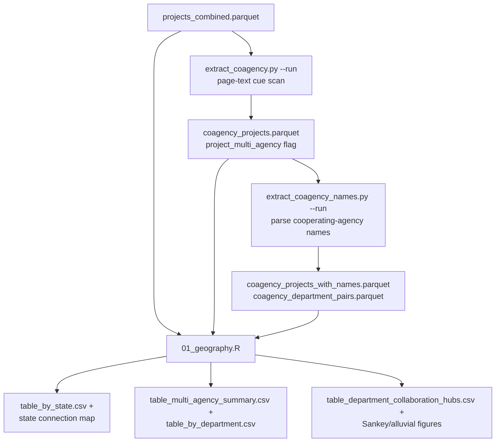

# D4: Geography and Multi-Agency Review — Architecture

**Goal:** Identify clean energy projects that span multiple states and/or involve multiple
federal agencies/departments, and characterize the geographic and inter-agency collaboration
patterns among them.

**Self-contained:** Partially. Multi-state analysis needs only `projects_combined.parquet`.
Multi-agency ("co-agency") analysis needs the sidecar outputs of `extract_coagency.py` and
`extract_coagency_names.py`, which scan document page text for cooperating-agency language
beyond what NEPATEC's structured `lead_agency` metadata captures.

---

## Data Flow



---

## Inputs

| File | Description |
|---|---|
| `phase1/data/analysis/projects_combined.parquet` | Base project universe (clean energy only) |
| `phase1/data/analysis/coagency_projects.parquet` | Output of `extract_coagency.py --run` — page-text cooperating-agency signal flags (20,725 rows, 22 columns) |
| `phase1/data/analysis/coagency_projects_with_names.parquet` | Output of `extract_coagency_names.py --run` — parsed cooperating-agency names and department pairs (20,725 rows, 28 columns) |

---

## Primary Outputs

Tables under `phase1/output/deliverable4/tables/`; figures under
`phase1/output/deliverable4/figures/`; maps under `phase1/output/deliverable4/maps/`.

| File | Description |
|---|---|
| `table_by_state.csv` | State-pair connections for multi-state projects (Top 15 by CE share) |
| `table_top_connections.csv` | Top 10 state-pair combinations by project count |
| `table_multi_agency_summary.csv` | Overall multi-state / multi-department project counts |
| `table_multi_agency_by_process.csv` | Strict-metadata vs. expanded (text-signal-augmented) multi-agency counts, by process type |
| `table_by_department.csv` | Department-pair connections for multi-department projects |
| `table_department_collaboration_hubs.csv` | Per-department collaboration network stats (unique partner departments, tie count, top partner, "bridge score") |
| `table_multistate_complex_sample.csv` | Sample of complex multi-state projects for report narrative |
| `coagency_cue_signal_scan*.csv`, `cooperating_agency_*.csv`, `coagency_name_*.csv` | Extensive QA/audit sidecars from the `extract_coagency*.py` development process |

---

## Module Architecture

### `extract_coagency.py` — Cooperating-Agency Signal Scan

Scans document page text for cooperating-agency cue phrases (e.g. "in cooperation with",
"cooperating agency", multi-agency signature blocks), producing per-project boolean flags at
two confidence tiers: `project_has_coagency_signal_any` (any cue, including auxiliary
document types) and `project_has_coagency_signal_high_conf` (primary-document, high-confidence
cues only). `project_multi_agency` is the **union** of the structured-metadata multi-department
flag (`project_multi_department`, precomputed in `extract_data.py`) and this text-signal flag
— i.e., a project counts as multi-agency if *either* NEPATEC's own metadata says so *or* the
document text contains a cooperating-agency cue that the metadata missed.

### `extract_coagency_names.py` — Cooperating-Agency Name Parsing

A second, more detailed pass that parses the **specific agency names** mentioned in
cooperating-agency text (not just a boolean flag), using role-segment detection
(`_find_role_segments()`), agency-token matching against a known-agency lookup
(`_match_agencies()`), and department-prefix resolution (`_department_from_prefix()`).
Produces `coagency_agencies`, `coagency_departments`, `coagency_lead_agencies`,
`coagency_partner_agencies`, and `coagency_partner_departments` list columns, plus
`coagency_department_pairs.parquet` (one row per department-pair tie, used to build the
department collaboration network figures).

### `01_geography.R`

Two parallel analyses sharing the same setup:

**Multi-state.** `explode_column("project_state")` produces state-pair connection counts
(`table_by_state.csv`), a connectivity map with jittered/highway-style edge lines between
state centroids, a process-type breakdown bar chart, and word-cloud panels of project types
by process type. A curated sample of complex multi-state projects
(`table_multistate_complex_sample.csv`) supports report narrative.

**Multi-agency/department.** Reports **two definitions side by side**, deliberately not
collapsed into one number:
- **Strict** (`project_multi_department`): projects where NEPATEC's own structured metadata
  lists more than one department. Very small (20 projects, all CE).
- **Expanded** (`project_multi_agency`): strict-metadata OR high-confidence text-signal
  detection. Much larger (301 projects), and almost entirely composed of EIS projects (267 of
  301) where multi-agency cooperation is far more likely to be documented in the text (large
  EIS documents routinely name cooperating agencies in a dedicated section) than captured in
  NEPATEC's structured fields.

Department-pair connections (`table_by_department.csv`) use `lead_agency` (not
`project_department`) for the crosstab, then map agency names to departments for display —
the script comment explains this is because `project_department` only reflects the *primary*
lead department, which would collapse genuine multi-department ties. A Sankey/alluvial diagram
visualizes cross-department collaboration ties, with a filtered variant restricted to
departments clearing a minimum-tie-count threshold (computed dynamically from the data, not a
fixed constant) to keep the diagram legible.

---

## Run Results

<!-- d4-run-results: pull this section into the D4 report -->

**Multi-state / multi-department summary** (`table_multi_agency_summary.csv`, 20,725 clean
projects): 841 multi-state projects, 301 multi-department projects (expanded definition).

**Multi-agency by process type and definition** (`table_multi_agency_by_process.csv`):

| Definition | CE | EA | EIS | Total |
|---|---:|---:|---:|---:|
| Strict (`project_multi_department`) | 20 | 0 | 0 | 20 |
| Expanded (`project_multi_agency`) | 20 | 14 | 267 | 301 |

The expanded definition adds 281 projects the strict metadata definition misses entirely —
all 281 are found via document text signal, and 267 of those 281 are EIS projects.

**Top state-pair connections** (`table_by_state.csv`): Oregon–Washington (87 projects,
transmission-heavy corridor), Kansas–Missouri (50), Colorado–New Mexico (43),
Virginia–West Virginia (28), Nebraska–Nevada (21).

**Department collaboration hubs** (`table_department_collaboration_hubs.csv`, ranked by
bridge score): Department of the Interior (12 unique partner departments, 209 collaborative
ties, top partner Department of Defense on 56 shared projects); Department of Defense (13
partners, 124 ties); Department of Energy (11 partners, 96 ties, top partner DOI on 38 shared
projects); EPA (11 partners, 89 ties).

**Cooperating-agency name-parsing coverage** (`coagency_name_coverage_by_process.csv`): CE 20
of 20 flagged projects have a parsed agency name (100%); EA 14 of 14 (100%); EIS 260 of 267
(97.4%) — 7 EIS projects have a text signal but no name successfully parsed.

---

## Known Issues and Cautions

- **Report the strict and expanded multi-agency counts as two distinct numbers, not one.**
  The 15x gap between strict (20) and expanded (301) reflects a genuine metadata-completeness
  gap, not competing definitions of "multi-agency" — collapsing to a single figure would
  either dramatically understate (strict) or overstate the confidence level of (expanded,
  which includes text-signal inference) true multi-agency collaboration.
- **Department-pair crosstabs use `lead_agency`, not `project_department`, deliberately.**
  Any modification to this table should preserve that choice — using `project_department`
  would silently collapse genuine multi-department ties into single-department self-pairs.
- **11 EIS projects have `lead_agency = [""]` and `project_department = "Other /
  Unclassified"`.** These are called out explicitly in the D4 script comments as a data-quality
  edge case affecting the department collaboration hub figures; they contribute no signal to
  any department-pair tie.

---

## Output Schema

### `coagency_projects.parquet`

| Column | Type | Description |
|---|---|---|
| `project_id` | str | Primary key |
| `project_multi_department` | bool | Structured-metadata multi-department flag (from `extract_data.py`) |
| `project_has_coagency_signal_any`, `project_has_coagency_signal_any_nonaux` | bool | Any cooperating-agency cue found (incl./excl. auxiliary document types) |
| `project_has_coagency_signal_high_conf` | bool | High-confidence, primary-document cue found |
| `project_has_coagency_signal_primary`, `project_has_coagency_signal_secondary` | bool | Cue tier flags |
| `project_coagency_cues_all`, `project_coagency_cues_primary`, `project_coagency_cues_secondary` | str (JSON) | Matched cue phrases |
| `project_coagency_first_hit_*` | various | Page/file/document-type metadata for the first matching cue |
| `project_multi_agency` | bool | Union of `project_multi_department` and `project_has_coagency_signal_high_conf` — the "expanded" definition |

### `coagency_projects_with_names.parquet`

Adds `coagency_agencies`, `coagency_departments`, `coagency_lead_agencies`,
`coagency_partner_agencies`, `coagency_partner_departments` (list columns of parsed agency/
department names) and `coagency_name_extraction_count`.

---

## Methodological Notes

**Why maintain both a strict and an expanded multi-agency definition?** NEPATEC's structured
`lead_agency`/department metadata reliably captures only the primary lead agency in most
cases. Cooperating-agency relationships are usually documented in prose (a "Cooperating
Agencies" section, or signature blocks) rather than structured fields, especially for EIS
documents. Reporting only the strict count would understate true multi-agency collaboration
by an order of magnitude; reporting only the expanded (text-signal) count would overstate
confidence in cases where a passing textual mention doesn't reflect genuine formal
cooperating-agency status. Presenting both, with the extraction methodology explicit, lets the
report be honest about this tradeoff.

**Why is agency-name parsing (`extract_coagency_names.py`) a separate pass from signal
detection (`extract_coagency.py`)?** Detecting *that* a project has multi-agency language is
a coarser, higher-recall problem than reliably parsing *which* agencies are named — role-segment
detection and agency-name matching are more failure-prone (7 of 267 EIS-flagged projects fail
to yield a parsed name). Splitting the two passes lets the coarse multi-agency flag
(used throughout D4's headline figures) remain robust even where the finer-grained name
parsing fails on a specific project.

---

## Reproduction

```bash
python phase1/code/extract/extract_coagency.py --run
python phase1/code/extract/extract_coagency_names.py --run
Rscript phase1/code/deliverable04/01_geography.R
quarto render phase1/reports/deliverable04.qmd
```

See [runbook 07](../../runbooks/07_geography.md).
