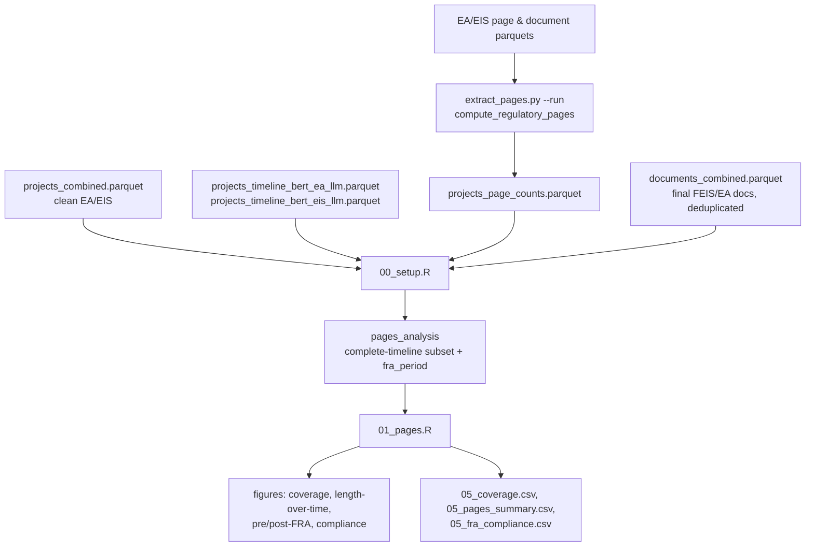

# D5: Regulatory Page Counts (FRA) — Architecture

**Goal:** Estimate FRA-compliant regulatory page counts for clean energy EA and EIS final
documents, and assess document length trends over time and compliance with the Fiscal
Responsibility Act of 2023 (FRA) page limits.

**Self-contained:** Partially. Needs `extract_pages.py`'s regulatory page-count output and
the EA/EIS LLM-adjudicated timeline dates (owned architecturally by D3) to classify projects
Pre-FRA/Post-FRA and compute review duration.

---

## Data Flow

---

## Inputs

| File | Description |
|---|---|
| `phase1/data/analysis/projects_combined.parquet` | Filtered to `project_energy_type == "Clean"` and `process_type %in% c("EA","EIS")` — CE is out of scope because FRA page limits apply only to EA/EIS |
| `phase1/data/analysis/projects_timeline_bert_ea_llm.parquet`, `..._eis_llm.parquet` | LLM-adjudicated initiation/decision dates (required) |
| `phase1/data/analysis/documents_combined.parquet` | Used to identify and deduplicate final documents (FEIS for EIS projects, final EA for EA projects) |
| `phase1/data/analysis/projects_page_counts.parquet` | Output of `extract_pages.py --run` — regulatory page counts |

---

## Primary Outputs

Tables under `phase1/output/deliverable5/tables/`; figures under
`phase1/output/deliverable5/figures/`.

| File | Description |
|---|---|
| `05_coverage.csv` | Project counts surviving each filter step (timeline → final document → complete timeline) |
| `05_pages_summary.csv` | Regulatory page descriptive statistics by process type × FRA period |
| `05_fra_compliance.csv` | Post-FRA compliance breakdown against the FRA's 150/300-page limits |
| Figures | Coverage funnel; document length over time (3-month rolling average, with an FRA-breakpoint-split variant and a monthly-mean variant); Pre/Post-FRA bar comparison; regulatory-vs-raw-page comparison; distribution violin/box plots; FRA compliance stacked bar |

---

## Module Architecture

### `extract_pages.py` — Regulatory Page-Count Extraction

Implements the FRA's own definition of a "page" (40 C.F.R. § 1508.1(bb)): 500 words,
excluding maps/figures/appendices. `compute_regulatory_pages()` (DuckDB SQL over the page
parquet):

1. Detects an **appendix section header** on each page (regex match within the first ~80
   characters of page text, only considered from page 5 onward to avoid false-positive hits
   in a table of contents).
2. Counts "body pages" as pages before the detected appendix boundary with word count above a
   low-content threshold (excludes near-blank/scanned-garbage pages).
3. `regulatory_pages = CEIL(body_word_count / 500)`.

A separate, higher-confidence path (`find_no_appendix_docs()`) detects document file names
that explicitly signal an appendix-free version (matching patterns like `wo_appendices`,
`without_appendix`, `no_app`, `noappx`) and uses the document's raw `total_pages` directly
rather than the word-count estimate for those files
(`regulatory_pages_method = "no_appendix_file"`) — this is more reliable than algorithmic
appendix detection because the agency itself produced the appendix-free version, though only
a small number of projects have such a file on record. Body-content pages require at least 50
words to count toward `body_word_count`; pages below that threshold are counted separately as
`low_content_pages` (maps, figures, dividers) and excluded.

**Why regulatory pages instead of raw PDF page count?** Per a prior architecture note (no
longer kept), roughly 52% of clean-energy main EA documents and 34% of main FEIS documents
contain appendices embedded in the same PDF as the body — raw `total_pages` would include
those appendix pages, overstating the FRA-comparable length.
`regulatory_pages` and `body_pages` (the pre-normalization physical body page count) typically
diverge by roughly 15–30% due to the 500-word/page normalization applied to sparse pages
(covers, dividers, tables).

### `00_setup.R` — Merge and FRA Classification

Merges projects + timeline + final documents (inner join — a project must have both a
timeline record and a final document to enter `pages_data`), then joins `regulatory_pages`
with a **fallback cascade**: use the OCR-derived word-count estimate where available;
otherwise fall back to the raw PDF `total_pages` (`reg_pages_source = "raw_fallback"`) so that
coverage remains complete for all figures even where the word-count method has no usable OCR
text.

`pages_analysis` further restricts to projects with **complete timelines** (both initiation
and decision date present) and adds `fra_period` (`Post-FRA` if
`timeline_decision_date >= 2023-06-03`, else `Pre-FRA`).

### `01_pages.R` — Figures and Tables

Notable figures:
- **Figure 2b** deliberately computes the 3-month rolling average **in two separate segments**
  (pre- and post-FRA) rather than one continuous rolling window, to avoid smoothing the trend
  line across the FRA breakpoint in a way that would visually understate the discontinuity.
- **Figure 3b** compares `regulatory_pages` (word-count-normalized) against `body_pages` (raw
  body page count before word-count normalization) to make explicit how much the FRA's
  500-word/page definition differs from a naive PDF page count.
- **Figure 5 (FRA compliance)** is Post-FRA only, and classifies projects against the FRA's
  statutory limits: **EA ≤ 75 pages** ("Compliant" band, "Exceeds limit" beyond), and
  **EIS ≤ 150 pages "concise" / ≤ 300 pages "complex"** with three compliance bands
  (`Compliant`, `Exceeds standard limit`, `Exceeds limit`). Projects with no extractable OCR
  text (`regulatory_pages = NA`) are dropped from this figure rather than assumed compliant.

---

## Run Results

<!-- d5-run-results: pull this section into the D5 report -->

**Coverage funnel** (`05_coverage.csv`, clean EA/EIS with timeline data as the starting
population):

| Step | EA | EIS | Total |
|---|---:|---:|---:|
| Total clean energy with timeline data | 573 | 753 | 1,326 |
| With final document | 498 | 478 | 976 |
| With timeline + document | 498 | 478 | 976 |
| Complete timeline (final analysis sample) | 316 | 311 | 627 |

Roughly half of clean EA/EIS projects (627 of 1,326, 47.3%) survive to the final analysis
sample — the binding constraint is the **complete-timeline** filter (976 → 627), not final
document availability (which alone drops only 350 of 1,326).

**Regulatory page summary** (`05_pages_summary.csv`):

| Process | FRA period | n | Mean pages | Median pages |
|---|---|---:|---:|---:|
| EA | Pre-FRA | 283 | 62 | 47 |
| EA | Post-FRA | 33 | 57 | 61 |
| EIS | Pre-FRA | 269 | 368 | 288 |
| EIS | Post-FRA | 42 | 270 | 269 |

EIS documents shrank substantially post-FRA at the mean (368 → 270 pages, −26.6%); EA
documents show little mean change (62 → 57) but a higher post-FRA median (47 → 61),
reflecting a genuinely small post-FRA EA sample (n=33).

**FRA compliance** (Post-FRA only, `05_fra_compliance.csv`): EA 23 of 33 compliant (69.7%),
10 exceed the 75-page limit (30.3%). EIS 12 of 42 compliant with the 150-page concise limit
(28.6%), 12 more within the 300-page complex-project allowance (28.6%, "Exceeds standard
limit" band), and 18 exceed even the 300-page complex limit (42.9%).

---

## Known Issues and Cautions

- **CE is out of scope for this entire deliverable.** FRA page limits apply only to EA/EIS;
  including CE would be a category error, not a missing-data gap.
- **The "complete timeline" filter is the dominant sample-size constraint** (976 → 627
  projects, a 35.8% drop). Any D5 statistic implicitly conditions on having both a resolvable
  initiation and decision date, which — per the D3/timeline coverage figures — is itself not a
  random subset of all EA/EIS projects (see [../README.md](../README.md#timeline-data-integration)).
- **Regulatory page counts fall back to raw PDF page count when OCR text is unavailable**
  (`reg_pages_source = "raw_fallback"`). Raw page counts are not word-count-normalized and can
  overstate the FRA-comparable page count for documents with sparse text per page (e.g.,
  large maps/figures). The Post-FRA compliance figure explicitly drops NA-regulatory-page
  projects rather than substituting the raw fallback, but the length-over-time and
  pre/post-FRA comparison figures do use the raw-fallback-inclusive `regulatory_pages` column.
- **This is a descriptive, not causal, analysis.** Changes in page count after FRA enactment
  could reflect shifts in project complexity, agency composition, or technology mix rather
  than FRA-driven compliance behavior — the analysis does not control for confounders, and the
  document-length-over-time figure suggests length was already trending downward before FRA
  enactment, which further complicates attribution to the statute itself.
- **OCR quality varies**, and in roughly 5% of cases `regulatory_pages` exceeds `total_pages`
  because table-dense OCR text inflates the word count relative to the physical page count.
  The appendix-header detection heuristic can also miss non-standard section headers or
  occasionally misidentify a body page as the appendix start.
- **Only ~2.5 years of Post-FRA data are available** (June 2023 onward at the time of the
  most recent build), which limits the statistical power of every Pre/Post-FRA comparison in
  this deliverable, independent of the sample sizes reported above.
- **Multi-volume documents are not summed.** Page counts reflect the single primary document
  selected per project (`main_document == "YES"`, or highest `total_pages` as fallback);
  agencies that split a NEPA review across many separate volumes may appear shorter than they
  actually are.

---

## Output Schema

### `projects_page_counts.parquet`

| Column | Description |
|---|---|
| `project_id`, `document_id` | Keys |
| `regulatory_pages` | `CEIL(body_word_count / 500)`, or raw `total_pages` for no-appendix-file matches |
| `body_pages`, `low_content_pages` | Page-count diagnostics feeding the regulatory-pages calculation |
| `appendix_start_page` | First detected appendix-header page, or null |
| `regulatory_pages_method` | `ocr` (word-count method) or `no_appendix_file` (raw-count method) |

### `05_pages_summary.csv`

| Column | Description |
|---|---|
| `process_type`, `fra_period` | `EA`/`EIS` × `Pre-FRA`/`Post-FRA` |
| `n_projects`, `mean_pages`, `median_pages`, `sd_pages`, `p25_pages`, `p75_pages` | Regulatory page descriptive statistics |
| `n_ocr`, `n_no_appx_file`, `n_raw_fallback` | Source breakdown of the `regulatory_pages` values in this group |

---

## Methodological Notes

**Why compute the rolling average in two segments around the FRA breakpoint (Figure 2b)?** A
single continuous rolling window would blend pre- and post-FRA document lengths together in
the weeks immediately surrounding June 3, 2023, visually softening what should be a sharp
before/after contrast. Splitting the rolling calculation at the breakpoint preserves the
discontinuity as a true step change in the figure.

**Why does the FRA compliance figure use two EIS bands (150/300) instead of one?** The FRA
text itself distinguishes a standard EIS page limit (150 pages) from an allowance for
"unusually complex" projects (300 pages). Collapsing to a single limit would misclassify
legitimately complex EIS documents as noncompliant; the three-band structure
(Compliant / Exceeds standard limit / Exceeds limit) preserves that statutory nuance.
