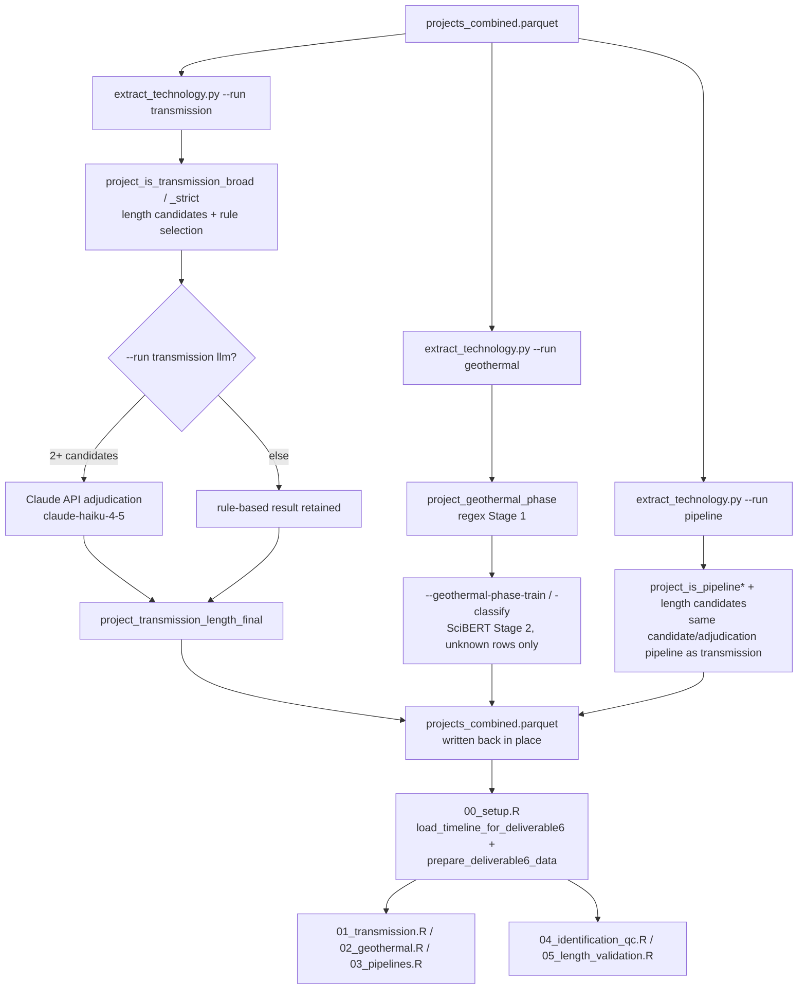

# D6: Transmission, Geothermal, and Pipelines — Architecture

**Goal:** Characterize three technology-specific NEPA review patterns among clean energy
projects: transmission line length vs. review duration/geography/action type; geothermal
development-phase sequencing (exploration → drilling → plant → operations); and carbon/
hydrogen pipeline review timelines compared to the more established natural gas baseline.

**Self-contained:** Partially. All three technology flags and length-extraction fields are
written entirely by `extract_technology.py` into `projects_combined.parquet` — R does not
re-derive any of them. Duration figures additionally need the shared timeline pipeline
(architecturally owned by D3 — see [../README.md](../README.md#timeline-data-integration)).

---

## Data Flow



---

## Inputs

| File | Description |
|---|---|
| `phase1/data/analysis/projects_combined.parquet` | All technology flags/length fields are written directly into this file by `extract_technology.py`; D6's R scripts never recompute them, and stub any expected column as `NA` if absent (guards against version mismatch) |
| `phase1/data/analysis/projects_timeline_bert.parquet`, `..._ea_llm.parquet`, `..._eis_llm.parquet` | Timeline dates, harmonized via `load_timeline_for_deliverable6()` (CE: BERT dates; EA/EIS: LLM-adjudicated dates — identical rule to D3's `load_timeline_for_deliverable3()`) |

---

## Primary Outputs

Tables under `phase1/output/deliverable6/tables/`; figures under
`phase1/output/deliverable6/figures/`.

| File | Description |
|---|---|
| `table_transmission_summary.csv`, `table_transmission_length_bins.csv`, `table_transmission_state_region.csv`, `table_transmission_action.csv` | Transmission summary, length-band duration stats, geography, action-type breakdown |
| `table_geothermal_phase_distribution.csv`, `table_geothermal_within_project_phases.csv`, `table_geothermal_phase_timeline.csv`, `table_geothermal_summary.csv` | Geothermal phase counts (project-level), within-project phase sequencing, phase-level duration |
| `table_pipeline_summary.csv`, `table_pipeline_group_summary.csv`, `table_pipeline_state_region.csv`, `table_pipeline_baseline_compare.csv`, `table_pipeline_correlations.csv` | Pipeline funnel, per-technology-group coverage/duration, geography, carbon/hydrogen-vs-natural-gas comparison |
| `table_identification_overview.csv`, `table_identification_by_process.csv` | Cross-technology identification coverage QC |
| `table_transmission_identification_audit_sample.csv`, `table_geothermal_identification_audit_sample.csv` | Manual-review audit samples (strict/broad-only, flagged/keyword-not-flagged) |
| `table_length_extraction_coverage.csv`, `table_transmission_length_validation_sample.csv`, `table_pipeline_length_validation_sample.csv` | Length-extraction coverage and stratified manual-validation samples |

**Figures** (`phase1/output/deliverable6/figures/`) — the core set produced by
`01_transmission.R`, `02_geothermal.R`, `03_pipelines.R`:

| File | Description |
|---|---|
| `fig_transmission_length_distribution.png` | Histogram of extracted line lengths; dashed line at median |
| `fig_transmission_length_by_action.png` | Boxplot of length by action type (excludes none/unknown/mixed) |
| `fig_transmission_length_bins.png` | Side-by-side bar charts: project count and median NEPA duration by length band |
| `fig_transmission_state_n.png` | Lollipop: number of projects per state, colored by census region |
| `fig_transmission_state_length.png` | Lollipop: median extracted length per state, with project count labels |
| `fig_transmission_length_vs_duration.png` | Scatter: length vs. duration, colored by action type; overall linear trend |
| `fig_transmission_duration_by_region.png` | Boxplot + jitter: NEPA duration by census region (y-axis capped at 1,000 days) |
| `fig_transmission_duration_by_action.png` | Boxplot + jitter: NEPA duration by project action type |
| `fig_geothermal_funnel.png` | Two-stage identification funnel: decarbonization universe → geothermal type-tag |
| `fig_geothermal_phase_distribution.png` | Project count by development phase (project-level, `analysis_proj`) |
| `fig_geothermal_phase_duration_boxplot.png` | NEPA duration by phase — violin + boxplot, action-level, topcoded at 250 days |
| `fig_geothermal_within_project_sequence.png` | Gantt-style segment plot: initiation-to-decision per inferred project, colored by phase |
| `fig_geothermal_upset.png` | UpSet plot of phase combinations for multi-phase projects with confirmed regex-derived phase combinations (n=241 of 318 total multi-phase; see Known Issues) |
| `fig_geothermal_ml_confidence.png` | ML classifier confidence histogram (only present after the `--geothermal-phase-classify` step is run) |
| `fig_pipeline_duration_by_group.png` | Boxplot of NEPA review duration by pipeline technology group |
| `fig_pipeline_length_vs_duration.png` | Scatter of pipeline length vs. duration, per-group trend lines |

`phase1/output/deliverable6/figures/` also contains several additional figures
(`fig_transmission_funnel.png`, `fig_transmission_sample_breakdown.png`,
`fig_transmission_action_count.png`, `fig_transmission_length_vs_duration_trim.png`,
`fig_transmission_start_vs_decision_lollipop.png`, `fig_pipeline_funnel.png`,
`fig_pipeline_decarb_vs_fossil.png`, `fig_pipeline_length_coverage.png`,
`fig_pipeline_length_distribution.png`, `fig_pipeline_length_bins.png`,
`fig_pipeline_length_by_group.png`) added to the R scripts after this table was last
compiled; consult `01_transmission.R` / `02_geothermal.R` / `03_pipelines.R` `ggsave()` calls
for the complete current set.

---

## Module Architecture

### Transmission (`extract_technology.py --run transmission`, analyzed by `01_transmission.R`)

**Two-tier identification.** `project_is_transmission_broad` is a permissive keyword pre-filter
(any of `\btransmission\b`, `\btransmission line\b`, `\belectricity transmission\b` in
combined title/description/type text). `project_is_transmission_strict` (aliased as
`project_is_transmission`, the analysis-grade flag) additionally requires: (1) `project_type`
contains "Electricity Transmission"; (2) title/description matches explicit build-related
transmission language (`TRANSMISSION_BUILD_RE` — new-line, construction-verb, kV-voltage,
HVDC, gen-tie patterns, narrowed to exclude bare ROW renewals); (3) extracted length ≥ 1 mile.
A title-only maintenance regex (`project_is_transmission_maintenance`) excludes vegetation-
management/routine-inspection-only projects before the strict gate is evaluated.

`TRANSMISSION_BUILD_RE` (`extract_technology.py`, case-insensitive):

```
(?:new\s+transmission\s+line|
\btransmission\s+line\s+(?:project|route|corridor)\b|
# transmission project/corridor without the word "line" (e.g. "Gateway West Transmission Project")
\btransmission\s+(?:project|corridor|facility)\b|
\b(?:construct(?:ion|ed)?|build(?:ing)?|install(?:ation|ed)?|upgrade(?:d|s)?|rebuild(?:ing)?)\s+
(?:of\s+)?(?:new\s+)?(?:\d{2,4}\s*-?\s*k\s?v\s+)?transmission\s+line\b|
double-?circuit\s+(?:\d{2,4}\s*-?\s*k\s?v\s+)?transmission\s+line|
single-?circuit\s+(?:\d{2,4}\s*-?\s*k\s?v\s+)?transmission\s+line|
\b\d{2,4}\s*-?\s*k\s?v\s+(?:transmission\s+line|line)\b|
# HVDC lines
\bHVDC\b|high.voltage\s+direct\s+current\b|
# generator-tie lines (new-build interconnection from generator to grid)
\bgen.tie\s+(?:line|transmission)\b|\bgenerating\s+tie\s+line\b|
# ROW branch: narrowed to require "new" so plain ROW renewals don't pass
right-?of-?way\s+(?:\w+\s+){0,3}new\s+transmission\s+line|
new\s+transmission\s+line\s+(?:\w+\s+){0,3}right-?of-?way)
```

**Length extraction** follows the same architecture as D3's generation-capacity pipeline:
sentence-level candidate extraction with hint terms (`transmission`, `powerline`, `kV
transmission`, …), false-positive filters (geographic-direction mentions, ROW-width context,
partial-land-crossing context, mile-post references), near-equal-value grouping, then a
rule-based selection cascade (`unique_match` → `single_nontrivial` → `alternative_take_max` →
`sum` → `build_verb_winner` → `take_max`) that stores its result in
`project_transmission_length_miles`. LLM adjudication (Claude, triggered only when 2+
non-trivial non-partial candidate groups remain) overrides to
`project_transmission_length_final` when it runs; **page-level length recovery**
(`_extract_tx_length_from_pages`, opt-in via `--page-length-recovery`) re-scans document
pages (all pages for CE; first 50 pages of `main_document='YES'` for EA/EIS) for projects that
passed the build-text gate but had no mileage in title/description — recovered projects have
`project_is_transmission_strict` **re-evaluated after write-back**, so the strict count can
grow between runs as page recovery finds more lengths.

**Action-type classification** (`project_transmission_action`): six regex categories
(`new_build`, `upgrade`, `maintenance`, `fiber_optic`, `renewal`, `acquisition`, plus `mixed`/
`unknown`) applied to full project text; `01_transmission.R`'s analysis universe explicitly
excludes `fiber_optic` and `renewal` actions (neither involves new line construction) while
retaining `unknown`/`mixed` as possibly-genuine builds with undetected signals.

### Geothermal (`extract_technology.py --run geothermal`, analyzed by `02_geothermal.R`)

**Identification** is a type-tag-only gate (`project_type` contains `geothermal`/`enhanced
geothermal`/`egs`) — no free-text keyword sweep, mirroring the pipeline design choice below.

**Two-stage phase classification.** Stage 1 (regex, always runs): `_classify_geothermal_phase()`
matches phase-specific keyword sets against combined project text —
`exploration` (resource assessment, geophysical survey, slim/core hole), `drilling`
(production/injection well, wellfield, well permit), `plant` (power plant, turbine,
interconnection), `operations` (steam supply, reinjection); `multi_phase` when 2+ phase sets
fire on the same document, with the specific matched phases recorded in
`project_geothermal_matched_phases`; `unknown` when a geothermal keyword is present but no
phase pattern matches. Stage 2 (ML, optional): a fine-tuned `allenai/scibert_scivocab_uncased`
classifier re-classifies `unknown` rows only, using class-weighted loss to correct
drilling-heavy imbalance and a self-training round for pseudo-labels; median post-training
confidence ~0.88–0.90. **Because Stage 2 is a single-label argmax classifier, ML-predicted
`multi_phase` rows never populate `project_geothermal_matched_phases`** (it stays `'[]'`) —
their internal phase breakdown cannot be reconstructed, which is why the UpSet figure in
`02_geothermal.R` covers only 241 of 318 project-level `multi_phase` projects (the 77 excluded
are entirely ML-classified `multi_phase` rows).

`GEOTHERMAL_PHASE_PATTERNS` (`extract_technology.py`, per-phase keyword regex lists matched
against `full_text`; `multi_phase` fires when 2+ phase sets match):

```
"exploration": \bexploration\b, \bexploratory\b, \bresource assessment\b, \bgeophysical survey\b,
    \btemperature gradient\b, \bseismic survey\b, \bgravity survey\b, \bmagnetic survey\b,
    \btemperature probe\b, \btest hole\b, \bslim.?hole\b, \bcore hole\b,
    \bresource characterization\b, \bgeoelectrical\b, \bfeasibility study\b,
    \bpre.?feasibility\b, \bgeothermal prospecting\b

"drilling": \bdrilling\b, \bdrill pad\b, \bwell pad\b, \bproduction well\b, \binjection well\b,
    \bwell stimulation\b, \bwell field\b, \bwell program\b, \bgeothermal well\b, \bsteam well\b,
    \btest well\b, \bhydrothermal well\b, \bwell construction\b, \bwellhead\b, \bwellfield\b,
    \bhydraulic stimulation\b, \breservoir stimulation\b, \bpermit to drill\b, \bwell permit\b,
    \bnotice of intent to drill\b, \bwell abandonment\b, \bwell plugging\b, \bwell completion\b

"plant": \bpower plant\b, \bgenerating station\b, \bsteam plant\b, \bbinary plant\b,
    \bflash plant\b, \bturbine\b, \binterconnection\b, \bpower generation\b,
    \belectric generation\b, \bgenerating facility\b, \bpower facility\b, \bgenerator\b,
    \bsubstation\b, \btransmission line\b, \bsteam gathering\b, \bpipeline system\b,
    \bcondenser\b, \bcooling tower\b, \bbinary cycle\b

"operations": \bsteam supply\b, \bfluid management\b, \bmake-up well\b, \bmakeup well\b,
    \breinjection\b, \bworking fluid\b, \bgeothermal resource utilization\b
```

**Project-level rollup** (`02_geothermal.R`) collapses action-level NEPA records to one row
per `geothermal_project_key` (a normalized-title key; titles under 8 characters after
normalization fall back to `project_id`) — a heuristic that may merge unrelated projects
sharing a location name or split one true project whose titles vary across reviews, with no
ground-truth match set to validate grouping accuracy.

### Pipelines (`extract_technology.py --run pipeline`, analyzed by `03_pipelines.R`)

**Identification** (`project_is_pipeline`) is type-tag-only (`project_type` contains
"Pipeline"), matching the geothermal design choice to avoid pulling in projects that mention
pipeline infrastructure only incidentally.

**New-build filter** (`project_is_pipeline_new_build`) narrows the broad pipeline set (which
spans new construction, expansions, safety certifications, ROW renewals, and administrative
filings) via two gates: build-text presence in title/description (`PIPELINE_BUILD_RE`) AND
not a maintenance-only title (`PIPELINE_MAINTENANCE_RE`). **Carbon and hydrogen pipelines are
exempted from the build-text gate** — as nascent technologies with essentially no installed
base, all NEPA reviews for them are effectively new-infrastructure reviews, and requiring
explicit construction language would undercount them when a large integrated document (e.g.
covering a CCS facility) describes the whole project rather than just the pipeline segment.
Unlike transmission, **no length gate** is applied to the new-build definition, because
pipeline length coverage is much sparser and a length requirement would drop many genuine
new-build projects with no extractable length.

`PIPELINE_BUILD_RE` (`extract_technology.py`, case-insensitive, matched against title +
description):

```
\b(?:
new\s+(?:natural\s+gas\s+|gas\s+|oil\s+|carbon\s+|co2\s+|hydrogen\s+|water\s+|crude\s+)?pipeline|
(?:construct(?:ion|ed)?|build(?:ing)?|install(?:ation|ed)?|lay(?:ing)?)\s+
(?:a\s+|the\s+|new\s+)?(?:gas\s+|oil\s+|carbon\s+|hydrogen\s+|water\s+|crude\s+)?pipeline|
pipeline\s+(?:project|route|corridor|expansion|extension|segment|lateral|alignment|interconnect(?:ion)?)|
buried\s+pipeline|
(?:gathering\s+system|gathering\s+line|flowline)\s+(?:project|construction|installation|expansion)|
pipeline\s+(?:facility|system)\s+(?:project|construction|development)
)\b
```

`PIPELINE_MAINTENANCE_RE` (`extract_technology.py`, case-insensitive, matched against title
only):

```
\b(?:
pipeline\s+(?:inspection|survey|monitoring)|
cathodic\s+protection|
in-?line\s+inspection|internal\s+inspection|
pigging|
pipeline\s+(?:repair|maintenance|replacement)|
right.of.way\s+(?:maintenance|mowing|spraying|herbicide)|
routine\s+(?:maintenance|inspection)|
annual\s+(?:maintenance|inspection|survey)|
leak\s+(?:detection|survey|repair)|
(?:recoating|coating|lining)\s+(?:of\s+)?(?:the\s+)?pipeline|
emergency\s+repair|
pipeline\s+safety\s+(?:program|rule|regulation|compliance)|
integrity\s+management\s+(?:plan|program)
)\b
```

**Length extraction** reuses the same candidate/adjudication architecture as transmission
(`_adjudicate_transmission_length()`, shared across both), with pipeline-specific hint terms
(`pipeline`, `right-of-way`, `flowline`, `gathering line`, …) and the same width-context
false-positive fix (a ±20-char local window around each feet-match, rather than
sentence-level exclusion, recovered candidates in sentences combining a length and a
ROW-width mention). Both the metadata-level and page-level (`_extract_pipeline_length_from_pages`)
extraction paths reuse `_adjudicate_transmission_length()`, so pipeline length **does** get
Claude adjudication when `--run pipeline llm` is used and 2+ non-trivial candidates remain —
the pipeline LLM audit columns (`project_pipeline_length_llm_*`) mirror transmission's. The
`_best_single_candidate()` helper defined in `extract_technology.py` is unused dead code, not
part of the pipeline path.

### Cross-technology QC (`04_identification_qc.R`, `05_length_validation.R`)

`04_identification_qc.R` produces the overview/by-process identification coverage tables and
draws stratified audit samples (60 strict + 60 broad-only-possible-misses for transmission; 60
flagged + 60 keyword-not-flagged for geothermal) for manual review, with blank columns for a
reviewer to record findings. `05_length_validation.R` draws stratified length-validation
samples (balanced by confidence bucket, plus a separate missing-length sample balanced by
process type) with blank `manual_length_found`/`manual_length_miles`/`manual_notes` columns.
**No automated validation pass exists for D6** — both scripts produce structured tables for
human review, not a computed accuracy metric.

---

## Run Results

<!-- d6-run-results: pull this section into the D6 report -->

**Identification coverage** (`table_identification_by_process.csv`, 20,725 clean energy
projects):

| Process | n | Transmission (strict) | Transmission (broad) | Geothermal | Pipeline |
|---|---:|---:|---:|---:|---:|
| CE | 19,399 | 151 (0.78%) | 7,171 | 0 | 0 |
| EA | 573 | 0 | 269 | 24 (4.19%) | 0 |
| EIS | 753 | 0 | 390 | 30 (3.98%) | 0 |

Strict transmission identification is CE-only in this snapshot (no EA/EIS projects clear the
build-text + length gates at this particular build); pipeline shows 0 for all three because
`project_is_pipeline` had not yet been populated for the clean-energy subset in this specific
committed run (see Known Issues).

**Transmission summary** (`table_transmission_summary.csv`, `project_is_transmission` universe
minus fiber-optic/renewal actions): 263 electricity transmission projects, 262 with an
extracted length, 141 with calculable duration, 28 multi-state, median length 11.9 miles,
median NEPA duration 110 days. Length-band duration (`table_transmission_length_bins.csv`)
scales sharply with line length: <10mi median 82 days (p90 684), 10–50mi median 110 days (p90
1,147), 50–100mi median 292.5 days (p90 747), 100+mi median 704.5 days (p90 2,480).

**Geothermal summary** (`table_geothermal_summary.csv`): 873 geothermal NEPA actions
resolving to 753 unique projects; 319 multi-phase projects at the action level, 241 with a
confirmed regex-derived phase combination usable in the UpSet figure. Phase distribution
(project-level, `table_geothermal_phase_distribution.csv`): drilling 191 (25.4%), plant 154
(20.5%), exploration 85 (11.3%), operations 4 (0.5%), multi_phase 319 (42.4%).

**Pipeline summary** (`table_pipeline_summary.csv`, all 61,881 NEPATEC projects, not just
clean energy — pipelines span both clean and fossil universes): 5,324 pipeline-type-tagged
projects, 899 new-build, 187 decarbonization (carbon + hydrogen) of which 183 are new-build,
3,014 with extractable length. By technology group
(`table_pipeline_group_summary.csv`): natural gas 1,828 projects (64.6% with length, median
0.70mi), oil/petroleum 2,338 (52.3%, median 0.69mi), carbon 157 (59.2%, median 8.5mi),
hydrogen 30 (33.3%, median 10.0mi), water/irrigation 658 (excluded from energy comparisons).

---

## Known Issues and Cautions

### Transmission strict count is unstable across artifacts in the current build

`table_identification_by_process.csv` / `table_identification_overview.csv` report **151**
strict transmission projects (CE only), while `table_transmission_summary.csv` (from
`01_transmission.R`, `filter(project_is_transmission)` minus fiber-optic/renewal actions)
reports **263**, and `table_length_extraction_coverage.csv` reports **215** transmission
projects with length data. This is architecturally expected: `project_is_transmission_strict`
is **re-evaluated after page-level
length-recovery write-back**, so its count grows as more projects get a recovered length —
the three artifacts reflect different points in that iterative recovery process, not three
different definitions. **Do not average or reconcile these three numbers; cite each with its
source table and treat 263 (the most complete, most recently generated `01_transmission.R`
run) as the current headline count** unless a fresher run of all three scripts is performed
together.

### Pipeline identification shows 0 in the by-process table

`table_identification_by_process.csv` reports `Pipeline flagged count = 0`, while
`table_pipeline_summary.csv` reports 187 clean decarbonization pipeline projects. This is a
timing artifact between when `04_identification_qc.R` and `03_pipelines.R` were last run
against `projects_combined.parquet` — use `table_pipeline_summary.csv` as the current pipeline
identification source of truth.

### Small pipeline and geothermal samples for headline comparisons

Carbon/hydrogen pipeline projects with both a new-build flag and a calculable duration are
few (order of magnitude: single digits per group per the underlying note), so all
carbon/hydrogen pipeline duration findings should be framed as preliminary and descriptive,
not statistically robust. Half of all geothermal-flagged projects carry
`project_geothermal_phase == "unknown"` even after the ML classifier pass, so phase-specific
conclusions are limited to the classifiable minority.

### Geothermal `multi_phase` has two structurally different origins

See Module Architecture above — 241 of 318 project-level `multi_phase` projects have a
recoverable phase combination (regex Stage 1); 77 do not (ML Stage 2, single-label argmax, no
recorded phase mixture). Any report language about "which phases co-occur" must restrict to
the 241, not the full 318.

---

## Output Schema

Technology fields are written into `projects_combined.parquet` by `extract_technology.py`.

#### Transmission flags and classification

| Field | Type | Description |
|---|---|---|
| `project_is_transmission_broad` | bool | Broad transmission flag (keyword-based) |
| `project_has_transmission_type_tag` | bool | `project_type` contains `Electricity Transmission` |
| `project_has_transmission_build_text` | bool | Title/description contains explicit build-language match (`TRANSMISSION_BUILD_RE`) |
| `project_is_transmission_maintenance` | bool | Title indicates vegetation management or maintenance-only scope |
| `project_is_transmission` | bool | Strict transmission flag — type tag + build text + length ≥ 1 mile + not maintenance. Referred to informally as "strict" in prose/comments, but this is the only boolean actually written to the dataframe; there is no separate `project_is_transmission_strict` column |
| `project_transmission_action` | str | `new_build`/`upgrade`/`maintenance`/`fiber_optic`/`renewal`/`acquisition`/`mixed`/`unknown` |

#### Transmission length extraction

| Field | Type | Description |
|---|---|---|
| `project_transmission_length_miles` | float | Rule-based selected length (baseline, always populated if candidates found) |
| `project_transmission_length_final` | float | Final length: LLM answer if LLM ran, else rule-based |
| `project_transmission_length_confidence` | str | `high`/`medium`/`none` |
| `project_transmission_length_source_text` | str | Text snippet containing the matched numeric value |
| `project_transmission_length_taxonomy` | str | Rule taxonomy used: `unique_match`/`build_verb_winner`/`take_max`/`sum`/`alternative_take_max`/`llm`/`none` |
| `project_transmission_length_selection_method` | str | `rule` or `llm` |
| `project_transmission_length_candidate_count` | int | Raw candidate count before grouping |
| `project_transmission_length_distinct_candidate_count` | int | Distinct value groups after near-equality collapse |
| `project_transmission_length_candidates_json` | str (JSON) | Array of all candidates (for QA) |
| `project_transmission_length_selected_candidate_ids` | str (JSON) | Array of IDs of selected candidates |
| `project_transmission_length_llm_trigger` | bool | Whether LLM adjudication was triggered (2+ non-trivial candidate groups) |
| `project_transmission_length_llm_used` | bool | Whether the LLM call succeeded |
| `project_transmission_length_llm_status` | str | `success`/`failed_fallback_rule`/`not_triggered`/`not_requested` |
| `project_transmission_length_llm_reasoning` | str | LLM's one-sentence explanation of its choice |
| `project_transmission_length_llm_model` | str | Model string (e.g. `claude-haiku-4-5-20251001`) or `""` if not used |
| `project_transmission_new_build_miles` | float | Sum of candidate lengths classified as new-build action type |
| `project_transmission_upgrade_miles` | float | Sum of candidate lengths classified as upgrade action type |
| `project_transmission_length_from_pages` | bool | TRUE if length was recovered from document page text (not title/description) |

#### Geothermal and pipeline

| Field | Type | Description |
|---|---|---|
| `project_is_geothermal` | bool | Geothermal keyword in `project_type` field |
| `project_geothermal_phase` | str | `exploration`/`drilling`/`plant`/`operations`/`multi_phase`/`unknown`/`none` — set by regex (Stage 1); updated from `unknown` by ML (Stage 2) |
| `project_geothermal_matched_phases` | str (JSON) | Array of phase keys whose regex patterns fired; `'[]'` for `unknown`, `none`, and ML-classified rows |
| `project_geothermal_phase_ml_classified` | bool | TRUE if the ML classifier updated this row's phase from `unknown` |
| `project_geothermal_phase_ml_confidence` | float | Softmax score for the ML-predicted label; NaN for regex-classified rows |
| `project_is_pipeline` | bool | `project_type` field contains "Pipeline" |
| `project_pipeline_has_build_text` | bool | Title/description contains construction-language match (`PIPELINE_BUILD_RE`) |
| `project_pipeline_is_maintenance` | bool | Title indicates operational maintenance scope (`PIPELINE_MAINTENANCE_RE`) |
| `project_is_pipeline_new_build` | bool | Likely new-construction/major-expansion review (build-text gate, carbon/hydrogen exemption, maintenance exclusion) |
| `project_is_carbon_pipeline` | bool | Carbon capture / CO₂ pipeline |
| `project_is_hydrogen_pipeline` | bool | Hydrogen pipeline |
| `project_is_natural_gas_pipeline` | bool | Natural gas pipeline |
| `project_pipeline_group` | str | Rolled-up subtype label |
| `project_pipeline_length_miles` | float | Rule-based selected length (baseline) |
| `project_pipeline_length_final` | float | Final length: LLM answer if LLM ran, else rule-based |
| `project_pipeline_length_confidence` | str | `high`/`medium`/`none` |
| `project_pipeline_length_source_text` | str | Text snippet containing the matched length value |
| `project_pipeline_length_from_pages` | bool | TRUE if length was recovered from document page text (not title/description) |
| `project_pipeline_length_candidate_count` | int | Raw candidate count |
| `project_pipeline_length_distinct_candidate_count` | int | Distinct value groups |
| `project_pipeline_length_candidates_json` | str (JSON) | Array of all pipeline candidates (for QA) |
| `project_pipeline_length_llm_trigger`, `_llm_used`, `_llm_status`, `_llm_reasoning`, `_llm_model` | various | LLM adjudication audit trail — same structure as the transmission LLM columns (see above); populated when `--run pipeline llm` is used |

---

## Methodological Notes

**Why strict vs. broad definitions for transmission, but type-tag-only for geothermal and
pipelines?** Transmission's broad keyword match ("transmission" anywhere in text) is far too
permissive — it would catch incidental interconnection-tie-line mentions in unrelated solar/
wind projects — so a strict, multi-gated definition (type tag + build language + length) is
needed for analysis-grade counts. Geothermal and pipeline identification instead rely on
NEPATEC's own controlled-vocabulary `project_type` tag, which is already reasonably precise
for those two technologies and avoids pulling in projects that mention geothermal/pipeline
infrastructure only incidentally in their description.

**Why is LLM adjudication triggered by candidate count, not universally?** For both
transmission and pipeline length extraction, the LLM is only useful when rule-based selection
cannot resolve ambiguity (2+ distinct non-trivial candidates survive grouping). Running it on
every project would be unnecessary cost for the (large) majority of projects where a single
unambiguous length candidate already exists.

**Why compare carbon/hydrogen pipelines against natural gas rather than oil/petroleum?**
Natural gas provides the closest established-technology analog with sufficient sample size
for a meaningful baseline; oil/petroleum pipelines are also large in count but represent a
different regulatory and siting context. "Other pipeline" (water/irrigation-dominated) is
retained as a residual category but excluded from the key energy-pipeline comparison.

---

## Reproduction

```bash
python phase1/code/extract/extract_technology.py --run transmission
export ANTHROPIC_API_KEY='...'
python phase1/code/extract/extract_technology.py --run llm --workers 4
python phase1/code/extract/extract_technology.py --run geothermal
python phase1/code/extract/extract_technology.py --geothermal-phase-train
python phase1/code/extract/extract_technology.py --geothermal-phase-classify
python phase1/code/extract/extract_technology.py --run pipeline
Rscript phase1/code/deliverable06/99_run_all.R
quarto render phase1/reports/deliverable06.qmd
```

See [runbook 06](../../runbooks/06_technology.md) for per-technology commands and cost notes.
