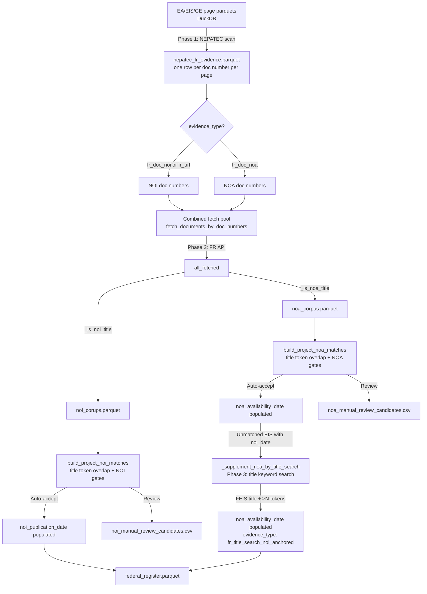

# federal_register.py — Architecture

**Script:** `phase2/code/api/federal_regisiter/federal_register.py` (note the misspelled folder name)

**Purpose:** Enrich NEPA projects with Federal Register dates:
- `noi_publication_date` — NOI (Notice of Intent) publication date at project initiation
- `noa_availability_date` — NOA (Notice of Availability) publication date at project end (FEIS/FSEIS/FONSI/Final EA)

Both are found by scanning project NEPATEC files for FR Doc. numbers, then direct-fetching the matching FR records.

**Runbook:** See [runbooks/federal_register.md](../../runbooks/federal_register.md) for CLI commands.

---

## Design Rationale

The initial approach used the FR keyword search API to build a corpus of candidate NOI documents, then matched projects by title similarity. This had two problems:

1. **Coverage gap:** FR documents cited in NEPATEC files often don't appear in a generic keyword search. Of ~822 projects with valid NEPATEC doc number evidence, only ~201 joined the keyword corpus — a 75% loss.

2. **False-positive risk:** Title-only matching has no temporal anchor. A project could match an NOI from a prior NEPA iteration that happens to share title tokens, silently backdating the NOI date.

**Current approach:** When the NEPATEC page scan extracts a specific FR doc number from a project's files, that number is the most reliable possible signal — the project's own reviewers cited it. One targeted API call fetches that exact document. No keyword search, no date windows, no corpus coverage gaps.

The same architecture extends to NOA (Notice of Availability): `fr_doc_noa` evidence in NEPATEC pages links to Final EIS / FONSI notices, providing an end-of-process date signal.

---

## Three-Phase Pipeline



### Phase 1 — NEPATEC Page Scan (DuckDB)

DuckDB scans all EA/EIS/CE page parquets (~6M+ pages) for two signal types:

**FR doc numbers** — regex captures:
- Bracket form: `[FR Doc. 2024-05618 ...]`
- Parenthetical form: `(FR Doc. 2024-05618 ...)`
- Bare prose: `FR Doc. 2024-05618`

En-dash variants (`2024–05618`) are normalized to ASCII hyphens before use as join keys.

**Proximity filter** — priority order within 500-char window:
1. `fr_doc_noi` — NOI-like phrase nearby ("notice of intent", "notice of preparation", etc.)
2. `fr_doc_noa` — NOA-like phrase nearby ("final environmental impact statement", "fonsi", "notice of availability", "record of decision", "final supplemental eis", etc.)
3. `fr_doc_non_noi` — no recognized phrase (excluded from matching)

**FR URLs** — `federalregister.gov/documents/...` links are captured as `fr_url` evidence (used for NOI matching only).

Evidence is cached in `nepatec_fr_evidence.parquet` and reused across refreshes unless `--rescan-nepatec-evidence` is set.

### Phase 2 — Direct Fetch from FR API

All unique doc numbers from valid `fr_doc_noi`, `fr_url`, and `fr_doc_noa` evidence are fetched in a single combined pass:
```
GET https://www.federalregister.gov/api/v1/documents/{doc_num}.json
```

404s are cached as `None`. The cache (`fr_noi_cache.json`) avoids redundant calls across refreshes.

The combined fetched set is then split by title type:
- `noi_corups.parquet` — records whose title passes `_is_noi_title()` (NOI/NOP/NOS)
- `noa_corpus.parquet` — records whose title passes `_is_noa_title()`: Final EIS and Final Supplemental EIS titles are accepted unconditionally; FONSI titles are accepted unconditionally; Final EA / Final Environmental Assessment titles require "availability" language.

Records matching neither type are not used in matching (e.g. proposed rules, notices of meeting).

### Phase 3 — NOA Title Search Fallback (EIS only)

For EIS projects that remain unmatched after Phase 2 (no `fr_doc_noa` NEPATEC evidence), `_supplement_noa_by_title_search()` attempts a targeted FR keyword search:

```
GET https://www.federalregister.gov/api/v1/documents.json
  ?conditions[term]=<title phrase>
  &conditions[type][]=NOTICE
  &conditions[publication_date][gte]=<noi_date + 365 days>
  &per_page=20
```

**Eligibility:** EIS project (EA excluded) + `noi_publication_date` known + ≥ 3 distinctive title tokens.

**Why EIS only:** FEIS notices are reliably detectable by title ("Final Environmental Impact Statement" in FR context always means a FEIS notice). FONSI matching without direct doc evidence would have higher false-positive risk.

**Structural rationale:** FEIS bodies are written before their FR doc number is assigned at publication. The FEIS text can never cite its own doc number — only post-FEIS documents (RODs, responses to comments) can. This makes Phase 2's direct-evidence path structurally incomplete for NOA. Phase 3 fills this gap by anchoring on `noi_publication_date` and strong title overlap rather than doc number evidence.

**Acceptance gates (all must pass):**
1. FR record title passes `_is_noa_title()` — FEIS/FSEIS type only
2. `_FEIS_TITLE_RE` confirms it is specifically a Final EIS/FSEIS (not FONSI)
3. Title token overlap ≥ max(_required_title_overlap(n), min(n, 3)) — more conservative than direct-evidence path
4. Not a termination/withdrawal notice

Results are cached in `fr_noi_cache.json` under key `noa_title_search|{term}|{min_date}`. Provenance: `noa_date_evidence_type = "fr_title_search_noi_anchored"`.

---

## Acceptance Gates

### NOI gates (all four must pass)

| Gate | Rule |
|---|---|
| 1. Doc number join | FR record was directly fetched for this doc number |
| 2. Title token overlap | ≥ N distinctive project title tokens appear in the FR record's title |
| 3. NOI-type title | FR record title is a Notice of Intent / Notice of Preparation / Notice of Scoping |
| 4. No process conflict | FR record is not explicitly a different process type than the project |

Gate 3 prevents a "Notice of Availability of the Final EIS" date from contaminating `noi_publication_date`.

### NOA gates (all must pass)

| Gate | Rule |
|---|---|
| 1. `fr_doc_noa` doc number join | FR record was fetched for a doc number with NOA proximity evidence |
| 2. Title token overlap | ≥ N distinctive project title tokens appear in the FR record's title |
| 3. NOA-type title | FR record title contains Final EIS / FSEIS / FONSI / Final EA language |
| 4. Process alignment | EIS project → FEIS or FSEIS title; EA project → FONSI/Final EA title |

CE projects never auto-accept for either NOI or NOA.

### Relative Title Overlap Threshold

| Project title distinctive tokens | Required overlap |
|---|---|
| 1 | 1 (all) |
| 2 | 2 (all) |
| 3 | 2 |
| 4+ | 3 |

"Distinctive tokens" excludes NEPA boilerplate (`environmental`, `assessment`, `impact`, `statement`, `project`, `federal`, etc.) and tokens shorter than 4 characters with no digits.

---

## Acceptance Rules Summary

### NOI
| Condition | Outcome |
|---|---|
| EA/EIS: `fr_doc_noi` evidence + ≥ N title tokens + NOI-type title + no conflict | **Auto-accept** (`noi_publication_date` populated) |
| EA/EIS: `fr_url` evidence + ≥ N title tokens + NOI-type title + no conflict | **Auto-accept** |
| EA/EIS: doc number joins + enough title overlap, but FR title is not NOI-type | **Manual review** |
| EA/EIS: doc number joins but title overlap < N | **Manual review** |
| EA/EIS: doc number joins but process conflict | **Manual review** |
| CE: any NEPATEC doc number evidence | **Manual review** |
| No NEPATEC doc number evidence | **Unmatched** |

### NOA
| Condition | Outcome |
|---|---|
| EIS: `fr_doc_noa` evidence + ≥ N title tokens + FEIS/FSEIS title | **Auto-accept** (`noa_availability_date` populated) |
| EA: `fr_doc_noa` evidence + ≥ N title tokens + FONSI/Final EA title | **Auto-accept** |
| Any: `fr_doc_noa` evidence + NOA title + insufficient title overlap | **Manual review** |
| Any: `fr_doc_noa` evidence + process mismatch | **Manual review** |
| CE: any `fr_doc_noa` evidence | **Manual review** |
| EIS: no `fr_doc_noa` evidence, has `noi_publication_date`, ≥ 3 title tokens → Phase 3 title search → FEIS title + ≥ max(N, min(n, 3)) overlap | **Auto-accept** (`noa_date_evidence_type = "fr_title_search_noi_anchored"`) |
| EA/CE: no `fr_doc_noa` evidence | **Unmatched** (no title search fallback) |

---

## Key Output Artifacts

| File | Description |
|---|---|
| `federal_register/federal_register.parquet` | **Primary output.** One row per project; `noi_publication_date` and `noa_availability_date` where auto-accepted. |
| `federal_register/noi_corups.parquet` | FR records for NOI doc numbers (one row per unique doc number). |
| `federal_register/noa_corpus.parquet` | FR records for NOA doc numbers (FEIS/FSEIS/FONSI/Final EA). |
| `federal_register/nepatec_fr_evidence.parquet` | One row per FR doc number per NEPATEC page; cached across refreshes. |
| `federal_register/noi_candidates.parquet` | All scored NOI project/document candidate links. |
| `federal_register/noa_candidates.parquet` | All scored NOA project/document candidate links. |
| `federal_register/noi_manual_review_candidates.csv` | Candidate rows for projects with multiple competing high-confidence NOI candidates. |
| `federal_register/noa_manual_review_candidates.csv` | NOA candidates requiring manual review (CE, process mismatch, insufficient title overlap). |
| `federal_register/fr_noi_cache.json` | API response cache. Direct-fetch keys: `docnum|{doc_num}`; Phase 3 title search keys: `noa_title_search|{term}|{min_date}`. |

---

## Provenance Fields in `federal_register.parquet`

### NOI
| Field | Description |
|---|---|
| `noi_date_evidence_type` | `nepatec_fr_doc_number` for auto-accepted direct-evidence matches |
| `noi_match_status` | `accepted`, `review_required`, `ambiguous`, or `unmatched` |
| `noi_match_reason` | Specific reason code (e.g., `nepatec_fr_doc_number_with_title_match`) |
| `noi_nepatec_evidence_document_id` | NEPATEC document where the FR doc number was found |
| `noi_nepatec_evidence_file_name` | File name of that document |
| `noi_nepatec_evidence_page_number` | Page number of the FR doc bracket |

### NOA
| Field | Description |
|---|---|
| `noa_availability_date` | FR publication date of FEIS/FONSI notice |
| `noa_document_number` | FR document number of the NOA record |
| `noa_match_status` | `accepted`, `review_required`, or `unmatched` |
| `noa_match_reason` | Specific reason code (e.g., `nepatec_fr_doc_noa_with_title_match`) |
| `noa_date_evidence_type` | `nepatec_fr_doc_noa` for direct-evidence matches; `fr_title_search_noi_anchored` for Phase 3 title search matches |
| `noa_nepatec_evidence_document_id` | NEPATEC document where the NOA doc number was found |
| `noa_nepatec_evidence_file_name` | File name of that document |
| `noa_nepatec_evidence_page_number` | Page number of the FR doc bracket |

---

## Integration with extract_data.py

`federal_register.py` is called by `extract_data.py` when `--refresh-federal-register` is set. The output `federal_register.parquet` (containing both NOI and NOA fields) is merged into `projects_combined.parquet` on `project_id`. In offline mode, `extract_data.py` reads a cached copy without calling the FR API.

**Timeline date hierarchy** (used in D4 and elsewhere):
1. `noi_publication_date` — authoritative Federal Register NOI date where present
2. `bert_initiation_date` from `extract_timeline.py` — BERT classifier fallback

`noa_availability_date` provides the complementary end-of-process signal: typically 30–90 days before the ROD for EIS projects, or at FONSI issuance for EA projects.
