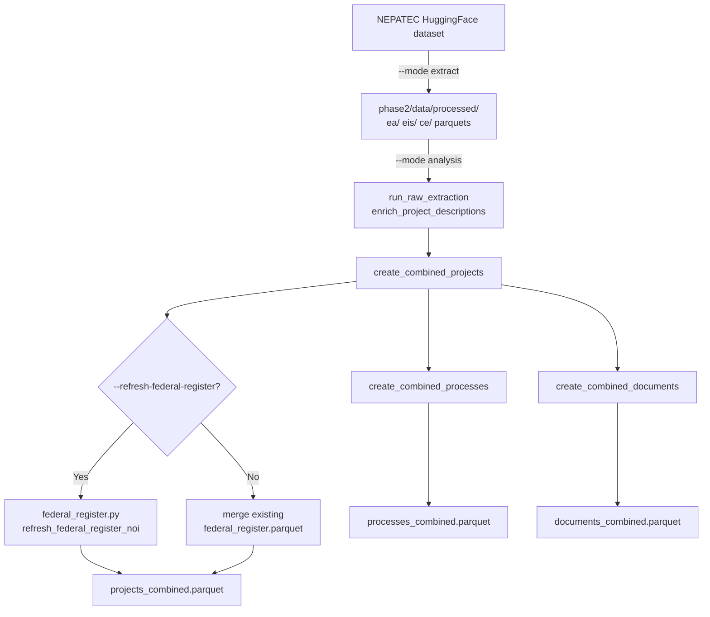

# extract_data.py — Pipeline Architecture

**Script:** `phase2/code/extract/extract_data.py`

**Purpose:** Main entry point for the Phase 2 data pipeline. Downloads raw NEPATEC data, builds analysis-ready parquet files, and merges enrichment artifacts (Federal Register NOI, timeline data). Every downstream deliverable script starts from `projects_combined.parquet` produced here.

---

## Data Flow



---

## Modes

| Mode | What it does |
|---|---|
| `--mode extract` | Downloads EA, EIS, CE datasets from HuggingFace and writes `data/processed/{ea,eis,ce}/`. Requires internet. |
| `--mode analysis` | Builds `projects_combined.parquet` from existing processed data. Default; fully offline unless `--refresh-federal-register`. |
| `--mode all` | Both — download then build. |

---

## Key Output: `projects_combined.parquet`

One row per NEPA project. Primary key: `project_id`.

| Column group | Source | Description |
|---|---|---|
| `project_id`, `project_title`, `project_type`, `project_sponsor` | Raw NEPATEC | Core project identity |
| `process_type` | NEPATEC processes table | `EA`, `EIS`, or `CE` |
| `lead_agency`, `lead_agency_harmonized`, `project_department` | Agency classification | Normalized agency and DOI/USFS/DOE etc. department |
| `project_energy_type`, `project_energy_type_strict` | `classify_energy.py` | `Clean`, `Other`; strict version applies tighter criteria |
| `project_state`, `project_county`, `project_lat`, `project_lon` | `parse_location.py` | Geography |
| `project_multi_state`, `project_multi_county`, `project_multi_department` | Derived flags | Multi-jurisdiction indicators |
| `project_has_decision_doc`, `project_has_final_doc`, `project_has_draft_doc` | Documents table | Document availability flags |
| `noi_publication_date`, `noi_document_number`, `noi_match_status` | `federal_register.py` | Federal Register NOI enrichment |
| `noa_availability_date`, `noa_document_number`, `noa_match_status` | `federal_register.py` | Federal Register NOA enrichment (FEIS/FONSI end-of-process signal) |
| `project_is_military_nuclear`, `project_is_nuclear_waste` | Exclusion lists | Manual filter flags |

---

## Energy Classification

Clean energy projects are identified from NEPATEC metadata (project type, sponsor, title keywords).
Two classification levels:

- `project_energy_type = "Clean"` — broad filter, includes borderline cases flagged by `project_energy_type_questions`
- `project_energy_type_strict = "Clean"` — tighter; used for conservative analysis cuts

Military/nuclear waste exclusions are applied via curated ID lists in `data/analysis/exclusions/`.
Projects reclassified to `"Other"` retain the `project_military_to_exclude` or `project_nuclear_waste_to_exclude` flag for auditability.

**Note:** The current Phase 2 analysis uses `n_clean = 20,725` projects where `project_energy_type == "Clean"`.

---

## Federal Register NOI/NOA Merge

The Federal Register enrichment is intentionally **opt-in** at refresh time:

```
Default (offline):
  → merges data/analysis/federal_register/federal_register.parquet if present
  → if does not exist, projects get null NOI/NOA fields (not an error)

With --refresh-federal-register:
  → calls federal_register.py refresh_federal_register_noi()
  → runs NEPATEC page scan (DuckDB) + targeted FR API fetches
  → rewrites federal_register.parquet, then merges
```

This keeps normal analysis runs fast and deterministic. See [federal_register.md](federal_register.md) for NOI/NOA matching architecture and [runbooks/federal_register.md](../../runbooks/federal_register.md) for refresh commands.

---

## CLI Reference

```bash
# Default: build analysis parquets offline
conda run -n nepa python phase2/code/extract/extract_data.py --mode analysis

# Build + refresh Federal Register NOI (network required)
conda run -n nepa python phase2/code/extract/extract_data.py --mode analysis --refresh-federal-register

# Download raw data from HuggingFace (first-time setup)
conda run -n nepa python phase2/code/extract/extract_data.py --mode extract

# Full rebuild from scratch
conda run -n nepa python phase2/code/extract/extract_data.py --mode all
```

---

## Other Outputs

| File | Description |
|---|---|
| `data/analysis/processes_combined.parquet` | One row per NEPA process (process_type, lead_agency, dates) |
| `data/analysis/documents_combined.parquet` | One row per NEPA document with classification flags |

---

## Design Notes

**Why DuckDB for page scanning?** The full NEPATEC corpus is ~6M+ pages across EA/EIS/CE parquets — too large to load into pandas. All page-level operations (FR doc number scan, regex extraction, section detection) use DuckDB `read_parquet()` with predicate pushdown.

**Why is FR refresh opt-in?** The NEPATEC page scan takes 30–60 seconds, and the FR API calls add network latency. Analysis runs that don't need updated NOI dates should remain fast and reproducible without external dependencies.

**Why no timeline merge here?** Timeline data (`timeline_*.parquet`) is merged at the deliverable level rather than baked into `projects_combined.parquet`. This keeps the base dataset stable across different timeline pipeline iterations and lets deliverables choose which timeline artifact to use.
