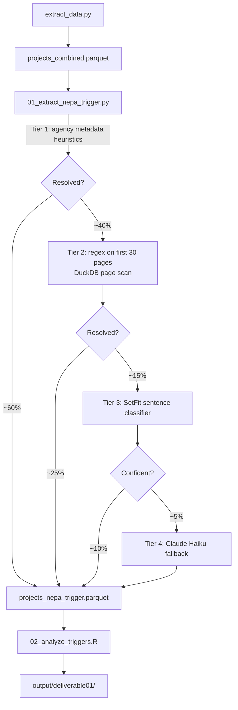

# D1: NEPA Triggered — Architecture

**Goal:** Classify why NEPA was triggered for each clean energy project (federal land, federal funding, federal permits, or combinations).

**Self-contained:** Yes — runs after `extract_data.py` only.

---

## Data Flow

---

## Inputs

| File | Description |
|---|---|
| `data/analysis/projects_combined.parquet` | Project metadata: agency, process type, energy type, land status, geography |
| `data/processed/ce/pages.parquet` | CE document pages (DuckDB scan, first 30 pages) |
| `data/processed/ea/pages.parquet` | EA document pages (DuckDB scan, first 30 pages) |
| `data/processed/eis/pages.parquet` | EIS document pages (DuckDB scan, first 30 pages) |

---

## Key Processing Steps

### Tier 1 — Metadata Heuristics (~60% coverage)
Map agency to trigger type using known jurisdiction rules:
- BLM, NPS, USFS, BOR, FWS projects → `federal_land`
- DOE, DOD projects with funding language → `federal_funding`
- Projects with federal permit requirements → `federal_permit`

Handles the majority of clean energy projects because agency type is a strong proxy for federal nexus.
Does NOT handle ambiguous cases (e.g., DOE funding on private land, or BLM permit for a non-federal project).

### Tier 2 — Regex (~25% additional coverage)
Scan first 30 pages per project via DuckDB for explicit trigger language:
- Federal land: `"federal land"`, `"public land"`, `"right-of-way"`, `"federal lands unit"`
- Federal funding: `"DOE funding"`, `"federal grant"`, `"appropriated funds"`, `"loan guarantee"`
- Federal permits: `"Section 404"`, `"Section 401"`, `"Clean Water Act permit"`, `"federal authorization"`

Returns `trigger_regex` (list of matched trigger types) and `trigger_regex_confidence` (high/medium/low).

### Tier 3 — SetFit Sentence Classifier
For projects unresolved after Tier 2, extract the top 5 most trigger-relevant sentences per project
(using keyword scoring) and run through a SetFit multi-label classifier trained on ~100 labeled examples.

SetFit is appropriate here because: (a) data scarcity — only ~15-20 examples per class available,
(b) classification is sentence-level not positional, (c) fast training and inference.

### Tier 4 — LLM Fallback
Claude Haiku for the remaining ~5% of projects with low-confidence results. Targeted prompt asking
only about trigger type; structured JSON output.

---

## Output Schema

`data/analysis/nepa_trigger/projects_nepa_trigger.parquet`

| Column | Type | Description |
|---|---|---|
| `project_id` | str | Primary key |
| `trigger_types` | list[str] | List of trigger types: `federal_land`, `federal_funding`, `federal_permit` |
| `trigger_primary` | str | Most prominent trigger type |
| `trigger_confidence` | str | `high`, `medium`, `low` |
| `trigger_source` | str | `metadata`, `regex`, `setfit`, `llm` |
| `trigger_context` | str | Supporting text evidence |
| `trigger_extraction_run_at` | str | ISO-8601 UTC timestamp |

---

## Methodological Notes

**Why four tiers instead of just LLM?** Most triggers are unambiguous from agency metadata alone (~60%).
Running LLM on all 20k projects would cost ~$20-40 at Haiku pricing and introduce hallucination risk for
cases that are trivially answered by agency type. The tiered approach reserves LLM for genuine ambiguity.

**Why SetFit over fine-tuned DeBERTa?** The trigger classification task has data scarcity (few labeled
examples per class), not label quality issues. SetFit is designed for exactly this regime — contrastive
learning on sentence embeddings from as few as 8-32 examples per class. DeBERTa fine-tuning would
overfit on ~100 total examples.

**Multi-label consideration:** Many projects are triggered by multiple nexus factors simultaneously
(e.g., federal land AND DOE funding for a DOE project on BLM land). The output stores all applicable
trigger types as a list rather than forcing single-label classification.
