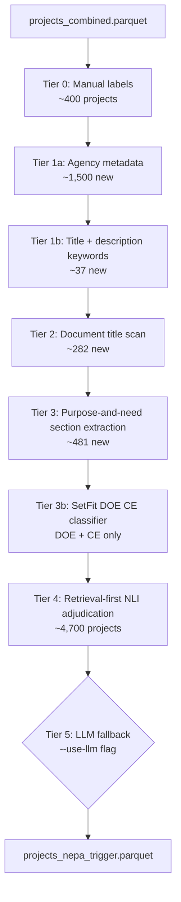

# D1: NEPA Triggered — Architecture

**Goal:** Classify why NEPA was triggered for each clean energy project across seven classes: `federal_direct_action`, `federal_program`, `federal_property_transaction`, `federal_land`, `federal_permit`, `federal_funding`, `unknown`.

**Self-contained:** Yes — requires only `projects_combined.parquet` and CE/EA/EIS pages files.

---

## Data Flow

---

## Inputs

| File | Description |
|---|---|
| `phase2/data/analysis/projects_combined.parquet` | Project metadata: agency, process type, energy type, land status, geography |
| `phase2/data/processed/ce/pages.parquet` | CE document pages (DuckDB scan) |
| `phase2/data/processed/ea/pages.parquet` | EA document pages (DuckDB scan) |
| `phase2/data/processed/eis/pages.parquet` | EIS document pages (DuckDB scan) |

---

## Classification Scheme

Seven mutually exclusive primary classes, with a strict priority ordering used when signals conflict:

| Priority | Class | Core signal |
|---|---|---|
| 1 | `federal_direct_action` | Federal agency is the proposing actor |
| 2 | `federal_program` | Programmatic EIS/EA, land-use plan, rulemaking |
| 3 | `federal_property_transaction` | Land exchange, disposal, conveyance |
| 4 | `federal_land` | Project on federal land; ROW/SUP granted to private developer |
| 5 | `federal_permit` | Federal permit/license is the primary nexus |
| 6 | `federal_funding` | Federal grant, loan guarantee, financial assistance |
| 7 | `unknown` | NEPA confirmed but trigger cannot be reliably identified |

Secondary triggers are stored in `nepa_trigger_secondary` (list) for multi-label combo analysis.

---

## Tier Architecture

### Tier 0 — Manual Labels
Hand-labeled gold-standard examples loaded from `manual_training_corrections.csv`. These are
ingested first and cannot be overwritten by any subsequent tier. ~400 projects.

### Tier 1a — Agency Metadata Heuristics
Maps `lead_agency_harmonized` to trigger class using known jurisdiction rules. A result from
Tier 1a that is auto-accepted goes directly to `finalized`; others go to `provisional` and may
be sent to Tier 4 for confirmation.

Key mappings:
- `FERC`, `FAA`, `FCC` → `federal_permit` (auto-accept)
- `BPA`, `WAPA`, `CBP`, `PMA` → `federal_direct_action` (auto-accept)
- `BLM`, `USFS` as authorizing agency → `federal_land` (auto-accept via `T1a_BLM_USFS_land_control`)
- `DOE`, `USACE` → routed to Tier 4 (ambiguous without verb evidence)

Adds ~1,500 projects. Highest-yield deterministic tier.

### Tier 1b — Title and Description Keywords
Applies `TIER1B_PATTERNS` (regex list) against the concatenated project title and description.
Each pattern tuple is `(regex, class, rule_slug, confidence)`. If the resulting `rule_id`
(`T1b_{slug}`) is in `AUTO_ACCEPT_RULE_IDS`, the result is auto-accepted; otherwise it goes
to `provisional`.

Currently auto-accepted rules: `T1b_ferc_license`, `T1b_special_use`, `T1b_row_grant`,
`T1b_land_exchange`. All other high-confidence Tier 1b matches go to provisional.

Adds ~37 projects to finalized (many more to provisional).

### Tier 2 — Document Title Scan
Scans the document titles of the first retrieved documents for each project via DuckDB.
Applies `_is_programmatic_title`, `_is_programmatic_exclusion`, and `DOC_TITLE_PATTERNS`.

Currently auto-accepted rules: `T2_doc_title_peis`, `T2_doc_title_row`,
`T2_doc_title_permit_app`, `T2_doc_title_license_amendment`, `T2_doc_title_loan_guarantee`.

Adds ~282 projects.

### Tier 3 — Purpose-and-Need Section Extraction
Extracts the "Purpose and Need" section (and related candidate sections) from document pages via
DuckDB, then applies the same `TIER1B_PATTERNS` + additional purpose-specific patterns.

Currently auto-accepted rules: `T3_npdes`, `T3_agency_grant`, `T3_blm_land`, `T3_nfs_land`.

Adds ~481 projects.

### Tier 3b — SetFit DOE CE Classifier
Runs only on projects where `lead_agency_harmonized` contains "Department of Energy" AND
`process_type == "CE"`. Uses a fine-tuned SetFit model at `phase2/models/trigger_setfit`
(6-class logistic regression head over a sentence-transformer backbone).

**How confidence works in SetFit:** `predict_proba` returns a probability vector over all
classes, e.g. `[0.04, 0.71, 0.03, 0.14, 0.05, 0.03]`. Two gates must both pass:
- `top_prob >= SETFIT_CONFIDENCE_THRESHOLD` (currently 0.80)
- `margin = top_prob - second_prob >= SETFIT_MARGIN_THRESHOLD` (currently 0.15)

If both gates pass, the result is auto-accepted as `confidence="high"`. If either gate fails,
the project falls through to Tier 4 unchanged. With a logistic regression head trained on a
small example bank, probabilities rarely concentrate above 0.80. In the April 2026 run,
0 projects cleared the gate despite 436 inference batches.

### Tier 4 — Retrieval-First NLI Adjudication
Receives all projects not yet finalized where `should_send_to_tier4` returns True. This
includes: projects with no provisional result, projects from ambiguous agencies (DOE, USACE),
and projects with medium/low confidence provisionals.

**How confidence works in Tier 4 NLI:** Uses `cross-encoder/nli-deberta-v3-base` (or
`cross-encoder/nli-MiniLM2-L6-H768` as configured). For each candidate class, the model
receives the retrieved chunk text as the premise and a natural-language hypothesis as the
hypothesis. The entailment score is the `final_score` per chunk. Scores are aggregated
across chunks into a per-project `doc_score` per candidate class. Three gates must all pass:

1. `doc_score >= threshold`: `TIER4_BASE_THRESHOLD` (0.72) if agency metadata priors exist,
   `TIER4_NO_PRIOR_THRESHOLD` (0.78) otherwise
2. `margin >= TIER4_MARGIN_THRESHOLD` (0.08): top class must score at least 0.08 above second
3. `affirmative_support`: at least one chunk must have `cue_score >= 0.25` or
   `entailment_score >= 0.82`

If all three pass, `auto_resolve=True` and the project is finalized as `confidence="high"`
(if `doc_score >= 0.95`) or `confidence="medium"` (otherwise). If any gate fails, the
project gets `rule_id="T4_local_uncertain"` with `confidence="low"` and is queued for Tier 5
(or finalized as `unknown` if `--use-llm` is not set).

Diagnostics written to:
- `phase2/data/analysis/nepa_trigger/tier4_chunk_scores.parquet`
- `phase2/data/analysis/nepa_trigger/tier4_doc_scores.parquet`

### Tier 5 — LLM Fallback
Claude Haiku receives the Tier 4 uncertain queue (target: <250 projects) with retrieved
context chunks and returns structured JSON classification. Only runs with `--use-llm` flag.

---

## Routing Logic

### `should_auto_accept(result)`
Returns `True` only when:
- `rule_id` is in `AUTO_ACCEPT_RULE_IDS` (explicit whitelist of trusted rules), OR
- `rule_id` starts with `T4_local_` or `T4_embed_` and confidence is high/medium, OR
- `rule_id == "T5_llm"` and confidence is high/medium

### `should_send_to_tier4(result)`
Returns `True` (send to Tier 4) when:
- `result is None` — no provisional result exists for this project
- `rule_id` is in `SEND_TO_TIER4_RULE_IDS` (`T1a_DOE_direct_action`, `T1a_DOE_funding`,
  `T3_sec404`)
- `evidence_source == "agency_metadata"` — agency-level priors need document confirmation
- `confidence != "high"` — low/medium confidence provisionals need adjudication

Returns `False` (do NOT send to Tier 4) when confidence is `"high"` and the rule is not
in `SEND_TO_TIER4_RULE_IDS`. **This creates a logic gap:** projects with high-confidence
provisional results from rules NOT in `AUTO_ACCEPT_RULE_IDS` are neither finalized nor sent
to Tier 4. They fall through to `_make_unknown` at the end of the pipeline.

### `_ingest(results)`
For each result: if `should_auto_accept` → add to `finalized`. Otherwise → add to
`provisional` (keeping the higher-confidence result if one already exists).

---

## Known Issues

### Provisional Fallthrough (13,324 projects in April 2026 run)
Projects can have a high-confidence provisional result that is silently discarded:
- Rule fires → confidence="high" → `should_auto_accept` returns False (rule not in
  `AUTO_ACCEPT_RULE_IDS`) → goes to `provisional`
- `should_send_to_tier4` returns False (confidence=="high") → never sent to Tier 4
- At end of pipeline: `_make_unknown` is called → appears as `unknown` in output

The original provisional rule_id and evidence text ARE preserved in the unknown record's
`nepa_trigger_evidence_text` and `nepa_trigger_evidence_source` fields. In the April 2026
run: 12,528 of the 13,324 had `evidence_source="description"`, indicating a Tier 1b pattern
match was silently dropped. Fix: either add those rule IDs to `AUTO_ACCEPT_RULE_IDS` or
change `should_send_to_tier4` to also forward high-confidence provisionals to Tier 4.

### SetFit Threshold Too High
`SETFIT_CONFIDENCE_THRESHOLD = 0.80` is too strict for a logistic regression head trained on
a small example bank. In the April 2026 run, 0 DOE CE projects cleared the gate despite 436
inference batches. Lower to 0.60–0.65.

### Unknown Pool Composition (April 2026 run)
Of 17,943 unknowns:
- 16,963 (94.5%) are CEs
- 14,193 (79.1%) are DOE
- 13,324 are `unresolved_after_tier4` (provisional fallthrough, all had a rule fire)
- 4,619 are `T4_local_uncertain` (Tier 4 processed but all three gates failed)

---

## Output Schema

`phase2/data/analysis/nepa_trigger/projects_nepa_trigger.parquet`

| Column | Type | Description |
|---|---|---|
| `project_id` | str | Primary key |
| `nepa_trigger_primary` | str | Top-priority trigger class |
| `nepa_trigger_secondary` | list[str] | Additional trigger classes (multi-label) |
| `nepa_trigger_multi` | bool | True if 2+ triggers detected |
| `nepa_trigger_count` | int | Number of trigger classes detected |
| `nepa_trigger_combo` | str | Sorted combo string for grouping |
| `nepa_trigger_primary_hierarchy` | str | Priority-resolved primary class |
| `nepa_trigger_evidence_text` | str | Supporting text passage |
| `nepa_trigger_evidence_source` | str | `description`, `document_text`, `doc_title`, `agency_metadata`, `purpose_and_need` |
| `nepa_trigger_confidence` | str | `high`, `medium`, `low` |
| `nepa_trigger_rule_id` | str | Rule that produced the classification |
| `nepa_trigger_manual_review` | bool | Flagged for manual review |
| `is_dual_nexus` | bool | True if both `federal_land` and `federal_permit` present |
| `nepa_trigger_extraction_run_at` | str | ISO-8601 UTC timestamp for the run |
| `nepa_trigger_llm_run_at` | str | ISO-8601 UTC timestamp for LLM call (empty if Tier 5 skipped) |

---

## Methodological Notes

**Why a tiered pipeline instead of just LLM?** Agency metadata alone resolves ~60% of
projects deterministically and cheaply. Running LLM on all 20K projects would cost ~$20–40
at Haiku pricing and introduce hallucination risk for cases trivially answered by agency type.
The tiered approach reserves LLM for genuine ambiguity (target: <250 projects).

**Why SetFit for DOE CE classification?** DOE CEs are the largest ambiguous class (~14K
projects). A fine-tuned SetFit model provides fast batched inference on MPS and requires only
a modest labeled example bank. DeBERTa fine-tuning would overfit on the available training set.
SetFit is appropriate for **data scarcity** (few labeled examples per class, not label quality
issues).

**Why NLI (cross-encoder) for Tier 4?** The Tier 4 adjudication task is better framed as
textual entailment than classification: given a retrieved passage, does it entail the hypothesis
"this project is triggered by federal land use"? Cross-encoders compute a joint representation
of (passage, hypothesis) and produce calibrated entailment scores. This is a **data scarcity**
problem where expressing classes as natural language hypotheses avoids the need for labeled
training data.

**Multi-label consideration:** Many projects are triggered by multiple nexus factors
simultaneously (e.g., federal land AND DOE funding). Primary trigger is priority-resolved for
all figures; secondary triggers are stored separately.
