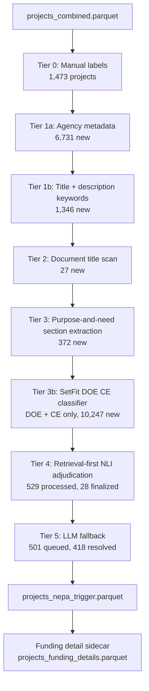

# D1: NEPA Triggered — Architecture

**Goal:** Classify why NEPA was triggered for each clean energy project across eight classes: `federal_direct_action`, `federal_program`, `pma`, `federal_property_transaction`, `federal_land`, `federal_permit`, `federal_funding`, `unknown`.

**Self-contained:** Yes — requires only `projects_combined.parquet` and CE/EA/EIS pages files.

---

## Data Flow

Counts reflect the July 2026 full run (see Run Results below).

---

## Inputs

| File | Description |
|---|---|
| `phase2/data/analysis/projects_combined.parquet` | Project metadata: agency, process type, energy type, land status, geography |
| `phase2/data/processed/ce/pages.parquet` | CE document pages (DuckDB scan) |
| `phase2/data/processed/ea/pages.parquet` | EA document pages (DuckDB scan) |
| `phase2/data/processed/eis/pages.parquet` | EIS document pages (DuckDB scan) |

## Sidecar Output

`phase2/data/analysis/deliverable01/projects_funding_details.parquet` is generated after the
primary trigger output, or independently with `--funding-details-only`. It is restricted to
projects where `nepa_trigger_primary == "federal_funding"` and never mutates
`projects_nepa_trigger.parquet`.

---

## Classification Scheme

Eight mutually exclusive primary classes, with a strict priority ordering used when signals conflict:

| Priority | Class | Core signal |
|---|---|---|
| 1 | `federal_program` | Programmatic EIS/EA, land-use plan, rulemaking |
| 2 | `federal_direct_action` | Federal agency is the proposing actor |
| 3 | `pma` | Power Marketing Administration (BPA, WAPA, SEPA, SWPA) or TVA is the acting agency |
| 4 | `federal_property_transaction` | Land exchange, disposal, conveyance |
| 5 | `federal_land` | Project on federal land; ROW/SUP granted to private developer |
| 6 | `federal_permit` | Federal permit/license is the primary nexus |
| 7 | `federal_funding` | Federal grant, loan guarantee, financial assistance |
| 8 | `unknown` | NEPA confirmed but trigger cannot be reliably identified |

This table mirrors `TRIGGER_HIERARCHY` in `01_extract_nepa_trigger.py`, and every row in the
published output obeys it: `nepa_trigger_primary == nepa_trigger_primary_hierarchy` for all
20,725 projects. Tier 5's raw LLM ranking is reconciled to this hierarchy at ingest (see
Known Issues → resolved, and Methodological Notes → reproducibility). The position of
`federal_program` remains nearly inert: only 17 projects carry `federal_program` together
with another class in `nepa_trigger_multi` (all surfaced by the Tier 5 pass; the May 2026
pre-Tier-5 output had no such co-occurrences), and as the top-priority class it wins the
primary in all 17.

Secondary triggers are stored in `nepa_trigger_secondary` (list) for multi-label combo analysis.

---

## Tier Architecture

### Tier 0 — Manual Labels
Hand-labeled gold-standard examples loaded from `manual_training_corrections.csv`. These are
ingested first and cannot be overwritten by any subsequent tier. 1,473 projects in the
May 2026 run (includes the SetFit and NLI training seeds).

### Tier 1a — Agency Metadata Heuristics
Maps `lead_agency_harmonized` to trigger class using known jurisdiction rules. A result from
Tier 1a that is auto-accepted goes directly to `finalized`; others go to `provisional` and may
be sent to Tier 4 for confirmation.

Key mappings:
- `FERC`, `FAA`, `FCC` → `federal_permit` (auto-accept)
- `BPA`, `WAPA`, `SEPA`, `SWPA`, `TVA`, `PMA` → `pma` (auto-accept)
- `CBP` → `federal_direct_action` (auto-accept)
- `BLM`, `USFS` as authorizing agency → `federal_land` (auto-accept via `T1a_BLM_USFS_land_control`)
- `DOE`, `USACE` → routed to Tier 4 (ambiguous without verb evidence)

Adds 6,731 projects (May 2026 run). Highest-yield deterministic tier.

### Tier 1b — Title and Description Keywords
Applies `TIER1B_PATTERNS` (regex list) against the concatenated project title and description.
Each pattern tuple is `(regex, class, rule_slug, confidence)`. If the resulting `rule_id`
(`T1b_{slug}`) is in `AUTO_ACCEPT_RULE_IDS`, the result is auto-accepted; otherwise it goes
to `provisional`.

Currently auto-accepted rules: `T1b_ferc_license`, `T1b_special_use`, `T1b_row_grant`,
`T1b_land_exchange`. All other high-confidence Tier 1b matches go to provisional.

Adds 1,346 projects to finalized (May 2026 run; more go to provisional).

### Tier 2 — Document Title Scan
Scans the document titles of the first retrieved documents for each project via DuckDB.
Applies `_is_programmatic_title`, `_is_programmatic_exclusion`, and `DOC_TITLE_PATTERNS`.

Currently auto-accepted rules: `T2_doc_title_peis`, `T2_doc_title_row`,
`T2_doc_title_permit_app`, `T2_doc_title_loan_guarantee`.

Adds 27 projects (May 2026 run).

### Tier 3 — Purpose-and-Need Section Extraction
Extracts the "Purpose and Need" section (and related candidate sections) from document pages via
DuckDB, then applies the same `TIER1B_PATTERNS` + additional purpose-specific patterns.

Currently auto-accepted rules: `T3_npdes`, `T3_agency_grant`, `T3_blm_land`, `T3_nfs_land`.

Adds 372 projects (May 2026 run).

### Tier 3b — SetFit DOE CE Classifier
Runs only on projects where `lead_agency_harmonized` contains "Department of Energy" AND
`process_type == "CE"`. Uses a fine-tuned SetFit model at `phase2/models/trigger_setfit`
(logistic regression head over a sentence-transformer backbone; the class set is derived
from the labeled example bank — 7 classes in the current model).

**How confidence works in SetFit:** `predict_proba` returns a probability vector over all
classes, e.g. `[0.04, 0.71, 0.03, 0.14, 0.05, 0.03]`. Two gates must both pass:
- `top_prob >= SETFIT_CONFIDENCE_THRESHOLD` (currently 0.65)
- `margin = top_prob - second_prob >= SETFIT_MARGIN_THRESHOLD` (currently 0.08)

If both gates pass, the result is auto-accepted as `confidence="high"`. If either gate fails,
the project falls through to Tier 4 unchanged. The gates were originally set at 0.80/0.15,
but with a logistic regression head trained on a small example bank, probabilities rarely
concentrate above 0.80 — in the April 2026 run, 0 projects cleared the original gates despite
436 inference batches. The thresholds were lowered to 0.65/0.08, making Tier 3b the
highest-yield tier in the pipeline (see Run Results).

### Tier 4 — Retrieval-First NLI Adjudication
Receives all projects not yet finalized where `should_send_to_tier4` returns True. This
includes: projects with no provisional result, projects from ambiguous agencies (DOE, USACE),
and projects with medium/low confidence provisionals.

**How confidence works in Tier 4 NLI:** Uses `cross-encoder/nli-deberta-v3-base` (or
`cross-encoder/nli-MiniLM2-L6-H768` as configured). For each candidate class, the model
receives the retrieved chunk text as the premise and a natural-language hypothesis as the
hypothesis. The entailment score is the `final_score` per chunk. Scores are aggregated
across chunks into a per-project `doc_score` per candidate class. Three gates must all pass:

1. `doc_score >= threshold`: `TIER4_BASE_THRESHOLD` (0.72) if agency metadata priors exist,
   `TIER4_NO_PRIOR_THRESHOLD` (0.78) otherwise
2. `margin >= TIER4_MARGIN_THRESHOLD` (0.08): top class must score at least 0.08 above second
3. `affirmative_support`: at least one chunk must have `cue_score >= 0.25` or
   `entailment_score >= 0.82`

If all three pass, `auto_resolve=True` and the project is finalized as `confidence="high"`
(if `doc_score >= 0.95`) or `confidence="medium"` (otherwise). If any gate fails, the
project gets `rule_id="T4_local_uncertain"` with `confidence="low"` and is queued for Tier 5
(or finalized as `unknown` if `--use-llm` is not set).

Diagnostics written to:
- `phase2/data/analysis/deliverable01/tier4_chunk_scores.parquet`
- `phase2/data/analysis/deliverable01/tier4_doc_scores.parquet`

### Tier 5 — LLM Fallback
Claude Haiku (`claude-haiku-4-5-20251001`, `temperature=0.0`) receives the Tier 4 uncertain
queue with retrieved context chunks and returns a structured JSON classification (class,
confidence, evidence). Only runs with the `--use-llm` flag. The LLM's proposed
primary/secondary ranking is reconciled to `TRIGGER_HIERARCHY` at ingest
(`_reconcile_to_hierarchy`), so Tier 5 rows obey the same priority ordering as every other
tier; the raw ranking is logged and preserved in the committed adjudication record. The
uncertain queue is persisted to `tier5_queue.parquet` on every run (with or without
`--use-llm`) before any preflight or API call, so the queue can be replayed standalone via
`03_rerun_tier5.py`.

**Acceptance rule:** unlike Tiers 1–4, the Tier 5 merge path writes *every* returned result
into the output (it bypasses `should_auto_accept`). High- and medium-confidence answers are
treated as resolved; low-confidence answers are written but marked
`nepa_trigger_manual_review = True`. Results that return a well-formed class but no usable
evidence, and calls whose JSON cannot be parsed (`rule_id = "T5_llm_error"`), fall back to
`unknown` and are likewise flagged for manual review.

**July 2026 run:** 501 projects queued (the Tier-4-uncertain pool), 501 successful API calls
(all HTTP 200), 6 JSON-parse failures (1.2%). 418 projects were resolved to a concrete trigger
class; the remaining 83 (77 LLM abstentions + 6 parse errors) stayed `unknown`. Measured spend
≈ \$1.80 at `claude-haiku-4-5` pricing (\$1/\$5 per MTok). Note that the preflight cost
display uses `ESTIMATED_TIER5_COST_PER_PROJECT` (corrected from a \$0.04 placeholder to \$0.004
to match measured per-project cost); the `--tier5-budget` flag raises the guardrail ceiling.

---

## Routing Logic

### `should_auto_accept(result)`
Returns `True` only when:
- `rule_id` is in `AUTO_ACCEPT_RULE_IDS` (explicit whitelist of trusted rules), OR
- `rule_id` starts with `T4_local_` or `T4_embed_` and confidence is high/medium, OR
- `rule_id == "T5_llm"` and confidence is high/medium

### `should_send_to_tier4(result)`
Returns `True` (send to Tier 4) when:
- `result is None` — no provisional result exists for this project
- `rule_id` is in `SEND_TO_TIER4_RULE_IDS` (`T1a_DOE_direct_action`, `T1a_DOE_funding`,
  `T3_sec404`)
- `evidence_source == "agency_metadata"` — agency-level priors need document confirmation
- `confidence != "high"` — low/medium confidence provisionals need adjudication

Returns `False` (do NOT send to Tier 4) when confidence is `"high"` and the rule is not
in `SEND_TO_TIER4_RULE_IDS`. **This creates a logic gap:** projects with high-confidence
provisional results from rules NOT in `AUTO_ACCEPT_RULE_IDS` are neither finalized nor sent
to Tier 4. They fall through to `_make_unknown` at the end of the pipeline.

### `_ingest(results)`
For each result: if `should_auto_accept` → add to `finalized`. Otherwise → add to
`provisional` (keeping the higher-confidence result if one already exists).

---

## Known Issues

### Tier 5 primary/secondary not hierarchy-reconciled (RESOLVED 2026-07-20)
Tiers 0–4 each map a rule to exactly one class, so the priority hierarchy fully determines
the primary. Tier 5 originally wrote the LLM's own primary/secondary ranking directly into
the output; in the initial July 2026 run, `nepa_trigger_primary !=
nepa_trigger_primary_hierarchy` for 88 rows (all `T5_llm`; zero mismatches in tiers 0–4),
and `is_dual_nexus` missed 33 of 124 land+permit projects because the LLM ranked permit
first. **Fix (same day):** `tier5_llm()` now reconciles the LLM's ranking to
`TRIGGER_HIERARCHY` at ingest, and the correction was back-applied to the published output
via the committed record replay (`03_rerun_tier5.py --from-record`), reordering exactly
those 88 rows. Net class deltas: direct_action +16, land +21, program +10, property +5,
funding −25, permit −27; `is_dual_nexus` 79 → 113; unknowns unchanged (83). The LLM's raw
pre-reconciliation verdicts are preserved in the committed
`tier5_adjudication_record.csv`, so the original ranking remains auditable.

The issues below were identified in the April 2026 run and are retained as design history;
both were fixed before the May 2026 run and remain in force for the July 2026 run that
produced the current output (the residual 83 unknowns are genuine Tier-4-uncertain cases that
even the Tier 5 LLM pass could not resolve, not fallthrough).

### Provisional Fallthrough (13,324 projects in April 2026 run — resolved)
Projects could have a high-confidence provisional result that was silently discarded:
- Rule fires → confidence="high" → `should_auto_accept` returns False (rule not in
  `AUTO_ACCEPT_RULE_IDS`) → goes to `provisional`
- `should_send_to_tier4` returns False (confidence=="high") → never sent to Tier 4
- At end of pipeline: `_make_unknown` is called → appears as `unknown` in output

The original provisional rule_id and evidence text ARE preserved in the unknown record's
`nepa_trigger_evidence_text` and `nepa_trigger_evidence_source` fields. In the April 2026
run: 12,528 of the 13,324 had `evidence_source="description"`, indicating a Tier 1b pattern
match was silently dropped. Fix: either add those rule IDs to `AUTO_ACCEPT_RULE_IDS` or
change `should_send_to_tier4` to also forward high-confidence provisionals to Tier 4.

### SetFit Threshold Too High (resolved)
`SETFIT_CONFIDENCE_THRESHOLD = 0.80` was too strict for a logistic regression head trained on
a small example bank. In the April 2026 run, 0 DOE CE projects cleared the gate despite 436
inference batches. The thresholds were lowered to 0.65/0.08 for the May 2026 run.

### Unknown Pool Composition (April 2026 pre-fix run, for comparison)
Of 17,943 unknowns:
- 16,963 (94.5%) are CEs
- 14,193 (79.1%) are DOE
- 13,324 are `unresolved_after_tier4` (provisional fallthrough, all had a rule fire)
- 4,619 are `T4_local_uncertain` (Tier 4 processed but all three gates failed)

---

## Run Results (July 2026)

<!-- d1-run-results: pull this section into the D1 report -->

Full pipeline run on all 20,725 clean energy projects (`nepa_trigger_extraction_run_at =
2026-07-21T01:36 UTC`), this time **with Tier 5 (`--use-llm`)**. Tier yields are derived from
the `nepa_trigger_rule_id` prefix in the output parquet.

> **Historical note:** the prior May 2026 run skipped Tier 5 and ended at 20,225 resolved /
> 500 unknown (97.6%). This July run added the LLM fallback, lifting resolution to 99.6%.

### Tier-by-Tier Yield

| Tier | Description | New Projects | Cumulative | % Resolved |
|---|---|---:|---:|---:|
| Tier 0 | Manual labels | 1,473 | 1,473 | 7.1% |
| Tier 1a | Agency metadata heuristics | 6,731 | 8,204 | 39.6% |
| Tier 1b | Title + description keywords | 1,346 | 9,550 | 46.1% |
| Tier 2 | Document title scan | 27 | 9,577 | 46.2% |
| Tier 3 | Purpose-and-need extraction | 372 | 9,949 | 48.0% |
| Tier 3b | SetFit DOE CE classifier | 10,247 | 20,196 | 97.4% |
| Tier 4 | NLI adjudication (finalized) | 28 | 20,224 | 97.6% |
| Tier 5 | LLM fallback (`claude-haiku-4-5`) | 418 | 20,642 | 99.6% |
| — | Unknown (Tier 4 + Tier 5 unresolved) | 83 | — | 0.4% |

**Total resolved: 20,642 / 20,725 (99.6%). Unknown: 83 (0.4%).**

Tier 3b is by far the highest-yield ML tier because DOE CEs dominate the unresolved pool after
Tier 1 (~14K projects). The SetFit threshold was lowered from 0.80/0.15 to 0.65/0.08 to achieve
this yield; see Known Issues for the original gate design.

Tier 4 processed 529 projects and finalized 28 with sufficient document evidence. The remaining
501 failed all three gates (`doc_score`, `margin`, `affirmative_support`) and were sent to
Tier 5. The LLM resolved 418 of them; 83 stayed `unknown` (77 LLM abstentions + 6 JSON-parse
errors). Flagged cases (including all unknowns and every low-confidence Tier 5 answer) are
grouped by rule for manual review in
`phase2/data/validation/deliverable01/validation_batches.csv`.

### Final Class Distribution

| Class | Count | % of Total |
|---|---:|---:|
| `federal_funding` | 9,210 | 44.4% |
| `federal_land` | 3,801 | 18.3% |
| `pma` | 3,535 | 17.1% |
| `federal_direct_action` | 3,181 | 15.3% |
| `federal_program` | 543 | 2.6% |
| `federal_permit` | 319 | 1.5% |
| `unknown` | 83 | 0.4% |
| `federal_property_transaction` | 53 | 0.3% |
| **Total** | **20,725** | |

These totals reflect the 2026-07-20 hierarchy reconciliation (88 Tier 5 rows reordered; see
Known Issues) and supersede the same-day pre-reconciliation figures.

### Unknown Pool Composition (July 2026)

Of 83 unknowns (all from the Tier 5 queue — 77 `T5_llm` abstentions + 6 `T5_llm_error`):
- 30 (36.1%) are EIS
- 29 (34.9%) are CEs
- 24 (28.9%) are EAs
- 51 (61.4%) have DOE as lead agency

The residual unknowns are far more evenly split across processes than the May 2026 pool
(then 40.4% EIS / 24.6% EA), because Tier 5 cleared the bulk of the long-document EA/EIS
uncertain cases. For deeper historical comparison, the May 2026 pre-Tier-5 run left 500
unknowns (2.4%), the April 2026 post-fix run produced 1,136 unknowns (5.5%), and the pre-fix
run (original thresholds) produced 17,943 unknowns (86.6%).

---

## Output Schema

`phase2/data/analysis/deliverable01/projects_nepa_trigger.parquet`

| Column | Type | Description |
|---|---|---|
| `project_id` | str | Primary key |
| `nepa_trigger_primary` | str | Top-priority trigger class |
| `nepa_trigger_secondary` | list[str] | Additional trigger classes (multi-label) |
| `nepa_trigger_multi` | list[str] | All detected trigger classes (primary + secondary; empty for unknown) |
| `nepa_trigger_count` | int | Number of trigger classes detected |
| `nepa_trigger_combo` | str | Sorted combo string for grouping |
| `nepa_trigger_primary_hierarchy` | str | Priority-resolved primary class |
| `nepa_trigger_evidence_text` | str | Supporting text passage |
| `nepa_trigger_evidence_source` | str | `description`, `document_text`, `doc_title`, `agency_metadata`, `purpose_and_need` |
| `nepa_trigger_confidence` | str | `high`, `medium`, `low` |
| `nepa_trigger_rule_id` | str | Rule that produced the classification |
| `nepa_trigger_manual_review` | bool | Flagged for manual review |
| `is_dual_nexus` | bool | True when primary is `federal_land` and `federal_permit` is secondary (consistent for all tiers since the 2026-07-20 hierarchy reconciliation) |
| `nepa_trigger_extraction_run_at` | str | ISO-8601 UTC timestamp for the run |
| `nepa_trigger_llm_run_at` | str | ISO-8601 UTC timestamp for LLM call (empty if Tier 5 skipped) |

### Funding Detail Sidecar Schema

`phase2/data/analysis/deliverable01/projects_funding_details.parquet`

This sidecar adds funding mechanism, program/source, and amount fields only for projects already
classified as `federal_funding`. It can be regenerated with `--funding-details-only` without
rerunning the trigger classifier.

| Column | Type | Description |
|---|---|---|
| `project_id` | str | Funding-primary project ID |
| `federal_funding_type_primary` | str | Priority-resolved funding mechanism |
| `federal_funding_type_multi` | list[str] | All detected mechanisms |
| `federal_funding_program_multi` | list[str] | Program/source labels (`ARRA`, `EECBG`, `SEP`, `WAP`, `Title XVII`, `BIL`, `IRA`, `FOA`) |
| `federal_funding_amount_usd` | double | Non-conflicting federal amount, if found |
| `federal_funding_total_project_cost_usd` | double | Total project cost/value, if found |
| `federal_funding_recipient_cost_share_usd` | double | Recipient/non-federal cost share, if found |
| `federal_funding_share_pct` | double | Explicit or computed federal funding share |
| `federal_funding_evidence_text` | str | Funding-specific evidence snippet |
| `federal_funding_evidence_source` | str | `trigger_evidence`, `project_metadata`, `doc_title`, or `document_text` |
| `federal_funding_confidence` | str | `high`, `medium`, or `low` |
| `federal_funding_manual_review` | bool | True for unknown mechanisms or conflicting amounts |
| `federal_funding_amount_candidates_json` | str | Parsed candidates and conflict metadata |
| `federal_funding_extraction_run_at` | str | ISO-8601 UTC timestamp |

---

## Methodological Notes

**Why a tiered pipeline instead of just LLM?** Agency metadata alone resolves ~60% of
projects deterministically and cheaply. Running the LLM on all 20,725 projects would cost on
the order of \$75 at `claude-haiku-4-5` pricing (measured per-project cost ≈ \$0.0036) and
introduce hallucination risk for cases trivially answered by agency type. The tiered approach
reserves the LLM for genuine ambiguity — the July 2026 run sent 501 projects (2.4%) to Tier 5.

**Run-to-run reproducibility.** Tiers 0–3 are exactly deterministic (regex and metadata
lookups). Tiers 3b (SetFit) and 4 (NLI) run neural inference on Apple MPS without a pinned
torch seed, so independent runs can differ by a few borderline projects near the decision
gates (<0.05% of the universe; measured near-threshold exposure was 4 of 280 Tier-4 projects
within ±0.001 of a gate). In the July 2026 re-run, deterministic-tier assignments (T0–T3)
matched the May run exactly, and exactly **1** project drifted — a Tier-4 `federal_funding`
acceptance that re-entered the Tier 5 queue and was re-classified to the same class — so the
drift created no new unknown.

Tier 5 (the LLM fallback) is a different reproducibility class: LLM sampling is
nondeterministic even at `temperature=0.0` (now pinned), and the judge model
(`claude-haiku-4-5-20251001`) has a deprecation horizon, so re-running `--use-llm`
reproduces the published results statistically but not row-for-row. **Exact replication is
guaranteed instead by the committed adjudication record**: the raw verdicts of the
2026-07-20 run live in `phase2/code/deliverable01/tier5_adjudication_record.csv`, and
`03_rerun_tier5.py --from-record` re-materializes the published Tier 5 classifications
(including the hierarchy reconciliation) deterministically, with no API call. A reviewer
replicating this deliverable should run the pipeline without `--use-llm`, then apply the
record.

**Why SetFit for DOE CE classification?** DOE CEs are the largest ambiguous class (~14K
projects). A fine-tuned SetFit model provides fast batched inference on MPS and requires only
a modest labeled example bank. DeBERTa fine-tuning would overfit on the available training set.
SetFit is appropriate for **data scarcity** (few labeled examples per class, not label quality
issues).

**Why NLI (cross-encoder) for Tier 4?** The Tier 4 adjudication task is better framed as
textual entailment than classification: given a retrieved passage, does it entail the hypothesis
"this project is triggered by federal land use"? Cross-encoders compute a joint representation
of (passage, hypothesis) and produce calibrated entailment scores. This is a **data scarcity**
problem where expressing classes as natural language hypotheses avoids the need for labeled
training data.

**Multi-label consideration:** Many projects are triggered by multiple nexus factors
simultaneously (e.g., federal land AND DOE funding). For tiers 0–4 the primary trigger is
strictly priority-resolved; Tier 5 rows carry the LLM's own primary/secondary ranking, which
diverges from the hierarchy for 88 of 501 rows (see Known Issues). The
`nepa_trigger_primary_hierarchy` column always holds the strict hierarchy resolution.
Secondary triggers are stored separately.

**Funding detail layer:** Funding mechanism and amount extraction is deliberately downstream of
trigger classification. Grant/loan/amount parsing is restricted to `federal_funding` primary
projects, suppresses land-authorization grant phrases such as right-of-way grants, and requires
project-specific funding context before extracting dollar amounts. Amount coverage is expected to
be partial; conflicting candidate amounts are preserved in JSON and flagged for manual review.
