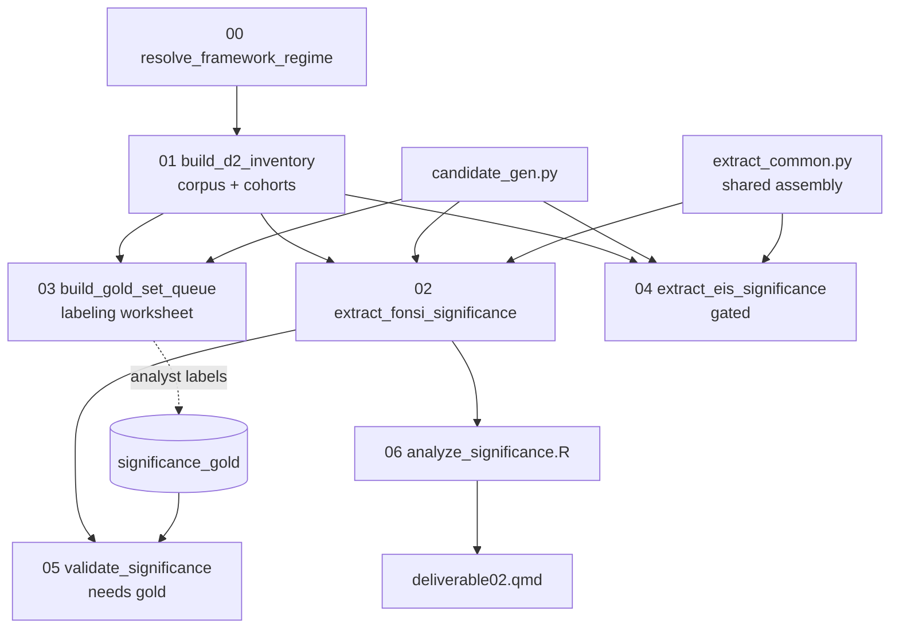

# Deliverable 2 — Determinations of Significance Across Resource Areas

**Plan:** `phase2/plans/deliverable02.md` (v2.11, six review rounds).
**Code:** `phase2/code/deliverable02/`. **Report:** `phase2/reports/deliverable02.qmd`.

Characterizes, per resource area, how BLM + the DOE agency family make the NEPA significance
determination (CEQ context/intensity factors + resource thresholds). Primary output = a
provenanced determination-record dataset; the report reads over it.

## Pipeline

## Scripts

| Script | Role | Runs key-free? |
|---|---|---|
| `common.py` | paths, IO, `sha256_join`, cohort constants, `SCHEMA_VERSION=d2_v2_11` | — |
| `significance_taxonomy.py` | resource crosswalk, determination/threshold/factor vocab, cue dicts | — |
| `00_resolve_framework_regime.py` | two-period regime + priority-resolved confidence status | ✅ |
| `01_build_d2_inventory.py` | 3-tier corpus + `agency_scope_status` + `project_cohorts` | ✅ |
| `candidate_gen.py` | shared deterministic candidate generator + `classify_determination` | ✅ |
| `03_build_gold_set_queue.py` | stratified labeling worksheet (300 pos + 100 neg) | ✅ |
| `extract_common.py` | shared determination assembly + LLM adjudication + manifest | ✅ (dry-run) |
| `02_extract_fonsi_significance.py` | FONSI candidates + mitigation page-window join + determinations | ✅ dry-run / 💰 LLM |
| `04_extract_eis_significance.py` | EIS track (gated; `_eis` suffix outputs) | ✅ dry-run / 💰 LLM |
| `05_validate_significance.py` | tiered gold metrics + threshold child metrics | needs gold |
| `06_analyze_significance.R` | primary-scope headline tables + association layer | ✅ |

## Key schema decisions (from the plan's review rounds)

- **Two-period regime, no single `regime` column.** `decision_period` (descriptive) +
  `applicability_period` (legal-method). `framework_regime` is a pinned alias = `decision_period`,
  materialized once in `02`.
- **Priority-resolved confidence status.** `regime_assignment_status` ∈ {assigned_high,
  assigned_medium_confidence, low_confidence_review, assigned_proxy, boundary_review,
  missing_date, not_applicable}; literal `'None'`/`'missing'` sentinels route to
  `low_confidence_review`.
- **`agency_scope_status`** ∈ {primary_blm_doe_family, context_other_agency, manual_scope_review}
  is the headline-denominator gate on all tiers (427/23/2 FONSI, 406/283/64 EIS); `agency` is a
  coarse display label; `agency_scope_rule` is provenance only.
- **`determination_instance_id`** = `sha256(project_id + document_id + source_substrate +
  source_unit_id + shared_resource_area + d2_resource_area + determination_class +
  determination_scope + primary_threshold_type + primary_threshold_status + alternative_name)`.
  `source_unit_id` = `evidence_span_id` (D6) or `document_section_id` (sections; the latter has
  no native `section_id`). Verified collision-free (3,478/3,478 IDs on the dry-run).
- **Thresholds in a child table.** Determination record carries only `primary_threshold_*`;
  every cited threshold is one row in `determination_thresholds.parquet`.
- **Two-stage mitigated flag.** `01` = recall screen; `02` computes the frozen page-window join
  (`mitigation_signal_matches.parquet`, cue-span × condition-row, same-section OR ±2 pages).
- **Cohorts** (`project_cohorts.parquet`): `cohort_by_date` bins (ARRA/BIL/IRA/FRA, lower-inclusive)
  kept orthogonal to `time_scope_status`; D5 `law_cited_*` flags are separate columns.

## Run modes

Deterministic, key-free: `00 → 01 → 02 --dry-run → 06`. The billable LLM pass upgrades `02`/`04`
rows to `extraction_method='regex+llm'` (requires the Anthropic key + budget approval; the user
runs it). `05` requires the hand-labeled gold set. See `phase2/code/deliverable02/HANDOFF.md`.

## Audit

Every output carries `schema_version` + `*_run_at`; determinations carry
`significance_extraction_run_at` (all rows) and `significance_llm_run_at` (LLM-success rows).
`significance_run_manifest.parquet` records input+output paths, row counts, content hashes,
model, and prompt/schema versions.
