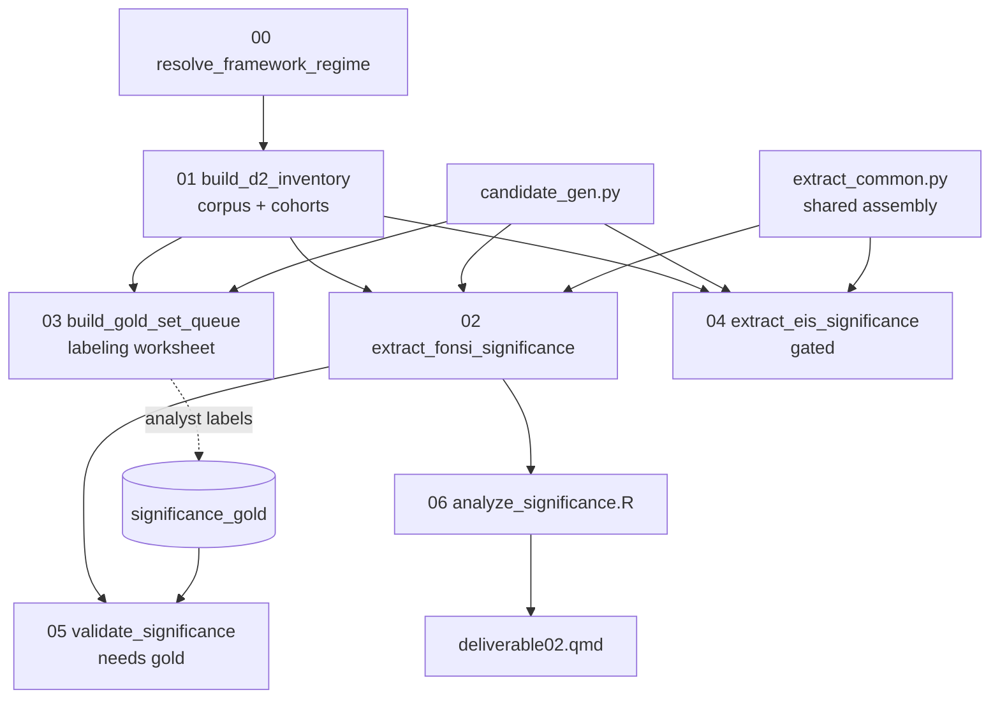

# Deliverable 2 — Determinations of Significance Across Resource Areas

**Plan:** `phase2/plans/deliverable02.md` (v2.11, six review rounds).
**Code:** `phase2/code/deliverable02/`. **Report:** `phase2/reports/deliverable02.qmd`.

Characterizes, per resource area, how BLM + the DOE agency family make the NEPA significance
determination (CEQ context/intensity factors + resource thresholds). Primary output = a
provenanced determination-record dataset; the report reads over it.

## Pipeline



## Scripts

| Script | Role | Runs key-free? |
|---|---|---|
| `common.py` | paths, IO, `sha256_join`, cohort constants, `SCHEMA_VERSION=d2_v2_11` | — |
| `significance_taxonomy.py` | resource crosswalk, determination/threshold/factor vocab, cue dicts | — |
| `00_resolve_framework_regime.py` | two-period regime + priority-resolved confidence status | ✅ |
| `01_build_d2_inventory.py` | 3-tier corpus + `agency_scope_status` + `project_cohorts` | ✅ |
| `candidate_gen.py` | shared deterministic candidate generator + `classify_determination` | ✅ |
| `03_build_gold_set_queue.py` | stratified labeling worksheet (300 pos + 100 neg) | ✅ |
| `extract_common.py` | shared determination assembly + sync LLM + **Batch API** (auto-chunked under the 100k-req/256 MB caps; keychain key memoized = one password per process) | ✅ (dry-run) |
| `02_extract_fonsi_significance.py` | FONSI candidates + mitigation page-window join + determinations (`--dry-run` / sync / `--batch-run`) | ✅ dry-run / 💰 LLM |
| `04_extract_eis_significance.py` | EIS track (gated; `_eis` suffix outputs; same modes) | ✅ dry-run / 💰 LLM |
| `05_validate_significance.py` | tiered gold metrics + threshold child metrics; adopts the labeled queue CSV automatically | needs gold labels |
| `06_analyze_significance.R` | primary-scope headline tables + association layer; FONSI-only by default, `--with-eis` combines the EIS track | ✅ |

## Key schema decisions (from the plan's review rounds)

- **Two-period regime, no single `regime` column.** `decision_period` (descriptive) +
  `applicability_period` (legal-method). `framework_regime` is a pinned alias = `decision_period`,
  materialized once in `02`.
- **Priority-resolved confidence status.** `regime_assignment_status` ∈ {assigned_high,
  assigned_medium_confidence, low_confidence_review, assigned_proxy, boundary_review,
  missing_date, not_applicable}; literal `'None'`/`'missing'` sentinels route to
  `low_confidence_review`.
- **`agency_scope_status`** ∈ {primary_blm_doe_family, context_other_agency, manual_scope_review}
  is the headline-denominator gate on all tiers (427/23/2 FONSI, 406/283/64 EIS); `agency` is a
  coarse display label; `agency_scope_rule` is provenance only.
- **`determination_instance_id`** = `sha256(project_id + document_id + source_substrate +
  source_unit_id + shared_resource_area + d2_resource_area + determination_class +
  determination_scope + primary_threshold_type + primary_threshold_status + alternative_name)`.
  `source_unit_id` = `evidence_span_id` (D6) or `document_section_id` (sections; the latter has
  no native `section_id`). Verified collision-free (3,478/3,478 IDs on the dry-run).
- **Thresholds in a child table.** Determination record carries only `primary_threshold_*`;
  every cited threshold is one row in `determination_thresholds.parquet`.
- **Two-stage mitigated flag.** `01` = recall screen; `02` computes the frozen page-window join
  (`mitigation_signal_matches.parquet`, cue-span × condition-row, same-section OR ±2 pages).
- **Cohorts** (`project_cohorts.parquet`): `cohort_by_date` bins (ARRA/BIL/IRA/FRA, lower-inclusive)
  kept orthogonal to `time_scope_status`; D5 `law_cited_*` flags are separate columns.

## CLI runbook (FONSI first, EIS later)

The pipeline is staged so the FONSI track is run, validated, and analyzed **before** paying for
the ~9×-larger EIS track. `04` writes `_eis`-suffixed outputs, so the tracks never clobber each
other; `06` combines them only when `--with-eis` is passed.

**Stage 0 — deterministic foundation (free, key-free; safe to re-run any time):**
```bash
conda run -n nepa python phase2/code/deliverable02/_run.py                     # 00 regime -> 01 corpus+cohorts
conda run -n nepa python phase2/code/deliverable02/03_build_gold_set_queue.py  # labeling worksheet
conda run -n nepa python phase2/code/deliverable02/02_extract_fonsi_significance.py --dry-run
```

**Stage 1 — FONSI LLM pass (billable; ONE keychain password via --batch-run):**
```bash
# optional ~$1 sync spike first:
conda run -n nepa python phase2/code/deliverable02/02_extract_fonsi_significance.py --sample 30 --model claude-sonnet-5
# full pass, Batch API (50% price), submit+poll+fetch in one process:
conda run -n nepa python phase2/code/deliverable02/02_extract_fonsi_significance.py --batch-run --model claude-sonnet-5
```

**Stage 2 — validate + FONSI-only analysis (free):**
```bash
conda run -n nepa python phase2/code/deliverable02/05_validate_significance.py  # vs hand-labeled gold (Gate 3)
Rscript phase2/code/deliverable02/06_analyze_significance.R                     # FONSI-only tables
quarto render phase2/reports/deliverable02.qmd
```
Decide from these outputs whether the EIS pass is worth running.

**Stage 3 — EIS LLM pass + combined analysis (billable; gated on Gate 3):**
```bash
conda run -n nepa python phase2/code/deliverable02/04_extract_eis_significance.py --dry-run --sample 800   # retrieval check, free
conda run -n nepa python phase2/code/deliverable02/04_extract_eis_significance.py --batch-run --sample 0 --model claude-sonnet-5
Rscript phase2/code/deliverable02/06_analyze_significance.R --with-eis          # combined FONSI + EIS
quarto render phase2/reports/deliverable02.qmd
```

Batch modes: `--batch-run` (one password: submit → poll → fetch → build), or split
`--batch-submit` / `--batch-fetch [--wait]` (one password each). Batches are auto-chunked to
stay far under the API's 100,000-request / 256 MB caps. `temperature=0` is only sent on Haiku —
Sonnet 5 / Opus 4.8 reject sampling parameters. `05` requires the hand-labeled gold set (it
adopts labeled rows straight from `output/deliverable02/significance_gold_queue.csv`). Full
detail: `phase2/code/deliverable02/HANDOFF.md`.

## API read volume & cost estimates (as of the initial build, 2026-07-07)

Measured from the actual candidate generators (not guesses); regenerate volumes by running
`candidate_gen.py` and `eis_candidates(0)` if the corpus changes.

| Track | Windows | Text volume | ≈ Input tokens* | ≈ Output tokens |
|---|---:|---:|---:|---:|
| FONSI (all finding spans) | 3,478 | 7.2M chars | ~2.7M | ~0.9M |
| EIS (kept sections, full corpus; 532 projects) | 19,696 | 65.1M chars | ~21M | ~5M |

*window + ~250-token instruction prompt per call; ~4 chars/token (Haiku tokenizer). Sonnet 5 /
Opus 4.8 use a newer tokenizer (~1.3× more tokens) — factored into the costs below.

Pricing at estimate time (per 1M input/output tokens): **Haiku 4.5 $1/$5 · Sonnet 5 $3/$15
(intro $2/$10 through 2026-08-31) · Opus 4.8 $5/$25**. The Batch API halves all of it.

| Scope | Haiku 4.5 | +Batch | Sonnet 5 (intro) | +Batch | Sonnet 5 (std) | +Batch | Opus 4.8 | +Batch |
|---|--:|--:|--:|--:|--:|--:|--:|--:|
| FONSI | $7 | **$4** | $19 | **$10** | $29 | $14 | $48 | $24 |
| EIS | $46 | $23 | $119 | **$59** | $178 | $89 | $297 | $148 |
| **Both** | $53 | $27 | $138 | **$69** | $207 | $104 | $345 | $172 |

Treat as ±50% (output length varies; prompt gets tuned after the spike; the EIS candidate set
may change after the retrieval spike). Prompt caching does not help here — the shared prefix
(~250 tokens) is below the minimum cacheable size; the per-window text dominates every request.
Actual spend is auditable after any run via `significance_run_manifest.parquet` +
`batch_manifest_*.json` (request counts) and the per-response `usage` fields.

## Audit

Every output carries `schema_version` + `*_run_at`; determinations carry
`significance_extraction_run_at` (all rows) and `significance_llm_run_at` (LLM-success rows).
`significance_run_manifest.parquet` records input+output paths, row counts, content hashes,
model, and prompt/schema versions.
