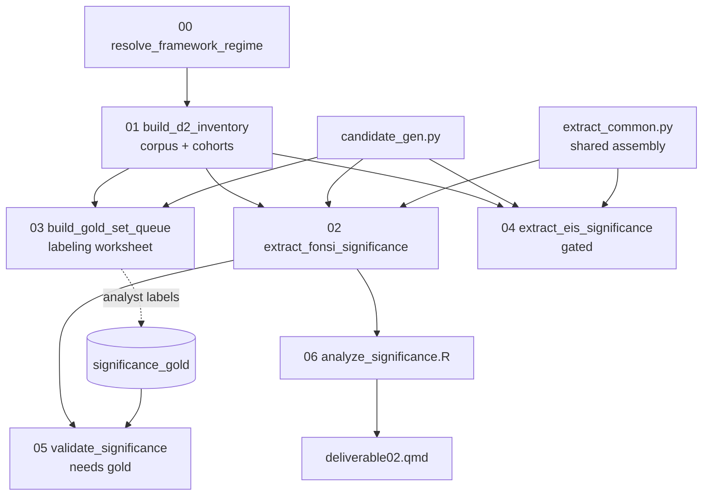

# Deliverable 2 — Determinations of Significance Across Resource Areas

**Plan:** `phase2/plans/deliverable02.md` (v2.11, six review rounds).
**Code:** `phase2/code/deliverable02/`. **Report:** `phase2/reports/deliverable02.qmd`.

Characterizes, per resource area, how BLM + the DOE agency family make the NEPA significance
determination (CEQ context/intensity factors + resource thresholds). Primary output = a
provenanced determination-record dataset; the report reads over it.

## Pipeline



## Scripts

| Script | Role | Runs key-free? |
|---|---|---|
| `common.py` | paths, IO, `sha256_join`, cohort constants, `SCHEMA_VERSION=d2_v2_11` | — |
| `significance_taxonomy.py` | resource crosswalk, determination/threshold/factor vocab, cue dicts | — |
| `00_resolve_framework_regime.py` | two-period regime + priority-resolved confidence status | ✅ |
| `01_build_d2_inventory.py` | 3-tier corpus + `agency_scope_status` + `project_cohorts` | ✅ |
| `candidate_gen.py` | shared deterministic candidate generator + `classify_determination` | ✅ |
| `03_build_gold_set_queue.py` | stratified labeling worksheet (300 pos + 100 neg) | ✅ |
| `extract_common.py` | shared determination assembly + sync LLM + **Batch API** (auto-chunked under the 100k-req/256 MB caps; keychain key memoized = one password per process) | ✅ (dry-run) |
| `02_extract_fonsi_significance.py` | FONSI candidates + mitigation page-window join + determinations (`--dry-run` / sync / `--batch-run`) | ✅ dry-run / 💰 LLM |
| `04_extract_eis_significance.py` | EIS track (gated; `_eis` suffix outputs; same modes) | ✅ dry-run / 💰 LLM |
| `05_validate_significance.py` | tiered gold metrics + threshold child metrics; adopts the labeled queue CSV automatically | needs gold labels |
| `06_analyze_significance.R` | primary-scope headline tables + association layer; FONSI-only by default, `--with-eis` combines the EIS track | ✅ |

## Key schema decisions (from the plan's review rounds)

- **Two-period regime, no single `regime` column.** `decision_period` (descriptive) +
  `applicability_period` (legal-method). `framework_regime` is a pinned alias = `decision_period`,
  materialized once in `02`.
- **Priority-resolved confidence status.** `regime_assignment_status` ∈ {assigned_high,
  assigned_medium_confidence, low_confidence_review, assigned_proxy, boundary_review,
  missing_date, not_applicable}; literal `'None'`/`'missing'` sentinels route to
  `low_confidence_review`.
- **`agency_scope_status`** ∈ {primary_blm_doe_family, context_other_agency, manual_scope_review}
  is the headline-denominator gate on all tiers (427/23/2 FONSI, 406/283/64 EIS); `agency` is a
  coarse display label; `agency_scope_rule` is provenance only.
- **`determination_instance_id`** = `sha256(project_id + document_id + source_substrate +
  source_unit_id + shared_resource_area + d2_resource_area + determination_class +
  determination_scope + primary_threshold_type + primary_threshold_status + alternative_name)`.
  `source_unit_id` = `evidence_span_id` (D6) or `document_section_id` (sections; the latter has
  no native `section_id`). Verified collision-free (3,478/3,478 IDs on the dry-run).
- **Thresholds in a child table.** Determination record carries only `primary_threshold_*`;
  every cited threshold is one row in `determination_thresholds.parquet`.
- **Multi-determination extraction (v3 prompt, 2026-07-08).** Each LLM call returns a **list** of
  determinations — one per resource area the window concludes on — so a window explodes into
  multiple rows (realizing the plan's `document × resource_area × determination` grain; the
  earlier one-per-window build captured only ~36% of the resource findings, since 41% of windows
  discuss ≥3 resources). Window cap raised 4,000 → **16,000 chars** (`WINDOW_CHAR_CAP`) so whole
  multi-page Environmental-Consequences chapters are read in full (was truncating 27%). Resource
  `project_wide` = a project-level/FONSI conclusion (not a resource); `unknown` = a
  resource-specific finding the model couldn't place (flagged for review). Empty LLM result → one
  `not_a_determination` row. Rows deduped by `determination_instance_id`.
- **Two-stage mitigated flag.** `01` = recall screen; `02` computes the frozen page-window join
  (`mitigation_signal_matches.parquet`, cue-span × condition-row, same-section OR ±2 pages).
- **Cohorts** (`project_cohorts.parquet`): `cohort_by_date` bins (ARRA/BIL/IRA/FRA, lower-inclusive)
  kept orthogonal to `time_scope_status`; D5 `law_cited_*` flags are separate columns.

## CLI runbook (FONSI first, EIS later)

The pipeline is staged so the FONSI track is run, validated, and analyzed **before** paying for
the ~9×-larger EIS track. `04` writes `_eis`-suffixed outputs, so the tracks never clobber each
other; `06` combines them only when `--with-eis` is passed.

**Stage 0 — deterministic foundation (free, key-free; safe to re-run any time):**
```bash
conda run -n nepa python phase2/code/deliverable02/_run.py                     # 00 regime -> 01 corpus+cohorts
conda run -n nepa python phase2/code/deliverable02/03_build_gold_set_queue.py  # labeling worksheet
conda run -n nepa python phase2/code/deliverable02/02_extract_fonsi_significance.py --dry-run
```

**Stage 1 — FONSI LLM pass (billable; ONE keychain password via --batch-run):**
```bash
# optional ~$1 sync spike first:
conda run -n nepa python phase2/code/deliverable02/02_extract_fonsi_significance.py --sample 30 --model claude-sonnet-5
# full pass, Batch API (50% price), submit+poll+fetch in one process:
conda run -n nepa python phase2/code/deliverable02/02_extract_fonsi_significance.py --batch-run --model claude-sonnet-5
```

**Stage 2 — validate + FONSI-only analysis (free):**
```bash
conda run -n nepa python phase2/code/deliverable02/05_validate_significance.py  # vs hand-labeled gold (Gate 3)
Rscript phase2/code/deliverable02/06_analyze_significance.R                     # FONSI-only tables
quarto render phase2/reports/deliverable02.qmd
```
Decide from these outputs whether the EIS pass is worth running.

**Stage 3 — EIS LLM pass + combined analysis (billable; gated on Gate 3):**
```bash
conda run -n nepa python phase2/code/deliverable02/04_extract_eis_significance.py --dry-run --sample 800   # retrieval check, free
conda run -n nepa python phase2/code/deliverable02/04_extract_eis_significance.py --batch-run --sample 0 --model claude-sonnet-5
Rscript phase2/code/deliverable02/06_analyze_significance.R --with-eis          # combined FONSI + EIS
quarto render phase2/reports/deliverable02.qmd
```

Batch modes: `--batch-run` (one password: submit → poll → fetch → build), or split
`--batch-submit` / `--batch-fetch [--wait]` (one password each). Batches are auto-chunked to
stay far under the API's 100,000-request / 256 MB caps. `temperature=0` is only sent on Haiku —
Sonnet 5 / Opus 4.8 reject sampling parameters. `05` requires the hand-labeled gold set (it
adopts labeled rows straight from `output/deliverable02/significance_gold_queue.csv`). Full
detail: `phase2/code/deliverable02/HANDOFF.md`.

## API read volume & cost estimates (multi-determination redesign, 2026-07-08)

Measured from the actual candidate generators (not guesses); regenerate volumes by running
`candidate_gen.py` and `eis_candidates(0)` if the corpus changes. **Both volume and cost roughly
doubled vs the initial build** because the window cap rose 4,000 → 16,000 chars (whole
Environmental-Consequences chapters now read in full) and each call returns a *list* of
determinations (~450 output tokens/call vs ~250).

| Track | Windows | Text volume | ≈ Input tokens* | ≈ Output tokens |
|---|---:|---:|---:|---:|
| FONSI (all finding spans) | 3,478 | 12.0M chars | ~4.9M | ~2.0M |
| EIS (kept sections, full corpus) | 22,452 | 176.6M chars | ~64M | ~13M |

*window (≤16k chars) + ~300-token instruction prompt per call; ~4 chars/token (Haiku tokenizer).
Sonnet 5 / Opus 4.8 use a newer tokenizer (~1.3× more tokens) — factored into the costs below.

Pricing (per 1M input/output tokens): **Haiku 4.5 $1/$5 · Sonnet 5 $3/$15 (intro $2/$10 through
2026-08-31) · Opus 4.8 $5/$25**. All figures below are **Batch API (50% off)**.

| Scope | Haiku 4.5 | Sonnet 5 (intro) | Sonnet 5 (std) | Opus 4.8 |
|---|--:|--:|--:|--:|
| FONSI | **$8** | **$15** | $23 | $38 |
| EIS | $65 | $130 | $195 | $325 |
| **Both** | $72 | $145 | $217 | $362 |

Treat as ±50% (output length varies; prompt gets tuned after the spike). Prompt caching does not
help here — the shared prefix (~300 tokens) is below the minimum cacheable size; the per-window
text dominates every request.
Actual spend is auditable after any run via `significance_run_manifest.parquet` +
`batch_manifest_*.json` (request counts) and the per-response `usage` fields.

## Audit

Every output carries `schema_version` + `*_run_at`; determinations carry
`significance_extraction_run_at` (all rows) and `significance_llm_run_at` (LLM-success rows).
`significance_run_manifest.parquet` records input+output paths, row counts, content hashes,
model, and prompt/schema versions.

---

# Results & validation — FONSI track (full run, 2026-07-09)

Full FONSI `--batch-run` on Sonnet 5: **7,250 determinations** from 3,478 windows, ~11 h, ~$15.

### Coverage funnel (state this whenever a rate is quoted)
- **452** decarbonization FONSI projects in the corpus →
- **427 (94.5%)** are BLM + DOE (25 dropped by agency scope; 23 other-agency + 2 manual-review) →
- **193 projects / 258 documents** carry machine-extractable significance findings (the analytic base).

The 427→193 gap is a **coverage limit of the upstream finding-section extraction (D6)**, not a
sampling choice. Every FONSI rate describes those 193 projects. Primary-scope analytic
determinations (document × resource × class): **1,990**.

### Gate 3 — validation vs the adjudicated gold (held-out is the honest number)
Gold: 932 rows / 400 windows (390 both-agree + 542 adjudicated), 30% held out by window.

| Metric | Overall F1 | Held-out F1 |
|---|--:|--:|
| Candidate is_determination (window) | 0.968 | **0.978** |
| Resource-determination detection | 0.879 | **0.886** |
| Determination-class macro-F1 | 0.784 | **0.808** |
| Mitigation-dependent | 0.612 | 0.623 |
| Threshold-type accuracy | 0.711 | 0.664 |

Mitigation-dependent and threshold are the weak fields (secondary attributes; see D6 mitigation
todo #47). Resource-level mitigation is reported from the per-resource class (precision ~0.67), not
the window flag.

### Headline FONSI findings
- **~58% of FONSIs are mitigated** (149/258 documents reach "no significant impact" only with
  committed mitigation); 42% are non-mitigated ("clean pass").
- **Mitigation drivers** (share of a resource's determinations that are mitigation-dependent):
  biological 30%, soils/geology 28%, water 26%, cultural 21%; low: land_use/socioeconomic/climate.
- **By department:** biological/cultural/air/visual/transportation lean **BLM**; noise/water lean
  **DOE** (confound: BLM and DOE run different project mixes).
- Mitigated FONSIs are **broader** (median ~6 resource areas vs ~4 for non-mitigated).
- Threshold profile: other-quantitative, wetland/floodplain, NHPA §106, visual VRM, ESA lead.

Report: `phase2/reports/deliverable02.qmd`. Figures/tables regenerated by `06_analyze_significance.R`.

---

# EIS track — gold + spike + open issues (as of 2026-07-09)

### EIS gold set (finalized)
`significance_gold_eis.parquet`: **547 gold determinations / 400 windows** (188 both-agree + 359
adjudicated by Reviewer 3), 30% held out. **418 real determinations** + 129 negatives. Class mix:
LTS 162, NSI 78, committed-mitigation 75, **significant_unavoidable 59, significant_adverse 38**,
ambiguous 6. Above-the-line findings spread across transportation, land_use, biological, visual,
socioeconomic, air. **54 rows flagged `needs_human_review`** (EIS significance is genuinely harder;
class agreement between reviewers was 58% vs FONSI's 68%). Independence spot-check of Reviewer 3
recommended before the EIS numbers are final.

### EIS spike (25 windows / 24 projects, Sonnet 5, ~$0.30)
25 candidates → 78 determinations (3.1/window). Classes surfaced the above-the-line story
(significant_adverse 13, significant_unavoidable 4), all grounded in spot-checks. **Retrieval
precision ~88%** (12% `not_a_determination`). Full-run cost (spike-informed): **~$107 Sonnet 5
batch / ~$54 Haiku batch** (22,452 windows, 64M in / 8.6M out tokens).

### Open issues to address BEFORE the full EIS run
1. **Duplicate windows (13%).** 2,983 of 22,452 EIS candidates share identical `evidence_text`
   (Draft/Final EIS overlap, repeated appendices). **Dedup by `evidence_text_sha256` before the
   run** — saves ~13% cost and prevents count inflation. Reviewer 3 hit this manually (W278/W319,
   W282/W286).
2. **`alternative_name` is never captured** — 36% of EIS determinations are
   `scope=alternative_specific`, but the field is hardcoded `""`, so we can't tell "significant
   under the Proposed Action" from "significant under Alternative 2." **Add alternative extraction
   to the EIS prompt/schema before the run** (the gold won't validate it — an exploratory field —
   but it enables the by-alternative analysis).
3. **Window truncation (19%).** 4,174 EIS windows are ≥16k chars (mean 7.9k); the determination can
   fall past the cap. Options: raise the cap for EIS (higher cost), target smaller sections, or
   accept + caveat. FONSI truncated far less.
4. **Retrieval recall untested.** The spike confirms precision, not recall — determinations stated
   in summary-of-impacts tables or the ROD may be missed. The gold validates classification, not
   retrieval recall (gold windows come from the same retrieval).
5. **`mitigation_flag` = 0 on EIS** (D6 `fonsi_conditions` are FONSI-only). EIS mitigation is the
   LLM class signal only; ROD-commitment mitigation is out of scope for v1.

### Variables worth adding for the EIS-specific ("above-the-line") analysis
- **`alternative_name`** (see #2) — the single most valuable EIS addition.
- **Significance factor / why-significant** (CEQ intensity: threatened species, cumulative effects,
  controversy, magnitude) — currently only in `rationale_text`; could be mined post-hoc or captured
  structurally.
- **Impact type** (direct / indirect / cumulative) — EIS distinguishes these; not captured today.

### Visualizations to add for the EIS report (not made for FONSI)
Saved here for the EIS report build-out. The last two require the new EIS fields (now captured).
- **FONSI-vs-EIS resource comparison** (the headline): per resource, share kept *below* the line
  (FONSI) vs *crossing* it (EIS) — a diverging bar. This is the payoff of running both tracks.
- **Significant & unavoidable by resource** — which resources hit the wall even with mitigation
  (bar of the `significant_unavoidable` share per resource).
- **Significance escalation ladder** — per resource, a 100% stacked bar across the full outcome
  ladder: NSI → LTS → committed-mitigation → significant_adverse → significant_unavoidable.
- **By alternative** (uses `alternative_name`) — significance mix by alternative type: Proposed
  Action vs action alternatives vs No Action (grouped/stacked bar; shows how the No-Action
  alternative flips outcomes).
- **What drives significant findings** (uses `significance_factor`) — bar/treemap of the CEQ
  intensity drivers (protected_resource, cumulative, magnitude, controversy, …) behind
  significant/unavoidable determinations.
- **Direct vs indirect vs cumulative** (uses `impact_type`) — share of significant findings by
  impact type; cumulative impacts are a distinct EIS story worth isolating.
- **Reuse from FONSI:** the validation dumbbell (EIS Gate 3), the corpus waffle (EIS resource mix),
  and the agency/sub-agency comparisons all port directly with `--track eis` inputs.

---

# EIS track — DELIVERED (full run + validation, 2026-07-10)

The full EIS run and the report section are complete; the planning items above are resolved. All
five EIS-only upgrades (alternative_name, significance_factor, impact_type, 24k window cap,
within-project dedup) shipped and were proven FONSI-safe (the FONSI det_id/schema are invariant to
the EIS-only fields; FONSI outputs were not re-run).

### Full run
`04_extract_eis_significance.py --sample 0 --batch-run --model claude-sonnet-5` (Message Batches,
2 auto-chunks, 12,000 + 9,854 = 21,854 windows; **21,852 succeeded**). Cost **~$110–115** Sonnet 5
batch. Outputs: `significance_determinations_eis.parquet` (**59,357 raw determinations**),
`determination_thresholds_eis.parquet` (27,212), `significance_section_candidates_eis.parquet`
(21,854). Full-corpus class mix — LTS 20,863 / NSI 11,587 / not-a-det 10,922 /
committed-mitigation 8,183 / **significant_adverse 3,851 / significant_unavoidable 1,893** /
ambiguous 2,030 / eis_required 28.

### Analytic results — ALL AGENCIES (2026-07-10 scope change; document × resource × class)
**Scope change:** the EIS analysis now covers **all agencies**, not just BLM + DOE (user, 2026-07-10:
BLM+DOE was only 132 of 753 projects — too truncated). The EIS section is purely descriptive and
never uses the decision date, so undated + pre-ARRA projects are kept. FONSI stays BLM+DOE. The gate
in `06`'s EIS block dropped `agency_scope_status` + `analysis_scope` filters (`eprimary <- edet %>%
filter(!class %in% NON_DET)`); a BLM+DOE subset (`eis_bd`) is retained ONLY for the like-for-like
FONSI-vs-EIS comparison figure.

`06_analyze_significance.R` EIS block → `phase2/output/deliverable02/analysis/eis_*.csv`.
**13,240 analytic determinations across 506 projects / 1,082 documents.** Class mix: LTS 4,887 /
NSI 3,749 / committed-mitigation 2,406 / **significant_adverse 1,478 / significant_unavoidable 698** /
eis_required 22. **2,198 above-the-line** determinations. Doc-level: 72.3% carry ≥1 committed-
mitigation determination, 60.2% carry ≥1 significant determination.

**Coverage funnel (`eis_coverage_funnel.csv`, `fig_eis_funnel.png`):** 753 corpus EIS projects →
536 with retrieved significance sections → **506 analyzed** (≥1 determination). Of the 506: 239
dated in-window, 206 no decision date, 57 pre-ARRA, 4 boundary.

**Which resources cross the line (significant share, all agencies):** visual **33.0%** (316) ≫
cultural 23.9% (352) ≈ biological 20.7% (372) > land_use 17.8% ≈ air_quality 17.5% > noise 16.5% …
soils_geology 7.0%, public_health 6.0% lowest. **The wall (significant_unavoidable):** visual 126 >
biological 93 ≈ cultural 91 > air_quality 76 > noise 66. **Why significant:** magnitude 869,
protected_resource 701, cumulative 573, regulatory_threshold 344. **Impact pathway:** direct 1,587 /
cumulative 780 / unspecified 230 / indirect 108.

**FONSI-vs-EIS structural finding** (BLM+DOE-matched for both tracks, `fig_fonsi_vs_eis.png`):
resources split into *cross-over* (visual, land_use, air_quality — cross the line more than they're
mitigated below it) vs *managed-below* (soils_geology, water, public_health — routinely mitigated in
FONSIs, rarely cross). Biological/cultural do both. Visual within BLM+DOE crosses ~38% vs ~11%
mitigated.

### EIS Gate 3 (validation vs finalized gold, held-out column)
`05_validate_significance.py --track eis` (547 gold rows / 400 windows). Held-out F1: window
detection **0.835** / resource detection **0.679** / class macro-F1 **0.686** / mitigation-dependent
**0.704** / threshold accuracy **0.616**. Lower than FONSI across the board — the above-the-line
distinction is genuinely finer (reviewers agreed 58% on class vs 68% FONSI). **Recall is the soft
spot** (window recall 0.77 → EIS rates are a well-grounded *floor*, disclosed in the report).

### Report figures + tables (06 EIS block → `analysis/`)
Figures: `fig_eis_funnel.png` (coverage funnel: 753→536→506 + date status + determination funnel),
`fig_validation_accuracy_eis.png` (Gate-3 dumbbell, now with the FONSI-style shaded secondary rows),
`fig_eis_above_line.png` (significant share by resource, adverse/unavoidable split with per-segment
% labels), `fig_eis_unavoidable.png` (the wall; counts are analytic significant_unavoidable per
resource — visual 126), `fig_fonsi_vs_eis.png` (**now a quadrant scatter**, x=FONSI-mit y=EIS-sig,
BLM+DOE-matched — replaced the dumbbell), `fig_eis_significance_drivers.png` (factor bar + **factor×
resource heatmap** "where each factor bites"), `fig_eis_by_agency.png` (**new** — significant-share
by lead agency; Army Corps/BLM highest, NRC/TVA lowest; BLM+DOE flagged as complete-coverage).
Tables (CSV → gt): `eis_unavoidable_examples.csv`, `eis_factor_examples.csv` (verbatim rationale
snippets), `eis_agency.csv`, `eis_coverage_funnel.csv`. All wired into
`phase2/reports/deliverable02.qmd` → *EIS analysis* section.

### Residual
54 gold rows flagged `needs_human_review` (Reviewer-3 best-guessed) still open — affects only the
class-F1 metric, not the run; user to leave/drop/resolve. EIS mitigation is the LLM class signal
only (no ROD-commitment linkage). Cached-candidate reuse for re-runs is todo #48 (candidate build
is ~15 min).
