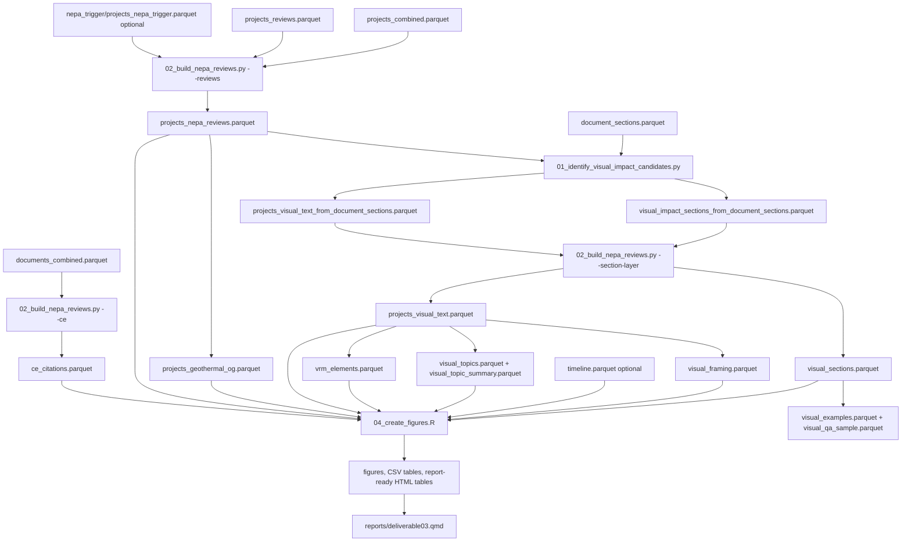

# D3: NEPA Review Process Application - Architecture

**Goal:** Compare how NEPA review process types, categorical exclusion citations, geography, geothermal/oil-and-gas patterns, and visual-impact treatment differ between decarbonization and fossil fuel energy projects.

**Self-contained:** Partially. The core D3 review, CE, geography, and visual-impact outputs are generated from Phase 2 analysis and processed document parquets. Trigger-based CE summaries use the D1 trigger output when available. Timeline figures are optional and require `phase2/data/analysis/timeline.parquet`.

---

## Data Flow



---

## Inputs

| File | Description |
|---|---|
| `phase2/data/analysis/projects_combined.parquet` | Main project universe with energy type, process type, agency, geography, and project type metadata |
| `phase2/data/analysis/projects_reviews.parquet` | Supplemental review metadata, especially `is_linear` when available |
| `phase2/data/analysis/nepa_trigger/projects_nepa_trigger.parquet` | D1 trigger classifications; clean-energy only, used for trigger-stratified CE summaries |
| `phase2/data/analysis/documents_combined.parquet` | Document-level metadata, including raw `ce_category` fields |
| `phase2/data/analysis/document_sections.parquet` | Reusable section layer consumed by the preferred visual-impact pipeline |
| `phase2/data/processed/ea/pages.parquet` | EA page text, used by legacy visual extraction and section inventory logic |
| `phase2/data/processed/eis/pages.parquet` | EIS page text, used by legacy visual extraction and section inventory logic |
| `phase2/data/analysis/timeline.parquet` | Optional timeline input for duration figures |

---

## Primary Outputs

All analysis parquets are written under `phase2/data/analysis/deliverable03/`.

| File | Description |
|---|---|
| `projects_nepa_reviews.parquet` | Base clean/fossil energy project table with `energy_group`, `tech_group`, process type, agency, geography, linearity, and optional trigger |
| `ce_citations.parquet` | One row per parsed CE citation from `documents_combined.parquet` |
| `projects_geothermal_og.parquet` | Clean geothermal plus land-based and offshore oil-and-gas subset |
| `visual_impact_sections_from_document_sections.parquet` | Section-level visual-impact candidates from the reusable section layer |
| `projects_visual_text_from_document_sections.parquet` | Project-level concatenated visual text before adaptation |
| `visual_sections.parquet` | Adapted section-level visual corpus used for examples, QA, and section-length figures |
| `projects_visual_text.parquet` | Project-level visual corpus used for framing, topics, and VRM element extraction |
| `visual_framing.parquet` | Project-level CEQ-style significance, adversity, mitigation, and VRM compliance indicators |
| `visual_topics.parquet` | Project-level NMF topic assignment |
| `visual_topic_summary.parquet` | Per-topic counts and top terms for NMF, plus comparison model rows when available |
| `visual_examples.parquet` | Representative visual-resource excerpts by energy/technology cell |
| `visual_qa_sample.parquet` | Stratified QA sample for source-document review |
| `vrm_elements.parquet` | Long project-element VRM contrast ratings: one row per project, element, and rating |

Figures, rendered tables, diagnostics, and CSV sidecars are written under `phase2/output/deliverable03/`.

---

## Analysis Universe

The base D3 universe is restricted to NEPATEC projects with `project_energy_type` in `Clean` or `Fossil`.

| Energy group | CE | EA | EIS | Total |
|---|---:|---:|---:|---:|
| Decarbonization | 19,399 | 573 | 753 | 20,725 |
| Fossil Fuel | 9,191 | 969 | 623 | 10,783 |
| **Total** | **28,590** | **1,542** | **1,376** | **31,508** |

`project_energy_type == "Clean"` is relabeled to `Decarbonization`; `project_energy_type == "Fossil"` is relabeled to `Fossil Fuel`.

---

## Module Architecture

### Module 1 - Base Review Table

`build_reviews()` in `phase2/code/deliverable03/02_build_nepa_reviews.py` creates `projects_nepa_reviews.parquet`.

Core behavior:

- Filters `projects_combined.parquet` to clean and fossil energy projects only.
- Derives `tech_group` from the NEPATEC `project_type` taxonomy.
- Relabels `Clean` to `Decarbonization` and `Fossil` to `Fossil Fuel`.
- Joins `is_linear` from `projects_reviews.parquet` if present.
- Joins `nepa_trigger_primary` from D1 when `projects_nepa_trigger.parquet` exists. Fossil projects generally have null trigger values because D1 is clean-energy focused.

Technology-group priority matters because `project_type` may contain multiple labels. For example, geothermal, wind, solar, and transmission labels are checked before the clean-energy fallback `Other Clean`.

### Module 2 - CE Citation Parsing

`build_ce_citations()` parses document-level `ce_category` values from `documents_combined.parquet` and writes `ce_citations.parquet`.

Normalization patterns extract short labels for common CE formats:

| Pattern family | Example output |
|---|---|
| BLM handbook codes | `B1.3`, `B3.6`, `B5.1` |
| DOI departmental manual | `516 DM 11.9` |
| CFR references | `10 CFR 1021` style references |
| Statutory exclusions | `Section 390 of the Energy Policy Act of 2005` |

The raw CE citation file is not itself restricted to the 31,508 D3 energy universe. D3 figures and tables join citations back to `projects_nepa_reviews.parquet` before computing clean/fossil summaries.

Current joined CE universe:

| Measure | Count |
|---|---:|
| CE citation rows joined to D3 energy projects | 29,751 |
| D3 projects with CE citation rows | 28,185 |
| Decarbonization CE projects with citations | 19,186 |
| Fossil Fuel CE projects with citations | 8,999 |

### Module 3 - Visual Impact Section Layer

The preferred visual pipeline begins with `phase2/code/deliverable03/01_identify_visual_impact_candidates.py`.

It consumes `document_sections.parquet`, scores candidate sections, and writes:

- `visual_impact_sections_from_document_sections.parquet`
- `projects_visual_text_from_document_sections.parquet`
- `visual_impact_section_project_coverage.csv`
- `visual_impact_section_coverage_summary.csv`
- a QA CSV under `phase2/output/validation/`

Candidate priority is assigned from heading and content signals:

| Priority | Signal |
|---:|---|
| 1 | Explicit visual topic or visual heading |
| 2 | Visual parent heading |
| 3 | Combined resource heading, such as land use plus visual/scenic |
| 5 | Land-use or recreation section with high visual and impact signal |
| 8 | High-density fallback section with visual and impact signal |

Only EA and EIS projects are considered in this visual section pipeline. CEs are excluded because they rarely contain the kind of visual-resource section text needed for comparable text analysis.

Current visual coverage summary:

| Process | Energy group | Projects | Projects with visual candidate | Percent |
|---|---|---:|---:|---:|
| EA | Decarbonization | 573 | 413 | 72.1% |
| EA | Fossil Fuel | 969 | 246 | 25.4% |
| EIS | Decarbonization | 753 | 503 | 66.8% |
| EIS | Fossil Fuel | 623 | 429 | 68.9% |

### Module 4 - Visual Adaptation, Framing, Topics, Examples, and QA

`02_build_nepa_reviews.py --section-layer` adapts the section-layer outputs into the schema expected by downstream modules.

The adaptation step:

- Drops administrative/reference sections by heading.
- Drops table-of-contents, credit, and preparer-list bodies.
- Deduplicates sections within project.
- Writes `visual_sections.parquet`.
- Aggregates project-level text into `projects_visual_text.parquet`.
- Creates `visual_analysis_text`, a cleaned and sentence-filtered version used for topic modeling.

Current visual corpus:

| Output | Rows/projects |
|---|---:|
| `visual_sections.parquet` sections | 13,642 |
| Unique projects in `visual_sections.parquet` | 1,589 |
| `projects_visual_text.parquet` projects | 1,591 |
| Heading-anchored projects | 1,310 |
| Fallback-only projects | 281 |

The two-project difference between section-level and project-level unique counts should be treated as a reconciliation check when regenerating the visual layer. The project-level table is the authoritative input for framing, topics, and VRM extraction.

### Module 5 - Framing Analysis

`build_framing()` writes `visual_framing.parquet`.

It applies domain-specific, negation-aware phrase matching to each project's visual text:

| Axis | Interpretation |
|---|---|
| `significance_ratio` | High-significance visual language divided by all high/low significance language |
| `adv_neg`, `adv_pos`, `adv_none` | Counts of adverse, beneficial, and no/negligible impact phrasing |
| `mitigation_ratio` | Strong/specific mitigation language divided by all mitigation language |
| `mitigation_specificity` | Count of distinct mitigation-specific terms |
| `vrm_class_cited` | Whether any VRM class was cited |
| `vrm_compliance_flag` | VRM objectives/classes are described as met and no exceedance is detected |
| `vrm_noncompliant_flag` | Text indicates VRM objective/class exceedance or noncompliance |

This is not general-purpose sentiment analysis. The lexicons are tailored to NEPA visual-resource language so that phrases like "no significant adverse visual impact" are not misread as adverse findings.

### Module 6 - Topic Modeling

`build_topics()` writes `visual_topics.parquet`, `visual_topic_summary.parquet`, and diagnostics.

Primary model:

- TF-IDF vectorizer over `visual_analysis_text`.
- `ngram_range=(1, 3)`.
- `min_df=5`.
- `max_df=0.55`.
- `max_features=10000`.
- NMF with `n_components=4`, `random_state=42`, `max_iter=400`, and light L1 regularization.
- NMF is the chosen model for all report figures. BERTopic and LDA are diagnostic/comparison paths only.

Training is done on heading-anchored projects; fallback-only projects are transformed into the learned topic space.

Current NMF topics:

| Topic | Interpretive label | Projects | Decarb | Fossil | EA | EIS |
|---:|---|---:|---:|---:|---:|---:|
| 2 | Industrial and Infrastructure Corridors | 804 | 448 | 356 | 368 | 436 |
| 0 | VRM Contrast Rating and Solar Glare | 432 | 299 | 133 | 163 | 269 |
| 3 | BLM VRM Objectives and Landscape Management | 286 | 103 | 183 | 88 | 198 |
| 1 | Wind Turbine Shadow Flicker | 69 | 66 | 3 | 40 | 29 |

The auto-labels stored in `visual_topic_summary.parquet` are term-based labels. Report figures remap them to interpretive labels in `04_create_figures.R`.

### Module 7 - VRM Element-Level Contrast Ratings

`build_vrm_elements()` writes `vrm_elements.parquet` and `vrm_elements_summary.csv`.

The extractor searches project-level visual text for explicit BLM VRM element ratings across:

- `form`
- `line`
- `color`
- `texture`
- `scale`
- `vividness`

Ratings are normalized to:

- `None`
- `Weak`
- `Moderate`
- `Strong`

Four textual forms are detected:

| Pattern | Example |
|---|---|
| Element then rating | `Form: Strong` or `Line - Moderate` |
| Contrast-of element | `contrast of form: strong` |
| Rating then contrast | `strong contrast in form` |
| Rating-element contrast | `strong form contrast` |

When multiple ratings are found for the same project and element, the strongest rating is retained.

#### VRM Analysis Findings

Fig21 has a small denominator by design. It is not a broad visual-impact count and it is not a count of all projects that mention VRM, contrast, scenic quality, or visual resources. It counts only projects where the extracted visual text contains explicit element-level ratings that match the patterns above.

Current denominator cascade:

| Stage | Count |
|---|---:|
| All D3 review projects | 31,508 |
| EA/EIS projects with project-level visual text | 1,591 |
| Projects with any extracted VRM element rating | 64 |
| Projects with non-`None` VRM element ratings used by fig21 | 63 |
| Decarbonization projects in fig21 basis | 44 |
| Fossil Fuel projects in fig21 basis | 19 |

The "64 cases" visible in the underlying data are not 64 decarbonization projects for each VRM element. They are project-element rows. The current non-`None` decarbonization denominators are:

| Element | Decarbonization projects | Fossil Fuel projects |
|---|---:|---:|
| Form | 25 | 11 |
| Line | 19 | 9 |
| Color | 16 | 4 |
| Texture | 4 | 3 |

Scale appears in only one decarbonization project, with rating `None`, and is excluded from fig21 because the figure drops `None` ratings and removes elements with fewer than five projects across both energy groups.

Process-type composition confirms that this is mostly a formal EIS-table subset:

| Energy group | EA projects | EIS projects |
|---|---:|---:|
| Decarbonization | 6 | 38 |
| Fossil Fuel | 1 | 18 |

Interpretation:

- Low coverage is expected because most documents do not publish formal BLM element-rating tables in machine-readable prose.
- The subset is strongest for BLM-style EIS documents and weaker for EAs and non-BLM projects.
- Fig21 should be described as "among projects with extractable formal VRM element ratings," not as corpus-wide visual-impact evidence.
- The chart is useful for showing the distribution of rated form, line, color, and texture contrasts within that formal subset.
- The current fig21 code places the intended per-element `n` labels at `x = 101` while the x scale is limited to 0-100, so the denominators are not visible in the image. The data are present in `vrm_elements_summary.csv`, but the plotted labels are clipped.

### Module 8 - Visual Examples, Scattertext, and QA

`build_examples()` selects representative heading-anchored visual sections by energy and technology cell. It keeps cells with at least ten distinct projects and chooses significance-heavy and mitigation-heavy sections when possible.

`build_scattertext()` optionally writes an interactive decarbonization-vs-fossil term explorer if `scattertext` is installed.

`build_qa_sample()` writes a stratified 20-row QA sample across energy group, process type, and extraction method.

### Module 9 - Geothermal vs. Oil and Gas

`build_geothermal_og()` writes `projects_geothermal_og.parquet`.

It selects:

- Clean `Geothermal`.
- Fossil `Land-based Oil & Gas`.
- Fossil `Offshore Oil & Gas`.

Current subset:

| Technology group | Projects |
|---|---:|
| Land-based Oil & Gas | 8,664 |
| Geothermal | 873 |
| Offshore Oil & Gas | 211 |
| **Total** | **9,748** |

---

## Figure and Table Builder

`phase2/code/deliverable03/04_create_figures.R` consumes the analysis parquets and writes report-ready figures, CSVs, and HTML tables.

Major output groups:

| Output group | Key files |
|---|---|
| Review process rates | `fig1_review_rates_by_energy.png`, `fig2_review_rates_by_tech.png`, `fig1b_within_agency.png` |
| CE citation patterns | `fig4_top_ce_codes.png`, `fig5_ce_by_energy.png`, `fig6_ce_by_agency.png`, `ce_by_trigger.csv` |
| Geography | `fig7_state_decarb.png`, `fig8_state_fossil.png`, `fig9_county_decarb.png`, `fig10_county_fossil.png`, `fig11a_state_process_decarb.png`, `fig11b_state_process_fossil.png` |
| Geothermal/O&G | `fig15_geo_og_rates.png`, `fig16_geo_og_states.png`, `fig17_geo_og_state_map.png` |
| Visual impacts | `fig12_visual_project_counts.png`, `fig13_wordcloud_grid.png`, `fig18_visual_framing.png`, `fig19a_section_length_energy.png`, `fig19_visual_section_length.png`, `fig21_vrm_elements.png` |
| Topic diagnostics | `fig14_topic_prevalence.png`, `fig14b_topic_terms.png`, `fig14d_nmf_elbow.png`, `visual_topic_excerpts_table.csv` |
| Optional timelines | `fig20_duration_by_energy_process.png`, `timeline_coverage.csv`, `duration_summary.csv` |

`phase2/reports/deliverable03.qmd` reads the same output directory and embeds these static figures and generated tables.

---

## Run Results

Current local D3 outputs show:

| Artifact | Count |
|---|---:|
| Base review projects | 31,508 |
| Decarbonization projects | 20,725 |
| Fossil fuel projects | 10,783 |
| Parsed CE citation rows, raw | 56,681 |
| Parsed CE citation rows joined to D3 energy universe | 29,751 |
| Visual section rows | 13,642 |
| Project-level visual text rows | 1,591 |
| Visual framing rows | 1,591 |
| Visual topic rows | 1,591 |
| NMF topic summary rows | 4 |
| LDA comparison topic summary rows | 4 |
| VRM element-rating rows, raw | 92 |
| VRM element-rating rows used by fig21 | 91 |
| Projects with non-`None` VRM element ratings | 63 |

---

## Known Issues and Cautions

### CE Citation File Is Broader Than the D3 Universe

`ce_citations.parquet` is generated from all `documents_combined.parquet` CE metadata. It must be joined to `projects_nepa_reviews.parquet` before D3 clean/fossil counts are interpreted.

### Visual Analysis Is EA/EIS Only

The section-layer visual pipeline intentionally excludes CEs. Report language should avoid implying that visual section findings apply to all 31,508 projects. The visual text universe is 1,591 EA/EIS projects.

### VRM Element-Level Coverage Is Narrow

VRM element extraction is a formal-table subset, not a general VRM mention detector. Only 63 projects currently contribute non-`None` ratings to fig21. Use the VRM figure for within-subset comparison, not as a corpus prevalence estimate.

### Fig21 Denominator Labels Are Clipped

The R plotting code computes per-element denominators and attempts to draw them at `x = 101`, but the x scale is limited to 0-100. The labels are clipped in the saved image. The denominator data are available in `vrm_elements_summary.csv`.

### Topic Labels Need Interpretive Remapping

The Python topic labels are generated from top terms. `04_create_figures.R` remaps them to stable interpretive labels. If topic vocabulary changes after a rerun, update `TOPIC_INTERP` in the R script before rendering the report.

### Timeline Section Is Optional

Timeline figures are guarded by `file.exists(TIMELINE_PATH)`. The rest of D3 can render without timeline data.

---

## Output Schema

### `projects_nepa_reviews.parquet`

| Column | Description |
|---|---|
| `project_id` | Primary key |
| `project_energy_type` | Original energy type, `Clean` or `Fossil` |
| `lead_agency_harmonized` | Harmonized lead agency |
| `project_state`, `project_county`, `project_lat`, `project_lon` | Geography fields |
| `project_type` | Original NEPATEC project type labels |
| `tech_group` | D3 technology group |
| `energy_group` | `Decarbonization` or `Fossil Fuel` |
| `process_type` | `CE`, `EA`, or `EIS` |
| `is_linear` | Linear infrastructure flag when available |
| `nepa_trigger_primary` | D1 primary trigger when available |
| `nepa_reviews_extraction_run_at` | UTC build timestamp |

### `visual_sections.parquet`

| Column group | Fields |
|---|---|
| IDs and metadata | `project_id`, `document_id`, `process_type`, `energy_group`, `tech_group`, `lead_agency_harmonized`, `document_title`, `source` |
| Location | `page_start`, `page_end`, `line_start`, `line_end`, `char_start`, `char_end` |
| Heading context | `heading_raw`, `heading_number`, `heading_title`, `heading_level`, `parent_heading_number`, `parent_heading_title` |
| Scoring | `canonical_topic`, `visual_term_count`, `impact_term_count`, `visual_terms_per_1000`, `impact_terms_per_1000`, `visual_impact_signal` |
| Extraction | `candidate_reason`, `candidate_priority`, `candidate_rank`, `extraction_unit`, `extraction_method`, `extraction_run_at` |
| Text | `n_words`, `n_chars`, `section_text` |

### `projects_visual_text.parquet`

Core fields include `project_id`, `energy_group`, `tech_group`, `process_type`, `n_sections`, `n_words`, `n_chars`, `has_heading_extraction`, `fallback_used`, `visual_text`, `visual_text_clean`, `visual_analysis_text`, and `extraction_run_at`.

### `visual_framing.parquet`

Core fields include `project_id`, `n_words`, significance counts and ratios, adversity counts, mitigation counts and ratios, mitigation specificity fields, VRM class fields, VRM compliance/noncompliance flags, and `framing_run_at`.

### `visual_topics.parquet`

| Column | Description |
|---|---|
| `project_id` | Primary key |
| `topic_nmf` | NMF topic ID |
| `topic_nmf_prob` | Maximum NMF document-topic weight |
| `topic_nmf_label` | Auto-generated term label |
| `topic_bertopic` | Optional BERTopic assignment |
| `topic_bertopic_prob` | Optional BERTopic probability |
| `topic_chosen` | Chosen topic ID, currently NMF |
| `topic_chosen_model` | Chosen model, currently `nmf` |
| `topics_run_at` | UTC build timestamp |

### `vrm_elements.parquet`

| Column | Description |
|---|---|
| `project_id` | Project ID |
| `energy_group` | `Decarbonization` or `Fossil Fuel` |
| `tech_group` | D3 technology group |
| `process_type` | `EA` or `EIS` in current visual universe |
| `element` | VRM element: form, line, color, texture, scale, or vividness |
| `rating` | Normalized rating: None, Weak, Moderate, or Strong |
| `vrm_elements_run_at` | UTC build timestamp |

---

## Reproduction

Preferred current pipeline:

```bash
conda run -n nepa python phase2/code/deliverable03/01_identify_visual_impact_candidates.py
conda run -n nepa python phase2/code/deliverable03/02_build_nepa_reviews.py --section-layer
Rscript phase2/code/deliverable03/04_create_figures.R
quarto render phase2/reports/deliverable03.qmd
```

Full legacy-compatible build:

```bash
conda run -n nepa python phase2/code/deliverable03/02_build_nepa_reviews.py
Rscript phase2/code/deliverable03/04_create_figures.R
quarto render phase2/reports/deliverable03.qmd
```

The preferred section-layer path is faster and avoids rereading page parquets for visual-section extraction.

---

## Methodological Notes

**Why a section-layer visual pipeline?** Heading-anchored sections preserve full visual-resource discussions better than keyword windows. Fallback candidates are used only when no stronger visual heading is available.

**Why NMF for topics?** Visual-resource sections share boilerplate vocabulary. TF-IDF plus NMF down-weights universal terms and produces more interpretable parts-based topics than LDA on this corpus.

**Why cap NMF at four topics?** Empirical elbow diagnostics show that k=4 separates shadow flicker, solar/glare contrast ratings, infrastructure corridors, and BLM VRM objectives. Higher k values create flat residual components without meaningful new themes.

**Why not use general sentiment for framing?** NEPA terms such as "adverse", "impact", and "significant" are technical terms. A domain-specific, negation-aware lexicon is more defensible for this report.

**How to interpret VRM findings?** VRM element ratings should be read as formal contrast-rating evidence among projects that expose those ratings in the extracted visual text. They are valuable for comparing rated form/line/color/texture outcomes, but they should not be generalized to all visual-impact projects without a coverage caveat.
