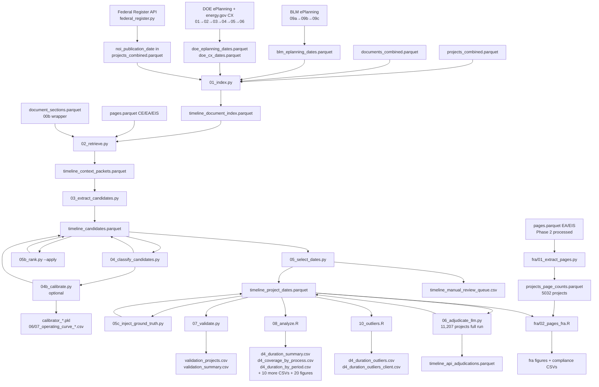

# D4: Project Timelines — Architecture

**Goal:** Extract initiation and decision dates for all NEPA projects in the corpus (CE, EA, EIS), produce a project-level timeline database supporting duration analysis, coverage diagnostics, and regulatory-period comparisons.

**Self-contained:** Partially. The core extraction pipeline (scripts 01–07 + `run_pipeline.py`) requires only `projects_combined.parquet`, `documents_combined.parquet`, and the processed pages/sections files. The Tier A metadata sources (scripts `api/blm_register/09a–09c` and `api/doe_register/01–06`) require network access to BLM ePlanning and energy.gov to build their lookup tables, but those outputs are cached as parquets and do not need to be re-fetched on each pipeline run. Script `06_adjudicate_llm.py` requires an Anthropic API key (macOS Keychain). The `fra/` sub-pipeline requires `phase2/data/processed/{ea,eis}/pages.parquet`.

---

## Script Quick-Reference

### Pipeline scripts — `phase2/code/deliverable04/`

**Canonical run order:** `00_sample` → `00b_sections` → `01_index` → `02_retrieve` → `03_extract_candidates` → `04_classify_candidates` → `04b_calibrate` → `05b_rank` → `05_select_dates` → `05c_inject_ground_truth` → `07_validate` → `08_analyze.R`. `run_pipeline.py`'s automated `FULL`/`SELECT` stage lists cover exactly this sequence (`02` through `07_validate`, then `08_analyze.R` run separately) — `06_adjudicate_llm.py` is **not** one of its stages; it is billable (Anthropic API) and is always run as a separate, explicitly-invoked step, positioned between `05c_inject_ground_truth` and `07_validate` in the data flow. `00_sample`/`00b_sections`/`01_index` also run outside `run_pipeline.py` (rarely re-run; see their own sections below). Post-analysis scripts run separately: `09_sample_check.R`, `10_outliers.R`, `fra/02_pages_fra.R`, `fra/03_solar_duration.R`.

`run_pipeline.py` is the single canonical orchestrator for a full corpus run. The sharded runner `_run.py` is retired (in git history). `run_pipeline.py --select` runs the selection-only sub-pipeline (`05b_rank` → `05_select_dates` → `05c_inject_ground_truth`), completing in minutes.

| Script | What it does |
|---|---|
| `00_sample.py` | Build the stratified 100-project gold sample (34 CE / 33 EA / 33 EIS, energy-type balanced, seed 20260527) used for validation design. |
| `00b_sections.py` | Check staleness and rebuild `document_sections.parquet` from the full CE/EA/EIS corpus when missing or stale. |
| `01_index.py` | Join projects, documents, and all Tier A register sources into `timeline_document_index.parquet` with document role scores, appendix flags, and scan priority. |
| `02_retrieve.py` | Execute the five-tier retrieval strategy (metadata, page slices, sections, keyword scoring, recovery) and write `timeline_context_packets.parquet`. |
| `03_extract_candidates.py` | Apply the full date-regex suite to context packets, prelabel each candidate's role (clear_decision, clear_initiation, proxy, review, historical, `body_text`, reject), and write `timeline_candidates.parquet`. |
| `04_classify_candidates.py` | **Learned scorer.** Three-head SetFit model (P_initiation, P_decision, P_feis) over the ambiguous candidate pool (`role_confidence_score < 5.0`, plus `body_text`/`unknown`; 5.0 register/strong-cue rows and review/reject are exempt). One shared-encoder SetFit model with a `[CE]/[EA]/[EIS]` process token; backend-pluggable (SetFit now → DeBERTa-v3 later). Writes `p_initiation`, `p_decision`, `classifier_*` columns. Passes through with neutral scores if no model is trained yet. |
| `04b_calibrate.py` | Fit Platt calibrators on the frozen candidate-label test split, write `calibrator_init.pkl`/`calibrator_dec.pkl`/`calibrator_feis.pkl`, produce `06_operating_curve_candidate.csv`/`07_operating_curve_project.csv`, and optionally write `p_init_cal`/`p_dec_cal`/`p_feis_cal` back to `timeline_candidates.parquet`. |
| `05b_rank.py` | **Learned selection ranker.** LightGBM LambdaRank — one ranker per head (init, decision). Consumes the full feature set (classifier probabilities + structural signals) and writes `learned_init_score`/`learned_decision_score` back to `timeline_candidates.parquet`. `--apply` flag writes scores; `--train`/`--eval` train and evaluate. |
| `05_select_dates.py` | Two-pass scoring and selection of best decision and initiation dates per project. **Variant B** logic: authoritative BLM/DOE register initiations are admitted regardless of ranking score and preferred over document text. Month-decision sliver routing (EA/EIS month-granularity decisions with explicit ROD/FEIS cues route to LLM adjudication). EIS tiered-decision: ROD-first, FEIS-fallback. Guard 2: calibrated initiation eligibility for EA/EIS (`T_INIT_CAL = 0.5`). Non-destructive write-back. Writes `timeline_project_dates.parquet` and the manual review queue. Appends `missing_both` universe-completeness stubs via `reconcile_universe()` (generalized 2026-07-15 from EIS-only `reconcile_eis_universe` to all processes); `--reconcile-only` applies just that step to an already-published parquet without re-selecting. |
| `05c_inject_ground_truth.py` | Terminal step that injects human-verified dates from `ranker.csv` directly into `timeline_project_dates.parquet` without re-running selection. `--scope all` (default) injects all verified rows; `--scope train` injects only training rows, leaving test rows as pipeline output for honest end-to-end evaluation. |
| `06_adjudicate_llm.py` | **Full-scale LLM adjudication** using Claude Haiku (`claude-haiku-4-5-20251001`). Scope gate: projects missing ≥1 slot where the missing slot has a candidate (11,207 projects on the 2026-06-17 full run: CE 8,625 / EA 901 / EIS 1,681; +9 incremental calls on 2026-07-13, 11,216 cumulative). Two modes: candidate-packet adjudication and document-recovery. ThreadPoolExecutor concurrency (threads only around the API call; main thread handles all writes). Incremental checkpoint every 50. Pre-run safety backup to `timeline_project_dates.pre_adj_<UTC>.parquet`. Credit-safety: fail-fast on ≥3 consecutive billing errors; 429 rate-limit errors classified as transient (never billing). API key via macOS Keychain. Not part of `run_pipeline.py`'s automated stages (billable — run separately). |
| `07_validate.py` | Prepare annotatable review packets from the 100-project sample or run granularity-aware validation against filled gold labels. |
| `run_pipeline.py` | **Single canonical orchestrator** for a full corpus run (`02` → `08_analyze.R`). `--select` flag runs selection-only sub-pipeline in minutes. Replaces the retired sharded `_run.py`. |
| `08_analyze.R` | Produce headline duration tables, FRA-breakpoint comparisons, coverage diagnostics, proxy-sensitivity summaries, and all figures. Negative-duration rows (`decision_date < initiation_date`) are reclassified to `invalid_order` **at source** (in `05_select_dates.py`/`05c_inject_ground_truth.py`, fixed 2026-07-13) — `08_analyze.R` no longer patches them; it only **asserts** the order invariant holds and `stop()`s loudly if it doesn't. |
| `09_sample_check.R` | Diagnostic spot-check: samples up to 5 projects per (process × coverage state) and writes `sample_check_candidates.csv` / `sample_check_projects.csv` with full candidate details and selected dates for eyeballing. |
| `10_outliers.R` | **Timeline duration-outlier deliverable.** Surfaces all projects with `duration_days > 5,000` or negative durations. Heuristic `suspect_error` triage flag (pre-1985 initiation, year-granularity initiation, early LLM-picked initiation). Writes `d4_duration_outliers.csv` (all processes, full provenance) and `d4_duration_outliers_client.csv` (EA/EIS only, likely-real, client-facing columns). |
| `fra/01_extract_pages.py` | Compute FRA regulatory page counts (40 C.F.R. § 1508.1(bb): body word count / 500, excluding embedded appendices + low-content pages) for ALL EA/EIS projects regardless of energy type. Streams pages via DuckDB; never loads pages into Python. Covers 5,032 projects (2,765 EA / 2,267 EIS). Output: `phase2/data/analysis/deliverable04/projects_page_counts.parquet`. |
| `fra/02_pages_fra.R` | FRA pre/post analysis on the 3,678 projects with a decision date. Produces document-length over time, pre/post-FRA bars, by-energy segmentation, distribution, page-limit compliance, and raw-vs-regulatory comparison. FRA date: 2023-06-03 (enactment). |
| `fra/03_solar_duration.R` | Solar duration analysis (Phase 2 re-creation of the Phase 1 solar timeline figures, added 2026-07-15). Restricts the 08-identical headline duration frame to `Renewable Energy Production - Solar`-tagged projects (solar tag + decarb scope from Phase 2 `projects_combined.parquet`) and plots intervals with all-decarbonization reference medians (EA/EIS). Deliberately does NOT use the parquet's stale `duration_days` column. Outputs: `fig_d4_solar_duration.png`, `d4_solar_duration.csv` (solar n: CE 812 / EA 60 / EIS 70; medians ~0.7 / ~12 / ~21 months vs decarb ~0.7 / ~10 / ~33). |
| `_test_adjudication.py` | (helper) Haiku-vs-Sonnet A/B test harness for adjudication quality comparison. |
| `_check_rate_limits.py` | (helper) Tier diagnostic — reports current API account tier, rate limits, and estimated throughput for a given worker count. |

### Labeling scripts — `phase2/code/deliverable04/labeling/`

Run once (or after major pipeline changes) to build, label, and import the gold set. Not part of the routine extraction pipeline. **The classifier (`04`) trains only on labels produced here.**

| Script | What it does |
|---|---|
| `01_build_gold_samples.py` | Build stratified gold split definitions (diagnostic, training, enriched) and write per-split CSV and ID files for labeling batches. |
| `02_prepare_gold_review_packets.py` | Create per-batch project-level and candidate-level review CSVs from gold split definitions and current pipeline outputs. |
| `05_llm_label_candidates.py` | **LLM gold-labeler.** Sends each project's candidates to Claude, assigns a role to every candidate and names THE initiation/decision date, and writes import-ready `*_llm_labeled.csv`. This is the real labeler. |
| `03_import_gold_labels.py` | Validate and import labeled CSVs into normalized Parquet tables under `timeline/gold/` (incl. `timeline_gold_candidate_training.parquet`, the classifier's training input) and inter-rater reliability tables. |
| `04_codex_prelabel_gold_packets.py` | ⚠️ Mechanical **regex echo**, NOT an LLM pass — copies `candidate_role` into `gold_candidate_role`. Baseline/scaffold only; never train on its output. Use `05_llm_label_candidates.py` instead. |

### API data-collection scripts — `phase2/code/api/`

Run once (or when registers are refreshed) to build cached Tier A lookup tables. Network access required; outputs are parquet files that the main pipeline reads without re-fetching.

| Script | What it does |
|---|---|
| `blm_register/01_scan_blm_case_numbers.py` | Scan NEPATEC page text for `DOI-BLM-...` case numbers in BLM projects and write `nepatec_case_evidence.parquet`. |
| `blm_register/02_fetch_blm_register.py` | POST each case number to BLM ePlanning, scrape Start/FONSI/ROD dates from the project page, and write `blm_register_records.parquet` (disk-cached). |
| `blm_register/03_build_blm_dates.py` | Match register records to NEPATEC project IDs and build `blm_eplanning_dates.parquet` with accepted initiation and decision dates. |
| `doe_register/01_scan_doe_doc_numbers.py` | Scan NEPATEC page text for `DOE/EA-NNNN` and `DOE/EIS-NNNN` document numbers and write `doe_case_evidence.parquet`. |
| `doe_register/02_fetch_doe_register.py` | Scrape energy.gov ROD and FONSI listing pages (and EPA EIS database for NOI dates), write `doe_register_records.parquet`. |
| `doe_register/03_fetch_project_pages.py` | Fetch individual energy.gov project pages for doc numbers that the listing-page scrape missed, merge into `doe_register_records.parquet`. |
| `doe_register/04_build_doe_dates.py` | Join DOE case evidence to register lookup and produce `doe_eplanning_dates.parquet` with per-project decision and initiation dates. |
| `doe_register/05_fetch_cx_register.py` | Crawl ~3,558 energy.gov CX determination listing pages (1 req/sec) and write the full `doe_cx_register.parquet` lookup (cx_number → date). |
| `doe_register/06_match_cx_register.py` | Join `cx-NNNNNN.pdf` filenames in NEPATEC CE documents to the CX register via integer match and write `doe_cx_dates.parquet`. |
| `federal_regisiter/federal_register.py` | Fetch Federal Register NOI and NOA records and match them to NEPATEC projects; produces `noi_publication_date` and `noa_availability_date` in `projects_combined.parquet`. |

---

## Data Flow



---

## Inputs

| File | Description |
|---|---|
| `phase2/data/analysis/projects_combined.parquet` | Project metadata including `process_type`, `project_energy_type`, agency, FR fields (`noi_publication_date`, `noi_match_status`, `noi_match_confidence`, `noa_availability_date`, `noa_match_status`), and `project_description` (used by script 02 for CE initiation extraction — see §CE Project Description Source below) |
| `phase2/data/analysis/documents_combined.parquet` | Cross-source document rollup with harmonized `document_type_clean`, `document_type_category`, `main_document`, `document_date_from_file_name` |
| `phase2/data/processed/ce/pages.parquet` | CE document page text (DuckDB scan only — never `pd.read_parquet`) |
| `phase2/data/processed/ea/pages.parquet` | EA document page text |
| `phase2/data/processed/eis/pages.parquet` | EIS document page text |
| `phase2/data/analysis/document_sections.parquet` | Section-level text with heading titles; rebuilt by `00b_sections.py` when stale |
| `phase2/data/analysis/blm_register/blm_eplanning_dates.parquet` | BLM ePlanning accepted initiation and decision dates by project_id |
| `phase2/data/analysis/doe_register/doe_eplanning_dates.parquet` | DOE ePlanning FONSI/ROD dates for EA/EIS projects |
| `phase2/data/analysis/doe_register/doe_cx_dates.parquet` | DOE CX determination dates for CE projects, matched via `cx-NNNNNN.pdf` filenames |

---

## Primary Outputs

Analysis parquets are written under `phase2/data/analysis/timeline/` (pipeline outputs) and `phase2/data/analysis/deliverable04/` (FRA page counts).

| File | Description |
|---|---|
| `timeline/timeline_project_dates.parquet` | One row per project: selected initiation and decision dates, granularity, confidence, proxy flags, duration, `timeline_status`, `has_rod`, `decision_is_feis_fallback`, `final_eis_*` fields, `route_to_llm`, `timeline_llm_run_at` |
| `timeline/timeline_api_adjudications.parquet` | One row per LLM adjudication call: model, tokens, cost, response JSON, guardrail flags, selected candidate IDs. 11,216 rows cumulative (11,207 from the 2026-06-17 full run + 9 incremental calls on 2026-07-13). |
| `timeline/timeline_candidates.parquet` | One row per date-context candidate: all extracted date evidence with scoring components, role pre-labels, classifier scores, calibrated classifier scores, `learned_init_score`/`learned_decision_score` from 05b |
| `timeline/timeline_context_packets.parquet` | One row per retrieved context span: retrieval audit trail with tier, reason, scores |
| `timeline/timeline_document_index.parquet` | One row per project-document: document role scores, scan priority, Tier A eligibility flags |
| `timeline/models/candidate_classifier/calibrator_init.pkl` / `calibrator_dec.pkl` / `calibrator_feis.pkl` | Platt calibrators (one per classifier head) fitted by `04b_calibrate.py` on the frozen candidate-label test split |
| `timeline/gold/timeline_gold_splits.parquet` | Gold sample split definitions for labeling batches |
| `timeline/gold/timeline_gold_projects.parquet` | Finalized gold project-level date labels |
| `timeline/gold/timeline_gold_candidates.parquet` | Finalized gold candidate-role labels |
| `timeline/gold/timeline_gold_candidate_training.parquet` | Training-ready candidate examples with labels |
| `deliverable04/projects_page_counts.parquet` | One row per EA/EIS project: raw pages, body pages, appendix pages, body word count, regulatory pages, method (`ocr`/`no_appendix_file`). 5,032 rows (2,765 EA / 2,267 EIS). |

Figures are written under `phase2/output/deliverable04/figures/`. Diagnostic CSVs are written under `phase2/output/deliverable04/diagnostics/`. Other outputs (review queues, sample checks) under `phase2/output/deliverable04/`.

---

## Module Architecture

### 00_sample.py — Balanced Validation Sample

Draws a 100-project stratified sample from `projects_combined.parquet` with quotas of 34 CE / 33 EA / 33 EIS, each process further divided equally across Clean / Fossil / Other energy types. Seed `20260527` is fixed. This sample is used as the calibration set for scripts 05 and 10–13. It reads only project and document metadata — no pipeline outputs — so it is stable across pipeline reruns.

Outputs: `phase2/output/deliverable04/timeline_sample100.csv`, `timeline_sample100_summary.csv`.

### 00b_sections.py — Section Index Wrapper

Thin D4 wrapper around `phase2/code/extract/build_document_sections.py`. Checks whether `document_sections.parquet` is stale relative to source pages (threshold: 30 days) and rebuilds it over the full CE/EA/EIS corpus when needed. Writes D4-specific section QA diagnostics used by Tier C retrieval.

### 01_index.py — Project-Document Index

Joins `projects_combined.parquet` and `documents_combined.parquet` into a flat project-document index, then merges the three Tier A register outputs (BLM ePlanning, DOE ePlanning, DOE CX). Each document row receives:

**Document role scores** — computed from `DECISION_DOC_SCORES` and `INITIATION_DOC_SCORES` dictionaries that map cleaned document type strings to scores 0–5. Decision top scores: ROD/FONSI/CE determination = 5.0. Initiation top scores: NOI/scoping notice = 4.5–5.0. Scores are taken as `max()` across `document_type_clean`, `document_type`, and `document_title`.

**Main document bonus** — `MAIN_DOC_BONUS = 1.5` added when `is_main_document` is True.

**Appendix penalty** — `APPENDIX_PENALTY_SCORE = 2.5` subtracted when `is_appendix_like` is True. A document is appendix-like when `document_type_category` is in `{appendix, attachment, exhibit, reference, comment}`, or when the title/filename/type matches `APPENDIX_TYPE_RE`. Strong cues (ROD/FONSI/CE determination/NOI language) override the appendix flag.

**Scan priority** — `scan_priority_score = max(decision_score, initiation_score) + main_doc_bonus - appendix_penalty`. Thresholds: `priority_1` (score >= 6 or NOI Tier A eligible), `priority_2` (score >= 3), `priority_3` (score >= 1), `defer` (score <= 0).

**NOI Tier A eligibility** — `noi_tier_a_eligible = True` when `noi_publication_date` is non-null and `noi_match_status` is not in `{unmatched, rejected, low_confidence, missing}` and `noi_match_confidence` is `high`/`medium` or numeric >= 0.75.

The script asserts that all required FR fields exist in `projects_combined.parquet` and raises a `ValueError` with diagnostics if any are missing, preventing silent Tier A candidate drops from field name changes.

### 02_retrieve.py — Five-Tier Context Retrieval

Produces `timeline_context_packets.parquet`. Pages are loaded via DuckDB (`read_parquet`) never `pd.read_parquet`, then pre-grouped by `document_id` into a dict for O(1) per-project lookup. Sections are also loaded once per process type via DuckDB with a process-type filter to avoid pulling all process types into RAM.

**Tier A — Structured metadata.** One synthetic packet per eligible source: FR NOI date, BLM ePlanning initiation date, BLM ePlanning decision date, DOE ePlanning initiation date, DOE ePlanning decision date, DOE CX determination date. Each packet has `retrieval_tier = "tier_a"`, `retrieval_score = 5.0`, and `source_tier = "metadata"`. The `retrieval_reason` field encodes the exact source (`blm_register_decision`, `doe_cx_register_decision`, etc.) so downstream prelabeling can assign roles deterministically without reading context text.

**Tier B — Page slices.** For `priority_1` and `priority_2` documents only. CE documents with <= 20 pages: scan all pages (`ce_small_doc_all_pages`). CE documents with 21–50 pages: scan all pages (`ce_expanded_all_pages`). All other documents: first 3 + last 3 pages plus top-3 pages by initiation score and top-3 by decision score. Decision score includes a 2x multiplier for signature-cue matches (`SIGNATURE_CUES`).

**Tier C — Section retrieval.** Sections with `heading_title` matching `DECISION_SECTION_CUES` or `INITIATION_SECTION_CUES` are retrieved; sections matching `NEGATIVE_SECTION_CUES` are skipped. CE documents with <= 20 pages bypass section retrieval entirely (Tier B is sufficient for short CE forms).

**Tier D — Page keyword scoring.** Scores all pages in `priority_1`, `priority_2`, and `priority_3` documents by `INITIATION_CUES` + `DECISION_CUES` matches; takes the top 10 by `retrieval_score`. Deduplicates against Tier B/C by `context_hash`, keeping the higher-tier packet.

**CE Project Description Source.** For CE projects that are not BLM-fully-resolved (i.e., don't have both a BLM register initiation and decision date), script 02 loads `project_description` from `projects_combined.parquet` and emits one additional context packet per project with `retrieval_tier = "ce_description"` and `source_tier = "page_slice"`. The description is the "Description of Proposed Action" section extracted from the CE form — 100% coverage for CEs, median ~840 characters. Approximately 15% of CE descriptions contain at least one date, and of those ~54% include initiation-language ("submitted", "received", "filed"), making this a meaningful additional initiation source for BLM CEs that lack a register start date.

`source_tier = "page_slice"` (not `"metadata"`) is intentional: the metadata branch of script 03 returns on the first date match only (designed for single-value register strings), whereas the page_slice path runs the full sentence-level extraction across the whole text. The description is parsed from its JSON list format (`["text..."]`) and markdown bold markers are stripped before extraction. Packet cap priority for `ce_description` is between `tier_a` (highest) and `tier_b`.

**Per-project packet caps:** CE: 25, EA: 75, EIS: 150. When a project exceeds its cap, packets are sorted by tier order then descending retrieval score and trimmed.

Sample runs use isolated output directories (`timeline/sample_runs/<ids_stem>/`) to prevent overwriting full-corpus outputs.

### 03_extract_candidates.py — Date Extraction and Role Prelabeling

Applies 14 date regex patterns to every context packet's `context_text`. Patterns cover: full month-name (`MDY_full`), abbreviated month-name (`MDY_short`), ordinal day variants, DMY order, numeric slash (2- and 4-digit year), ISO, numeric dash, digital signature (`YYYY.MM.DD`), numeric dot (`M.DD.YY`), month-year (`MY_full`, `MY_short`), and a NEPA case-number year fallback (`nepa_case_year`).

**Granularity rules:** Month-year patterns produce `granularity = "month"` with day set to 1. `nepa_case_year` produces `granularity = "year"` with date normalized to July 1 of the year. All other full-date patterns produce `granularity = "day"`.

**Numeric dot guardrail:** `numeric_dot` (`M.DD.YY`) is only accepted when the surrounding context contains a signature, role title, or approval cue — otherwise version numbers and section numbers produce false hits.

**Exclusion rules:** Future dates, pre-1970 dates (hard reject for CE/EA; soft reject for EIS), legal/statutory citation keywords (`EXCLUSION_KEYWORDS` — ~35 phrases including "act of 19", "u.s.c.", "public law", "doi:", "isbn", "expiration date", "valid until", "expires on", "expiry", "categorical exclusion expires", "printed on recycled", "doe f ", "previous editions obsolete", "remain in place until", "protective fencing"), regex-based exclusions (`EXCLUSION_RE` — CFR citations `\d+ cfr \d+`, FR volume citations `\d+ fr \d+`, author-year bibliographic patterns), and reject cues (OMB, "form approved", "prepared by", "downloaded", "revision date", "revised YYYY", "map date/created/printed/prepared"). The keywords `"expiry"`, `"remain in place until"`, and `"protective fencing"` were added to exclude ROW/lease expiry dates in renewal CE backgrounds and operational field-management duration dates (e.g., "protective fencing would remain in place until 8/17/08") that appeared as spurious `clear_decision` candidates in CE Decision Records.

**Role prelabeling** (`_prelabel_role`): assigns `candidate_role` and `role_confidence` (0–5 scale). The evaluation order within `_prelabel_role` is:

1. **Tier A metadata early returns** — BLM/DOE register `retrieval_reason` strings produce `clear_decision` or `clear_initiation` at confidence 5.0 without reading context text. Filename Tier A (`filename_date_decision_doc`) produces `clear_decision` at confidence 3.0.
2. **`nepa_case_year` early return** — dates extracted via the NEPA case-number year pattern (`DOI-BLM-...-2022-...` → 2022-07-01) always return `proxy_decision` at confidence 0.5, regardless of any decision language in the surrounding context. This prevents text cues like "Field Manager Date" from upgrading a case-number year to `clear_decision`.
3. **`HISTORICAL_CUES` (before decision cues)** — if the context contains historical-reference language ("was granted a ROW on", "prior ROD", "resource management plan", "communication site established"), the candidate is immediately labeled `historical` at confidence 0.0. This check runs **before** `CLEAR_DECISION_STRONG` so that historical dates embedded in decision documents (e.g., a CE body referencing a 1988 ROW grant) are not mistakenly promoted to `clear_decision` by decision-language elsewhere in the same context block.
4. **`CLEAR_DECISION_STRONG`** — confidence 5.0. Key patterns: FONSI/ROD/CE determination signed or issued; "digitally signed by"; "SIGNATURE OF AUTHORIZED OFFICER" (standard BLM CE form section header for the approving official's signature block — added after this pattern was misclassified as `review` when "Planning and Environmental Coordinator" appeared in the same context block); "NEPA compliance officer"; "NCO determination"; "authority and approval"; YYYY.MM.DD digital-signature timestamps; `/s/ <name>` notation.
5. **`CLEAR_INITIATION_STRONG`** — confidence 5.0.
6. **`REJECT_CUES`** — confidence 0.0.
7. **`CLEAR_DECISION_MED`** / **`CLEAR_INITIATION_MED`** — confidence 3.0.
8. **`REVIEW_CUES`** — specialist roles (environmental specialist, SHPO, Section 106); confidence 2.0.
9. **FEIS/EA proxy**, **month-year**, **document-type fallback**, **unknown** — in order.

Candidates not matching any cue get `candidate_role = "unknown"` with confidence 1.0–1.5.

**Specialist /s/ face-sheet disambiguation:** `CLEAR_DECISION_STRONG` includes a `/s/` branch that matches any digital signature notation. On multi-specialist face sheets (e.g. BLM EA cover pages with cultural resources, paleontology, range rows), multiple `/s/` patterns fire without any actual decision keyword. The `CLEAR_DECISION_KEYWORDS_RE` pattern (same as `CLEAR_DECISION_STRONG` minus the `/s/` and `YYYY.MM.DD` branches) is used to detect this case: if the decision-strong match was driven only by `/s/` and 3+ signature instances appear in the context (or `REVIEW_CUES` matches a specialist role), the candidate is downgraded to `review` role.

**Key `CLEAR_INITIATION_STRONG` additions (Phase 2):** `"external scoping was conducted"`, `"posted (on/to) the (online) NEPA register"`, `(?:noi|notice\s+of\s+intent)\s+(?:was\s+)?(?:published|issued|submitted)` (note the optional `was` — NEPATEC text consistently uses passive past tense). **Key `CLEAR_INITIATION_MED` additions:** `"comment period was/ran/began/started/opened"` (9,280 candidate contexts); `"deemed the application complete"`, `"amended and re-submitted"`, `"30-day comment period"`, `"date created/prepared"`, `"drafted"`.

CE initiator-role field handling: `CE_INITIATOR_ROLE` pattern (`doe initiator`, `nepa initiator`, `action initiating office`) triggers `candidate_role = "clear_initiation"` only when the form-role context is not mixed with decision text.

### 04_classify_candidates.py — Learned Candidate Scoring

The classifier sits between candidate extraction and date selection. It trains from the single human-labeled source file, `phase2/training/deliverable04/classifier.csv` (moved from the earlier `output/deliverable04/labeling_sample.csv`), whose `split` column is frozen so new active-learning rows default to `train` and never leak into the test set (current split: 4,423 train / 938 test, over 5,361 labeled candidates). The current production model is a SetFit shared encoder with **three** independent one-vs-rest heads in fixed order (`LABEL_ORDER`): `p_initiation`, `p_decision`, then `p_final_eis`. The third head was added on top of the original two-head design to isolate EIS Final-EIS publication / Notice-of-Availability dates from RODs — existing initiation/decision/neither-labeled rows are automatically `final_eis` negatives, so adding the head required no relabeling of existing data.

Input text is built from a process token plus the anchored candidate context (`model_context` when present, falling back to `context_text`/`context_cleaned`). The model scores only ambiguous candidates: eligible roles are clear/proxy initiation, clear/proxy decision, `body_text`, `unknown`, and `historical` with `role_confidence_score < 5.0`; register and strong-cue rows at 5.0 bypass the classifier as deterministic evidence (`historical` is eligible rather than exempt because a 2026-06-02 audit found regex `historical` is only ~16% reliably historical and sweeps in genuine Field-Manager/NEPA-officer signature dates the classifier can rescue).

**Final-EIS document-type gate.** A final-EIS publication date can only come from a document actually typed FEIS, so `p_final_eis` is force-zeroed on every candidate whose `document_type_clean != "FEIS"` before any downstream use. On the frozen test this lifts final_eis precision from 0.50 to 0.74 (drops 18 non-FEIS false positives) at a 0.977 recall ceiling (only 1 of 44 true positives lives outside an FEIS document). Every downstream consumer — the argmax label, `05b_rank`, `04b_calibrate --apply`, `05_select_dates`, and `06`'s routing — inherits the gate from this single rule.

**Label assignment.** `classifier_label` is a 3-way argmax over `(p_initiation, p_decision, p_final_eis)` with a `neither` floor: if all three heads score below `LABEL_THRESHOLD = 0.5`, the candidate is labeled `neither`; otherwise it takes the name of the highest-scoring head. `classifier_score` is `max()` of the three raw probabilities.

**Backward compatibility for older 2-head models.** `run_score()` does not assume the loaded model has three heads: `p_feis = probs[:, 2] if probs.shape[1] > 2 else zeros`. A legacy 2-head model therefore still runs unmodified — `p_final_eis` stays 0 for every candidate and the argmax silently degrades to the original 2-way (+neither) choice. `LABEL_ORDER` (used for training-label mapping and the argmax) is always 3-long; only the model's actual output width is guarded.

The scorer writes `p_initiation`, `p_decision`, `p_final_eis`, `classifier_label`, `classifier_score`, backend, model version, and run timestamp back to `timeline_candidates.parquet`.

### 04b_calibrate.py — Probability Calibration and Operating Curve

`04b_calibrate.py` imports `04_classify_candidates.py` through `importlib` because the module name starts with a digit, then reuses its model loader, text builder, path constants, frozen split value, and label order. `--fit` scores the frozen test split (938 rows of `classifier.csv`, same split `04` trains/evals on) with the current classifier and fits three Platt calibrators — `calibrator_init.pkl`, `calibrator_dec.pkl`, and `calibrator_feis.pkl` (`LogisticRegression` on one raw probability feature per head). Platt is used instead of isotonic regression because the frozen test has far fewer positives for the rarer classes (final_eis: ~44 positives) than rows overall. A legacy 2-head model's missing 3rd probability column is padded with zeros before fitting so `--fit` never fails on an older checkpoint; the resulting `calibrator_feis.pkl` is degenerate (always near-zero) until a 3-head model is scored.

`--curve` applies the calibrators to the scored pool for the current classifier model version and writes two operating-curve tables under `phase2/output/deliverable04/diagnostics/`: `06_operating_curve_candidate.csv` (candidate-level: threshold, auto-resolved/routed candidate counts, frozen-test precision by head and combined) and `07_operating_curve_project.csv` (project-level: one-LLM-call-per-routed-project cost view). `--apply` is optional; it writes `p_init_cal`, `p_dec_cal`, and `p_feis_cal` back to `timeline_candidates.parquet` for rows matching the current classifier version.

### 05b_rank.py — Learned Selection Ranker

LightGBM LambdaRank with one ranker per head (init, decision). Loads the feature set from `05_select_dates.py` via `importlib` and adds the classifier probabilities. Requires human-verified `ranker.csv` for training labels (one verified initiation candidate ID and one decision candidate ID per gold project). `--apply` writes `learned_init_score` and `learned_decision_score` back to `timeline_candidates.parquet`; `05_select_dates.py` reads these and uses them as the primary ranking signal when present (falling back to heuristic `ranking_score` when absent). `--train` fits both rankers on `split == "train"` rows and reports eval metrics on held-out rows.

### 05_select_dates.py — Scoring and Date Selection (Variant B)

Implements two-pass selection to avoid circular chronology scoring. **Variant B** is the current production variant, characterized by three key behaviors beyond the base scoring:

1. **Authoritative BLM/DOE register initiations admitted unconditionally.** Register-sourced initiation candidates (`candidate_source_type == "metadata"`) are accepted regardless of `ranking_score` and ranked above document-text candidates. This ensures that BLM ePlanning start dates (13,854 projects) and DOE ePlanning NOI dates are never suppressed by a low learner score.

2. **Month-decision sliver routing (EA/EIS).** A month-granularity decision candidate is eligible only when it carries an explicit ROD/FEIS/NOA cue (`_MONTH_DEC_POS_RE`) and no known false-positive cue (`_MONTH_DEC_NEG_RE`), and no equally-cued day-level decision exists. These are NOT auto-selected — they route to script 06 (LLM adjudication) by setting `route_to_llm = True`. CE month decisions are auto-selected (the CX cover month IS the determination for a CE).

3. **Guard 2 — calibrated initiation eligibility for EA/EIS.** For EA and EIS, the initiation candidate pool is expanded to include any candidate with `p_init_cal >= 0.5` (calibrated classifier probability), union-merged with the legacy `ranking_score > 0` gate. CE uses the legacy gate only (too large to validate before the deadline). An OMB/paperwork-reduction boilerplate guard (`_INIT_NEG_RE`) excludes form-expiry language regardless of gate.

4. **EIS tiered decision — ROD-first, FEIS-fallback.** `EIS_TIERED_DECISION = True`. For each EIS project the decision pool is built from ROD-eligible candidates first (register RODs, ROD-typed documents, explicit ROD-language); if the pool is empty, FEIS-doc candidates (NOA/availability language or FEIS cover-page dates) are used as fallback, flagged `decision_is_feis_fallback = True`. This ensures ROD outranks FEIS by construction.

**Pass 1 (decision).** Score all `clear_decision` and `proxy_decision` candidates using:
- `source_strength` (0–5): Tier A = 5, page_slice/section = 3, page_keyword = 2
- `role_cue_strength` (0–5): derived from `role_confidence`
- `document_priority`: `DOCUMENT_TYPE_SCORES` dict lookup (ROD/FONSI/CE determination = 5.0; appendix = -2.5)
- `section_priority` (−2 to +3): based on `heading_title` keywords
- `page_priority` (0–3): capped from retrieval score / 3
- `position_signal` (−1 to +1.5): role-aware; decision dates boost if `position_pct > 0.85`, initiation dates boost if `position_pct < 0.15`
- `classifier_signal` (additive): `CLASSIFIER_WEIGHT * own_prob − CLASSIFIER_DISAGREE_PENALTY * (other − own)` when the other head is more confident
- `granularity_signal` (−1 to +1): day = +1, month = 0, year = −1
- `agreement_signal` (0–1.5): corroboration when multiple candidates resolve to the same date
- `chronology_signal` (−5 to +2): penalties applied in pass 2 only
- `repeated_mention_signal` (0–1): small boost for dates repeated in consistent contexts
- `negative_penalty` (0–8): historical gap flag, strong negative context, `REJECT_CUES`
- `July-1 penalty` (+2 negative): `nepa_case_year` proxies (YYYY-07-01 normalized dates) receive an extra penalty to ensure a real specific date on the same page beats the case-number proxy

**Historical gap rule:** For CE and EA, dates before a gap of > 730 days (`GAP_DAYS = 730`) relative to the date cluster are flagged `historical_gap_candidate` with increased `negative_penalty`. EIS is exempt (`EIS_GAP_EXEMPT = True`).

**Pass 2 (initiation).** Re-score `clear_initiation` and `proxy_initiation` candidates using the selected decision as a chronology anchor. Dates after the decision receive −5 `chronology_signal`. An implausible-duration guard (`MAX_INIT_LOOKBACK_DAYS = {EA: 3650, EIS: 5475}`) drops absurd-early init candidates. **Chronology filter granularity fix:** when the selected decision date has `granularity = "year"` (normalized `YYYY-07-01`), the filter uses year-level comparison to avoid dropping valid BLM register initiation dates that fall in the same year after July 1.

**`nepa_case_year` proxy discard.** If the decision date came from a `nepa_case_year` candidate AND the selected initiation falls in the same year or later, the proxy decision is discarded and the project is re-labeled `missing_decision` with flag `nepa_case_year_proxy_discarded`.

**Timeline status** is assigned from the combination of which dates exist, proxy flags, and ordering validity:
- `complete_clear` — both dates non-null, ordered, neither is proxy
- `complete_with_proxy` — both dates non-null, ordered, at least one is proxy
- `missing_initiation` — decision exists, no initiation
- `missing_decision` — initiation exists, no decision; also set when a `nepa_case_year` proxy is discarded
- `missing_both` — neither endpoint
- `invalid_order` — decision before initiation (excludes same-year `nepa_case_year` artifact)
- `manual_review` — flagged for human resolution

`duration_days` is populated only when both selected dates have `date_granularity == "day"`.

Manual corrections from `timeline_manual_corrections.parquet` are applied after deterministic selection, with `manual_override` added to `timeline_flags`.

**Month midpoint imputation (`apply_month_midpoint_imputation`).** After manual corrections, any remaining project where either date has `granularity == "month"` has its date adjusted from day 1 to day 15 (`YYYY-MM-15`), and `midpoint_imputed` is set to `True`. Projects with both-day granularity after midpoint imputation are now eligible for `duration_days`. The `midpoint_imputed` flag lets downstream analysis and LLM adjudication distinguish these estimates from authoritative day-level dates.

**Pipeline ordering:** API/Register (Tier A) → Regex extraction (03) → classifier scoring (04) → LightGBM ranking (05b) → selection (05) → ground-truth injection (05c) → LLM adjudication (06).

**`reconcile_universe()` — universe-completeness stub fill.** The selection loop only ever visits projects that survived to have at least one candidate; a project with zero surviving candidates never gets an output row and silently vanishes from the published parquet, understating the true "out of X projects" denominator. `reconcile_universe()` appends a `missing_both` stub (all fields empty/false, `project_id` populated) for every project in `timeline_document_index.parquet` of a processed type that is absent from the selection output, so the published universe matches the document index / project inventory exactly. Originally EIS-only (as `reconcile_eis_universe`, Phase B — the ~664 zero-candidate EIS gap; see Known Issues); **generalized to all processes 2026-07-15** (the deferred Phase D), which surfaced 628 zero-candidate CE + 66 zero-candidate EA projects that had been silently missing from every published CE/EA denominator. Runs before manual corrections / midpoint imputation / `deis_only` flagging so stub rows still receive those steps identically to pipeline-produced rows.

**`--reconcile-only` mode.** Skips selection entirely: loads the existing canonical `timeline_project_dates.parquet`, backs it up to `timeline_project_dates.pre_reconcile_<UTC>.parquet`, runs `reconcile_universe()` against it, and writes back — purely additive, every pre-existing row byte-identical. This exists because a **from-scratch full re-selection was tried first (2026-07-15) and rejected**: re-forming candidate packets from current retrieval does not reproduce the same packet composition the June-era LLM adjudication cache was keyed on (cache key = `project_id | candidate_ids | model`), so the CE adjudication layer failed to re-apply entirely (0 of 8,306 CE `api_adjudication`-sourced dates re-formed; EA and EIS re-formed completely) and CE complete-timeline coverage collapsed to 45.7% in the trial run. `--reconcile-only` avoids touching anything selection-derived, so the (large, already-validated) adjudication layer stays intact — see the Reproducibility Note in the LLM Adjudication section below.

### 05c_inject_ground_truth.py — Ground Truth Injection

Terminal step that injects human-verified dates from `phase2/training/deliverable04/ranker.csv` into `timeline_project_dates.parquet` without re-running selection or touching candidates. One-sided conflict handling: if only one side is verified and the other side now contradicts it (decision before initiation), the un-verified contradicted date is dropped rather than generating `invalid_order`. `--scope all` (default) is used in production. Model training reads `ranker.csv` directly — writing verified dates into the output parquet cannot leak into any training or validation set.

### 06_adjudicate_llm.py — Full-Scale LLM Adjudication

Uses Claude Haiku (`claude-haiku-4-5-20251001`, Anthropic API) in two modes.

**Candidate adjudication** (primary mode): sends compact packets — project title, process type, agency, current pipeline status/flags, and up to `ROUTED_TOPK = 3` top candidates (ranked by classifier score then `ranking_score`) — for projects that are missing ≥1 slot where the missing slot has a candidate. The LLM selects candidate IDs from the presented list; a hallucination guardrail (`_validate_candidate_response`) rejects any ID not in the input list. Classifier-authoritative candidates (`role_confidence_score >= 5.0`) are kept in the pool even if the classifier left them unscored.

**Document recovery** (secondary mode): sends top 10 page/section chunks (strict `MAX_INPUT_TOKENS = 4096` cap) for projects with no useful candidates. Returns free-form YYYY-MM-DD strings; validated by `pd.Timestamp` parsing. Recovery dates that are day-level clear `midpoint_imputed` on the overwritten slot.

**Scope gate (completable gate):** Only projects where each missing slot has a corresponding candidate are sent. Already-both-present projects are excluded. This is the core filter that produced the 11,207-project queue (CE 8,625 / EA 901 / EIS 1,681).

**Concurrency model:** `ThreadPoolExecutor` with `workers=24` (Tier-2 account). API calls run in worker threads; ALL writes to `adj_records`, `dates_updates`, and the checkpoint file happen in the main thread via `as_completed` — no locks needed.

**Resilience:**
- Incremental checkpoint every `SAVE_EVERY = 50` calls — kill never loses more than 50 results
- `MAX_TRANSIENT_RETRIES = 5` with exponential backoff (`BACKOFF_BASE_SEC = 2.0`) for rate-limit (429), overloaded (529), timeout, and connection errors — these are always classified transient (never billing)
- `BILLING_FAILFAST_N = 3` consecutive billing/auth errors triggers a clean stop with work saved; a top-up + re-run resumes only the un-cached projects
- Cache key: SHA-1 of `project_id | candidate_ids | model`; only successful calls are cached (errored rows are retried on re-run)

**Pre-run safety backup:** Before any applying run, `_backup_dates_file()` snapshots `timeline_project_dates.parquet` to `timeline_project_dates.pre_adj_<UTC>.parquet` in the same directory.

**Reproducibility note — the published parquet is a layered artifact, not a pure function of the current code + inputs.** The adjudication cache re-applies by prompt hash (`project_id | candidate_ids | model` — i.e. it depends on the exact candidate-packet *composition* the LLM was shown at call time, not just the project and model). Retrieval, extraction, and ranking have all evolved since the 2026-06-17 adjudication run, so a from-scratch full re-selection re-forms identical candidate-ID sets only where the packets are stable — the 2026-07-15 rejected re-selection trial (see `05_select_dates.py` — `reconcile_universe()`) found the failure is **entirely CE-specific**: 0 of 8,306 CE `api_adjudication`-sourced dates re-formed (5,889 changed date or status outright; the rest landed on the same date via a different deterministic source), while EA (797/797) and EIS (1,227/1,227) re-formed completely; CE complete-timeline coverage collapsed to 45.7% as a result. **Treat `timeline_project_dates.parquet` together with `timeline_api_adjudications.parquet` (the call-level cache/audit log) as the reproducibility root**, not the candidate-extraction/retrieval code in isolation — regenerating from 02/03/04/05 alone, without either replaying the existing adjudication cache or re-running `06_adjudicate_llm.py` (billable) end to end, will not reproduce the current published coverage numbers.

**Month-granularity decisions:** LLM-picked month-granularity dates are stored at the mid-month 15th (mirroring `05`'s `apply_month_midpoint_imputation`) and flagged `month_decision` in `timeline_flags`.

**Audit columns:** `timeline_llm_run_at` is set per-row (ISO-8601 UTC) only when the LLM changed a date for that project.

**Full run results (2026-06-17, + 9 incremental calls 2026-07-13):** 11,216 API calls cumulative, \$18.20 total cost, 0 errors. CE 8,633 (\$13.79) / EA 901 (\$1.44) / EIS 1,682 (\$2.97). Projects with `timeline_llm_run_at` set after the 2026-07-14 selection rebuild + reapply: CE 8,396 / EA 845 / EIS 1,508 (see Run Results for the full explanation of the count shift vs. the original 06-17 figures).

**API key:** via macOS Keychain prompt-on-access (standard `anthropic.Anthropic()` constructor; key not stored in code or environment files).

**Companion tools:** `_test_adjudication.py` (Haiku-vs-Sonnet A/B harness), `_check_rate_limits.py` (tier diagnostic).

**Midpoint imputation interaction:** A guard in `_apply_adjudication_results` prevents the LLM from overwriting a midpoint-imputed date when the project was queued for the other role. If the API returns a day-level date for a previously imputed role, `midpoint_imputed` is reset to `False`.

### run_pipeline.py — Canonical Orchestrator

Single file that defines the production run order and runs it. `FULL` stages: `02_retrieve.py --force` → `03_extract_candidates.py --force` → `04_classify_candidates.py --force` → `04b_calibrate.py --apply` → `05b_rank.py --apply` → `05_select_dates.py` → `05c_inject_ground_truth.py --scope all` → `07_validate.py --validate` → `08_analyze.R`. `SELECT` stages (for `--select` flag): `05b_rank.py --apply` → `05_select_dates.py` → `05c_inject_ground_truth.py --scope all`. The sharded `_run.py` is retired (preserved in git history).

### Gold Set Workflow — `labeling/`

Scripts in `phase2/code/deliverable04/labeling/` form a complete gold-label annotation pipeline, separate from the extraction pipeline. Run once (or after major pipeline changes) to build, label, and import the gold set:

- **01_build_gold_samples.py** — defines named splits with quota tables per process/energy stratum; writes `timeline_gold_splits.parquet` and per-split CSV/ID files
- **02_prepare_gold_review_packets.py** — for a named split and batch number, joins current pipeline outputs to produce annotatable CSVs under `output/deliverable04/gold/review_packets/`
- **05_llm_label_candidates.py** — **LLM gold-labeler.** The real labeler: sends each project's candidates to Claude, assigns roles, and writes import-ready `*_llm_labeled.csv`. Use this instead of `04_codex_prelabel_gold_packets.py`.
- **03_import_gold_labels.py** — validates reviewed CSVs, writes normalized Parquet tables under `timeline/gold/`, computes inter-rater reliability, and produces `reconciliation_queue.csv`
- **04_codex_prelabel_gold_packets.py** — ⚠️ Mechanical regex echo, NOT an LLM pass. Baseline/scaffold only; never train on its output.

### 08_analyze.R — Duration Analysis

Reads from `timeline_project_dates.parquet` and joins energy type from Phase 1 `projects_combined.parquet` and burden from `timeline_document_index.parquet`. Headline analysis uses only `timeline_status == "complete_clear"` with non-null `duration_days`. Sensitivity analysis uses `complete_with_proxy`.

**Negative-duration handling (fixed at source 2026-07-13):** Rows where `timeline_status` is `complete_clear`/`complete_with_proxy` with `decision_date < initiation_date` are reclassified to `invalid_order` **at source** — by `normalize_invalid_order()` in `05_select_dates.py` (after midpoint imputation) and `_normalize_invalid_order()` in `05c_inject_ground_truth.py` (after ground-truth injection). The old runtime stopgap in `08_analyze.R` was removed; 08 now **asserts** the invariant (`stop()` if any complete row still violates ordering) so a regression fails loudly instead of being silently patched. Affects ~235 rows (mostly month-imputation artifacts: a month-granular initiation imputed to the 15th that lands a few days after a same-month day-level decision).

**Duration caps / outlier handling — headline medians are un-capped.** The headline duration medians apply NO upper cap, only the `duration_days >= 0` filter. Two things are sometimes mistaken for caps but do NOT affect the medians: (1) the `duration_days < 365*15` (15-year) filter on specific duration-histogram figures is **display-only** (x-axis range), not applied to the summary statistics; (2) `10_outliers.R` **surfaces** projects with `duration_days > 5,000` for review but does not drop them from any aggregate. Verified impact: dropping durations > 3,650 days leaves the CE and EA medians unchanged and moves the EIS median by only ~80 days — so outliers do not affect the main (median-based) findings.

Required regulatory breakpoints: FRA effective date `2023-08-16`, ARRA `2009-02-17`, BIL `2021-11-15`, IRA `2022-08-16`.

Output CSVs (under `phase2/output/deliverable04/diagnostics/`): `d4_duration_summary.csv`, `d4_duration_by_period.csv`, `d4_endpoint_coverage.csv`, `d4_coverage_by_process.csv`, `d4_coverage_diagnostics.csv`, `d4_proxy_sensitivity.csv`, `d4_duration_by_year.csv`, `d4_fra_comparison.csv`, `d4_flag_summary.csv`, `d4_register_source_candidates.csv`, `d4_register_source_projects.csv`.

Output figures (under `phase2/output/deliverable04/figures/`): 20+ figures including duration histogram, FRA comparison, coverage by process/energy, project span chart, trend by year.

### 09_sample_check.R — Coverage Spot-Check

Diagnostic script that samples up to 5 projects per (process × coverage state) combination (complete / missing_initiation / missing_decision / missing_both) for manual eyeballing. Writes `sample_check_candidates.csv` (one row per candidate for sampled projects, with classifier scores, ranking score, selected flags, and context excerpt) and `sample_check_projects.csv`. Accepts optional seed argument (default 42). Not part of the production pipeline; run on demand after selection or adjudication changes.

### 10_outliers.R — Timeline Duration Outliers

Client-facing deliverable script that identifies projects with implausibly long NEPA timelines for case-study investigation. Threshold: `LONG_THRESHOLD_DAYS = 5000` (≈13.7 years), configurable via command-line argument. For each outlier, heuristic `suspect_error` triage:
- `duration_days < 0` → always `suspect_error = TRUE`
- `init_year < 1985` → likely historical citation
- `initiation_date_granularity == "year"` → imprecise year-granularity initiation
- `init_year < 1995 AND initiation_source_type == "api_adjudication"` → early LLM-picked date (verify)
- Otherwise → `"plausibly real long process"`

Writes two CSVs to `phase2/output/deliverable04/diagnostics/`:
- `d4_duration_outliers.csv` — all processes, full provenance including `initiation_evidence_text` and `decision_evidence_text`
- `d4_duration_outliers_client.csv` — EA/EIS only, likely-real (`!suspect_error`, `outlier_type == "long"`), client-facing columns only

### fra/01_extract_pages.py — FRA Regulatory Page Counts

Computes FRA "regulatory pages" (40 C.F.R. § 1508.1(bb): body word count / 500) for all EA/EIS projects regardless of energy type. Self-contained within Phase 2: reads from `phase2/data/processed/{ea,eis}/{documents,pages}.parquet` (EIS pages file = 6.1M rows, ~5.5 GB).

**Algorithm per project:** (1) Select one main final document per project (main_document=YES preferred, tie → most pages). (2) **No-appendix-file shortcut:** if the filename matches `(without|wo|no)[_ -]?(appendix|appendices|app|appx)`, use the raw page count directly. (3) **OCR path:** stream page text via a single DuckDB query per process type — detect the embedded-appendix boundary (appendix/attachment/exhibit header at `page_num >= MIN_APPENDIX_PAGE = 5` with `word_count < APPENDIX_HEADER_MAX_WORDS = 100`), count body pages (`word_count >= WORD_COUNT_THRESHOLD = 50`), compute `regulatory_pages = ceil(body_word_count / 500)`.

Efficiency: the heavy work is a single multithreaded DuckDB query that streams the pages parquet and joins only target main documents — nothing loaded into Python memory. DuckDB threads default to all cores. EA and EIS processed sequentially (each query saturates all cores).

Output: `phase2/data/analysis/deliverable04/projects_page_counts.parquet`. 5,032 rows: EA 2,765 / EIS 2,267. Current run: 2026-06-17. Includes `pages_extraction_run_at` audit timestamp.

### fra/02_pages_fra.R — FRA Pre/Post Analysis

Joins `projects_page_counts.parquet` with `timeline_project_dates.parquet` (decision date) and energy type from `timeline_document_index.parquet`. Restricts to projects with a non-null decision date (3,678 projects for the current run). FRA date: 2023-06-03 (enactment, matching Phase 1 D5). Energy categories: Decarb (mapped from "Clean"), Fossil, Other.

Produces 6 figures and 3 diagnostic CSVs under `phase2/output/deliverable04/`:
- `figures/fig_d4_pages_over_time.png` — document length over time with 3-month rolling mean and FRA vertical line
- `figures/fig_d4_pages_pre_post_fra.png` — pre/post FRA bar (mean + median diamond)
- `figures/fig_d4_pages_pre_post_fra_by_energy.png` — by energy category
- `figures/fig_d4_pages_distribution.png` — violin + boxplot distribution (y capped at p99)
- `figures/fig_d4_pages_compliance.png` — FRA page-limit compliance for post-FRA projects (EA ≤75, EIS ≤150/300)
- `figures/fig_d4_pages_reg_vs_raw.png` — regulatory vs raw pages comparison
- `diagnostics/d4_pages_summary.csv`, `d4_pages_summary_by_energy.csv`, `d4_pages_compliance.csv`

---

## Tier A Metadata Sources

All Tier A sources produce structured date records that bypass document retrieval and are ingested as synthetic context packets with `retrieval_score = 5.0`. They are merged into `timeline_document_index.parquet` by `01_index.py` and emitted as packets by `02_retrieve.py`.

### BLM ePlanning (scripts 09a → 09b → 09c)

**Join key:** `DOI-BLM-{ST}-{OFFICE}-{YEAR}-{SEQ}-{TYPE}` case numbers scanned from NEPATEC page text via `BLM_CASE_RE`. OCR confusion between letter O and digit 0 in the office code segment is corrected by `_normalize_case_number`.

**Fetch:** Each case number is POSTed to `https://eplanning.blm.gov/searchresults/` to retrieve a D365 project ID, then the project page is scraped for Start Date, FONSI Date, ROD Date, and Decision Date fields. Responses are cached in `blm_register_cache.json` — re-runs skip already-fetched case numbers. Rate limit: 1.5 seconds between fetches.

**Date selection (09c):** Decision date priority: FONSI → ROD → decision → end_date (proxy). Initiation date: Start Date field when present.

**Coverage (full run 2026-05-29):** BLM initiation dates accepted: 13,854 projects. BLM decision dates accepted: 1,392 projects.

**Output:** `phase2/data/analysis/blm_register/blm_eplanning_dates.parquet`

### DOE CX Register (scripts 05 → 06)

**Source:** energy.gov CX determination listing (`categorical-exclusion-cx-determinations-date`), ~3,558 pages at 10 records each, crawled at 1 req/sec.

**Join key:** The integer in the `cx-NNNNNN.pdf` filename in NEPATEC CE documents matches the same integer in the energy.gov article URL (`cx-NNNNNN-categorical-exclusion-determination`). This is a direct, lossless join — no fuzzy matching. The filename regex `(^|/)cx-[0-9]{4,7}(-|[.]pdf)` excludes BLM-style filenames. Join is executed via DuckDB.

**Coverage (full run 2026-05-29):** 21,169 DOE CE projects matched to determination dates.

**Output:** `phase2/data/analysis/doe_register/doe_cx_dates.parquet`

### DOE ePlanning (scripts 01 → 02 → 03 → 04)

**Join key:** `DOE/EA-NNNN` and `DOE/EIS-NNNN` document numbers scanned from NEPATEC page text. NNSA-prefixed numbers are normalized to `DOE/` prefix. Supplements are handled (e.g. `EIS-0490-SA-01`).

**Sources:** energy.gov ROD listings, FONSI listings, EPA EIS database for NOI dates, and per-document project pages as fallback (script 03 fetches individual pages not resolved by listing scrapes).

**Date selection (04):** Decision priority: FONSI → ROD. Initiation: NOI date from EPA EIS database.

**Coverage (full run 2026-05-29):** 406 DOE EA/EIS projects with accepted dates.

**Output:** `phase2/data/analysis/doe_register/doe_eplanning_dates.parquet`

### Federal Register NOI (federal_register.py)

Fetches Federal Register NOI/scoping notice records via the FR API using seven query strings. Matches notices to NEPATEC projects; match confidence is stored in `noi_match_confidence`. Accepted when `noi_match_status` is not `{unmatched, rejected, low_confidence}` and confidence is `high`/`medium` or >= 0.75.

**Coverage (full run 2026-05-29):** 94 projects with accepted NOI initiation dates.

FR fields land in `projects_combined.parquet` and are treated as opportunistic structured evidence. Sparse match coverage means FR cannot carry the pipeline and is intentionally not the primary initiation source.

---

## Document Retrieval Tiers (Tier B–E)

The five-tier retrieval architecture separates the decision of what text to read (retrieval) from the decision of what those dates mean (extraction and selection). Retrieval is deterministic and auditable via the `retrieval_tier` and `retrieval_reason` fields in every context packet.

**Tier B page-slice logic** prioritizes `priority_1` and `priority_2` documents. The scan depth is process- and document-length-dependent:

| Process | Condition | Pages scanned |
|---|---|---|
| CE | total_pages <= 20 | all pages |
| CE | total_pages 21–50 | all pages |
| CE/EA/EIS | total_pages > 50 | first 3 + last 3 + top-3 by init score + top-3 by dec score |

Signature-block cues (`SIGNATURE_CUES` regex) double the decision page score, pulling bottom-of-document CE approval blocks to the top of the selection.

**Tier C** skips CE documents with <= 20 pages entirely (short CE forms have unreliable headings). For longer documents it only retrieves sections with `heading_title` matching `INITIATION_SECTION_CUES` or `DECISION_SECTION_CUES`. Sections matching `NEGATIVE_SECTION_CUES` (references, bibliography, appendix, table of contents) are skipped before scoring.

**Tier D** scores all pages in `priority_1`, `priority_2`, and `priority_3` documents, then takes the top 10 by composite score. This is a sweep pass that catches high-signal pages missed by Tier B position heuristics.

**Tier E (recovery)** is only triggered for unresolved projects after deterministic selection. It may retrieve from `scan_priority == "defer"` documents — the only tier allowed to do so — and sets `retrieval_reason = "recovery_defer_document"` for auditability.

**Defer-tier EIS projects are a known coverage gap.** EIS projects with many large appendices and no clearly typed main decision document often receive `scan_priority = "defer"` for all their documents because the `decision_doc_score` and `initiation_doc_score` both score near 0. These projects contribute to the 48.1% EIS decision coverage gap. Tier E recovery and manual review are the current remediation path.

---

## Date Extraction and Selection Detail

### Regex Suite

Fourteen patterns are applied in order. Earlier patterns take precedence when the same text span could match multiple patterns. Key non-obvious patterns:

- `numeric_dot` (`M.DD.YY`) is guarded: only accepted when `SIGNATURE_BLOCK_RE` matches nearby text, preventing version-number false positives
- `nepa_case_year` extracts the four-digit year from `DOI-BLM-{ST}-{OFFICE}-{YYYY}-{SEQ}` case numbers as a year-granularity date (normalized to July 1), providing a last-resort proxy for BLM CEs whose only date signal is the header case number
- Month-year patterns (`MY_full`, `MY_short`) produce `date_granularity = "month"` and are stored with day = 1 to avoid falsely treating them as precise day dates

### Role Prelabeling System

Five final roles and two intermediate roles are assigned by `_prelabel_role`:

| Role | Assigned when |
|---|---|
| `clear_decision` | Tier A decision source; or `CLEAR_DECISION_STRONG` pattern matches (FONSI signed, ROD issued, CE determination) |
| `clear_initiation` | Tier A initiation source; or `CLEAR_INITIATION_STRONG` pattern matches (application received, NOI published, scoping began) |
| `proxy_decision` | FEIS/EA publication date language; or filename/title date in a final/decision document |
| `proxy_initiation` | Filename/title date in an initiation-type document |
| `review` | Specialist review roles: `REVIEW_CUES` (environmental specialist, SHPO, Section 106, concurrence date) |
| `historical` | `HISTORICAL_CUES` matches (RMP, LUP, prior ROD, programmatic EIS, old lease) |
| `reject` | `REJECT_CUES` matches (OMB, form approved, prepared by, downloaded, revision date, map date) |

Role confidence uses a 0–5 scale: 5.0 = Tier A or strong pattern; 3.0 = medium pattern; 1.0 = weak/unknown; 0 = reject/historical.

### Scoring Component Summary

| Component | Range | Primary driver |
|---|---:|---|
| `source_strength` | 0–5 | Tier A metadata = 5; **ce_description = 4**; page_slice/section/tier_b/tier_c = 3; page_keyword/tier_d = 2 |
| `role_cue_strength` | 0–5 | From `role_confidence` value |
| `document_priority` | −3 to +5 | `DOCUMENT_TYPE_SCORES` dict; ROD/FONSI/CE determination = 5.0; appendix = −2.5 |
| `section_priority` | −2 to +3 | Decision/approval headings = +3; introduction/background/purpose and need/scoping/**proposed action**/**description of proposed action** = +2; references/bibliography/appendix = −2 |
| `page_priority` | 0–3 | Capped from retrieval score / 3 |
| `position_signal` | −1 to +1.5 | Bottom-of-document boost for CE decisions |
| `chronology_signal` | −5 to +2 | Strong penalty for initiation after selected decision |
| `repeated_mention_signal` | 0–1 | Small boost for consistent repeated mentions only |
| `negative_penalty` | 0–8 | Historical gap flag; strong negative context; reject cues dominate weak positive scores |

**Candidate ranking hierarchy (designed scores for common scenarios):**

| Scenario | Approx. score | Beats description? |
|---|---:|---|
| Register Tier A (BLM/DOE, initiation or decision) | 10 | — (above all) |
| CE determination doc + signed (SIGNATURE OF AUTHORIZED OFFICER, decision section) | 17 | Yes ✓ |
| CE determination doc + medium cue | 15 | Yes ✓ |
| **CE description + medium cue** (submitted on, filed, received) | **9.7** | — (baseline) |
| **CE description + strong cue** (application received, NOI published) | **11.7** | — (baseline) |
| **CE description + no cue** (date with no initiation language) | 7.7 | No (below most doc scans) |
| Document body: background section + medium cue | 9 | No — description wins ✓ |
| Document body: no section + medium cue | 7 | No — description wins ✓ |
| Strong cue in unlabeled page (no doc type or section) | 9 | No — edge case; in practice signature blocks appear in decision-type docs |
| Document body: no section + low cue | 5 | No — description wins ✓ |

The hierarchy ensures CE description dates with initiation/decision language (submitted, filed, authorized) rank above generic document body text, while clear signed-document signals (decision-type documents, decision-section headings) always win.

---

## Run Results

<!-- d4-run-results: pull this section into the D4 report -->

Most recent full corpus run: 2026-07-14 (`run_pipeline.py --select`: `timeline_run_at` 05:08–05:23 UTC, covering `05b_rank` → `05_select_dates` → `05c_inject_ground_truth`; `06_adjudicate_llm.py` was then re-applied at 05:27 UTC to restore LLM-sourced completions on top of the freshly-rebuilt selection — see LLM Adjudication table below), **followed by a 2026-07-15 universe-reconciliation pass** (`05_select_dates.py --reconcile-only`, using the newly-generalized `reconcile_universe()` — see Module Architecture) that additively appended 628 CE + 66 EA zero-candidate `missing_both` stub rows (all pre-existing rows are byte-identical; nothing was re-derived or overwritten). This run picked up the 2026-07-13 source-level fix to negative-duration handling (`normalize_invalid_order()`; see Known Issues). Total rows in `timeline_project_dates.parquet`: **61,881** (CE 54,668 / EA 3,083 / EIS 4,130) — up from 61,187 solely due to the 694 reconciliation stubs; EIS was already fully reconciled and is unchanged.

### Timeline Status by Process (parquet as-written, fixed at source, post-reconciliation)

`decision_date < initiation_date` rows are now reclassified to `invalid_order` **inside** `05_select_dates.py`/`05c_inject_ground_truth.py` at write time (fixed 2026-07-13) — the numbers below are the parquet as-written, with no further R-side correction needed. (`08_analyze.R` only asserts the invariant holds; see Module Architecture.) The 694 reconciliation stubs (2026-07-15) land entirely in `missing_both` and do not change any other status count.

| Process | complete_clear | complete_with_proxy | missing_initiation | missing_decision | missing_both | invalid_order | manual_review | Total |
|---|---:|---:|---:|---:|---:|---:|---:|---:|
| CE | 12,713 | 15,692 | 19,477 | 2,697 | 2,579 | 1,412 | 98 | 54,668 |
| EA | 1,587 | 149 | 661 | 259 | 369 | 58 | — | 3,083 |
| EIS | 423 | 901 | 265 | 1,093 | 1,294 | 154 | — | 4,130 |

Verified: zero rows with `timeline_status in ('complete_clear','complete_with_proxy')` and `decision_date < initiation_date` remain in the parquet (the invariant `08_analyze.R` now asserts).

### Complete-Timeline Coverage

Two different "complete" definitions are both in use downstream — report narrative should specify which. Numerators are unchanged from the pre-reconciliation run (the new stub rows have no dates, so they cannot be "complete" under either definition); denominators grew for CE/EA, so percentages shifted down slightly.

| Process | complete_clear + complete_with_proxy (status-based, used for duration analysis) | pct | both dates present regardless of order (`d4_complete_share.csv`, headline "% complete") | pct |
|---|---:|---:|---:|---:|
| CE | 28,405 | 52.0% | 29,915 | 54.7% |
| EA | 1,736 | 56.3% | 1,794 | 58.2% |
| EIS | 1,324 | 32.1% | 1,478 | 35.8% |

The right-hand ("headline") columns additionally count `invalid_order` and `manual_review` rows, since both dates are present there too (just out of order, or pending human review) — this is the `timeline_complete = !is.na(initiation_date) & !is.na(decision_date)` definition computed in `08_analyze.R`'s Fig 5 and persisted to `d4_complete_share.csv` so the report narrative and the figure cite the same numbers. **Note:** the `d4_*` diagnostics were regenerated from the reconciled parquet on 2026-07-15 (denominators 54,668/3,083/4,130). The diagnostics CSVs are untracked, so a checkout whose copies predate 2026-07-15 still carries the old 61,187-universe denominators — rerun `08_analyze.R` (or copy the regenerated CSVs) there before re-rendering the report, or its inline coverage numbers will revert.

### Decision Date Coverage

Denominators grew (CE/EA) from the reconciliation stubs; the numerator (projects with a decision date) is unchanged, so pct declined slightly for CE/EA and is flat for EIS.

| Process | Total | With decision date | Pct with decision date |
|---|---:|---:|---:|
| CE | 54,668 | 49,392 | 90.3% |
| EA | 3,083 | 2,455 | 79.6% |
| EIS | 4,130 | 1,743 | 42.2% |

### Duration Medians (unaffected by reconciliation)

The reconciliation stubs carry no dates, so `duration_days` distributions are unchanged:

| Process | n | Median days |
|---|---:|---:|
| CE | 27,278 | 20 |
| EA | 1,730 | 116 |
| EIS | 1,321 | 1,008 |

### LLM Adjudication (06_adjudicate_llm.py — cumulative through 2026-07-13)

| Metric | Value |
|---|---|
| Total API calls (cumulative) | 11,216 (11,207 from the 2026-06-17 full run + 9 new calls on 2026-07-13) |
| Cost (cumulative) | \$18.20 (the 9 new calls added ~\$0.003; effectively free — mostly cache hits) |
| CE / EA / EIS calls | 8,633 / 901 / 1,682 |
| API errors | 0 |
| Model | `claude-haiku-4-5-20251001` |
| Workers | 24 (Tier-2 account) |
| Projects with `timeline_llm_run_at` set (post 2026-07-14 rebuild) | CE 8,396 / EA 845 / EIS 1,508 |

The 2026-07-14 selection rerun (`05`/`05c`) does not itself know about prior LLM adjudications — it rebuilds `timeline_project_dates.parquet` from candidates. `06_adjudicate_llm.py` was re-applied immediately afterward (05:27 UTC) to restore the LLM-sourced completions on top of the rebuilt file; because the candidate pool and prompts were unchanged, nearly all of this was a same-day cache replay (SHA-1 cache key on `project_id | candidate_ids | model`), plus the 9 genuinely new calls dated 2026-07-13. The small count changes vs. the 2026-06-17 run (e.g. CE 8,518 → 8,396) reflect a handful of projects that the improved 05/05c selection now resolves without LLM help, so 06's completable-gate no longer routes them.

### Tier A Metadata Source Contributions (register runs 2026-05-29)

| Source | Projects with accepted dates |
|---|---:|
| BLM initiation (ePlanning) | 13,854 |
| DOE CX determination | 21,169 |
| BLM decision (ePlanning) | 1,392 |
| DOE ePlanning (EA/EIS) | 406 |
| Federal Register NOI | 94 |

### FRA Page Count Coverage (fra/01_extract_pages.py — 2026-06-17)

| Process | Projects | Median raw pages | Median regulatory pages |
|---|---:|---:|---:|
| EA | 2,763 | 35 | 21 |
| EIS | 2,226 | 381 | 241 |

Total output: 5,032 rows (EA 2,765 / EIS 2,267). `regulatory_pages` is null for projects whose body_word_count = 0 (blank/image-only main documents).

### Classifier Model and Calibration Status

The candidate classifier currently in production is `salvage_20260609T042302Z` (trained 2026-06-09, three heads, SetFit head-only fit salvaged from a checkpoint), scored across `timeline_candidates.parquet` on 2026-06-16 (451,928 of the 689,424 candidate rows scored; the rest — `role_confidence_score == 5.0` register/strong-cue rows, plus `review`/`reject` roles — are exempt). Per `classifier_meta.json`, the frozen test split (938 rows of 5,361 labeled candidates in `classifier.csv`; 4,423 train / 938 test) gives:

| Head | Precision | Recall | F1 | TP | FP | FN |
|---|---:|---:|---:|---:|---:|---:|
| initiation | 0.858 | 0.907 | 0.882 | 224 | 37 | 23 |
| decision | 0.854 | 0.918 | 0.885 | 246 | 42 | 22 |
| final_eis | 0.500 | 0.636 | 0.560 | 28 | 28 | 16 |

The `final_eis` head is markedly weaker (fewer positives: 148 of 5,361 labeled rows) — this is the head the FEIS document-type gate (see `04_classify_candidates.py`) exists to shore up.

**Calibration diagnostics on disk are stale relative to this model.** `phase2/output/deliverable04/diagnostics/06_operating_curve_candidate.csv` and `07_operating_curve_project.csv` (2026-06-05) and `05_calibration_reliability.csv` (2026-06-08) all predate the 2026-06-09 three-head model and its `calibrator_feis.pkl`; they reflect only a 2-head operating point. (`04b_calibrate.py`'s `DEFAULT_POOL_MODEL_VERSION` fallback constant was updated to the current production version on 2026-07-15; it is only consulted when `classifier_meta.json` is absent.) Do not cite the specific tau/precision numbers in those files as current — treat this as a known gap and rerun `04b_calibrate.py --fit --curve --apply` before quoting a calibrated operating curve for the 3-head model. The 06 adjudication script's routing gate (`classifier_score >= ROUTE_CONF_THRESHOLD = 0.70`, in `06_adjudicate_llm.py`) is unaffected by this gap since it thresholds the raw (uncalibrated) `classifier_score`, not the calibrated probability.

---

## Output Schema

### timeline_project_dates.parquet

| Column | Type | Description |
|---|---|---|
| `project_id` | object | Primary key |
| `process_type` | object | CE, EA, or EIS |
| `initiation_date` | object (date) | Selected initiation date, nullable |
| `initiation_date_granularity` | object | `day`, `month`, `year`, or `unknown` |
| `initiation_source_type` | object | Source label: `noi_notice`, `application_received`, `scoping_notice`, `form_initiator_field`, `blm_register`, `doe_register`, `fr_noi`, `api_adjudication`, etc. |
| `initiation_confidence` | object | `high`, `medium`, `low`, or `missing` |
| `initiation_is_proxy` | bool | True for sensitivity-only dates |
| `initiation_evidence_text` | object | Short evidence snippet |
| `initiation_document_id` | object | Source document id, nullable |
| `initiation_page_number` | object | Source page number, nullable |
| `decision_date` | object (date) | Selected decision date, nullable |
| `decision_date_granularity` | object | `day`, `month`, `year`, or `unknown` |
| `decision_source_type` | object | Source label: `ce_determination`, `fonsi`, `rod`, `decision_record`, `doe_cx_register`, `blm_register`, `nepa_case_year`, `api_adjudication`, `eis_rod`, `eis_feis_fallback`, etc. |
| `decision_confidence` | object | `high`, `medium`, `low`, or `missing` |
| `decision_is_proxy` | bool | True for sensitivity-only dates |
| `decision_evidence_text` | object | Short evidence snippet |
| `decision_document_id` | object | Source document id, nullable |
| `decision_page_number` | object | Source page number, nullable |
| `has_rod` | bool | EIS only: True when at least one ROD-eligible candidate exists (register ROD, ROD-typed doc, or explicit ROD language) |
| `decision_is_feis_fallback` | bool | EIS only: True when the selected decision date came from an FEIS-doc fallback (no ROD found) |
| `decision_confidence_cal` | float64 | Calibrated confidence of the selected decision candidate (`p_dec_cal`); null when unscored |
| `route_to_llm` | bool | True when 05 flagged this project for LLM adjudication (month-decision sliver or low calibrated confidence) |
| `final_eis_date` | object (date) | EIS FEIS publication date (separate from decision); null when `EIS_FINAL_EIS_ENABLED = False` (current production) |
| `final_eis_date_granularity` | object | `day`, `month`, or `unknown` |
| `final_eis_source_type` | object | Source of the FEIS date, nullable |
| `final_eis_is_proxy` | bool | True when FEIS date is proxy evidence |
| `final_eis_confidence` | object | `high`, `medium`, `low`, or `missing` |
| `final_eis_evidence_text` | object | FEIS date evidence snippet, nullable |
| `final_eis_document_id` | object | FEIS document id, nullable |
| `final_eis_page_number` | object | FEIS page number, nullable |
| `duration_days` | float64 | `decision_date - initiation_date`; NULL unless both dates have `granularity = "day"` |
| `timeline_status` | object | `complete_clear`, `complete_with_proxy`, `missing_initiation`, `missing_decision`, `missing_both`, `invalid_order`, `manual_review` |
| `timeline_flags` | object | Pipe-delimited diagnostics: `non_day_granularity`, `proxy_decision`, `proxy_initiation`, `same_day`, `duration_gt_25y`, `missing_initiation`, `fr_noi_selected`, `api_adjudicated`, `api_recovery`, `manual_override`, `month_decision`, `imputed_month_midpoint_decision`, `imputed_month_midpoint_initiation`, `nepa_case_year_proxy_discarded`, etc. |
| `midpoint_imputed` | bool | True when either date was adjusted from day 1 to day 15 by month midpoint imputation. Reset to False if script 06 later recovers a day-level date. |
| `timeline_run_at` | object | ISO-8601 UTC timestamp of the 05_select_dates.py run |
| `timeline_llm_run_at` | object | ISO-8601 UTC timestamp set per-row only when the LLM adjudication changed a date for that project; empty string otherwise |

### timeline_candidates.parquet (key columns)

| Column | Type | Description |
|---|---|---|
| `candidate_id` | object | SHA-1 hash of project/document/page/date/context |
| `project_id` | object | Join key |
| `process_type` | object | CE, EA, EIS |
| `document_id` | object | Source document, nullable |
| `page_number` | object | Source page, nullable |
| `retrieval_tier` | object | `tier_a` through `tier_e` |
| `source_tier` | object | `metadata`, `page_slice`, `section`, `page_keyword`, `recovery` |
| `candidate_source_type` | object | Semantic source: `ce_determination`, `fonsi`, `application_received`, etc. |
| `raw_date_text` | object | Matched date string from regex |
| `parsed_date` | object (date) | Normalized date value |
| `date_granularity` | object | `day`, `month`, `year`, `unknown` |
| `context_text` | object | Bounded evidence context |
| `candidate_role` | object | `clear_decision`, `clear_initiation`, `proxy_decision`, `proxy_initiation`, `review`, `historical`, `reject`, `unknown` |
| `role_confidence` | float64 | 0–5 confidence scale |
| `ranking_score` | float64 | Final composite heuristic score (sum of `candidate_score_components`) |
| `learned_init_score` | float64 | LightGBM init ranker score from 05b; null when model not yet trained |
| `learned_decision_score` | float64 | LightGBM decision ranker score from 05b; null when model not yet trained |
| `p_initiation` | float64 | Raw SetFit initiation head probability |
| `p_decision` | float64 | Raw SetFit decision head probability |
| `p_final_eis` | float64 | Raw SetFit final_eis head probability; force-zeroed on non-FEIS-typed documents (doc-type gate); 0.0 on legacy 2-head model scores |
| `p_init_cal` | float64 | Platt-calibrated initiation probability (written by 04b --apply) |
| `p_dec_cal` | float64 | Platt-calibrated decision probability (written by 04b --apply) |
| `p_feis_cal` | float64 | Platt-calibrated final_eis probability (written by 04b --apply); NaN if scored with a pre-3-head model |
| `classifier_label` | object | 3-way argmax over the three heads with a `neither` floor: `initiation`, `decision`, `final_eis`, or `neither` |
| `classifier_score` | float64 | Max of classifier head probabilities |
| `selected_for_decision` | bool | True when chosen as decision evidence |
| `selected_for_initiation` | bool | True when chosen as initiation evidence |
| `is_proxy` | bool | True when candidate is proxy evidence |
| `positive_cue_flags` | object | Comma-separated positive cue labels |
| `negative_cue_flags` | object | Comma-separated negative cue labels |
| `created_at` | object | Extraction timestamp |

### timeline_api_adjudications.parquet

| Column | Type | Description |
|---|---|---|
| `api_call_id` | object | SHA-1 of `project_id\|prompt_hash\|run_at` |
| `project_id` | object | Project that was adjudicated |
| `process_type` | object | CE, EA, or EIS |
| `adjudication_mode` | object | `candidate_adjudication` or `document_recovery` |
| `model` | object | Model ID (e.g. `claude-haiku-4-5-20251001`) |
| `provider` | object | `anthropic` |
| `prompt_hash` | object | Cache key (SHA-1 of prompt text) |
| `context_packet_ids` | object | JSON list of context packet IDs sent (document recovery mode) |
| `input_tokens` | int64 | Tokens in the API request |
| `output_tokens` | int64 | Tokens in the API response |
| `estimated_cost_usd` | float64 | Cost of this call at model list price |
| `response_json` | object | Raw JSON response from model (stringified) |
| `raw_response_excerpt` | object | First 500 chars of the raw model output |
| `api_error` | object | Error string if the call failed, null otherwise |
| `called_at` | object | ISO-8601 UTC timestamp of the API call |
| `candidate_ids` | object | JSON list of candidate IDs presented to the model |
| `selected_initiation_candidate_id` | object | Candidate ID the LLM picked for initiation; null if none or hallucinated |
| `selected_decision_candidate_id` | object | Candidate ID the LLM picked for decision; null if none or hallucinated |
| `guardrail_flags` | object | Pipe-delimited guardrail violations: `hallucinated_initiation_id`, `hallucinated_decision_id`, etc. |

### projects_page_counts.parquet

| Column | Type | Description |
|---|---|---|
| `project_id` | object | Join key |
| `document_id` | object | Main final document selected |
| `dataset_source` | object | `EA` or `EIS` |
| `raw_pages` | int32 | Raw PDF page count from documents parquet |
| `file_name` | object | Document filename |
| `appendix_start_page` | int32 | Page number where embedded appendix begins; null if none detected |
| `total_parquet_pages` | int64 | Total pages in the pages parquet for this document |
| `body_pages` | float64 | Pages before appendix with `word_count >= 50` |
| `low_content_pages` | float64 | Pages before appendix with `word_count < 50` (maps/blanks) |
| `appendix_pages` | float64 | Pages at or after `appendix_start_page` |
| `body_word_count` | float64 | Total word count of body pages |
| `regulatory_pages` | float64 | `ceil(body_word_count / 500)` per 40 C.F.R. § 1508.1(bb); null when body_word_count = 0 |
| `regulatory_pages_method` | object | `ocr` (DuckDB word-count scan) or `no_appendix_file` (raw page count shortcut) |
| `pages_extraction_run_at` | timestamp | UTC timestamp of the extraction run |

---

## Known Issues and Cautions

- **Underlying EIS ROD coverage is sparse and inconsistently labeled.** A 2026-06-08 audit of the 4,130 EIS projects in `projects_combined.parquet` found only 582 projects (14.1%) with "ROD" or "Record of Decision" in `document_title` or `file_name`, 574 (13.9%) with `document_type_clean = "ROD"`, and 608 (14.7%) meeting either definition. Thus 3,522 EIS projects have no ROD signal in the available document names or standardized type, and some combined FEIS/ROD documents are classified only as FEIS or OTHER. Separately, 872 projects (21.1%) lack all three primary EIS record types (FEIS, DEIS, and ROD), broadly consistent with the NEPATEC 2.0 documentation's "about 25%" limitation. Missing ROD dates therefore reflect corpus retrieval/grouping and document-type classification as well as D4 extraction performance; absence of a local ROD record must not be interpreted as evidence that the underlying project had no ROD.

- **Negative-duration handling is fixed at source (2026-07-13), not patched at analysis time.** Rows where `decision_date < initiation_date` (mostly month-imputation artifacts: a month-granular initiation imputed to the 15th landing a few days after a same-month day-level decision) are reclassified to `invalid_order` by `normalize_invalid_order()` in `05_select_dates.py` and `_normalize_invalid_order()` in `05c_inject_ground_truth.py`, so `timeline_project_dates.parquet` is written already-correct. The former `08_analyze.R` runtime stopgap was removed; `08_analyze.R` now only asserts the invariant and `stop()`s if it is ever violated again. The 2026-07-14 run confirms zero remaining violations. Historical note: the pre-fix parquet (through 2026-06-17) had ~233 `complete_*` rows (CE 223 / EA 1 / EIS 9) violating this ordering, silently patched by the old R-side filter.

- **EIS decision coverage gap (42.2% raw, well below Phase 1 75.2%).** Root cause: three compounding factors. First, many EIS projects have all documents scored as `scan_priority = "defer"` because no document title or type matches the decision or initiation score dictionaries. Second, `EIS_DETERMINISTIC_DOC_ROD = False` in the current production run — document-text ROD tiers are disabled because the 2026-06-08 precision audit found them unreliable (high false-positive rate from ROD-doc pages that are EO citations / chapter covers). Third, the FEIS-fallback path (`EIS_TIERED_DECISION = True`) partially compensates but only for the ~908 `complete_with_proxy` EIS projects. Enabling document-text ROD tiers (after classifier/ranker validation) is the planned path to improve coverage.

- **EIS candidate-presence gap (~664 EIS projects with zero candidates).** A 2026-06-08 count of `timeline_candidates.parquet` shows only **3,466 of the ~4,130 EIS projects carry at least one extracted date candidate**; roughly **664 EIS projects have no candidate row at all** (no-packet + no-surviving-regex-match cases). These date-less projects do not appear in candidate counts, so the gap is invisible in per-process candidate totals and is handled downstream by `reconcile_universe()` (originally EIS-only as `reconcile_eis_universe`, Phase B; appends `missing_both` stubs so the EIS universe reconciles to the full project count). This is distinct from, and a subset of, the 10,237 all-process zero-candidate projects below. Note the gap is *not* an extraction-density problem: where EIS documents exist, yield is rich (median 22, mean 32.2 candidates/project; 11.4 candidates/document — roughly 2× CE per document). The ~664 gap is therefore a retrieval/grouping and document-availability issue, not a date-extraction failure. **This is the active remediation target (EIS coverage work, June 2026).** The same mechanism was **generalized to CE/EA on 2026-07-15** (Phase D) and surfaced an analogous 628 zero-candidate CE + 66 zero-candidate EA projects that had been silently absent from every published CE/EA denominator prior to that date — see Run Results and the `reconcile_universe()` module note for the corrected totals (61,881 rows) and why the fix was applied additively (`--reconcile-only`) rather than via a fresh full re-selection.

- **EA project count is anomalously low — follow-up after the EIS gap.** The candidate pool decomposes to CE 52,093 projects / EIS 3,466 / **EA 2,992**. EA projects being *fewer* than EIS inverts the usual NEPA ratio (EAs normally vastly outnumber EISs), which suggests a possible `process_type` mis-assignment or an artifact of the clean-energy filter rather than a true population. **Do not publish EA-level counts in a report until this is sanity-checked.** Deferred deliberately: the EIS coverage gap above is the current priority; revisit the EA `process_type` derivation once EIS extraction is improved.

- **Year-proxy dates (11,348 projects).** These are CE projects where the only date evidence is the NEPA case-number year extracted by the `nepa_case_year` pattern (e.g. `DOI-BLM-WY-P070-2019-0035-CX` → year 2019, stored as 2019-07-01, `date_granularity = "year"`). They are counted in decision coverage but flagged `proxy_decision = True` and excluded from `duration_days`. Do not include these in headline duration analysis without explicit sensitivity framing.

- **10,237 projects with zero candidates.** These projects have context packets (most have 60,922 packets covering them) but no date regex matches survived filtering. Primary causes: documents containing only images/scanned PDFs with no OCR text, very short CE memos with no dates in the scanned text, and documents where all dates were excluded by legal/statutory citation filters. Manual review or Tier E document-recovery API calls are needed for high-priority cases.

- **Rule confidence and classifier calibration are separate.** The `*_confidence` fields (`high`, `medium`, `low`) are deterministic labels based on source tier and role cue strength. The calibrated classifier probabilities are `p_init_cal`/`p_dec_cal` from `04b_calibrate.py` and apply only to candidates scored by `04_classify_candidates.py`.

- **CE initiation coverage is intentionally low.** Clear initiation evidence is structurally rare in CE documents. DOE CE forms sometimes contain an initiator role field, but the date is often a worksheet date or review date rather than a federal application-received date. Per plan §5, missing CE initiation is a valid outcome and should not be imputed. CE `complete_clear` duration rows are potentially selective for longer, more documented projects.

- **Month midpoint imputation expands `duration_days` coverage.** `midpoint_imputed = True` projects have their month-year dates stored as `YYYY-MM-15` with `granularity = "day"`, making them eligible for `duration_days` calculation. These durations carry ±15 day uncertainty. Filter on `midpoint_imputed = FALSE` for analyses that require exact day-level precision.

- **`duration_days` NULL when granularity is not `day`.** Per the plan precision rule, `duration_days` is NULL for any project where either date has `granularity` of `month`, `year`, or `unknown`. The `non_day_granularity` flag is set in `timeline_flags` for these rows. Analysis scripts must not silently convert NULL durations to zero.

- **Join caution on `timeline_document_index.parquet`.** The index has one row per project-document pair. Burden fields (`project_doc_count`, `total_pages`, `max_document_pages`) are denormalized onto every row. Always deduplicate on `project_id` before computing project-level summaries.

- **BLM ePlanning OCR O/0 confusion.** The case-number normalizer in `09a` corrects O↔0 confusion in office codes, but false normalizations are possible for unusual office code patterns. Check `blm_manual_review.csv` for projects flagged during the matching step.

---

## Methodological Notes

**Why separate retrieval from extraction?** Prior Phase 1 BERT/LLM approaches made the text selection and date interpretation steps opaque — the model received a context window and returned a date with no intermediate audit trail. The Phase 2 design writes explicit context packets (`timeline_context_packets.parquet`) and explicit candidates (`timeline_candidates.parquet`) so every selected date can be traced to its source tier, retrieval reason, evidence text, and scoring components. This is essential for debugging coverage gaps and for building gold labels that can improve future iterations.

**Why SetFit plus Platt calibration?** Candidate-level labels are still scarce, so the production classifier uses SetFit as a lightweight shared encoder rather than a fully fine-tuned transformer. The two heads provide useful ranking scores but their raw probabilities are not reliable thresholds; `04b_calibrate.py` fits one Platt sigmoid per head on the frozen test split so routing thresholds are tied to observed precision instead of raw SetFit score scale.

**Why NEPA case-number year proxies?** BLM CE case numbers (`DOI-BLM-WY-P070-2019-0035-CX`) embed the fiscal year in a fixed position. For CE projects with no other date signal, this year is the only deterministic evidence available without fetching the BLM ePlanning register. The `nepa_case_year` pattern preserves these as year-granularity proxies rather than dropping the project from all coverage, while `date_granularity = "year"` and `proxy_decision = True` ensure they cannot silently contaminate headline duration calculations.

**Why DOE CX filename matching is the primary DOE CE source?** The `cx-NNNNNN.pdf` → energy.gov `cx-NNNNNN` match is a lossless join requiring no text matching, fuzzy logic, or confidence scoring. The resulting 21,169 matched projects have `role_confidence = 5.0` and `candidate_role = "clear_decision"`. This is why DOE CE decision coverage is substantially higher than BLM CE coverage in the current run.

**Why BLM initiation coverage (13,854) is high but BLM decision coverage (1,392) is low.** BLM ePlanning reliably stores a project "Start Date" corresponding to the application or review initiation. Decision dates (FONSI, ROD) are populated less consistently — many BLM EA projects in ePlanning are in-progress or have decision dates in fields the scraper does not reach. This asymmetry is expected and reflects BLM ePlanning data quality, not a pipeline bug.

**FRA breakpoint (2023-08-16).** Duration analysis must report pre/post breakpoints at this CEQ final rule effective date. `08_analyze.R` implements `FRA_CUT_DATE <- as.Date("2023-08-16")` as the primary regulatory breakpoint. Do not use the proposed-rule date or any other proxy date for the FRA cutoff.

**Why run_pipeline.py replaces _run.py.** The sharded orchestrator (`_run.py`) was designed for incremental corpus processing when memory and wall-clock time were constraints. After the pipeline was stabilized and the full corpus fit in a single pass, the sharding complexity introduced ordering bugs (stale `ranking_score` when `05b_rank` was added after the sharding design). `run_pipeline.py` is a flat sequential runner — one command, baked-in order, no state files — which eliminates the shard-resume complexity and makes the run order unambiguous for reproducibility.

**Why LLM adjudication at full scale rather than a targeted subset.** The initial calibration-curve analysis suggested routing only high-confidence-ambiguous candidates to the LLM to minimize cost. The completable-gate approach (send only projects where each missing slot has a candidate that can fill it) turned out to be the right scoping mechanism: it constrains the queue to 11,207 projects where the LLM can plausibly produce a completion, avoids wasting calls on structurally-incompletable projects, and at $18.20 for the full run is economically well within budget for the deliverable. The calibration threshold approach was set aside as over-engineering for this scale.

**Why FRA regulatory pages use body word count / 500 rather than raw PDF pages.** Raw PDF page counts are inflated by embedded appendices (which can outnumber the main body 3:1 for large EIS documents) and by low-content pages (maps, figures, blank separators). The FRA page limit (40 C.F.R. § 1508.1(bb)) specifically defines a page as 500 words and excludes maps, diagrams, tables, and bibliographic sections. Using raw page counts would systematically overstate document length relative to the regulatory standard. The no-appendix-file shortcut (filenames containing `without_appendices` etc.) is used as a reliable proxy when available because those files were explicitly created to exclude appendices.

**Why EIS deterministic document-text ROD selection is disabled (`EIS_DETERMINISTIC_DOC_ROD = False`).** A precision audit (2026-06-16) on the gold-rank EIS cohort found that dates from ROD-typed documents without explicit "Record of Decision ... signed/issued" language in the context had ~20% false-positive rate — Executive Order citations, chapter section covers, and errata dates that happened to appear in ROD-typed documents. The tiered-decision approach (`EIS_TIERED_DECISION = True`, enabled) addresses this: it only accepts ROD-doc dates that carry explicit ROD signing language or are register/metadata dates. The FEIS-fallback path provides partial coverage for projects with no ROD at all.

---

## Validation and Gold Set

The `07_validate.py` script operates on the original 100-project stratified sample from script 00. In `--prepare-review` mode it writes an annotatable review packet; in `--validate` mode it computes granularity-aware match statistics against filled gold labels using the acceptance thresholds:

- Decision precision >= 95% for CE, EA, and EIS
- Clear initiation precision >= 90% for EA/EIS; >= 85% for CE
- Invalid-order rate < 2%

As of the current (three-head, 2026-06-09) classifier, candidate-level calibration has been fit from the frozen test split via `04b_calibrate.py --fit`, but the operating-curve diagnostics on disk predate this model and need a `--curve` rerun (see Classifier Model and Calibration Status above). Project-level validation against gold labels remains pending (gold labels are in progress via the `labeling/` workflow).

---

## Reproduction

Full corpus run (after Tier A register tables are built):

```bash
# Tier A — BLM ePlanning (run once; re-run only when NEPATEC BLM projects change)
conda run -n nepa python phase2/code/api/blm_register/09a_scan_blm_case_numbers.py
conda run -n nepa python phase2/code/api/blm_register/09b_fetch_blm_register.py
conda run -n nepa python phase2/code/api/blm_register/09c_build_blm_dates.py

# Tier A — DOE ePlanning (run once; re-run when NEPATEC DOE EA/EIS projects change)
conda run -n nepa python phase2/code/api/doe_register/01_scan_doe_doc_numbers.py
conda run -n nepa python phase2/code/api/doe_register/02_fetch_doe_register.py
conda run -n nepa python phase2/code/api/doe_register/03_fetch_project_pages.py
conda run -n nepa python phase2/code/api/doe_register/04_build_doe_dates.py

# Tier A — DOE CX (run once; ~60 min full crawl; re-run when energy.gov CX list changes)
conda run -n nepa python phase2/code/api/doe_register/05_fetch_cx_register.py
conda run -n nepa python phase2/code/api/doe_register/06_match_cx_register.py

# Section index (rebuild if stale)
conda run -n nepa python phase2/code/deliverable04/00b_sections.py

# Document index (run after any register source changes)
conda run -n nepa python phase2/code/deliverable04/01_index.py

# Full corpus extraction + analysis (single command, canonical order)
CONDA_DEFAULT_ENV=nepa python phase2/code/deliverable04/run_pipeline.py

# Selection-only rebuild (minutes; after a regex/classifier/ranker change that doesn't require re-retrieval)
CONDA_DEFAULT_ENV=nepa python phase2/code/deliverable04/run_pipeline.py --select

# LLM adjudication (full scale; run after selection is stable; requires API key in macOS Keychain)
CONDA_DEFAULT_ENV=nepa python phase2/code/deliverable04/06_adjudicate_llm.py --mode candidate_adjudication --process CE EA EIS --workers 24

# FRA page counts (run once; re-run when Phase 2 processed pages change)
conda run -n nepa python phase2/code/deliverable04/fra/01_extract_pages.py --run

# FRA analysis (reads page counts + decision dates)
Rscript phase2/code/deliverable04/fra/02_pages_fra.R

# Post-analysis diagnostics
Rscript phase2/code/deliverable04/09_sample_check.R
Rscript phase2/code/deliverable04/10_outliers.R

# Classifier calibration (rerun after retraining 04)
CONDA_DEFAULT_ENV=nepa python phase2/code/deliverable04/04b_calibrate.py --fit
CONDA_DEFAULT_ENV=nepa python phase2/code/deliverable04/04b_calibrate.py --curve
CONDA_DEFAULT_ENV=nepa python phase2/code/deliverable04/04b_calibrate.py --apply
```

Partial rebuild by process type (after a full corpus run):

Scripts 01–06 all accept `--process CE EA EIS` (any subset). This is the supported path for rebuilding a single process type without touching the others.

**Key isolation behavior in `02_retrieve.py`:** when `--process` is a strict subset of all three types, the script auto-routes output to `phase2/data/analysis/timeline/process_runs/<key>/` instead of the canonical `timeline/` directory. A `[GUARD]` message is printed.

**`03_extract_candidates.py` behaves differently:** it reads from the canonical packets parquet and filters in memory by `process_type`. No output isolation — it overwrites `timeline_candidates.parquet` in place for the selected process types only.

```bash
# Re-run candidate extraction for CE only
conda run -n nepa python phase2/code/deliverable04/03_extract_candidates.py --process CE --append

# Re-run classification for EA only
conda run -n nepa python phase2/code/deliverable04/04_classify_candidates.py --process EA --append

# Re-run date selection for EIS only
conda run -n nepa python phase2/code/deliverable04/05_select_dates.py --process EIS --append
```
