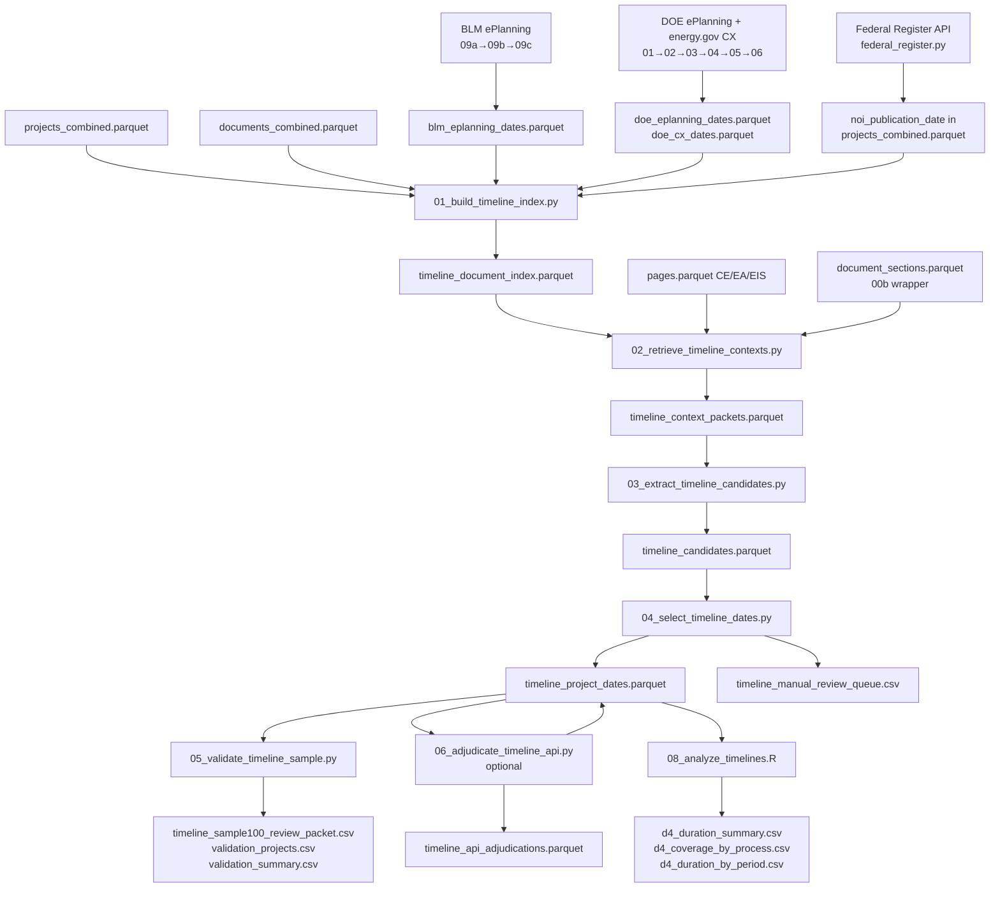

# D4: Project Timelines — Architecture

**Goal:** Extract initiation and decision dates for all NEPA projects in the corpus (CE, EA, EIS), produce a project-level timeline database supporting duration analysis, coverage diagnostics, and regulatory-period comparisons.

**Self-contained:** Partially. The core extraction pipeline (scripts 01–07) requires only `projects_combined.parquet`, `documents_combined.parquet`, and the processed pages/sections files. The Tier A metadata sources (scripts `api/blm_register/09a–09c` and `api/doe_register/01–06`) require network access to BLM ePlanning and energy.gov to build their lookup tables, but those outputs are cached as parquets and do not need to be re-fetched on each pipeline run.

---

## Script Quick-Reference

### Pipeline scripts — `phase2/code/deliverable04/`

Run in numbered order. Scripts 01–07 form the core extraction pipeline; `validation/` scripts are run separately to build and evaluate the gold set.

| Script | What it does |
|---|---|
| `00_sample_timeline_projects.py` | Build the stratified 100-project gold sample (34 CE / 33 EA / 33 EIS, energy-type balanced, seed 20260527) used for validation design. |
| `00b_build_document_sections.py` | Check staleness and rebuild `document_sections.parquet` from the full CE/EA/EIS corpus when missing or stale. |
| `01_build_timeline_index.py` | Join projects, documents, and all Tier A register sources into `timeline_document_index.parquet` with document role scores, appendix flags, and scan priority. |
| `02_retrieve_timeline_contexts.py` | Execute the five-tier retrieval strategy (metadata, page slices, sections, keyword scoring, recovery) and write `timeline_context_packets.parquet`. |
| `03_extract_timeline_candidates.py` | Apply the full date-regex suite to context packets, prelabel each candidate's role (clear_decision, clear_initiation, proxy, review, historical, reject), and write `timeline_candidates.parquet`. |
| `04_select_timeline_dates.py` | Two-pass scoring and selection of best decision and initiation dates per project; writes `timeline_project_dates.parquet` and the manual review queue. |
| `05_validate_timeline_sample.py` | Prepare annotatable review packets from the 100-project sample or run granularity-aware validation against filled gold labels. |
| `05b_export_api_validation.py` | Export projects with any API-sourced Tier A date to a flat CSV for manual spot-checking, with source labels and register URLs. |
| `06_adjudicate_timeline_api.py` | Optional LLM adjudication (Claude Haiku) for projects with missing or conflicting dates; two modes: candidate-packet adjudication and document-recovery. |
| `07_run_full_corpus_timelines.py` | Orchestration wrapper that shards projects by process type and hash bucket, calls scripts 02–04 (and optionally 06), and maintains a run manifest. |
| `08_analyze_timelines.R` | Produce headline duration tables, FRA-breakpoint comparisons, coverage diagnostics, and proxy-sensitivity summaries from the D4 database. |

### Validation scripts — `phase2/code/deliverable04/validation/`

Run once (or after major pipeline changes) to build and evaluate the labeled gold set. Not part of the routine extraction pipeline.

| Script | What it does |
|---|---|
| `01_build_gold_samples.py` | Build stratified gold split definitions (diagnostic, training, enriched) and write per-split CSV and ID files for labeling batches. |
| `02_prepare_gold_review_packets.py` | Create per-batch project-level and candidate-level review CSVs from gold split definitions and current pipeline outputs. |
| `03_import_gold_labels.py` | Validate and import reviewed gold CSVs into normalized Parquet tables under `timeline/gold/`, including inter-rater reliability tables. |
| `04_codex_prelabel_gold_packets.py` | Pre-fill `gold_*` fields in review packet copies from current pipeline outputs so human reviewers only need to verify/correct rather than label from scratch. |

### API data-collection scripts — `phase2/code/api/`

Run once (or when registers are refreshed) to build cached Tier A lookup tables. Network access required; outputs are parquet files that the main pipeline reads without re-fetching.

| Script | What it does |
|---|---|
| `blm_register/01_scan_blm_case_numbers.py` | Scan NEPATEC page text for `DOI-BLM-...` case numbers in BLM projects and write `nepatec_case_evidence.parquet`. |
| `blm_register/02_fetch_blm_register.py` | POST each case number to BLM ePlanning, scrape Start/FONSI/ROD dates from the project page, and write `blm_register_records.parquet` (disk-cached). |
| `blm_register/03_build_blm_dates.py` | Match register records to NEPATEC project IDs and build `blm_eplanning_dates.parquet` with accepted initiation and decision dates. |
| `doe_register/01_scan_doe_doc_numbers.py` | Scan NEPATEC page text for `DOE/EA-NNNN` and `DOE/EIS-NNNN` document numbers and write `doe_case_evidence.parquet`. |
| `doe_register/02_fetch_doe_register.py` | Scrape energy.gov ROD and FONSI listing pages (and EPA EIS database for NOI dates), write `doe_register_records.parquet`. |
| `doe_register/03_fetch_project_pages.py` | Fetch individual energy.gov project pages for doc numbers that the listing-page scrape missed, merge into `doe_register_records.parquet`. |
| `doe_register/04_build_doe_dates.py` | Join DOE case evidence to register lookup and produce `doe_eplanning_dates.parquet` with per-project decision and initiation dates. |
| `doe_register/05_fetch_cx_register.py` | Crawl ~3,558 energy.gov CX determination listing pages (1 req/sec) and write the full `doe_cx_register.parquet` lookup (cx_number → date). |
| `doe_register/06_match_cx_register.py` | Join `cx-NNNNNN.pdf` filenames in NEPATEC CE documents to the CX register via integer match and write `doe_cx_dates.parquet`. |
| `federal_regisiter/federal_register.py` | Fetch Federal Register NOI and NOA records and match them to NEPATEC projects; produces `noi_publication_date` and `noa_availability_date` in `projects_combined.parquet`. |

---

## Data Flow



---

## Inputs

| File | Description |
|---|---|
| `phase2/data/analysis/projects_combined.parquet` | Project metadata including `process_type`, `project_energy_type`, agency, FR fields (`noi_publication_date`, `noi_match_status`, `noi_match_confidence`, `noa_availability_date`, `noa_match_status`) |
| `phase2/data/analysis/documents_combined.parquet` | Cross-source document rollup with harmonized `document_type_clean`, `document_type_category`, `main_document`, `document_date_from_file_name` |
| `phase2/data/processed/ce/pages.parquet` | CE document page text (DuckDB scan only — never `pd.read_parquet`) |
| `phase2/data/processed/ea/pages.parquet` | EA document page text |
| `phase2/data/processed/eis/pages.parquet` | EIS document page text |
| `phase2/data/analysis/document_sections.parquet` | Section-level text with heading titles; rebuilt by `00b_build_document_sections.py` when stale |
| `phase2/data/analysis/blm_register/blm_eplanning_dates.parquet` | BLM ePlanning accepted initiation and decision dates by project_id |
| `phase2/data/analysis/doe_register/doe_eplanning_dates.parquet` | DOE ePlanning FONSI/ROD dates for EA/EIS projects |
| `phase2/data/analysis/doe_register/doe_cx_dates.parquet` | DOE CX determination dates for CE projects, matched via `cx-NNNNNN.pdf` filenames |

---

## Primary Outputs

All analysis parquets are written under `phase2/data/analysis/timeline/`.

| File | Description |
|---|---|
| `timeline_project_dates.parquet` | One row per project: selected initiation and decision dates, granularity, confidence, proxy flags, duration, timeline_status |
| `timeline_candidates.parquet` | One row per date-context candidate: all extracted date evidence with scoring components and role pre-labels |
| `timeline_context_packets.parquet` | One row per retrieved context span: retrieval audit trail with tier, reason, scores |
| `timeline_document_index.parquet` | One row per project-document: document role scores, scan priority, Tier A eligibility flags |
| `timeline_run_manifest.parquet` | One row per run shard: status, row counts, input hashes, timing |
| `gold/timeline_gold_splits.parquet` | Gold sample split definitions for labeling batches |
| `gold/timeline_gold_projects.parquet` | Finalized gold project-level date labels |
| `gold/timeline_gold_candidates.parquet` | Finalized gold candidate-role labels |
| `gold/timeline_gold_candidate_training.parquet` | Training-ready candidate examples with labels |

Figures and tables are written under `phase2/output/deliverable04/`.

---

## Module Architecture

### 00_sample_timeline_projects.py — Balanced Validation Sample

Draws a 100-project stratified sample from `projects_combined.parquet` with quotas of 34 CE / 33 EA / 33 EIS, each process further divided equally across Clean / Fossil / Other energy types. Seed `20260527` is fixed. This sample is used as the calibration set for scripts 05 and 10–13. It reads only project and document metadata — no pipeline outputs — so it is stable across pipeline reruns.

Outputs: `phase2/output/deliverable04/timeline_sample100.csv`, `timeline_sample100_summary.csv`.

### 00b_build_document_sections.py — Section Index Wrapper

Thin D4 wrapper around `phase2/code/extract/build_document_sections.py`. Checks whether `document_sections.parquet` is stale relative to source pages (threshold: 30 days) and rebuilds it over the full CE/EA/EIS corpus when needed. Writes D4-specific section QA diagnostics used by Tier C retrieval.

### 01_build_timeline_index.py — Project-Document Index

Joins `projects_combined.parquet` and `documents_combined.parquet` into a flat project-document index, then merges the three Tier A register outputs (BLM ePlanning, DOE ePlanning, DOE CX). Each document row receives:

**Document role scores** — computed from `DECISION_DOC_SCORES` and `INITIATION_DOC_SCORES` dictionaries that map cleaned document type strings to scores 0–5. Decision top scores: ROD/FONSI/CE determination = 5.0. Initiation top scores: NOI/scoping notice = 4.5–5.0. Scores are taken as `max()` across `document_type_clean`, `document_type`, and `document_title`.

**Main document bonus** — `MAIN_DOC_BONUS = 1.5` added when `is_main_document` is True.

**Appendix penalty** — `APPENDIX_PENALTY_SCORE = 2.5` subtracted when `is_appendix_like` is True. A document is appendix-like when `document_type_category` is in `{appendix, attachment, exhibit, reference, comment}`, or when the title/filename/type matches `APPENDIX_TYPE_RE`. Strong cues (ROD/FONSI/CE determination/NOI language) override the appendix flag.

**Scan priority** — `scan_priority_score = max(decision_score, initiation_score) + main_doc_bonus - appendix_penalty`. Thresholds: `priority_1` (score >= 6 or NOI Tier A eligible), `priority_2` (score >= 3), `priority_3` (score >= 1), `defer` (score <= 0).

**NOI Tier A eligibility** — `noi_tier_a_eligible = True` when `noi_publication_date` is non-null and `noi_match_status` is not in `{unmatched, rejected, low_confidence, missing}` and `noi_match_confidence` is `high`/`medium` or numeric >= 0.75.

The script asserts that all required FR fields exist in `projects_combined.parquet` and raises a `ValueError` with diagnostics if any are missing, preventing silent Tier A candidate drops from field name changes.

### 02_retrieve_timeline_contexts.py — Five-Tier Context Retrieval

Produces `timeline_context_packets.parquet`. Pages are loaded via DuckDB (`read_parquet`) never `pd.read_parquet`, then pre-grouped by `document_id` into a dict for O(1) per-project lookup. Sections are also loaded once per process type via DuckDB with a process-type filter to avoid pulling all process types into RAM.

**Tier A — Structured metadata.** One synthetic packet per eligible source: FR NOI date, BLM ePlanning initiation date, BLM ePlanning decision date, DOE ePlanning initiation date, DOE ePlanning decision date, DOE CX determination date. Each packet has `retrieval_tier = "tier_a"`, `retrieval_score = 5.0`, and `source_tier = "metadata"`. The `retrieval_reason` field encodes the exact source (`blm_register_decision`, `doe_cx_register_decision`, etc.) so downstream prelabeling can assign roles deterministically without reading context text.

**Tier B — Page slices.** For `priority_1` and `priority_2` documents only. CE documents with <= 20 pages: scan all pages (`ce_small_doc_all_pages`). CE documents with 21–50 pages: scan all pages (`ce_expanded_all_pages`). All other documents: first 3 + last 3 pages plus top-3 pages by initiation score and top-3 by decision score. Decision score includes a 2x multiplier for signature-cue matches (`SIGNATURE_CUES`).

**Tier C — Section retrieval.** Sections with `heading_title` matching `DECISION_SECTION_CUES` or `INITIATION_SECTION_CUES` are retrieved; sections matching `NEGATIVE_SECTION_CUES` are skipped. CE documents with <= 20 pages bypass section retrieval entirely (Tier B is sufficient for short CE forms).

**Tier D — Page keyword scoring.** Scores all pages in `priority_1`, `priority_2`, and `priority_3` documents by `INITIATION_CUES` + `DECISION_CUES` matches; takes the top 10 by `retrieval_score`. Deduplicates against Tier B/C by `context_hash`, keeping the higher-tier packet.

**Per-project packet caps:** CE: 25, EA: 75, EIS: 150. When a project exceeds its cap, packets are sorted by tier order then descending retrieval score and trimmed.

Sample runs use isolated output directories (`timeline/sample_runs/<ids_stem>/`) to prevent overwriting full-corpus outputs.

### 03_extract_timeline_candidates.py — Date Extraction and Role Prelabeling

Applies 14 date regex patterns to every context packet's `context_text`. Patterns cover: full month-name (`MDY_full`), abbreviated month-name (`MDY_short`), ordinal day variants, DMY order, numeric slash (2- and 4-digit year), ISO, numeric dash, digital signature (`YYYY.MM.DD`), numeric dot (`M.DD.YY`), month-year (`MY_full`, `MY_short`), and a NEPA case-number year fallback (`nepa_case_year`).

**Granularity rules:** Month-year patterns produce `granularity = "month"` with day set to 1. `nepa_case_year` produces `granularity = "year"` with date normalized to July 1 of the year. All other full-date patterns produce `granularity = "day"`.

**Numeric dot guardrail:** `numeric_dot` (`M.DD.YY`) is only accepted when the surrounding context contains a signature, role title, or approval cue — otherwise version numbers and section numbers produce false hits.

**Exclusion rules:** Future dates, pre-1970 dates (hard reject for CE/EA; soft reject for EIS), legal/statutory citation keywords (`EXCLUSION_KEYWORDS` list of ~30 phrases including "act of 19", "u.s.c.", "public law", "doi:", "isbn"), reject cues (OMB, "form approved", "prepared by", "downloaded", "revision date", "map date").

**Role prelabeling** (`_prelabel_role`): assigns `candidate_role` and `role_confidence` (0–5 scale). Tier A metadata packets are prelabeled deterministically based on `retrieval_reason` — BLM/DOE register sources always produce `clear_decision` or `clear_initiation` with confidence 5.0. For document text: `CLEAR_DECISION_STRONG` and `CLEAR_INITIATION_STRONG` patterns are checked first (confidence 5.0); `HISTORICAL_CUES` and `REJECT_CUES` are checked before medium-strength patterns; `CLEAR_DECISION_MED` and `CLEAR_INITIATION_MED` produce confidence 3.0. `REVIEW_CUES` (environmental specialist, SHPO, Section 106) produce `candidate_role = "review"`. Candidates not matching any cue get `candidate_role = "unknown"` with confidence 1.0.

CE initiator-role field handling: `CE_INITIATOR_ROLE` pattern (`doe initiator`, `nepa initiator`, `action initiating office`) triggers `candidate_role = "clear_initiation"` only when the form-role context is not mixed with decision text.

### 04_select_timeline_dates.py — Scoring and Date Selection

Implements two-pass selection to avoid circular chronology scoring:

**Pass 1 (decision).** Score all `clear_decision` and `proxy_decision` candidates using:
- `source_strength` (0–5): Tier A = 5, page_slice/section = 3, page_keyword = 2
- `role_cue_strength` (0–5): derived from `role_confidence`
- `document_priority`: `DOCUMENT_TYPE_SCORES` dict lookup (ROD/FONSI/CE determination = 5.0; appendix = -2.5)
- `section_priority` (−2 to +3): based on `heading_title` keywords
- `page_priority` (0–3): capped from retrieval score / 3
- `position_signal` (−1 to +1.5): bottom-of-document boost for CE decisions when `position_pct > 0.85`
- `chronology_signal` (−5 to +2): penalties applied in pass 2 only
- `repeated_mention_signal` (0–1): small boost for dates repeated in consistent contexts
- `negative_penalty` (0–8): historical gap flag, strong negative context, `REJECT_CUES`

**Historical gap rule:** For CE and EA, dates that appear before a gap of > 730 days (`GAP_DAYS = 730`) relative to the cluster of dates are flagged `historical_gap_candidate` and have their `negative_penalty` increased. EIS is exempt (`EIS_GAP_EXEMPT = True`) because EIS reviews legitimately span many years.

**Pass 2 (initiation).** Re-score `clear_initiation` and `proxy_initiation` candidates using the selected decision date as a chronology anchor. Dates after the selected decision receive a −5 `chronology_signal` penalty. Best clear initiation before the selected decision is chosen.

**Timeline status** is assigned from the combination of which dates exist, proxy flags, and ordering validity:
- `complete_clear` — both dates non-null, ordered, neither is proxy
- `complete_with_proxy` — both dates non-null, ordered, at least one is proxy
- `missing_initiation` — decision exists, no initiation
- `missing_decision` — initiation exists, no decision
- `missing_both` — neither endpoint
- `invalid_order` — decision before initiation
- `manual_review` — flagged for human resolution

`duration_days` is populated only when both selected dates have `date_granularity == "day"`.

Manual corrections from `timeline_manual_corrections.parquet` are applied after deterministic selection, with `manual_override` added to `timeline_flags`.

### 06_adjudicate_timeline_api.py — Optional LLM Adjudication

Uses Claude Haiku (`claude-haiku-4-5-20251001`) in two modes. **Candidate adjudication** sends compact packets (project title, process type, agency, top 40 candidates with scores and 300–500 char evidence contexts) for projects with missing or conflicting dates. Returned dates must be from the existing candidate set — hallucination guardrail rejects dates not present in the input. **Document recovery** sends top 3–10 page/section chunks (strict token cap) and validates returned dates by re-running the regex parser over the supplied context. All calls are cached by `project_id + context_hash + model`. Outputs update `timeline_project_dates.parquet` and append to `timeline_api_adjudications.parquet`.

### 07_run_full_corpus_timelines.py — Orchestration

Shards all projects by process type and SHA-1 hash bucket (default: 5 shards per process). For each shard, calls scripts 02–04 via subprocess using `--sample-ids` with a temporary shard ID file, with optional `--with-api` flag to also call script 06. Maintains a run manifest with shard status (started / completed / failed), row counts, input file hashes, and timing. Completed shards are skipped on re-runs unless `--force` is passed.

### 10–13 — Gold Set Workflow

Four scripts that form a complete gold-label annotation pipeline:

- **10_build_gold_samples.py** — defines named splits (`diagnostic_balanced_v2`, `train_enriched_v1`, etc.) with quota tables per process/energy stratum; writes `timeline_gold_splits.parquet` and per-split CSV/ID files
- **11_prepare_gold_review_packets.py** — for a named split and batch number, joins current pipeline outputs to produce annotatable project-level and candidate-level review CSVs under `output/deliverable04/gold/review_packets/`
- **13_codex_prelabel_gold_packets.py** — pre-fills `gold_*` columns in review packet copies from the current pipeline's best candidate per project, so reviewers verify rather than label from scratch
- **12_import_gold_labels.py** — validates reviewed CSVs (checks date formats, role enumerations, required fields), writes normalized Parquet tables under `timeline/gold/`, computes inter-rater reliability (`timeline_gold_irr.parquet`), and produces a `reconciliation_queue.csv` for disagreements

### 08_analyze_timelines.R — Duration Analysis

Reads from `timeline_project_dates.parquet` and optionally joins `timeline_document_index.parquet` for burden stratification. Headline analysis uses only `timeline_status == "complete_clear"`. Sensitivity analysis uses `complete_with_proxy`. Required regulatory breakpoints: FRA effective date `2023-08-16`, ARRA `2009-02-17`, BIL `2021-11-15`, IRA `2022-08-16`. Outputs include duration summary, coverage-by-process, duration-by-period, proxy sensitivity, and coverage diagnostics CSVs.

---

## Tier A Metadata Sources

All Tier A sources produce structured date records that bypass document retrieval and are ingested as synthetic context packets with `retrieval_score = 5.0`. They are merged into `timeline_document_index.parquet` by `01_build_timeline_index.py` and emitted as packets by `02_retrieve_timeline_contexts.py`.

### BLM ePlanning (scripts 09a → 09b → 09c)

**Join key:** `DOI-BLM-{ST}-{OFFICE}-{YEAR}-{SEQ}-{TYPE}` case numbers scanned from NEPATEC page text via `BLM_CASE_RE`. OCR confusion between letter O and digit 0 in the office code segment is corrected by `_normalize_case_number`.

**Fetch:** Each case number is POSTed to `https://eplanning.blm.gov/searchresults/` to retrieve a D365 project ID, then the project page is scraped for Start Date, FONSI Date, ROD Date, and Decision Date fields. Responses are cached in `blm_register_cache.json` — re-runs skip already-fetched case numbers. Rate limit: 1.5 seconds between fetches.

**Date selection (09c):** Decision date priority: FONSI → ROD → decision → end_date (proxy). Initiation date: Start Date field when present.

**Coverage (full run 2026-05-29):** BLM initiation dates accepted: 13,854 projects. BLM decision dates accepted: 1,392 projects.

**Output:** `phase2/data/analysis/blm_register/blm_eplanning_dates.parquet`

### DOE CX Register (scripts 05 → 06)

**Source:** energy.gov CX determination listing (`categorical-exclusion-cx-determinations-date`), ~3,558 pages at 10 records each, crawled at 1 req/sec.

**Join key:** The integer in the `cx-NNNNNN.pdf` filename in NEPATEC CE documents matches the same integer in the energy.gov article URL (`cx-NNNNNN-categorical-exclusion-determination`). This is a direct, lossless join — no fuzzy matching. The filename regex `(^|/)cx-[0-9]{4,7}(-|[.]pdf)` excludes BLM-style filenames. Join is executed via DuckDB.

**Coverage (full run 2026-05-29):** 21,169 DOE CE projects matched to determination dates.

**Output:** `phase2/data/analysis/doe_register/doe_cx_dates.parquet`

### DOE ePlanning (scripts 01 → 02 → 03 → 04)

**Join key:** `DOE/EA-NNNN` and `DOE/EIS-NNNN` document numbers scanned from NEPATEC page text. NNSA-prefixed numbers are normalized to `DOE/` prefix. Supplements are handled (e.g. `EIS-0490-SA-01`).

**Sources:** energy.gov ROD listings, FONSI listings, EPA EIS database for NOI dates, and per-document project pages as fallback (script 03 fetches individual pages not resolved by listing scrapes).

**Date selection (04):** Decision priority: FONSI → ROD. Initiation: NOI date from EPA EIS database.

**Coverage (full run 2026-05-29):** 406 DOE EA/EIS projects with accepted dates.

**Output:** `phase2/data/analysis/doe_register/doe_eplanning_dates.parquet`

### Federal Register NOI (federal_register.py)

Fetches Federal Register NOI/scoping notice records via the FR API using seven query strings. Matches notices to NEPATEC projects; match confidence is stored in `noi_match_confidence`. Accepted when `noi_match_status` is not `{unmatched, rejected, low_confidence}` and confidence is `high`/`medium` or >= 0.75.

**Coverage (full run 2026-05-29):** 94 projects with accepted NOI initiation dates.

FR fields land in `projects_combined.parquet` and are treated as opportunistic structured evidence. Sparse match coverage means FR cannot carry the pipeline and is intentionally not the primary initiation source.

---

## Document Retrieval Tiers (Tier B–E)

The five-tier retrieval architecture separates the decision of what text to read (retrieval) from the decision of what those dates mean (extraction and selection). Retrieval is deterministic and auditable via the `retrieval_tier` and `retrieval_reason` fields in every context packet.

**Tier B page-slice logic** prioritizes `priority_1` and `priority_2` documents. The scan depth is process- and document-length-dependent:

| Process | Condition | Pages scanned |
|---|---|---|
| CE | total_pages <= 20 | all pages |
| CE | total_pages 21–50 | all pages |
| CE/EA/EIS | total_pages > 50 | first 3 + last 3 + top-3 by init score + top-3 by dec score |

Signature-block cues (`SIGNATURE_CUES` regex) double the decision page score, pulling bottom-of-document CE approval blocks to the top of the selection.

**Tier C** skips CE documents with <= 20 pages entirely (short CE forms have unreliable headings). For longer documents it only retrieves sections with `heading_title` matching `INITIATION_SECTION_CUES` or `DECISION_SECTION_CUES`. Sections matching `NEGATIVE_SECTION_CUES` (references, bibliography, appendix, table of contents) are skipped before scoring.

**Tier D** scores all pages in `priority_1`, `priority_2`, and `priority_3` documents, then takes the top 10 by composite score. This is a sweep pass that catches high-signal pages missed by Tier B position heuristics.

**Tier E (recovery)** is only triggered for unresolved projects after deterministic selection. It may retrieve from `scan_priority == "defer"` documents — the only tier allowed to do so — and sets `retrieval_reason = "recovery_defer_document"` for auditability.

**Defer-tier EIS projects are a known coverage gap.** EIS projects with many large appendices and no clearly typed main decision document often receive `scan_priority = "defer"` for all their documents because the `decision_doc_score` and `initiation_doc_score` both score near 0. These projects contribute to the 48.1% EIS decision coverage gap. Tier E recovery and manual review are the current remediation path.

---

## Date Extraction and Selection Detail

### Regex Suite

Fourteen patterns are applied in order. Earlier patterns take precedence when the same text span could match multiple patterns. Key non-obvious patterns:

- `numeric_dot` (`M.DD.YY`) is guarded: only accepted when `SIGNATURE_BLOCK_RE` matches nearby text, preventing version-number false positives
- `nepa_case_year` extracts the four-digit year from `DOI-BLM-{ST}-{OFFICE}-{YYYY}-{SEQ}` case numbers as a year-granularity date (normalized to July 1), providing a last-resort proxy for BLM CEs whose only date signal is the header case number
- Month-year patterns (`MY_full`, `MY_short`) produce `date_granularity = "month"` and are stored with day = 1 to avoid falsely treating them as precise day dates

### Role Prelabeling System

Five final roles and two intermediate roles are assigned by `_prelabel_role`:

| Role | Assigned when |
|---|---|
| `clear_decision` | Tier A decision source; or `CLEAR_DECISION_STRONG` pattern matches (FONSI signed, ROD issued, CE determination) |
| `clear_initiation` | Tier A initiation source; or `CLEAR_INITIATION_STRONG` pattern matches (application received, NOI published, scoping began) |
| `proxy_decision` | FEIS/EA publication date language; or filename/title date in a final/decision document |
| `proxy_initiation` | Filename/title date in an initiation-type document |
| `review` | Specialist review roles: `REVIEW_CUES` (environmental specialist, SHPO, Section 106, concurrence date) |
| `historical` | `HISTORICAL_CUES` matches (RMP, LUP, prior ROD, programmatic EIS, old lease) |
| `reject` | `REJECT_CUES` matches (OMB, form approved, prepared by, downloaded, revision date, map date) |

Role confidence uses a 0–5 scale: 5.0 = Tier A or strong pattern; 3.0 = medium pattern; 1.0 = weak/unknown; 0 = reject/historical.

### Scoring Component Summary

| Component | Range | Primary driver |
|---|---:|---|
| `source_strength` | 0–5 | Tier A metadata = 5; page_slice/section = 3; page_keyword = 2 |
| `role_cue_strength` | 0–5 | From `role_confidence` value |
| `document_priority` | −3 to +5 | `DOCUMENT_TYPE_SCORES` dict; ROD/FONSI/CE determination = 5.0; appendix = −2.5 |
| `section_priority` | −2 to +3 | Decision/initiation section headings get boosts; references/bibliography get penalties |
| `page_priority` | 0–3 | Capped from retrieval score / 3 |
| `position_signal` | −1 to +1.5 | Bottom-of-document boost for CE decisions |
| `chronology_signal` | −5 to +2 | Strong penalty for initiation after selected decision |
| `repeated_mention_signal` | 0–1 | Small boost for consistent repeated mentions only |
| `negative_penalty` | 0–8 | Historical gap flag; strong negative context; reject cues dominate weak positive scores |

---

## Run Results

<!-- d4-run-results: pull this section into the D4 report -->

Full corpus run completed 2026-05-29. All 61,881 projects in `projects_combined.parquet` (process_type in CE, EA, EIS; no energy-type filter).

### Pipeline Volume

| Stage | Count |
|---|---:|
| Total projects | 61,881 |
| Projects with context packets | 60,922 |
| Total context packets | 219,348 |
| Total date candidates | 332,226 |
| Projects with no candidates | 10,237 |
| Projects with dates in output | 51,644 |

### Decision Date Coverage

| Process | Projects | Decision coverage | Real (day/month) | Year-proxy only |
|---|---:|---:|---:|---:|
| CE | — | 77.8% | 57.5% real day + 20.3% proxy year | 20.3% |
| EA | — | 89.5% | 81.8% real day | 7.7% |
| EIS | — | 48.1% | 47.3% real day | 0.8% |

"Real (day/month)" decisions are those with `decision_date_granularity` of `day` or `month`. Year-proxy decisions use the NEPA case-number year fallback (`nepa_case_year` pattern) as a last-resort year-only estimate.

### Tier A Metadata Source Contributions

| Source | Projects with accepted dates |
|---|---:|
| BLM initiation (ePlanning) | 13,854 |
| DOE CX determination | 21,169 |
| BLM decision (ePlanning) | 1,392 |
| DOE ePlanning (EA/EIS) | 406 |
| Federal Register NOI | 94 |

### Year-Proxy Count

11,348 projects have a decision date with `date_granularity = "year"` — these are NEPA case-number year proxies used as last-resort estimates for CE projects whose document text yielded no clearer date. These are included in coverage counts above but flagged with `proxy_decision = True` and excluded from headline duration calculations.

---

## Output Schema

### timeline_project_dates.parquet

| Column | Type | Description |
|---|---|---|
| `project_id` | object | Primary key |
| `process_type` | object | CE, EA, or EIS |
| `initiation_date` | object (date) | Selected initiation date, nullable |
| `initiation_date_granularity` | object | `day`, `month`, `year`, or `unknown` |
| `initiation_source_type` | object | Source label: `noi_notice`, `application_received`, `scoping_notice`, `form_initiator_field`, `blm_register`, `doe_register`, `fr_noi`, etc. |
| `initiation_confidence` | object | `high`, `medium`, `low`, or `missing` |
| `initiation_is_proxy` | bool | True for sensitivity-only dates |
| `initiation_evidence_text` | object | Short evidence snippet |
| `initiation_document_id` | object | Source document id, nullable |
| `initiation_page_number` | object | Source page number, nullable |
| `decision_date` | object (date) | Selected decision date, nullable |
| `decision_date_granularity` | object | `day`, `month`, `year`, or `unknown` |
| `decision_source_type` | object | Source label: `ce_determination`, `fonsi`, `rod`, `decision_record`, `doe_cx_register`, `blm_register`, `nepa_case_year`, etc. |
| `decision_confidence` | object | `high`, `medium`, `low`, or `missing` |
| `decision_is_proxy` | bool | True for sensitivity-only dates |
| `decision_evidence_text` | object | Short evidence snippet |
| `decision_document_id` | object | Source document id, nullable |
| `decision_page_number` | object | Source page number, nullable |
| `duration_days` | float64 | `decision_date - initiation_date`; NULL unless both dates have `granularity = "day"` |
| `timeline_status` | object | `complete_clear`, `complete_with_proxy`, `missing_initiation`, `missing_decision`, `missing_both`, `invalid_order`, `manual_review` |
| `timeline_flags` | object | Pipe-delimited diagnostics: `non_day_granularity`, `proxy_decision`, `proxy_initiation`, `same_day`, `duration_gt_25y`, `missing_initiation`, `fr_noi_selected`, `api_adjudicated`, `manual_override`, etc. |
| `timeline_run_at` | object | ISO-8601 UTC run timestamp |

### timeline_candidates.parquet (key columns)

| Column | Type | Description |
|---|---|---|
| `candidate_id` | object | SHA-1 hash of project/document/page/date/context |
| `project_id` | object | Join key |
| `process_type` | object | CE, EA, EIS |
| `document_id` | object | Source document, nullable |
| `page_number` | object | Source page, nullable |
| `retrieval_tier` | object | `tier_a` through `tier_e` |
| `source_tier` | object | `metadata`, `page_slice`, `section`, `page_keyword`, `recovery` |
| `candidate_source_type` | object | Semantic source: `ce_determination`, `fonsi`, `application_received`, etc. |
| `raw_date_text` | object | Matched date string from regex |
| `parsed_date` | object (date) | Normalized date value |
| `date_granularity` | object | `day`, `month`, `year`, `unknown` |
| `context_text` | object | Bounded evidence context |
| `candidate_role` | object | `clear_decision`, `clear_initiation`, `proxy_decision`, `proxy_initiation`, `review`, `historical`, `reject`, `unknown` |
| `role_confidence` | float64 | 0–5 confidence scale |
| `ranking_score` | float64 | Final composite score used by selector |
| `selected_for_decision` | bool | True when chosen as decision evidence |
| `selected_for_initiation` | bool | True when chosen as initiation evidence |
| `is_proxy` | bool | True when candidate is proxy evidence |
| `positive_cue_flags` | object | Comma-separated positive cue labels |
| `negative_cue_flags` | object | Comma-separated negative cue labels |
| `created_at` | object | Extraction timestamp |

---

## Known Issues and Cautions

- **EIS decision coverage gap (48.1% vs Phase 1 75.2%).** Root cause: two compounding factors. First, many EIS projects have all documents scored as `scan_priority = "defer"` because no document title or type matches the decision or initiation score dictionaries (e.g., numbered EIS volumes without explicit type labels). These projects receive no Tier B/C/D retrieval. Second, the current pipeline uses regex candidate extraction rather than the fine-tuned BERT model used in Phase 1. Tier E recovery is the near-term remediation path; better EIS document type classification in `01_build_timeline_index.py` is the longer-term fix.

- **Year-proxy dates (11,348 projects).** These are CE projects where the only date evidence is the NEPA case-number year extracted by the `nepa_case_year` pattern (e.g. `DOI-BLM-WY-P070-2019-0035-CX` → year 2019, stored as 2019-07-01, `date_granularity = "year"`). They are counted in decision coverage but flagged `proxy_decision = True` and excluded from `duration_days`. Do not include these in headline duration analysis without explicit sensitivity framing.

- **10,237 projects with zero candidates.** These projects have context packets (most have 60,922 packets covering them) but no date regex matches survived filtering. Primary causes: documents containing only images/scanned PDFs with no OCR text, very short CE memos with no dates in the scanned text, and documents where all dates were excluded by legal/statutory citation filters. Manual review or Tier E document-recovery API calls are needed for high-priority cases.

- **Confidence calibration not yet validated.** The `*_confidence` fields (`high`, `medium`, `low`) are assigned by deterministic rules based on source tier and role cue strength; they have not been validated against a gold label set. Gold labels from scripts 10–13 are needed before these fields should be used as quality gates.

- **CE initiation coverage is intentionally low.** Clear initiation evidence is structurally rare in CE documents. DOE CE forms sometimes contain an initiator role field, but the date is often a worksheet date or review date rather than a federal application-received date. Per plan §5, missing CE initiation is a valid outcome and should not be imputed. CE `complete_clear` duration rows are potentially selective for longer, more documented projects.

- **`duration_days` NULL when granularity is not `day`.** Per the plan precision rule, `duration_days` is NULL for any project where either date has `granularity` of `month`, `year`, or `unknown`. The `non_day_granularity` flag is set in `timeline_flags` for these rows. Analysis scripts must not silently convert NULL durations to zero.

- **Join caution on `timeline_document_index.parquet`.** The index has one row per project-document pair. Burden fields (`project_doc_count`, `total_pages`, `max_document_pages`) are denormalized onto every row. Always deduplicate on `project_id` before computing project-level summaries.

- **BLM ePlanning OCR O/0 confusion.** The case-number normalizer in `09a` corrects O↔0 confusion in office codes, but false normalizations are possible for unusual office code patterns. Check `blm_manual_review.csv` for projects flagged during the matching step.

---

## Methodological Notes

**Why separate retrieval from extraction?** Prior Phase 1 BERT/LLM approaches made the text selection and date interpretation steps opaque — the model received a context window and returned a date with no intermediate audit trail. The Phase 2 design writes explicit context packets (`timeline_context_packets.parquet`) and explicit candidates (`timeline_candidates.parquet`) so every selected date can be traced to its source tier, retrieval reason, evidence text, and scoring components. This is essential for debugging coverage gaps and for building gold labels that can improve future iterations.

**Why no BERT in the production path?** BERT fine-tuning is appropriate when the bottleneck is label quality (enough examples exist but they need accurate labels). Phase 2 prioritizes a deterministic baseline that can be fully audited and reproduced before adding a classifier layer. Per plan §6: a classifier should only be adopted if gold-label validation shows it improves precision/recall beyond deterministic scoring. SetFit is explicitly ruled out for timeline date classification (label quality problem, not data scarcity).

**Why NEPA case-number year proxies?** BLM CE case numbers (`DOI-BLM-WY-P070-2019-0035-CX`) embed the fiscal year in a fixed position. For CE projects with no other date signal, this year is the only deterministic evidence available without fetching the BLM ePlanning register. The `nepa_case_year` pattern preserves these as year-granularity proxies rather than dropping the project from all coverage, while `date_granularity = "year"` and `proxy_decision = True` ensure they cannot silently contaminate headline duration calculations.

**Why DOE CX filename matching is the primary DOE CE source?** The `cx-NNNNNN.pdf` → energy.gov `cx-NNNNNN` match is a lossless join requiring no text matching, fuzzy logic, or confidence scoring. The resulting 21,169 matched projects have `role_confidence = 5.0` and `candidate_role = "clear_decision"`. This is why DOE CE decision coverage is substantially higher than BLM CE coverage in the current run.

**Why BLM initiation coverage (13,854) is high but BLM decision coverage (1,392) is low.** BLM ePlanning reliably stores a project "Start Date" corresponding to the application or review initiation. Decision dates (FONSI, ROD) are populated less consistently — many BLM EA projects in ePlanning are in-progress or have decision dates in fields the scraper does not reach. This asymmetry is expected and reflects BLM ePlanning data quality, not a pipeline bug.

**FRA breakpoint (2023-08-16).** Duration analysis must report pre/post breakpoints at this CEQ final rule effective date. `08_analyze_timelines.R` implements `FRA_CUT_DATE <- as.Date("2023-08-16")` as the primary regulatory breakpoint. Do not use the proposed-rule date or any other proxy date for the FRA cutoff.

---

## Validation and Gold Set

Scripts 10–13 implement a structured multi-pass gold-labeling workflow. The workflow is:

1. `10_build_gold_samples.py` — define named splits with process/energy stratification
2. `11_prepare_gold_review_packets.py` — export per-batch CSVs with current pipeline outputs pre-populated
3. `13_codex_prelabel_gold_packets.py` — auto-fill `gold_*` fields from best pipeline candidates (for reviewer efficiency)
4. Human reviewer fills or corrects gold columns in the CSV
5. `12_import_gold_labels.py` — import, validate, and normalize into `timeline/gold/` Parquet tables; produces inter-rater reliability report and reconciliation queue for disagreements

The `05_validate_timeline_sample.py` script operates on the original 100-project stratified sample from script 00. In `--prepare-review` mode it writes an annotatable review packet; in `--validate` mode it computes granularity-aware match statistics against filled gold labels using the acceptance thresholds:

- Decision precision >= 95% for CE, EA, and EIS
- Clear initiation precision >= 90% for EA/EIS; >= 85% for CE
- Invalid-order rate < 2%

As of 2026-05-29, no gold labels have been reviewed; confidence calibration is pending.

---

## Reproduction

Full corpus run sequence (after Tier A register tables are built):

```bash
# Tier A — BLM ePlanning (run once; re-run only when NEPATEC BLM projects change)
conda run -n nepa python phase2/code/api/blm_register/09a_scan_blm_case_numbers.py
conda run -n nepa python phase2/code/api/blm_register/09b_fetch_blm_register.py
conda run -n nepa python phase2/code/api/blm_register/09c_build_blm_dates.py

# Tier A — DOE ePlanning (run once; re-run when NEPATEC DOE EA/EIS projects change)
conda run -n nepa python phase2/code/api/doe_register/01_scan_doe_doc_numbers.py
conda run -n nepa python phase2/code/api/doe_register/02_fetch_doe_register.py
conda run -n nepa python phase2/code/api/doe_register/03_fetch_project_pages.py
conda run -n nepa python phase2/code/api/doe_register/04_build_doe_dates.py

# Tier A — DOE CX (run once; ~60 min full crawl; re-run when energy.gov CX list changes)
conda run -n nepa python phase2/code/api/doe_register/05_fetch_cx_register.py
conda run -n nepa python phase2/code/api/doe_register/06_match_cx_register.py

# Section index (rebuild if stale)
conda run -n nepa python phase2/code/deliverable04/00b_build_document_sections.py

# Document index (run after any register source changes)
conda run -n nepa python phase2/code/deliverable04/01_build_timeline_index.py

# Full corpus extraction (sharded, resumes from completed shards)
conda run -n nepa python phase2/code/deliverable04/07_run_full_corpus_timelines.py --process CE EA EIS --shards 5

# Optional: API adjudication for unresolved EA/EIS
conda run -n nepa python phase2/code/deliverable04/07_run_full_corpus_timelines.py --with-api --process EA EIS

# Spot-check API-sourced dates
conda run -n nepa python phase2/code/deliverable04/05b_export_api_validation.py

# Duration analysis
Rscript phase2/code/deliverable04/08_analyze_timelines.R
```

Sample run (100-project validation sample):

```bash
conda run -n nepa python phase2/code/deliverable04/01_build_timeline_index.py --sample-ids phase2/output/deliverable04/timeline_sample100_ids.txt
conda run -n nepa python phase2/code/deliverable04/02_retrieve_timeline_contexts.py --sample-ids phase2/output/deliverable04/timeline_sample100_ids.txt
conda run -n nepa python phase2/code/deliverable04/03_extract_timeline_candidates.py --sample-ids phase2/output/deliverable04/timeline_sample100_ids.txt
conda run -n nepa python phase2/code/deliverable04/04_select_timeline_dates.py --sample-ids phase2/output/deliverable04/timeline_sample100_ids.txt
conda run -n nepa python phase2/code/deliverable04/05_validate_timeline_sample.py --prepare-review
```
