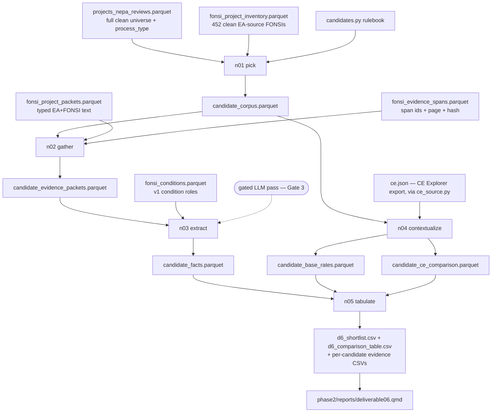

# D6: Patterns in FONSIs — Architecture (v2, Narrow-First)

**Goal:** Identify a small, defensible shortlist of recurring clean-energy action
categories in prior EAs/FONSIs that may warrant CATF, policy, and legal review
for new or expanded categorical exclusions (CEs). For each candidate: a crisp
action definition, evidence it recurs with no significant impact, the recurring
bounding limits, whether findings depend on case-specific mitigation, whether an
existing CE already covers it, and traceable citations.

**Status:** v2 narrow-first pipeline built and running (deterministic pass). The
LLM extraction pass is wired but gated (Gate 3). Outputs are review materials,
not legal-sufficiency determinations. Supersedes the v1 full-corpus
opportunity-scan architecture; the v1 scripts remain in place but are not
orchestrated. Forward plan: `phase2/plans/deliverable06_updates.md` (the v2.2
build plan is archived at `plans/_archived/deliverable06_v2.2_build_plan.md`).

---

## Plain-language summary (for clients)

We start from clean-energy projects whose environmental review **ended in a
Finding of No Significant Impact (FONSI)** — i.e., the agency did a full
Environmental Assessment (EA) and concluded the project would not significantly
harm the environment. A FONSI is strong evidence that an action *category* may be
a good candidate for a categorical exclusion (a class of actions agencies may
approve without a full EA/EIS).

The pipeline does five things:

1. **Picks** the candidate action categories (transmission upgrades, geothermal
   exploration, solar, temporary resource assessment) and gathers each one's
   FONSI projects.
2. **Gathers** the relevant text for each project from its EA and FONSI
   documents.
3. **Extracts** the facts that matter for a CE: what the action is, its size
   limits (acres, miles, megawatts), siting constraints ("within existing
   right-of-way," "no new roads"), and whether the no-impact finding leaned on
   project-specific mitigation.
4. **Contextualizes** each category with base rates — how often this kind of
   action goes the quick route (CE), the medium route (EA→FONSI), or the full
   route (EIS) — so we can see whether it rarely triggers significant impacts.
5. **Tabulates** a ranked shortlist, one comparison table, and per-category
   evidence with citations for CATF to review.

The output is a *starting point* for discussion, not a legal determination. CATF
reviews it and tells us which categories to pursue in depth.

---

## What the corpus is (and is not)

**Deep-extraction corpus = clean-energy, EA-source FONSI projects (452).** These
are projects where NEPATEC's `document_type_clean = "FONSI"` (excluding RODs),
restricted to EA-source records, with one canonical FONSI chosen per project
(v1's `01_build_fonsi_inventory.py`). A FONSI is the *decision* that concludes an
EA, so mining "FONSI projects" means mining the **EA analysis plus its FONSI**.

The text we analyze is drawn from three document roles per project (v1 section
manifest): **canonical FONSI + linked EA(s) + supporting FONSI**. So we are
reading the EAs, not just the one-page finding.

**EIS and CE projects are context, not deep-mined.**

- An **EIS** means the agency found *significant* impact — the opposite of a CE
  candidate. We do not deep-extract EIS text; instead we **count** EIS projects
  in each candidate's base-rate denominator to show how often the action
  escalates to a full EIS (a survivorship-bias guard).
- A **CE** means the action was *already* categorically excluded. We count CE
  projects in the denominator too (evidence the action is sometimes already
  CE'd), but their document text is sparse.

So: **EA/FONSI = evidence; EIS + CE = base-rate context.** This is the right
shape for CE development — we look at what got a FONSI, and we measure how often
the same action category goes the other routes.

---

## Script quick-reference

Pipeline scripts live under `phase2/code/deliverable06/` (prefix `n` = v2).

| Script | Plain-language role | What it does |
|---|---|---|
| `candidates.py` | the rulebook | Versioned candidate categories + membership/subtype rules + the storage scan config. |
| `n01_select_candidate_corpus.py` | **pick** | Assigns projects to candidate categories (tech_group + keyword rules), splits subtypes, runs the resource-assessment prevalence + de-overlap screen and the storage-deployment scan. |
| `n02_assemble_candidate_evidence.py` | **gather** | Pulls each candidate FONSI's typed text from the existing packets + span-level provenance from the evidence spans. |
| `n03_extract_candidate_facts.py` | **extract** | Deterministic regex for numeric limits + siting constraints; mitigation-dependence reused from v1 conditions; gated LLM pass (Gate 3). |
| `n04_base_rates_and_ce.py` | **contextualize** | Three base-rate counts per candidate; lexical CE-Explorer comparison (ranking aid, all pending verification). |
| `n05_build_report_tables.py` | **tabulate** | Shortlist, comparison table, per-candidate evidence CSVs, multi-category overlap. |
| `n06_benchmark_models.py` | **benchmark** | Runs the production prompt through Haiku/Sonnet/Opus on a small sample to find the lowest model that clears the accuracy bar. Calls the paid API; **not** in `_run.py`. |
| `_run.py` | orchestrator | Runs `n01`→`n05`; `--use-llm` enables the Gate-3 LLM pass (default model: Sonnet). |

---

## Data flow



---

## Inputs (all read-only; reused from v1 + D3)

| File | Role |
|---|---|
| `deliverable06/fonsi_project_inventory.parquet` | The 452 clean EA-source FONSI projects (canonical selection). |
| `deliverable03/projects_nepa_reviews.parquet` | Full clean universe + `process_type` for base-rate denominators. |
| `deliverable06/fonsi_project_packets.parquet` | Per-project typed text (action/finding/resource/condition/boundary), drawn from EA+FONSI documents. |
| `deliverable06/fonsi_evidence_spans.parquet` | Span-level provenance: `section_id`, `evidence_span_id`, `source_span_sha256`, page. |
| `deliverable06/fonsi_conditions.parquet` | v1 condition roles/obligations — reused for the (preliminary) mitigation signal. |
| `notes/deliverable06/ce.json` | **Canonical existing-CE source** — CE Explorer export (v2.0.0, 2025-08-07), loaded via `ce_source.py`. Replaces the v1 parquet snapshot / live fetch; rendered to `ce_catalog_extracted.md` by `extract_ce_catalog.py`. (The CEQ government-wide xlsx was removed in favor of this structured source.) |
| `deliverable03/ce_citations.parquet` | Project-level CE-use evidence. |

## Outputs

| File | Description |
|---|---|
| `deliverable06/candidate_corpus.parquet` | One row per (project, candidate) over universe + observed FONSIs, with subtype, process_type, is_fonsi, is_profile_subtype. |
| `deliverable06/candidate_evidence_packets.parquet` | Per-project typed text + span provenance for candidate FONSIs. |
| `deliverable06/candidate_facts.parquet` | Per (project, candidate): action definition, capped numeric limits, siting booleans, mitigation dependence, citation. |
| `deliverable06/candidate_base_rates.parquet` | Three base-rate counts per candidate. |
| `deliverable06/candidate_ce_comparison.parquet` | Lexical-ranked CE matches (all `manual_verification_status = pending`). |
| `output/deliverable06/d6_shortlist.csv` | Ranked candidate shortlist + recommendation. |
| `output/deliverable06/d6_comparison_table.csv` | Single at-a-glance comparison. |
| `output/deliverable06/d6_candidate_evidence_<cat>.csv` | Representative profile projects with cited limits. |
| `output/deliverable06/candidate_membership_review.csv` | Gate 2 membership QA packet. |
| `output/deliverable06/candidate_storage_scan_review.csv` | Non-manufacturing storage-deployment hits (Gate 2 evidence). |

---

## Key design decisions

- **Narrow-first.** Choose candidates up front and deep-extract only those
  (20–150 FONSIs each — small enough to read and to LLM affordably). Trust comes
  from small N + verification, not a big pipeline. (See the plan's "Why we are
  changing direction.")
- **Reuse, don't rebuild.** The corpus inventory and the EA+FONSI section
  extraction are read-only inputs from v1. The existing-CE source is the
  committed `ce.json` (CE Explorer), loaded via `ce_source.py` — no live fetch,
  no parquet snapshot. No shared `extract/*` module is modified — keeps D6
  self-contained and clear of the D4 refactor.
- **Three explicit base-rate counts**, never one ambiguous "share": universe by
  process type, candidate EA projects, observed EA-source FONSI projects.
- **Deterministic first, LLM gated.** The deterministic pass runs now and is
  reproducible; the LLM pass (Gate 3) refines action definitions, limit
  selection, and the mitigation determination once benchmarked.
- **Provenance throughout.** Every fact carries document/section/span IDs + a
  hash; CE matches are ranking aids left pending manual verification; audit
  timestamps (`*_extraction_run_at` always, `*_llm_run_at` only on success, else
  `""`) match the rest of the pipeline.

---

## Model selection & cost (Gate 3)

The LLM extraction pass (`n03 --use-llm`) is the lever for the subtle fields
(action definition, mitigation-dependence, extraordinary circumstances). The
deterministic pass already handles the easy fields (acres, miles, MW, siting
booleans), so model choice is about quality on the *hard* fields, not cost —
the whole job is a rounding error.

Per call ≈ 1,650 input + ~400 output tokens. Pricing per 1M tokens (claude-api
reference, cached 2026-05-26 — verify before relying on it):

| Model | Input | Output | ~per call | All candidates (293) | Full corpus (452) |
|---|---:|---:|---:|---:|---:|
| `claude-haiku-4-5` | $1 | $5 | ~$0.004 | ~$1.05 | ~$1.65 |
| `claude-sonnet-4-6` (default) | $3 | $15 | ~$0.011 | ~$3.20 | ~$4.95 |
| `claude-opus-4-8` | $5 | $25 | ~$0.018 | ~$5.35 | ~$8.25 |

The **Batch API halves** all of these (async, fine for this non-interactive job).

**Default: Sonnet 4.6** (the workhorse), escalate to **Opus 4.8** where the
benchmark shows nuance gaps; Haiku only if the benchmark confirms it suffices.
Don't guess — run `n06_benchmark_models.py` on a labeled sample to pick the
**lowest model that clears the accuracy threshold** (default 0.90). It runs the
exact production prompt through all three, writes a side-by-side comparison and a
measured cost table, and (with `--gold`) scores each model to recommend the
cheapest sufficient one.

## Current status & known limitations

- **Extraction is deterministic** (LLM pass gated). After the n03 improvements:
  acreage and miles are disturbance-context-aware (prefer the footprint over
  planning-area totals); `action_definition` requires an action verb and skips
  chapter/figure headers; well counts recover spelled-out numbers ("twelve
  wells"); membership keyword rules now split `other_transmission` (63 → 21,
  with 9 off-scope misclassifications flagged) and fix solar `gen_tie`
  over-capture. **Still use medians, not maxes**, and treat `action_definition`
  as improved-but-imperfect until the LLM pass runs.
- **Mitigation-dependence is preliminary**, reused from v1 conditions (~51%
  "uncertain"). A minor supporting signal, not a headline. Validate at Gate 3.
- **Extraordinary-circumstances field is a *mention scan*** (canonical CE-gating
  categories only), not a determination that the resource is present AND
  impacted — that requires the LLM.
- **CE comparison is lexical + embedding ranked, unverified** — a ranking aid
  only; never decides coverage.
- **NEPATEC "Clean + Transmission" tagging is noisy** — the `off_scope_misclassified`
  subtype surfaces non-clean projects (nuclear demo, gas plant, mining, an
  appliance-efficiency standard) that leaked into the clean-transmission corpus.

---

## Open gates / next steps

1. **Gate 2** — review `candidate_membership_review.csv` and tighten `n01` rules.
2. **Gate 3** — benchmark models with `n06_benchmark_models.py` to pick the
   lowest sufficient model, then run + validate the LLM pass (`_run.py --use-llm`,
   default Sonnet) to firm up action definitions, mitigation dependence, and the
   extraordinary-circumstances determination.
3. **CE verification** — manually verify the top CE-Explorer matches.
4. **Report** — draft `phase2/reports/deliverable06.qmd` with the plain-language
   summary above + the shortlist/comparison/evidence; present to CATF (Gate 4).

---

## Runbook

```bash
# deterministic Stage A (runs now)
CONDA_DEFAULT_ENV=nepa /opt/anaconda3/envs/nepa/bin/python phase2/code/deliverable06/_run.py

# with the gated LLM pass (Gate 3; needs ANTHROPIC_API_KEY)
CONDA_DEFAULT_ENV=nepa /opt/anaconda3/envs/nepa/bin/python phase2/code/deliverable06/_run.py --use-llm
```
