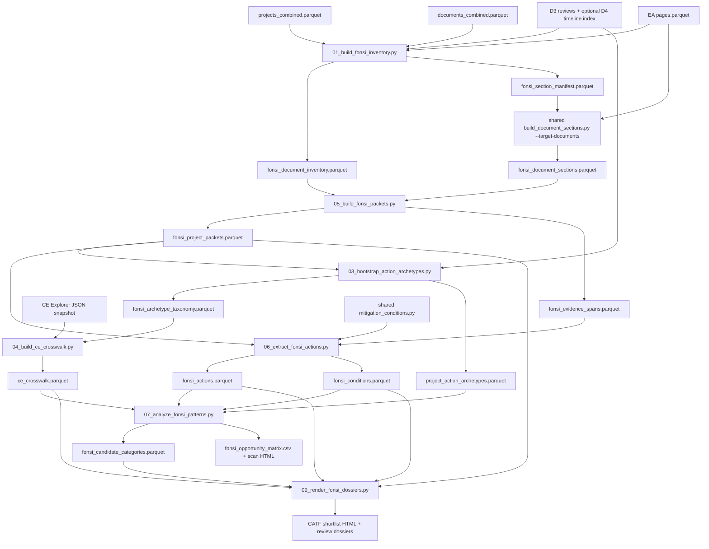

# D6: Patterns in FONSIs - Architecture

**Goal:** Identify recurring categories of actions in prior EAs and FONSIs that
may warrant CATF, policy, and legal review for categorical exclusion (CE)
development. Preserve project-level evidence, repeated limitations, condition
roles, comparison-case base rates, and existing-CE retrieval links.

**Status:** Stage A pipeline implemented and run on June 2, 2026. The outputs
are review materials, not legal sufficiency determinations. Manual inventory,
taxonomy, condition-role, and CE-crosswalk review gates remain open before any
candidate advances to Stage B substantiation.

**Self-contained:** Partially. The corpus pipeline reads local Phase 2 parquet
artifacts. The CE crosswalk fetches a dated snapshot from CE Explorer when a
local snapshot is not supplied. CE Explorer is a discovery source; final
dossiers must verify matches against canonical agency materials.

---

## Script Quick-Reference

Pipeline scripts live under `phase2/code/deliverable06/`.

| Script | What it does |
|---|---|
| `01_build_fonsi_inventory.py` | Build the role-aware FONSI inventory, exact-text hashes, canonical EA-source FONSIs, linked-EA section manifest, and stratified document-role QA sample. |
| `03_bootstrap_action_archetypes.py` | Build the versioned seed taxonomy and apply multi-label project-archetype assignments across the BLM/DOE clean-energy CE, EA, and EIS comparison universe. Rerun after packets exist to upgrade text-supported assignments. |
| `04_build_ce_crosswalk.py` | Fetch or reuse the dated CE Explorer JSON snapshot, normalize CE descriptions, and rank lexical plus `all-MiniLM-L6-v2` retrieval candidates for manual review. |
| `05_build_fonsi_packets.py` | Build typed project evidence packets from the D6 section artifact, with bounded canonical-FONSI page fallbacks where headings do not yield usable spans. |
| `06_extract_fonsi_actions.py` | Extract project action descriptions, common scales and road constraints, and shared D2/D6 condition rows. |
| `07_analyze_fonsi_patterns.py` | Produce base rates, limitation summaries, condition dependence measures, review gates, heuristic tiers, and the Stage A opportunity matrix. |
| `08_topic_model_diagnostics.py` | Optional project-level TF-IDF/NMF diagnostic. Topics suggest taxonomy revisions; they do not define candidate CEs. |
| `09_render_fonsi_dossiers.py` | Render the CATF shortlist and one review dossier per seed category. |
| `_run.py` | Orchestrate the Stage A pipeline, including the post-packet taxonomy rerun and optional NMF diagnostic. |

Shared code:

| Script | What it does |
|---|---|
| `phase2/code/extract/build_document_sections.py` | Existing reusable section parser, extended with `--target-documents` allowlist mode. Existing D3/D4 behavior is unchanged when the flag is absent. |
| `phase2/code/extract/mitigation_conditions.py` | Shared D2/D6 deterministic condition extractor, resource-area taxonomy, optional bounded LLM classification, D2 rollup helper, and D6 project helper. |

---

## Data Flow



---

## Inputs

| File | Description |
|---|---|
| `phase2/data/analysis/projects_combined.parquet` | Project metadata, source process, agency, geography, and project-energy type. |
| `phase2/data/analysis/documents_combined.parquet` | Cross-source document inventory with cleaned FONSI and EA labels. |
| `phase2/data/analysis/deliverable03/projects_nepa_reviews.parquet` | D3-derived `energy_group`, `tech_group`, process, and agency fields. |
| `phase2/data/analysis/deliverable03/ce_citations.parquet` | Project-level CE citation evidence used where normalized CE codes match. |
| `phase2/data/processed/ea/pages.parquet` | EA-source page text. Large scans use DuckDB. |
| `phase2/data/analysis/timeline/timeline_document_index.parquet` | Optional D4 decision-date provenance. The inventory runs without it. |
| `https://ce.permitting.innovation.gov/data/exclusions.json` | CE Explorer JSON export, stored as a dated local snapshot before matching. |

---

## Primary Outputs

Analysis parquets are written under `phase2/data/analysis/deliverable06/`.

| File | Description |
|---|---|
| `fonsi_document_inventory.parquet` | One row per cleaned FONSI document with source, role, text hash, duplicate flags, canonical score, and optional date provenance. |
| `fonsi_project_inventory.parquet` | One row per EA-source project with its selected canonical FONSI. |
| `fonsi_section_manifest.parquet` | Explicit allowlist of canonical FONSIs, selected supporting FONSIs, and linked main EAs for targeted section parsing. |
| `fonsi_document_sections.parquet` | D6-specific shared-parser output. Does not overwrite the general section index. |
| `fonsi_archetype_taxonomy.parquet` | Versioned seed taxonomy with candidate versus comparison-diagnostic scope. |
| `project_action_archetypes.parquet` | Multi-label CE/EA/EIS project assignments with primary label, method, and confidence. |
| `ce_explorer_snapshot.parquet` | Normalized CE Explorer snapshot with official source URL, source version, retrieval timestamp, and content SHA-256. |
| `ce_crosswalk.parquet` | Ranked CE retrieval candidates. Similarity is a ranking aid, not a coverage decision threshold. |
| `fonsi_project_packets.parquet` | One evidence packet per canonical EA-source FONSI project. |
| `fonsi_evidence_spans.parquet` | Typed, traceable source spans for actions, findings, resources, conditions, boundaries, and bounded fallbacks. |
| `fonsi_actions.parquet` | Project action descriptions and deterministic scale or road-constraint fields. |
| `fonsi_conditions.parquet` | Deduplicated shared condition rows with roles, obligations, resource areas, source hashes, and extraction provenance. |
| `fonsi_candidate_categories.parquet` | Stage A opportunity rows with base rates, gates, heuristic assessments, CE retrieval links, and representative project IDs. |
| `fonsi_topic_assignments.parquet` | Optional NMF topic assignments. |

Review outputs are written under `phase2/output/deliverable06/`.

| File | Description |
|---|---|
| `fonsi_document_role_review.csv` | Stratified inventory QA packet. |
| `fonsi_archetype_review.csv` | Seed-taxonomy representative projects. |
| `ce_crosswalk_review.csv` | Ranked CE retrieval candidates for manual verification. |
| `fonsi_extraction_review.csv` | Action and condition-count QA packet. |
| `fonsi_opportunity_matrix.csv` | Full CATF-facing Stage A matrix. |
| `fonsi_opportunity_scan.html` | Compact HTML scan. |
| `fonsi_candidate_shortlist.html` | Four-candidate review shortlist. |
| `dossiers/*.html` | One Stage A review dossier for each seed category. |

---

## Corpus Snapshot

The June 2, 2026 production run produced:

| Artifact | Rows |
|---|---:|
| FONSI documents across sources | 2,839 |
| EA-source canonical FONSI projects | 2,463 |
| Target section-manifest documents | 6,080 |
| D6 document sections | 112,820 |
| Seed archetypes | 14 |
| Project-archetype assignments | 43,532 |
| CE Explorer records | 2,105 |
| Ranked CE crosswalk rows | 140 |
| Project evidence packets | 2,463 |
| Typed evidence spans | 110,570 |
| Structured action rows | 2,463 |
| Deduplicated condition rows | 70,802 |
| Candidate-category rows | 14 |
| Optional NMF topic assignments | 2,224 |

The CE Explorer snapshot reports source version `2.0.0` dated `2025-08-07`.

---

## Key Design Decisions

### Role-aware inventory

`document_type_clean = "FONSI"` is an input signal, not a final corpus
definition. The inventory classifies standalone FONSIs, combined final
EA/FONSIs, decision notices, drafts, attachments, and uncertain records.
Canonical selection preserves all records and scores one EA-source FONSI per
project. The production role QA packet must be reviewed before Stage B.

### Explicit section allowlist

The shared parser accepts `--target-documents`. In this mode the manifest is
authoritative and joins by `document_id`, so listed supporting documents are
processed even when `main_document = "NO"`. Without the flag, the existing
D3/D4 D3-review-table join and main-document behavior remain unchanged.

### Project-level evidence packets

The primary analysis unit is one project packet, not arbitrary paragraphs.
Typed evidence spans retain document IDs, pages, section IDs, stable hashes,
and extraction methods. Only 22 projects required bounded canonical-page
fallbacks in the production run.

### Shared D2/D6 conditions

`mitigation_conditions.py` owns the resource-area taxonomy and seven
condition roles:

1. `baseline_design_feature`
2. `best_management_practice`
3. `mitigation_commitment`
4. `monitoring_requirement`
5. `enforcement_or_permit_condition`
6. `legal_or_procedural_boilerplate`
7. `uncertain`

The deterministic pass is reproducible and deduplicates repeated evidence
created by overlapping source spans. D2 can call
`rollup_conditions_to_significance_rows()`. Optional LLM classification is
bounded to unresolved or low-confidence sentences and supports local Ollama
or Anthropic providers.

### CE crosswalk is retrieval, not adjudication

The crosswalk stores lexical and embedding similarity. Those values rank CE
materials for review. They never prove existing coverage. The opportunity
scorer activates `already_covered_by_existing_ce` only when a reviewer changes
`manual_verification_status` to `verified_existing_coverage`.

### Heuristic opportunity tiers

The opportunity scorer records five `0-2` reviewer-facing assessments:
evidence volume, diversity, action homogeneity, enforceable boundaries, and
QA confidence. The sum is not a probability. Gating flags cap or redirect a
candidate. The initial production run routes candidate categories to `review`.
Comparison-diagnostic rows such as `oil_gas` and the catch-all
`other_clean_energy` row are retained in the matrix but cannot advance. CATF
and counsel decide whether any candidate advances.

---

## Runbook

Run the complete Stage A pipeline from the repository root:

```bash
CONDA_DEFAULT_ENV=nepa /opt/anaconda3/envs/nepa/bin/python \
  phase2/code/deliverable06/_run.py --topics
```

Reuse the cached CE Explorer snapshot and skip the expensive section rebuild
when appropriate:

```bash
CONDA_DEFAULT_ENV=nepa /opt/anaconda3/envs/nepa/bin/python \
  phase2/code/deliverable06/_run.py --skip-sections --topics
```

Use `--skip-input-hashes` only for smoke tests. Production inventory artifacts
must retain full input SHA-256 fingerprints.

---

## Validation Status and Open Gates

Completed engineering checks:

- Python compilation passed for all D6 scripts and shared parser modules.
- Targeted parser mode passed a five-project smoke test and the full manifest
  run.
- Existing shared-parser mode passed a separate one-project runtime smoke
  test after the extension.
- Condition extraction helper tests passed for extraction, D2 rollup, and the
  D6 project helper.
- Condition output contains zero duplicate
  `project_id + document_id + source_span_sha256 + role + obligation` groups.
- Production inventory artifacts contain full input hashes rather than smoke
  placeholders.
- CE snapshot provenance retains the official endpoint, version `2.0.0`,
  version date `2025-08-07`, retrieval timestamp, and content SHA-256.

Open review gates:

1. Review and import at least 100 stratified document-role and canonical
   selection labels.
2. Review seed-taxonomy false merges and splits. In particular, inspect
   incidental `oil_gas` assignments within the clean-energy comparison
   universe.
3. Benchmark condition-role precision and recall. The deterministic run
   retains a substantial `uncertain` queue; evaluate bounded local and
   enterprise LLM options only on reviewed spans.
4. Manually verify shortlisted CE Explorer matches against canonical agency
   procedures.
5. Select 2-4 candidate categories for Stage B substantiation and matched
   boundary-case review.
