## Agenda

::: {.columns}
::: {.column width="55%"}
**Phase 1 Deliverables**

1. **Project Background & Data**
2. **D1 — Clean Energy Project Landscape**
3. **D2 — Programmatic & Tiered Reviews**
4. **D3 — NEPA Process, Timelines & Capacity**
5. **D4 — Multi-State & Multi-Agency Projects**
6. **D5 — Document Length & FRA Impact**
7. **D6 — Technology Deep Dives**
8. **Discussion & Next Steps**
:::
::: {.column width="45%"}
**Format**

- ~30 minutes of content
- ~15 minutes for open discussion

**Resources**

Full reports available at the
[NEPA Analysis website](../reports/project_overview.html)

**Appendix** slides follow the main deck
with additional detail and methodology
:::
:::

::: {.notes}
Welcome. This is the Phase 1 summary presentation for CATF's NEPA clean energy analysis. We'll move through six deliverables in about 30 minutes, then open it up for discussion. Appendix slides at the end contain additional maps, methodology detail, and the NEPA policy timeline.
:::

---

# Project Background & Data {background-color="#012169"}

::: {.notes}
Let me start with what we're analyzing and where the data comes from.
:::

---

## The NEPATEC 2.0 Dataset

::: {.columns}
::: {.column width="52%"}
**Source:** PNNL PermitAI — the most comprehensive
public NEPA database ever assembled

- [60,000+]{.highlight-stat} total federal projects
- [120,000+]{.highlight-stat} NEPA documents
- 60+ federal agencies
- Machine-readable full text (JSON)

**Clean Energy Universe:**

- ~25,000 initially tagged as clean energy
- [22,279]{.highlight-stat} after applying exclusion criteria
- Projects span 2000–2024

*This is the first analysis to systematically characterize
NEPA review patterns across the full clean energy portfolio.*
:::
::: {.column width="48%"}
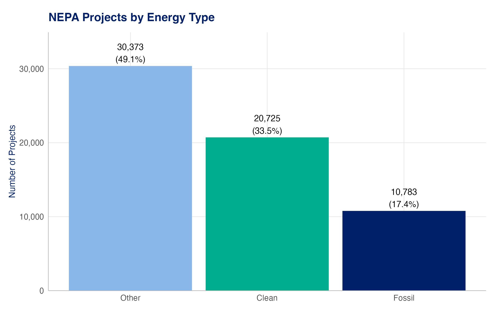

::: {.caption-text}
Clean energy: 37% | Fossil fuel: 18% | Other energy/infrastructure: 45%
:::
:::
:::

::: {.notes}
NEPATEC 2.0 was assembled by PNNL as part of their PermitAI initiative. The key innovation is that it converted tens of thousands of PDF documents into machine-readable format with metadata tags. Before this dataset existed, there was no systematic way to study NEPA review patterns across agencies and technologies at this scale. The 22,279 number is our working clean energy universe after we applied deliberate exclusion criteria.
:::

---

## Defining Clean Energy

::: {.columns}
::: {.column width="50%"}
**Clean Energy Tags** *(any 1 qualifies)*

| Tag Category |
|---|
| Renewable Energy Production |
| Electricity Transmission |
| Nuclear Technology |
| Carbon Capture & Sequestration |
| Utilities (electricity/gas) |
| Biomass / Biofuels |
| Battery / Energy Storage |
| Fuel Cells / Hydrogen |
| *...and 6 more* |

**Rule:** ≥1 clean energy tag **AND** no fossil fuel tags
:::
::: {.column width="50%"}
**Fossil Fuel Tags** *(any 1 excludes)*

| Tag | Effect |
|---|---|
| Conventional Energy — Coal | Excluded |
| Conventional Energy — Land Oil & Gas | Excluded |
| Conventional Energy — Offshore Oil & Gas | Excluded |
| Conventional Energy — Rural Energy | Excluded |
| Pipelines (fossil fuel) | Excluded |

**Key exclusions applied to clean energy:**

1. Utilities-only + non-energy tags: **1,623 removed**
2. Military/Defense + Nuclear: **481 removed**
3. Nuclear + Waste Management: all but **34 retained**
:::
:::

::: {.notes}
The tagging system uses both document metadata and NLP on document titles and descriptions. The exclusions were carefully reviewed — without them, the "clean energy" category would have included nuclear weapons facilities and waste disposal. CATF staff reviewed samples from each exclusion category to validate the approach.
:::

---

## Phase 1 Deliverables at a Glance

| # | Deliverable | Focus | Key Stat |
|---|---|---|---|
| 1 | Clean Energy Project Landscape | Technology, agency, geography | 22,279 projects; DOE = 81% |
| 2 | Programmatic & Tiered Reviews | Non-standard review types | Only 35.5% of EA/EIS are non-standard |
| 3 | NEPA Process, Timelines & Capacity | CE/EA/EIS durations; generation scale | EIS median 34 months; 90th pctile > 7.5 yrs |
| 4 | Multi-State & Multi-Agency Projects | Cross-boundary reviews | DOE is the collaboration hub (bridge score 26) |
| 5 | Document Length & FRA Impact | Page counts pre/post FRA | EA 76% compliant; EIS 27% compliant |
| 6 | Technology Deep Dives | Transmission, geothermal, pipelines | 100+ mi transmission = 6× longer duration |

::: {.notes}
This table gives a quick preview of what we'll cover. Each deliverable will have its own section with figures and a key takeaways summary.
:::

---

# Deliverable 1 {background-color="#012169"}
## Clean Energy Project Landscape

::: {.notes}
D1 answers the foundational question: how are clean energy NEPA projects distributed across technologies, agencies, and geography?
:::

---

## Technology Distribution {.slide-label data-deliverable="D1"}

::: {.columns}
::: {.column width="50%"}
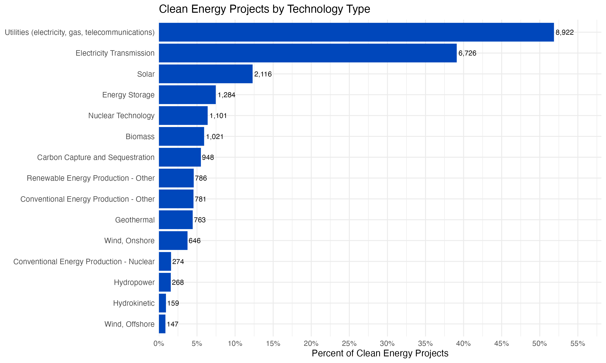
:::
::: {.column width="50%"}
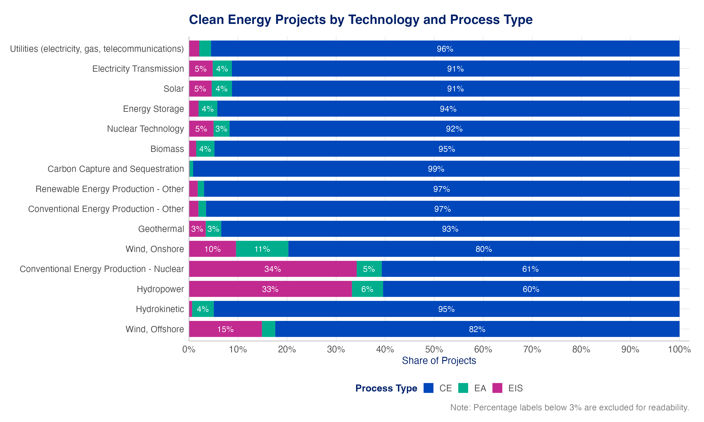
:::
:::

::: {.callout-finding}
**Utilities, Electricity Transmission, and Nuclear dominate.** Hydropower, Nuclear, and Wind show notably higher EA/EIS rates — reflecting larger environmental footprints or regulatory requirements.
:::

::: {.notes}
The left chart shows raw project counts by technology. The right shows the same data broken down by NEPA review process type (CE/EA/EIS). The dominance of CEs across most technologies reflects DOE's portfolio — large numbers of relatively small projects processed administratively. The higher EA/EIS rates for Hydro, Nuclear, and Wind are important for understanding where the most intensive NEPA review is concentrated.
:::

---

## Lead Agencies: DOE Dominates

::: {.columns}
::: {.column width="55%"}
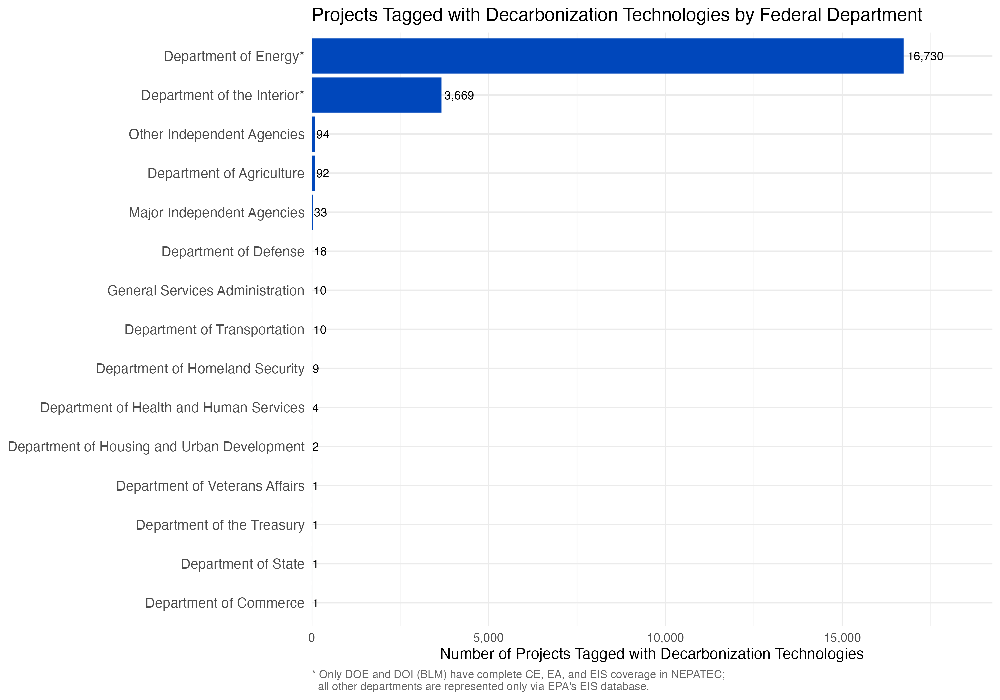
:::
::: {.column width="45%"}
::: {.callout-finding}
- **DOE: 81% of clean energy projects**
- DOE processes **96%** through Categorical Exclusions
- Interior: 17% of projects; more varied process mix
- Other agencies (USDA, Army Corps) have higher EA/EIS shares
:::

**Why DOE dominates:**

- Loan programs (DOE Loan Programs Office)
- Power Marketing Administrations (BPA, TVA, etc.)
- Grid modernization and R&D grants
- National Laboratory site operations
:::
:::

::: {.notes}
DOE's 81% share and 96% CE rate is a striking feature of the clean energy NEPA landscape. This concentration has policy implications — CE status means limited public review and shorter timelines. Interior's more varied mix reflects its land management mission where larger-footprint projects (utility-scale solar, wind farms on federal land) require EAs or EISs more often.
:::

---

## Geographic Distribution

::: {.columns}
::: {.column width="58%"}
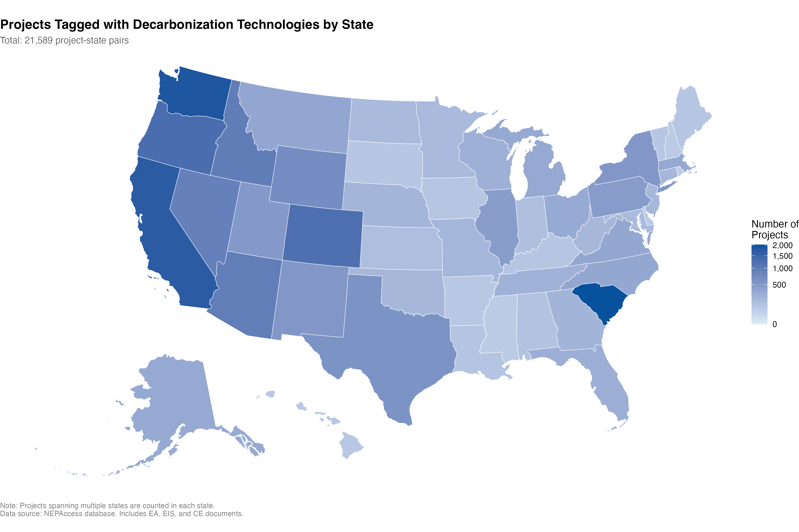
:::
::: {.column width="42%"}
**Top 5 States:**

1. South Carolina *(Savannah River Site)*
2. Washington
3. California
4. Idaho
5. Colorado

**County-Level Coverage:**

| Process | Coverage |
|---|---|
| All | 48% have county |
| CE | 46% |
| EA | 81% |
| EIS | 64% |

::: {.small-text}
~397 EA/EIS projects missing county data are
estimated **~99% recoverable** via reverse geocoding
:::
:::
:::

::: {.notes}
South Carolina's dominance is an artifact of the Savannah River Site — a massive DOE nuclear facility that generates enormous NEPA review activity. Washington reflects Hanford and the Pacific Northwest. The county coverage gap for CEs is a data quality issue — CE documents often contain legal land descriptions rather than coordinates. The good news is this is almost entirely recoverable for the EA/EIS projects that matter most for policy analysis.
:::

---

## D1 Key Takeaways {background-color="#012169"}

::: {style="margin-top: 1em;"}

::: {.takeaway-box}
**Scale:** 22,279 clean energy projects — far more NEPA activity than previously documented
:::

::: {.takeaway-box}
**DOE dominance:** 81% of projects, 96% via CE — the clean energy permitting story is largely a DOE CE story
:::

::: {.takeaway-box}
**Geography:** South Carolina leads due to one federal nuclear facility — important context when reading geographic distributions
:::

::: {.takeaway-box}
**Coverage:** County-level data gaps are concentrated in CEs and are largely recoverable; EA/EIS geographic coverage is solid
:::

:::

[Full Deliverable 1 Report](../reports/deliverable01.html)

---

# Deliverable 2 {background-color="#012169"}
## Programmatic & Tiered Reviews

::: {.notes}
D2 asks: how many NEPA reviews are programmatic or tiered, and do these "efficient" review types actually deliver faster outcomes?
:::

---

## Programmatic & Tiered Reviews Are the Minority

::: {.columns}
::: {.column width="50%"}
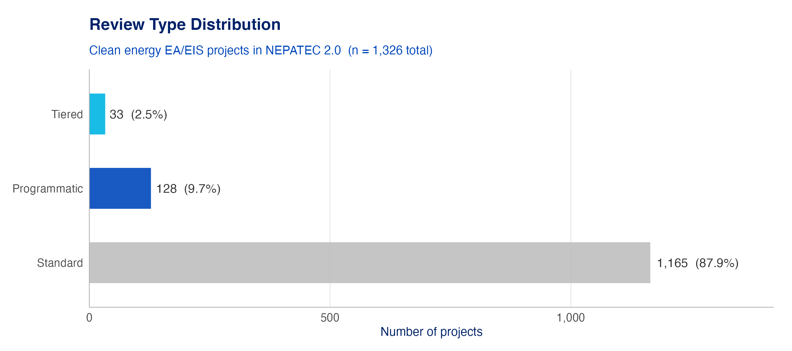

::: {.callout-finding}
Only **35.5%** of EA/EIS clean energy projects
(1,503 of 4,231) are programmatic or tiered
:::
:::
::: {.column width="50%"}
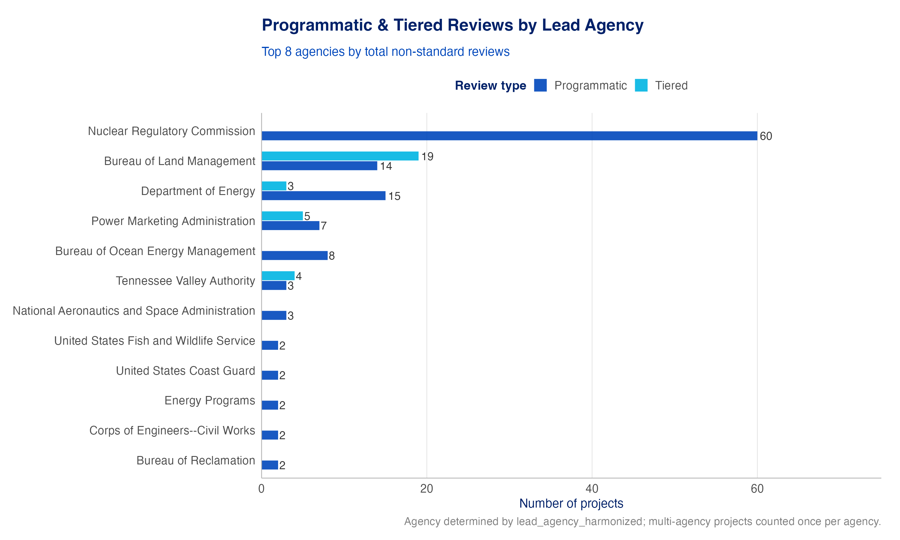

**BLM dominates** (50%+ of non-standard reviews)
reflecting its western land management mission

**Western state concentration:**
California, Nevada, Washington lead

*Detection method: title keyword matching +
regex extraction from first 60 document pages*
:::
:::

::: {.notes}
The 35.5% figure is lower than many assume. BLM's dominance reflects how Resource Management Plans frequently serve as programmatic NEPA documents for subsequent site-specific actions. The detection methodology uses two-stage text analysis — not just metadata — which makes it more reliable but also means we may undercount in some cases.
:::

---

## Are Tiered Reviews Actually Faster?

::: {.columns}
::: {.column width="58%"}
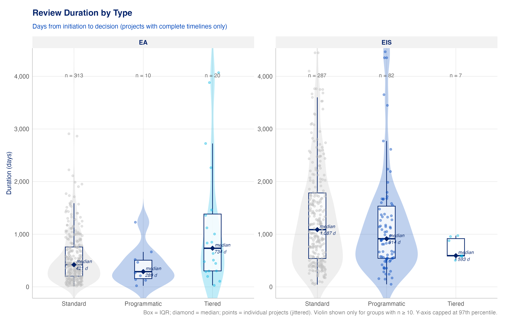
:::
::: {.column width="42%"}
**Median review durations:**

| Review Type | EA | EIS |
|---|---|---|
| Standard | 294 days | 1,042 days |
| Tiered | **380 days** | — |
| Programmatic | — | **924 days** |

::: {.callout-finding}
**Tiered EAs are *longer* than standard EAs.**
Programmatic EISs are modestly faster, but
the distribution overlap is substantial.
:::

::: {.callout-warning}
**Caution:** Small sample for tiered EIS limits
conclusions about that category
:::
:::
:::

::: {.notes}
This is a counterintuitive finding that challenges the standard efficiency argument for tiering. The assumption is that establishing a programmatic framework upfront saves time on site-specific reviews. In practice, tiered EAs still require full site-specific analysis, coordination with the parent review, and often additional public comment periods. The duration distributions substantially overlap — tiering is not a reliable speed advantage.
:::

---

## D2 Key Takeaways {background-color="#012169"}

::: {style="margin-top: 1em;"}

::: {.takeaway-box}
**Prevalence:** Only 35.5% of EA/EIS projects use programmatic or tiered review — these are not the norm
:::

::: {.takeaway-box}
**Speed:** Tiering does **not** reliably speed up environmental review — tiered EAs are actually *slower* than standard EAs
:::

::: {.takeaway-box}
**Who uses them:** BLM drives more than half of non-standard reviews; western states dominate
:::

::: {.takeaway-box}
**Policy implication:** Expanding tiering requirements alone will not accelerate permitting without addressing root causes of EA/EIS duration
:::

:::

[Full Deliverable 2 Report](../reports/deliverable02.html)

---

# Deliverable 3 {background-color="#012169"}
## NEPA Process, Timelines & Generation Capacity

::: {.notes}
D3 is the most data-rich deliverable — how do CE, EA, and EIS compare on duration? How has NEPA activity changed over time? And what generation capacity is associated with each review type?
:::

---

## How Long Does NEPA Review Take?

::: {.columns}
::: {.column width="60%"}
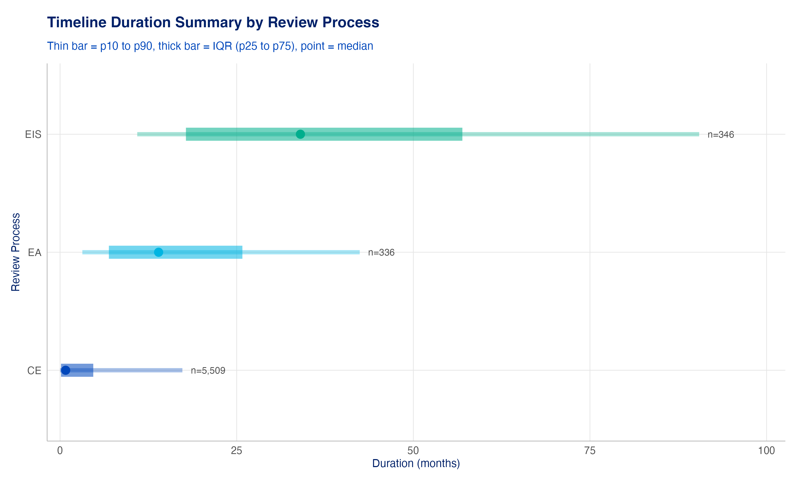
:::
::: {.column width="40%"}
**Median durations:**

- CE: [~1 month]{.highlight-stat}
- EA: [~14 months]{.highlight-stat}
- EIS: [~34 months (3 yrs)]{.highlight-stat}

**90th percentile:**

- EIS: [> 7.5 years]{.highlight-stat}

**Timeline completeness:**

| Process | Both Dates |
|---|---|
| CE | 30% |
| EA | 62% |
| EIS | 48% |

::: {.small-text}
*Dates extracted via custom BERT NLP pipeline
from document text*
:::
:::
:::

::: {.notes}
The 7.5-year 90th percentile for EIS is the number that drives the NEPA delay narrative in policy debates. But it's important to contextualize: this is the tail of the distribution, representing a small fraction of total reviews. The 34-month median is a more representative picture for EIS. Timeline completeness is low for CEs (30%) because CE documents are shorter and contain less temporal information — this is a data limitation, not necessarily a signal of missing reviews.
:::

---

## NEPA Activity Over Time

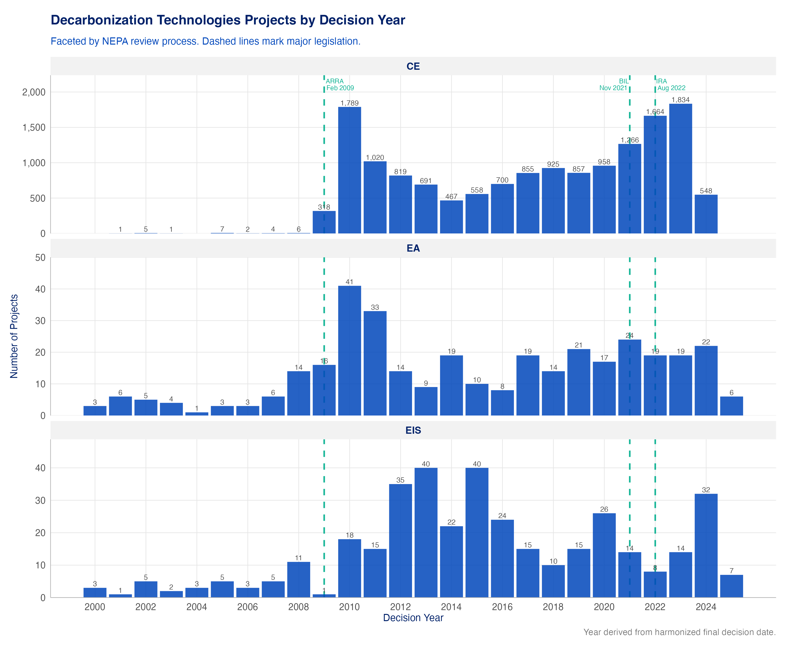

::: {.callout-finding}
**CE peaked in 2010** (ARRA stimulus) and again in **2023**. The IRA/BIL investment surge (2022) has not yet fully appeared — projects initiated in 2022–2023 will decide in 2024–2026.
:::

::: {.notes}
The 2010 ARRA peak is a direct signal of the Recovery Act flowing through federal agencies as CE-processed grants and loans. The 2023 uptick reflects IRA and BIL early activity — but because CE is fast and EIS is slow, we're likely seeing IRA projects that were initiated quickly and completed. The larger IRA/BIL cohort of EAs and EISs initiated in 2022–2024 won't show up in completion data until later years.
:::

---

## Generation Capacity by Review Process

::: {.columns}
::: {.column width="50%"}
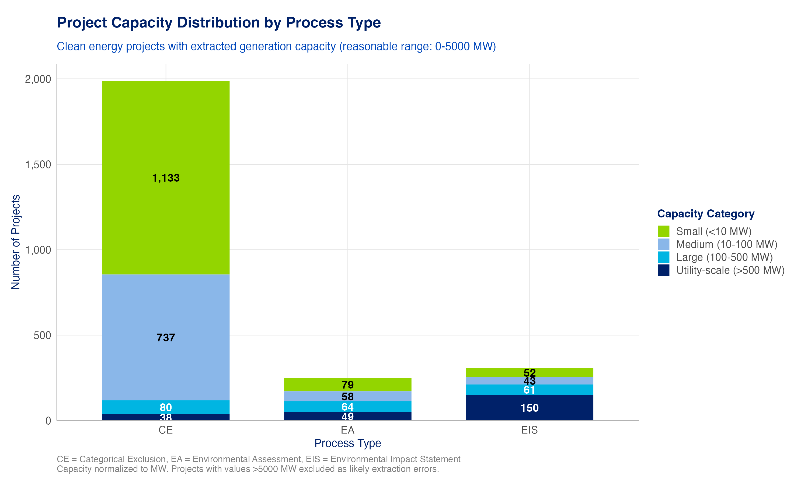
:::
::: {.column width="50%"}
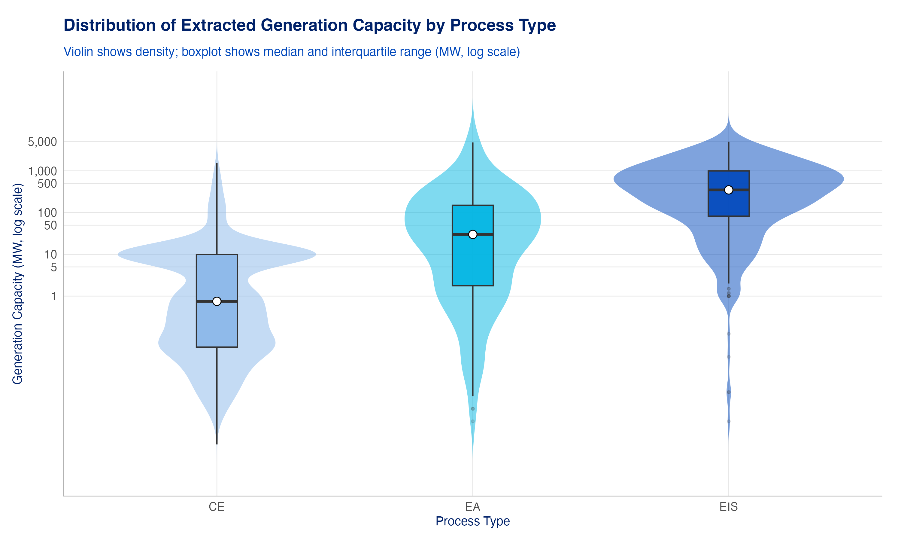
:::
:::

::: {.callout-finding}
**EIS median: [538 MW]{.highlight-stat}** &nbsp;|&nbsp; **EA median: [60 MW]{.highlight-stat}** &nbsp;|&nbsp; **CE median: [1.2 MW]{.highlight-stat}**
Review intensity is broadly proportional to project scale — consistent with NEPA's risk-proportional design.
:::

::: {.notes}
This is a reassuring finding from a policy perspective: the review process is broadly calibrated to project size. Utility-scale projects (500+ MW) predominantly receive EIS reviews. The tail of CE projects with higher capacity warrants further investigation — are these genuinely low-impact large projects, or candidates for review of CE category appropriateness? Capacity data coverage is much higher for EIS (81%) than CE (8%), so CE statistics are less reliable.
:::

---

## D3 Key Takeaways {background-color="#012169"}

::: {style="margin-top: 1em;"}

::: {.takeaway-box}
**Scale matters:** CE = 1 month, EA = 14 months, EIS = 3 years median — the difference is real and large
:::

::: {.takeaway-box}
**Long tail:** 10% of EIS reviews take more than 7.5 years — these outliers drive the NEPA delay narrative but are not typical
:::

::: {.takeaway-box}
**Stimulus signal:** ARRA (2010) and IRA/BIL (2022–) are visible in the data; the full IRA cohort is still working through the pipeline
:::

::: {.takeaway-box}
**Proportionality:** Review intensity broadly matches project scale — the largest projects (500+ MW) appropriately receive EIS-level review
:::

:::

[Full Deliverable 3 Report](../reports/deliverable03.html)

---

# Deliverable 4 {background-color="#012169"}
## Multi-State & Multi-Agency Projects

::: {.notes}
D4 examines projects that cross state boundaries or involve multiple federal agencies — particularly relevant for large transmission and pipeline infrastructure critical to the energy transition.
:::

---

## Multi-State Projects

::: {.columns}
::: {.column width="55%"}
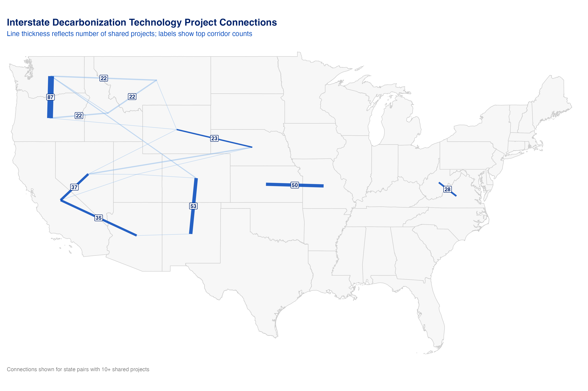
:::
::: {.column width="45%"}
::: {.callout-finding}
- **Western states dominate** multi-state activity
- Multi-state projects are predominantly **EIS-level** reviews
- Most common project types: long-haul transmission, right-of-way renewals, utility-scale renewables
:::

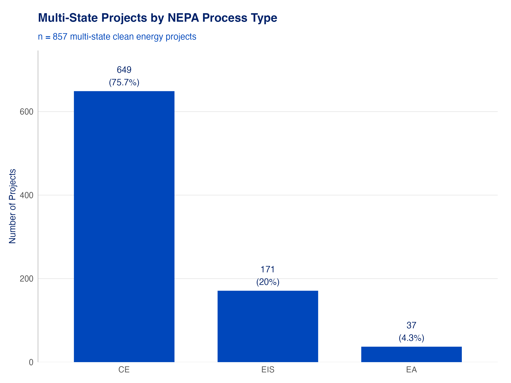
:::
:::

::: {.notes}
The western concentration reflects the geography of transmission buildout — connecting renewable-rich areas (desert Southwest, Great Plains) to load centers in California and the Pacific Northwest. These projects inherently cross state lines and trigger coordinated federal review, often at the EIS level. The state connection map shows which corridors are most active — these are the infrastructure arteries of the clean energy transition.
:::

---

## Multi-Agency Collaboration

::: {.columns}
::: {.column width="50%"}
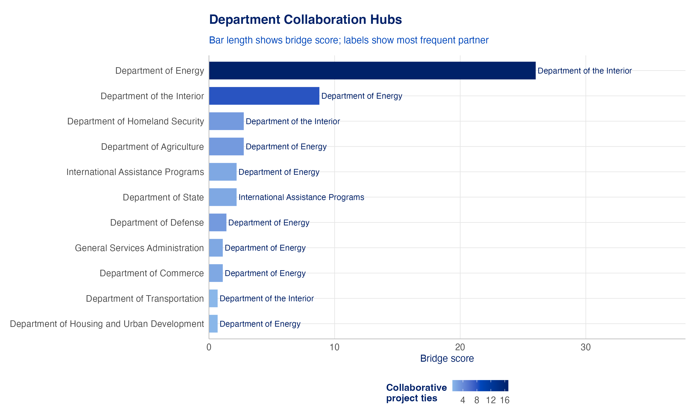
:::
::: {.column width="50%"}
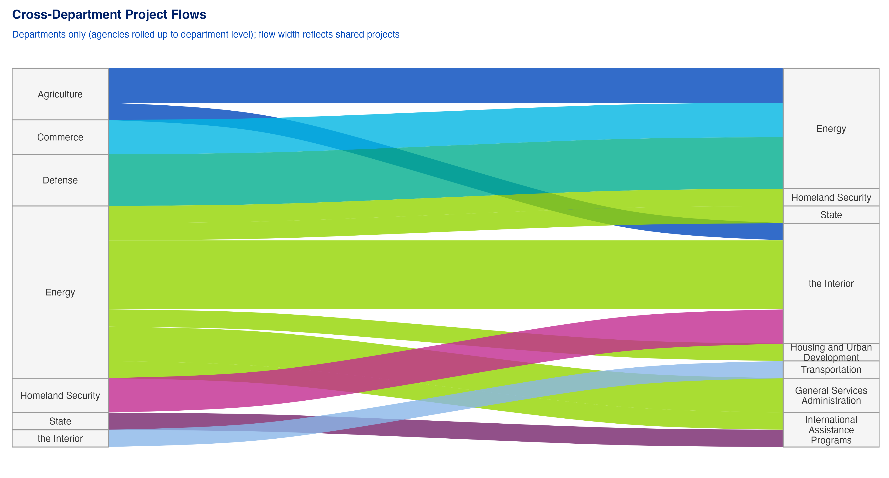
:::
:::

::: {.callout-finding}
Multi-agency projects are **89% EIS** &nbsp;|&nbsp; **DOE bridge score: [26]{.highlight-stat}** (clear hub, 9 unique partner agencies) &nbsp;|&nbsp; **DOI bridge score: 9** (secondary hub)
:::

::: {.notes}
The bridge score is a network centrality measure — DOE's score of 26 means it appears as a co-agency in a far wider range of multi-agency reviews than any other department. This reflects DOE's cross-cutting mission: it funds and supports projects across energy types, often alongside Interior (land), USDA (rural energy), and Army Corps (water). The Sankey diagram shows the flow of collaboration — DOE is the connective tissue. The 89% EIS rate for multi-agency projects is expected — these are the largest, most complex projects that affect multiple jurisdictions and resource areas.
:::

---

## D4 Key Takeaways {background-color="#012169"}

::: {style="margin-top: 1em;"}

::: {.takeaway-box}
**Geography:** Western states drive cross-state activity — the clean energy transmission build-out is fundamentally a western story
:::

::: {.takeaway-box}
**Complexity:** Multi-state and multi-agency projects are almost exclusively EIS-level — these are the most intensive reviews in the system
:::

::: {.takeaway-box}
**DOE as hub:** DOE is the connective tissue of multi-agency review, collaborating with 9 different partner departments
:::

::: {.takeaway-box}
**Policy implication:** Improving coordination among DOE, DOI, and USDA would have outsized impact on the most complex clean energy reviews
:::

:::

[Full Deliverable 4 Report](../reports/deliverable04.html)

---

# Deliverable 5 {background-color="#012169"}
## Document Length & Fiscal Responsibility Act Impact

::: {.notes}
D5 asks: did the Fiscal Responsibility Act of 2023's page limits actually change how long NEPA documents are? This is directly relevant to current policy debates about permitting reform.
:::

---

## The FRA 2023 Page Limits

::: {.columns}
::: {.column width="55%"}
**Fiscal Responsibility Act (June 2023) established:**

| Document | Standard Limit | Complex Limit |
|---|---|---|
| Environmental Assessment | **75 pages** | — |
| Environmental Impact Statement | **150 pages** | **300 pages** |

**Regulatory "page" definition** *(40 C.F.R. § 1508.1(bb))*:

> Body word count ÷ 500
> *Excludes:* maps, figures, graphs, tables, appendices, citations

::: {.callout-finding}
This analysis uses **regulatory pages** to match the statutory definition — not raw PDF page counts, which overstate document length by 45–55% for EAs and 20–30% for EISs due to bundled appendices.
:::
:::
::: {.column width="45%"}
**Why this matters:**

- FRA is among the most significant NEPA reforms in decades
- Page limits were intended to force concise, focused analysis
- Compliance depends heavily on how "pages" are counted
- Waivers and "extraordinary complexity" exceptions complicate assessment

**Our approach:**

- Final EA/EIS only (drafts excluded)
- Clean energy projects with complete timelines
- Post-FRA = decision date ≥ June 3, 2023
:::
:::

::: {.notes}
The methodological choice to use regulatory pages is critical. If we used raw PDF pages, compliance rates would appear much lower and would be misleading — a 200-page document with 100 pages of appendices might have only 50 regulatory pages and be fully compliant. The body-word-count method is the correct interpretation of the statutory definition, but it requires detecting appendix boundaries in OCR text, which introduces some error.
:::

---

## Document Length Trends Over Time

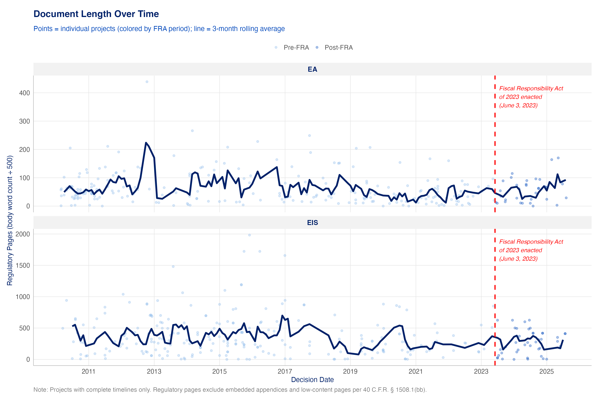

::: {.callout-finding}
**Document lengths were already declining before FRA.** The rolling average trend predates June 2023. Post-FRA mean EA fell ~22%, EIS fell ~25% — but causation is uncertain.
:::

::: {.callout-warning}
**Small post-FRA sample:** Only 33 EAs and 42 EISs completed after June 2023 — limit strong causal claims.
:::

::: {.notes}
This is the most important cautionary finding in D5. The declining trend is real, but it appears to have started before FRA. Possible explanations: informal agency compliance with anticipated limits, simpler projects entering the pipeline, or general efficiency improvements. We cannot use this data alone to establish that FRA caused the decline. The post-FRA sample is also small — as more post-FRA documents accumulate, this analysis will become more definitive.
:::

---

## Pre/Post FRA Comparison & Compliance

::: {.columns}
::: {.column width="52%"}
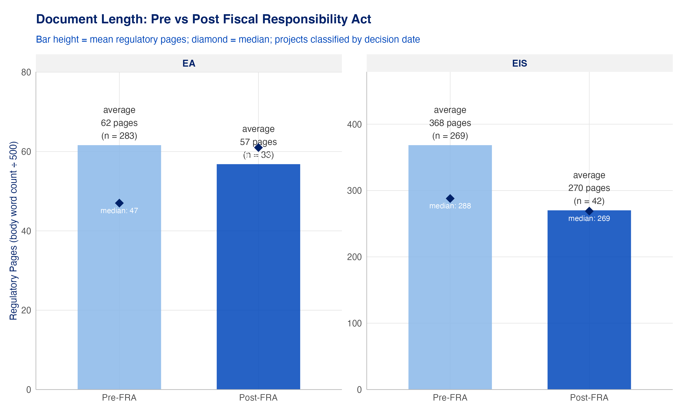

**Regulatory page medians:**

| | Pre-FRA | Post-FRA | Change |
|---|---|---|---|
| EA | 41 | **33** | −20% |
| EIS | 120 | **93** | −23% |
:::
::: {.column width="48%"}
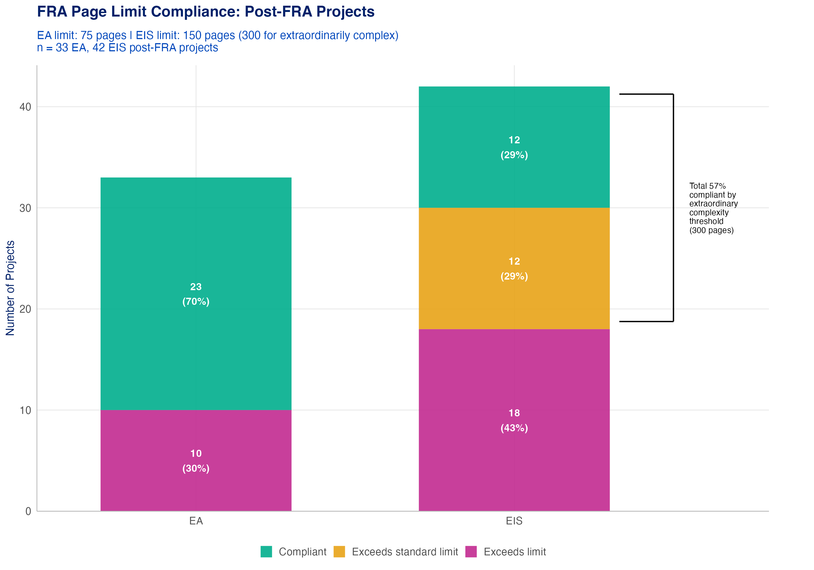

**Compliance rates (post-FRA):**

- EA (75-page limit): [76%]{.highlight-stat} comply
- EIS (150-page limit): [27%]{.highlight-stat} comply
- EIS in 150–300 range: 48%

::: {.small-text}
*Compliance data lacks context: waivers,
"extraordinary complexity" exceptions,
and grandfathering are not distinguished*
:::
:::
:::

::: {.notes}
The 76% EA compliance is encouraging. The 27% EIS compliance for the 150-page limit looks bad, but note that 48% fall in the 150–300 range, which may qualify for the extraordinary complexity exception. Without document-by-document review, we can't distinguish which of these properly invoked the exception. The compliance picture for EIS may be more favorable than the 27% headline suggests. But 26% exceeding even 300 pages is notable — those projects are clearly out of compliance.
:::

---

## D5 Key Takeaways {background-color="#012169"}

::: {style="margin-top: 1em;"}

::: {.takeaway-box}
**Decline is real:** EA and EIS document lengths fell ~20–25% post-FRA — a meaningful reduction if it holds
:::

::: {.takeaway-box}
**Causation is uncertain:** The downward trend preceded FRA; the law may have reinforced, not initiated, the decline
:::

::: {.takeaway-box}
**EA compliance is solid:** 76% of post-FRA EAs comply with the 75-page limit
:::

::: {.takeaway-box}
**EIS compliance is low:** Only 27% comply with the 150-page limit; many may qualify for the 300-page exception — but 26% exceed even that
:::

::: {.takeaway-box}
**Watch this space:** The post-FRA sample (33 EAs, 42 EISs) is small — conclusions will strengthen as more post-FRA documents accumulate through 2025–2026
:::

:::

[Full Deliverable 5 Report](../reports/deliverable05.html)

---

# Deliverable 6 {background-color="#012169"}
## Technology Deep Dives

::: {.notes}
D6 zooms into three specific technology areas: electricity transmission lines, geothermal energy, and pipelines — including the emerging carbon and hydrogen categories.
:::

---

## Electricity Transmission Lines

::: {.columns}
::: {.column width="50%"}
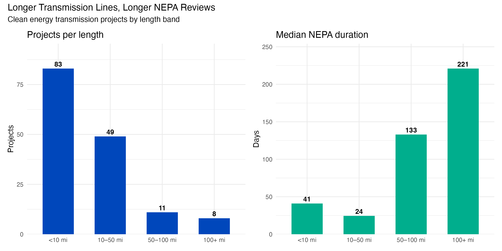
:::
::: {.column width="50%"}
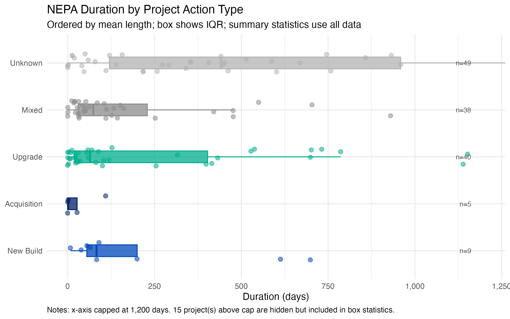
:::
:::

::: {.callout-finding}
**151 projects** with extractable line lengths &nbsp;|&nbsp; Median **8 miles** &nbsp;|&nbsp; **55%** under 10 miles
Projects ≥100 miles take [6× longer]{.highlight-stat} than projects under 10 miles
:::

::: {.notes}
The 151 strict clean-energy transmission projects come from a 3-gate classification: electricity transmission tag, build-related language in title/description, and extractable line length ≥1 mile. The 38.5-day median across all transmission projects is driven by the many short, CE-processed upgrades and replacements. The 6x duration multiplier for 100+ mile lines is striking and has direct implications for the large-scale transmission buildout needed for the energy transition.
:::

---

## Geothermal Energy

::: {.columns}
::: {.column width="50%"}
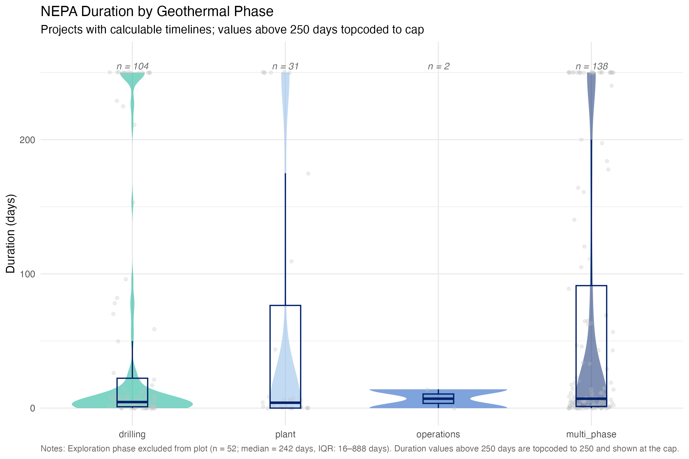
:::
::: {.column width="50%"}
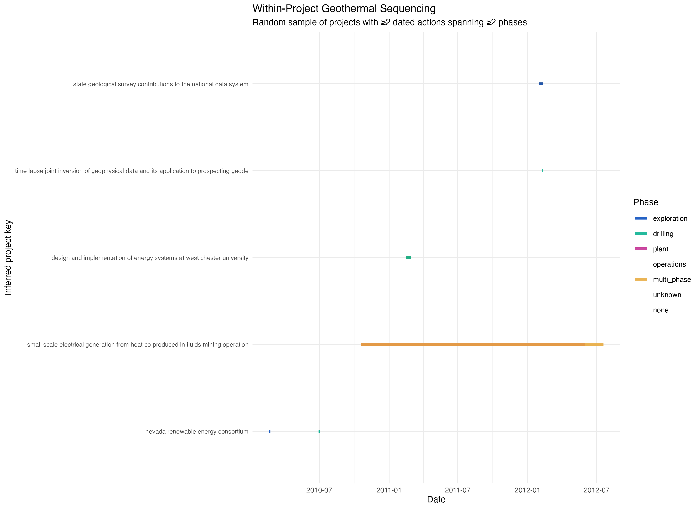
:::
:::

::: {.callout-finding}
**914 NEPA actions** across **5 phases** &nbsp;|&nbsp; Drilling is most common and fastest &nbsp;|&nbsp; Exploration & multi-phase reviews are longest
**A single geothermal project may require multiple sequential NEPA reviews** — the within-project timeline is a multi-year permitting journey.
:::

::: {.notes}
Geothermal is unique because each phase of development — exploration, confirmation drilling, plant construction, operations — may trigger a separate NEPA review. The within-project sequencing figure shows how these phases chain together over time. This has a direct policy implication: the total NEPA burden for a geothermal project is the cumulative sum of multiple reviews, not just one. Streamlining geothermal permitting requires addressing this sequencing problem, not just making individual reviews faster.
:::

---

## Pipelines: Carbon, Hydrogen & Natural Gas

::: {.columns}
::: {.column width="50%"}
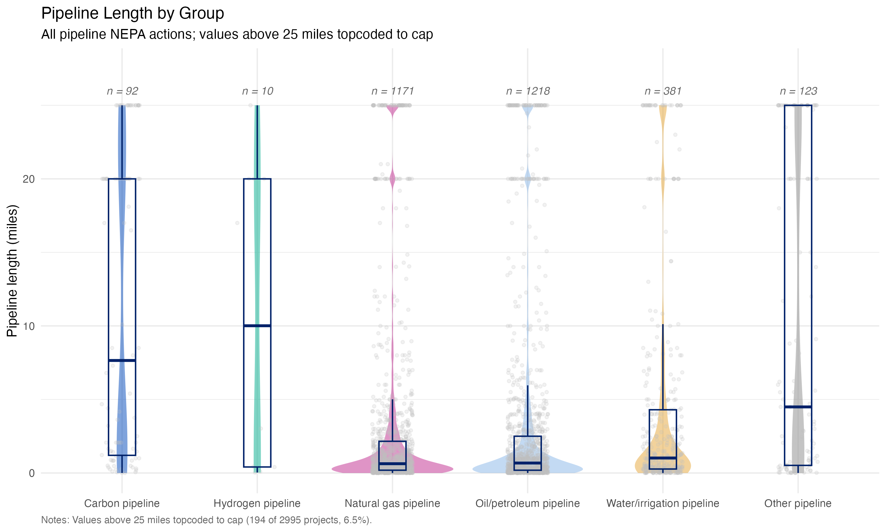
:::
::: {.column width="50%"}
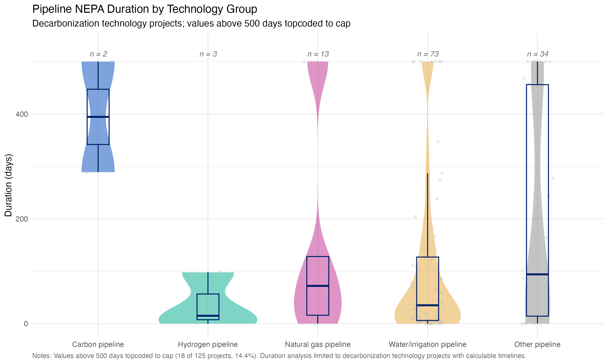
:::
:::

::: {.callout-finding}
**6,133 total pipeline NEPA actions** &nbsp;|&nbsp; Carbon pipelines have the longest median length &nbsp;|&nbsp; Natural gas provides the most statistically reliable baseline
:::

::: {.callout-warning}
**Very small samples for emerging technologies:** Only ~8 carbon and ~4 hydrogen projects have both length and duration data — interpret with caution. These are exploratory findings.
:::

::: {.notes}
The pipeline dataset includes natural gas, oil, carbon capture, and hydrogen categories. Oil and natural gas provide reliable baselines by count. The carbon and hydrogen categories are critically important for policy — carbon pipeline buildout is essential for CCS, and hydrogen pipelines are emerging — but the current data is too thin for strong statistical conclusions. This will improve as new projects enter the permitting system.
:::

---

## D6 Key Takeaways {background-color="#012169"}

::: {style="margin-top: 1em;"}

::: {.takeaway-box}
**Transmission length = duration:** 100+ mile transmission lines take 6× longer than short lines — a critical constraint for large-scale grid buildout
:::

::: {.takeaway-box}
**Geothermal phases:** A full geothermal development project requires multiple sequential NEPA reviews — streamlining requires addressing the whole lifecycle
:::

::: {.takeaway-box}
**Carbon/hydrogen data is thin:** Only single-digit to low-double-digit projects have full data — findings are directional, not definitive
:::

::: {.takeaway-box}
**Upgrades vs. new builds:** Most transmission NEPA activity is upgrades and replacements, not greenfield new construction — important context for buildout policy
:::

:::

[Full Deliverable 6 Report](../reports/deliverable06.html)

---

## Phase 1 Summary: Key Findings Across All Deliverables

::: {.incremental}
1. **Scale** — 22,279 clean energy projects documented; the NEPA clean energy portfolio is larger than previously understood
2. **DOE dominance** — 81% of projects, 96% via Categorical Exclusion; the permitting story is largely a DOE CE story
3. **Tiering doesn't automatically help** — programmatic/tiered reviews represent only 35% of EA/EIS and are not reliably faster
4. **Duration gradient is steep** — CE (~1 month) → EA (~14 months) → EIS (~3 years median, 7.5-year 90th pctile)
5. **Review matches scale** — EIS projects are genuinely large (median 538 MW); CE projects are genuinely small (median 1.2 MW)
6. **DOE is the multi-agency hub** — improving DOE-DOI-USDA coordination would have outsized impact on complex reviews
7. **FRA effect is real but uncertain** — document lengths fell ~20–25%; causation is not yet established; EIS compliance is low
8. **Technology matters** — transmission length predicts duration; geothermal requires multi-phase permitting; carbon/hydrogen data needs to grow
:::

::: {.notes}
These are the eight core findings from Phase 1. The incremental reveal allows the audience to focus on each one. Invite reactions after showing all eight — which is most surprising? Most actionable?
:::

---

## Discussion & Next Steps

::: {.columns}
::: {.column width="55%"}
**Discussion Questions:**

- Which findings most surprise you?
- Which are most actionable for CATF's policy work?
- Where should Phase 2 focus?

**Phase 2 Potential Directions:**

1. Why is NEPA triggered? (federal land vs. funding)
2. Significance determinations across resource areas
3. Fossil fuel vs. clean energy comparison
4. Timeline outlier case studies (90th pctile EIS)
5. Regulatory categorical exclusion development patterns

**Data Improvements Underway:**

- Improve CE timeline coverage (30% → higher)
- Expand county geocoding for missing EA/EIS projects
:::
::: {.column width="45%"}
**Ideas for Interactive Tools:**

::: {.callout-finding}
**Shiny App: Project Explorer**
Filter by technology, state, agency, process type
→ dynamic map + summary statistics

**Plotly Timeline Visualizer**
Zoom into project cohorts, hover for project names,
compare distributions interactively
:::

**Resources:**

[{width=150px}](https://www.catf.us)

[Full Analysis Website](../reports/project_overview.html) &nbsp;|&nbsp; [Data: NEPATEC 2.0](https://huggingface.co/datasets/PNNL/NEPATEC2.0)

<a href="presentation1.pdf" class="pdf-btn">Download PDF Version</a>
:::
:::

::: {.notes}
Leave this slide up for the full 15-minute discussion period. The Phase 2 directions listed here were developed in consultation with CATF staff — use this as a starting point for prioritization. The Shiny app idea is ready to scope if CATF wants an interactive tool for internal use or external communication.
:::

---

# Appendix {background-color="#012169"}

---

## A1: NEPA Process Detail — Duration Statistics

| Process | Type | n | Median (days) | Mean (days) | 25th pct | 75th pct | 90th pct |
|---|---|---|---|---|---|---|---|
| CE | Standard | ~17,000 | ~30 | ~45 | 14 | 60 | 120 |
| EA | Standard | ~2,700 | 294 | 380 | 150 | 520 | 900 |
| EA | Tiered | ~250 | 380 | 480 | 200 | 650 | 1,100 |
| EA | Programmatic | ~350 | 320 | 420 | 170 | 580 | 960 |
| EIS | Standard | ~400 | 1,042 | 1,200 | 600 | 1,600 | 2,800 |
| EIS | Programmatic | ~80 | 924 | 1,050 | 500 | 1,400 | 2,400 |

::: {.small-text}
*Note: Statistics derived from projects with complete timelines (both initiation and decision dates). CE n and statistics are approximate due to lower timeline completeness (30%). See Deliverable 3 for full methodology.*
:::

::: {.notes}
These are approximate statistics for reference. The deliverable 3 report contains the precise figures with confidence intervals.
:::

---

## A2: County-Level Maps by Process Type

::: {.columns}
::: {.column width="33%"}
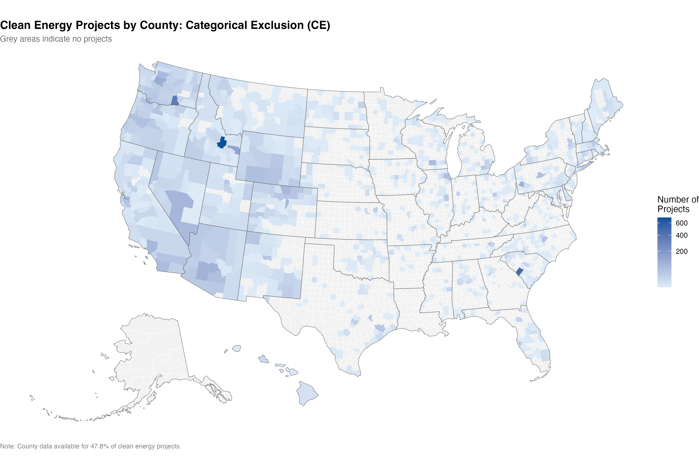

::: {.caption-text}
Categorical Exclusions
:::
:::
::: {.column width="33%"}
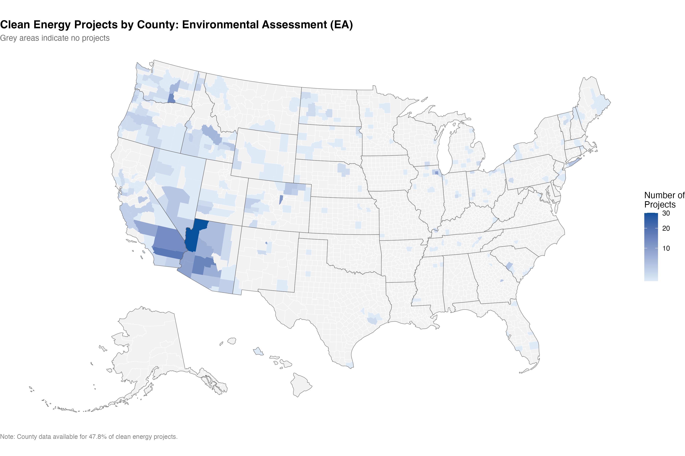

::: {.caption-text}
Environmental Assessments
:::
:::
::: {.column width="33%"}
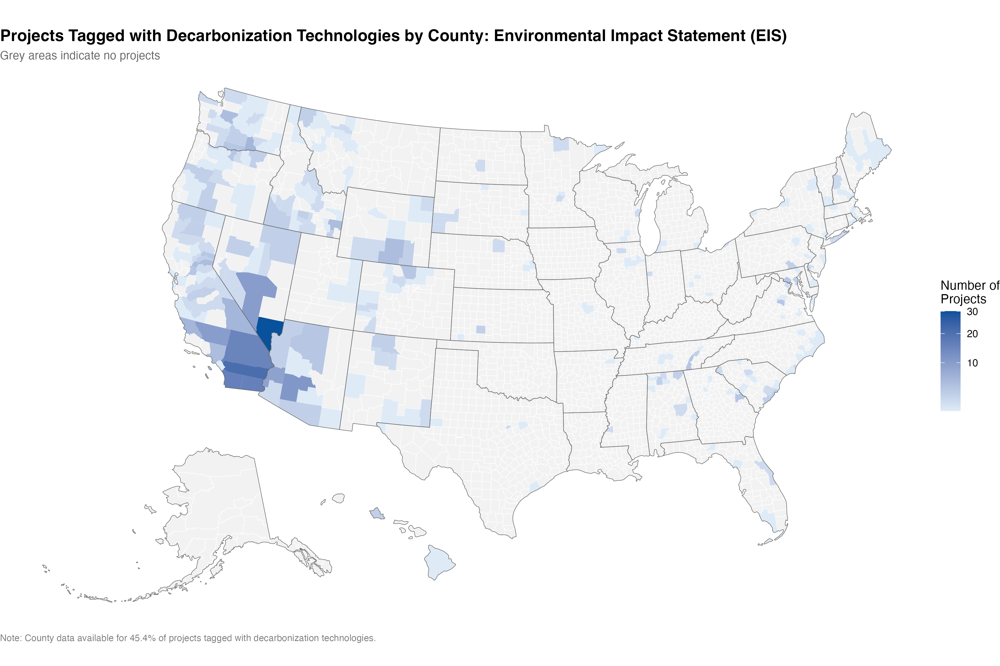

::: {.caption-text}
Environmental Impact Statements
:::
:::
:::

::: {.small-text}
County coverage varies by process type: CE 46%, EA 81%, EIS 64%. Western federal land counties show highest activity.
:::

---

## A3: Timeline Extraction Methodology

::: {.columns}
::: {.column width="55%"}
**Two-Stage Extraction Pipeline:**

1. **Date extraction** — identify all dates in document text with surrounding sentence context
2. **Date classification** — BERT sequence labeler assigns each date to:
   - Initiation (NOI, application received, scoping)
   - Review (draft publication, comment period)
   - Decision (ROD, FONSI, signature)
   - Other

**Timeline Selection Rules:**

- Decision date: prioritize strong signature/approval cues; avoid "expected" future dates
- Initiation date: prioritize formal trigger events (NOI > application > scoping)
- Fallback: use earliest review date as proxy initiation when no initiation found
:::
::: {.column width="45%"}
**Known Limitations:**

::: {.callout-warning}
- **CE completeness (30%):** Short documents have less temporal information
- **EIS completeness (48%):** RODs often issued as separate documents, not linked in dataset
- **EA completeness (62%):** Best coverage; FONSIs typically included
- **Class imbalance:** Initiation dates are harder to classify than decision dates
:::

**Model:** Fine-tuned BERT (bert-base-uncased) trained on manually annotated NEPA document sentences
:::
:::

---

## A4: Transmission — Duration by Census Region

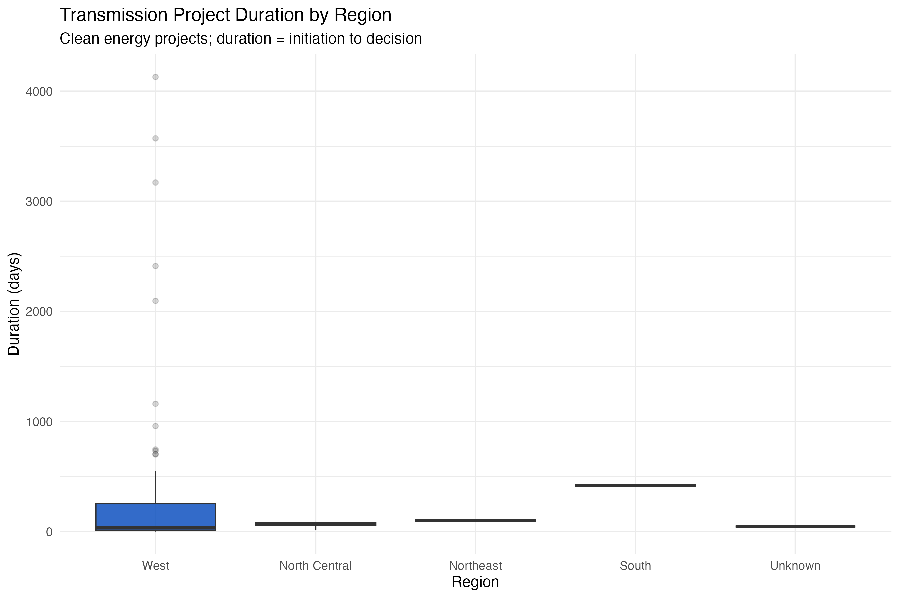

::: {.small-text}
Regional variation in transmission review duration reflects differences in project scale, agency staffing, and land status (federal vs. private). Western regions show both the highest median durations and the widest variance.
:::

---

## A5: Geothermal Phase Distribution

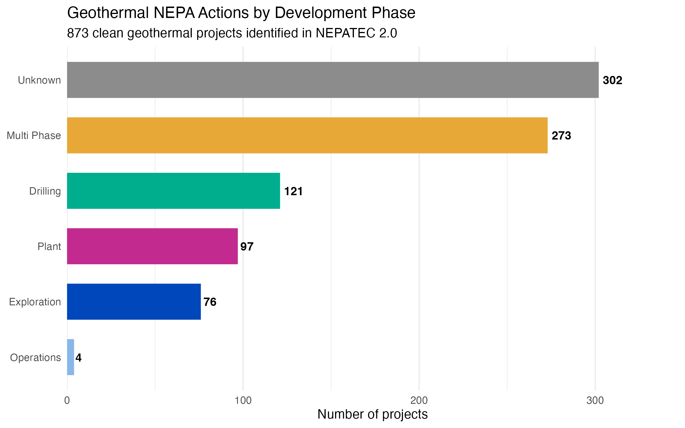

::: {.small-text}
Phase classification uses regex pattern matching on project title and description text. Projects matching keywords from 2+ phase categories are classified as "multi-phase." Projects with no keyword match fall back to process type (CE → drilling; EA/EIS → exploration).
:::

---

## A6: Pipeline Length vs. Duration

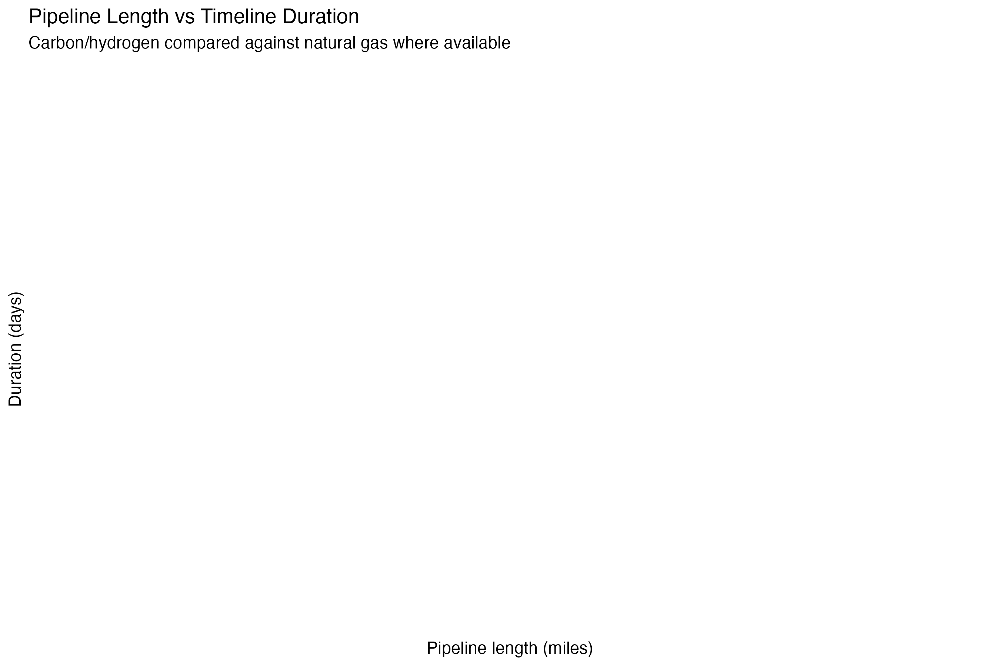

::: {.small-text}
Modest positive correlation between pipeline length and NEPA duration across all pipeline types. High variance in both dimensions. Natural gas provides the most statistically reliable trend line. Carbon and hydrogen samples (8 and 4 projects respectively) are too small for regression inference.
:::

---

## A7: FRA Regulatory vs. Raw Pages Methodology

::: {.columns}
::: {.column width="55%"}
**Regulatory Page Calculation:**

1. Extract body text from OCR'd PDF
2. Detect appendix boundaries using section-header patterns:
   - "Appendix [A-Z]", "References", "Bibliography", "List of Preparers", etc.
3. Count words in body text (pre-appendix)
4. Regulatory pages = body word count ÷ 500

**Why this differs from raw page count:**

- Raw pages include all embedded maps, figures, appendices
- EAs: regulatory ≈ 45–55% of raw pages
- EISs: regulatory ≈ 70–80% of raw pages
- Raw-page compliance would show much lower rates
:::
::: {.column width="45%"}
**Known edge cases:**

::: {.callout-warning}
- **OCR errors:** Scanned legacy documents may have NULL word counts
- **Non-standard headers:** Some appendices use non-standard naming and may not be detected
- **Table-heavy documents:** ~5% of cases show regulatory pages exceeding raw pages (OCR text extraction artifact)
- **Waivers and exceptions:** Cannot distinguish properly invoked "extraordinary complexity" exceptions from non-compliant documents
:::
:::
:::

---

## A8: NEPA Policy Context 2025–2026

::: {.small-text}
| Date | Event |
|---|---|
| Jan 20, 2025 | Executive Order 14154 revokes CEQ NEPA regulation authority |
| Feb 25, 2025 | CEQ issues interim rule removing NEPA regulations from CFR |
| Apr 23, 2025 | DOI emergency permitting procedures: review timelines under 1 month |
| May 22, 2025 | House passes reconciliation bill with pay-to-play permitting |
| May 29, 2025 | Supreme Court (*Seven County v. Eagle County*): agencies may limit NEPA scope to decisional authority |
| Jul 4, 2025 | Reconciliation bill signed into law — pay-to-play expedited reviews |
| Jul 23, 2025 | AI Action Plan: executive order directs new CEs, NEPA exemption for <50% federal funding |
| Dec 18, 2025 | SPEED Act passes House — limits on judicial review, new NEPA exemptions |
| Dec 22, 2025 | DOI issues stop-work orders for 5 offshore wind projects |
| Jan 8, 2026 | CEQ adopts final rule: removes all NEPA regulations from Federal Register |
:::

::: {.small-text}
*Source: CATF NEPA & Permitting Reform Timeline. The Phase 1 analysis predates most of these actions — the Phase 2 data collection window will capture their effects.*
:::

---

::: {style="text-align: center; margin-top: 2em;"}

[{width=200px}](https://www.catf.us)

**Clean Air Task Force**
NEPA Clean Energy Analysis — Phase 1

[Full Analysis Website](../reports/project_overview.html) &nbsp;&nbsp; | &nbsp;&nbsp; <a href="presentation1.pdf" class="pdf-btn">Download PDF</a>

:::
